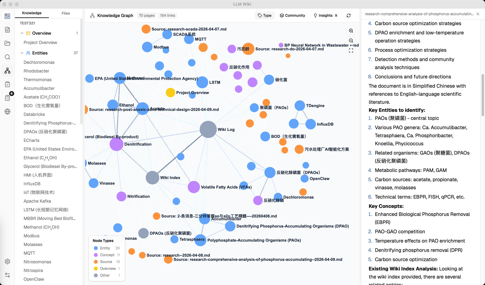
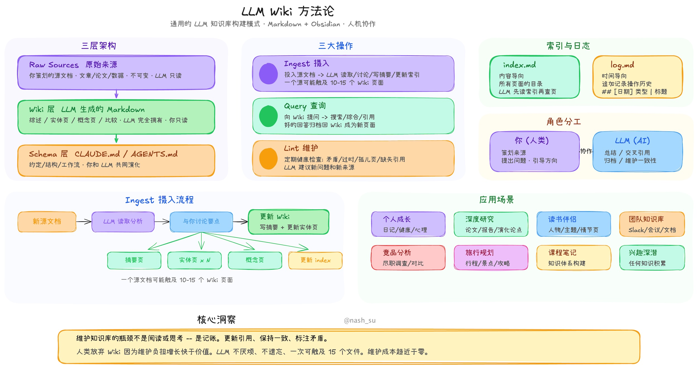
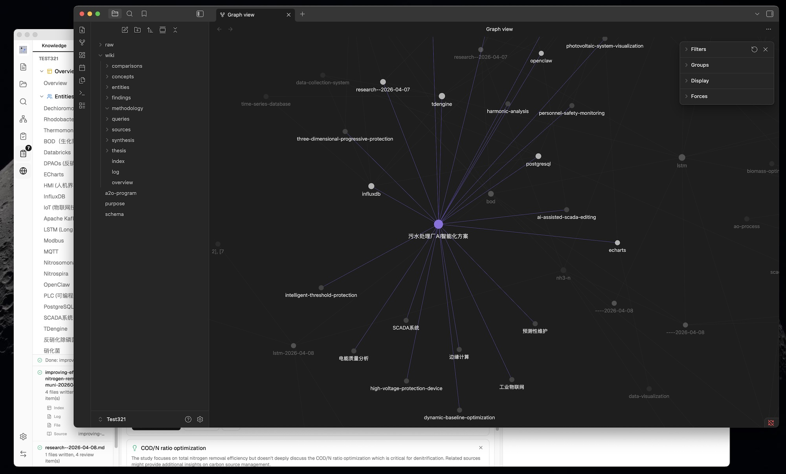
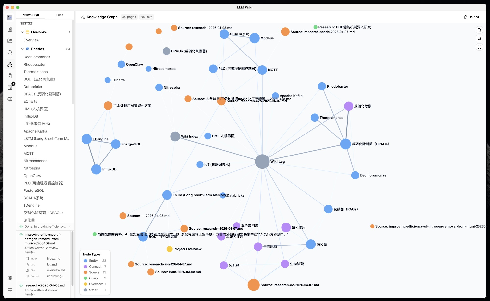
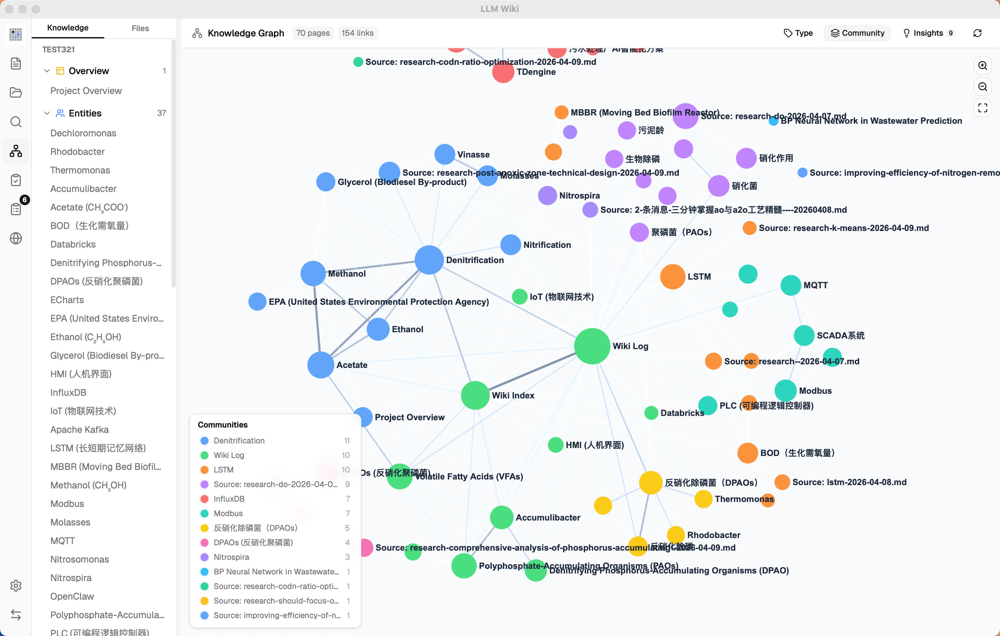
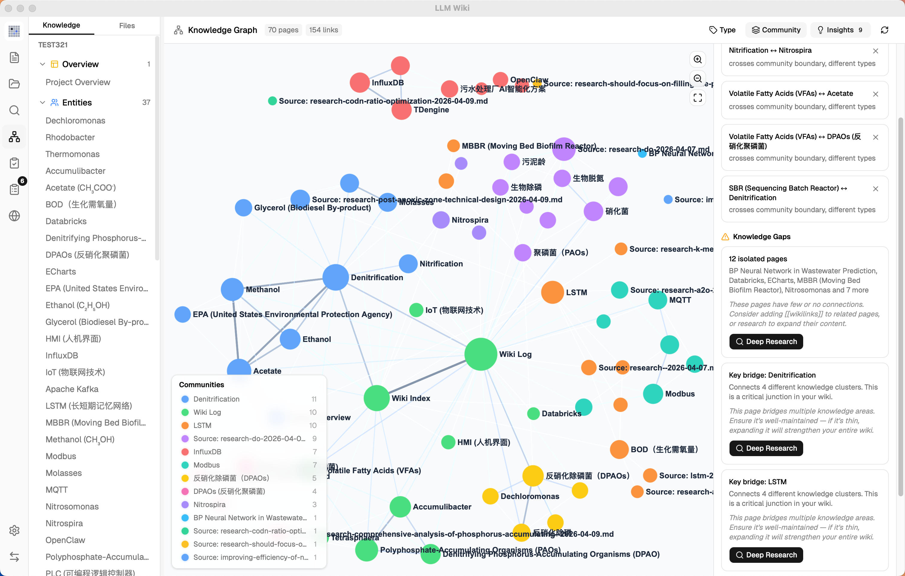
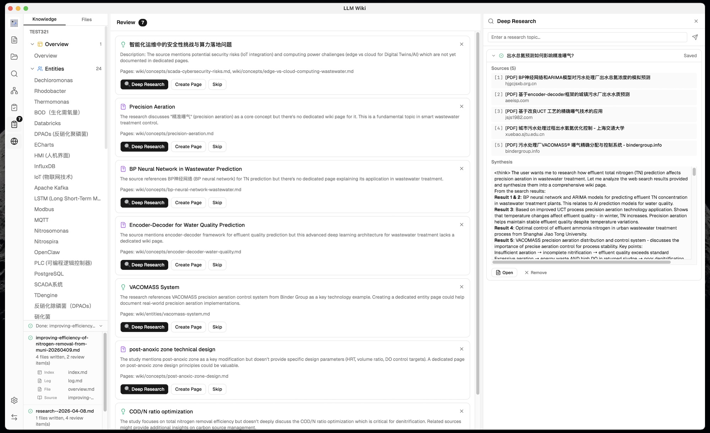
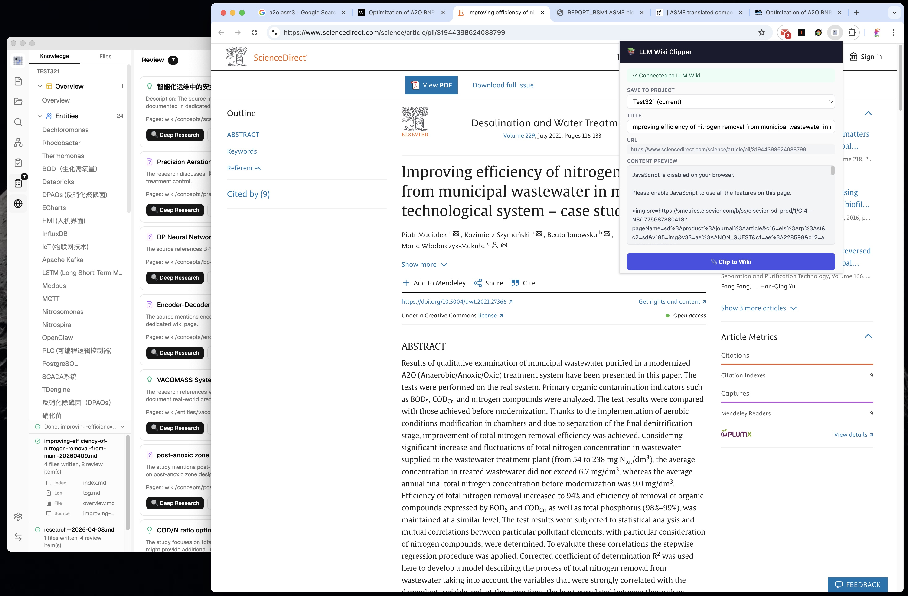

# LLM Wiki

<p align="center">
  
</p>

<p align="center">
  <strong>A personal knowledge base that builds itself.</strong><br>
  LLM reads your documents, builds a structured wiki, and keeps it current.
</p>

<p align="center">
  <a href="#design-philosophy">Design Philosophy</a> •
  <a href="#what-is-this">What is this?</a> •
  <a href="#what-we-changed--added">Features</a> •
  <a href="#tech-stack">Tech Stack</a> •
  <a href="#installation">Installation</a> •
  <a href="#credits">Credits</a> •
  <a href="#license">License</a>
</p>

<p align="center">
  English | <a href="README_CN.md">中文</a>
</p>

---

<p align="center">
  
</p>

## Features

- **Two-Step Chain-of-Thought Ingest** — LLM analyzes first, then generates wiki pages with source traceability and incremental cache
- **Multimodal Image Ingestion** — extract embedded images from PDFs, generate factual captions with a vision LLM, surface them in image-aware search results with lightbox preview and jump-to-source
- **4-Signal Knowledge Graph** — relevance model with direct links, source overlap, Adamic-Adar, and type affinity
- **Leiden Community Detection** — automatic knowledge cluster discovery with cohesion scoring
- **Graph Insights** — surprising connections and knowledge gaps with one-click Deep Research
- **Vector Semantic Search** — optional embedding-based retrieval via LanceDB, supports any OpenAI-compatible endpoint
- **LLM Wiki v2 Local Slice** — page-level lifecycle metadata, fact-level claim evidence, confidence signals, typed relationship fields, graph-aware RRF retrieval, BM25 evidence, pre-write conflict gates, historical conflict patrol, and append-only audit events
- **Memory Ops Workbench** — local maintenance patrol, schema/quality scans, claim health, historical conflict review suggestions, batch metadata governance, rollback, audit timeline explorer, lifecycle policy tuning, custom search health checks, digest preview, and coordination summary
- **Persistent Ingest Queue** — serial processing with crash recovery, cancel, retry, and progress visualization
- **Folder Import** — recursive folder import preserving directory structure, folder context as LLM classification hint
- **Deep Research** — LLM-optimized search topics, multi-query web search, auto-ingest results into wiki
- **Async Review System** — LLM flags items for human judgment, predefined actions, pre-generated search queries
- **Chrome Web Clipper** — one-click web page capture with auto-ingest into knowledge base

## Design Philosophy

**Markdown-first, human-gated, local-first storage with transparent cloud compute.** This is an opinionated LLM wiki: `wiki/` remains the source of truth, and `.llm-wiki/` stores derived local state such as indexes, audit logs, maintenance state, and review suggestions. LLMs, embeddings, web search, and vision captioning can run against local endpoints or cloud APIs; those outbound compute calls should be explicit, governed by Network Policy, and auditable rather than hidden.

- **Markdown is the source of truth.** Graphs, indexes, and derived records can be rebuilt from local files. Your wiki stays readable without the app, diffable in Git, and portable to tools like Obsidian.
- **Humans approve risky writes.** The app may suggest updates, supersessions, and maintenance actions, but it does not silently rewrite Markdown behind your back.
- **Cloud LLMs are optional compute, not remote storage.** OpenAI, Anthropic, Google, Claude Code CLI, Tavily, SerpApi, and similar providers may be used when you choose them, while project files and derived state remain local-first.
- **A local app daemon keeps maintenance visible.** While the app process is running, a lightweight local maintenance loop checks due state every 15 minutes by default. It can remind you, and when policy allows it can schedule deterministic patrol. It stops when the app fully quits.
- **Network Policy governs outbound calls.** `local-only` is a strict mode for offline-sensitive users; `allowlist` and `any` support transparent cloud compute when that is the desired workflow.
- **No remote memory server or mesh sync.** This phase deliberately excludes a hosted backend, auth system, multi-user ACL, and cross-device mesh sync.
- **Explicit beats auto-magic.** Confidence, contradictions, and crystallization are designed to be inspectable and reviewable rather than invisible background mutations.

### Local Storage vs Cloud Compute

| Area | Default posture | Notes |
|------|-----------------|-------|
| Wiki pages | Local-first | Markdown in `wiki/` is the source of truth. |
| Derived state | Local-first | `.llm-wiki/` stores rebuildable indexes, audit, claims, chats, and maintenance state. |
| Lexical/BM25/graph search | Local | Runs over local Markdown and derived indexes. |
| Vector store | Local storage, configurable compute | LanceDB is local; embedding generation uses the configured endpoint. |
| LLM chat / ingest / lint | Configurable compute | Can use Ollama/local endpoints or cloud LLM APIs. |
| Claude Code CLI | Local process, remote model | Uses the local `claude` binary, but inference happens through Claude Code's remote backend. |
| Web Search / Deep Research | Cloud-dependent unless configured local | Tavily/SerpApi are cloud providers; local SearXNG support is planned. |
| Vision caption | Configurable compute | Image bytes are sent to the selected vision provider; local VLM presets are planned. |
| Update check | Cloud-dependent, policy-gated | Uses GitHub Releases when enabled and allowed by Network Policy. |
| Clip server / maintenance daemon | Local app runtime | Clip server binds to `127.0.0.1`; maintenance checks run only while the app process is alive. The `127.0.0.1:19827` clip bridge is a documented policy exception, not cloud egress. |

## What is this?

LLM Wiki is a cross-platform desktop application that turns your documents into an organized, interlinked knowledge base — automatically. Instead of traditional RAG (retrieve-and-answer from scratch every time), the LLM **incrementally builds and maintains a persistent wiki** from your sources. Knowledge is compiled once and kept current, not re-derived on every query.

This project is based on [Karpathy's LLM Wiki pattern](https://gist.github.com/karpathy/442a6bf555914893e9891c11519de94f) — a methodology for building personal knowledge bases using LLMs. We implemented the core ideas as a full desktop application with significant enhancements.

<p align="center">
  
</p>

## Credits

The foundational methodology comes from **Andrej Karpathy**'s [llm-wiki.md](https://gist.github.com/karpathy/442a6bf555914893e9891c11519de94f), which describes the pattern of using LLMs to incrementally build and maintain a personal wiki. The original document is an abstract design pattern; this project is a concrete implementation with substantial extensions.

## What We Kept from the Original

The core architecture follows Karpathy's design faithfully:

- **Three-layer architecture**: Raw Sources (immutable) → Wiki (LLM-generated) → Schema (rules & config)
- **Three core operations**: Ingest, Query, Lint
- **index.md** as the content catalog and LLM navigation entry point
- **log.md** as the chronological operation record with parseable format
- **[[wikilink]]** syntax for cross-references
- **YAML frontmatter** on every wiki page
- **Obsidian compatibility** — the wiki directory works as an Obsidian vault
- **Human curates, LLM maintains** — the fundamental role division

<p align="center">
  
</p>

## What We Changed & Added

### 1. From CLI to Desktop Application

The original is an abstract pattern document designed to be copy-pasted to an LLM agent. We built it into a **full cross-platform desktop application** with:
- **Three-column layout**: Knowledge Tree / File Tree (left) + Chat (center) + Preview (right)
- **Icon sidebar** for switching between Wiki, Sources, Search, Graph, Lint, Review, Deep Research, Settings
- **Custom resizable panels** — drag-to-resize left and right panels with min/max constraints
- **Activity panel** — real-time processing status showing file-by-file ingest progress
- **All state persisted** — conversations, settings, review items, project config survive restarts
- **Scenario templates** — Research, Reading, Personal Growth, Business, General — each pre-configures purpose.md and schema.md

### 2. Purpose.md — The Wiki's Soul

The original has Schema (how the wiki works) but no formal place for **why** the wiki exists. We added `purpose.md`:
- Defines goals, key questions, research scope, evolving thesis
- LLM reads it during every ingest and query for context
- LLM can suggest updates based on usage patterns
- Different from schema — schema is structural rules, purpose is directional intent

### 3. Two-Step Chain-of-Thought Ingest

The original describes a single-step ingest where the LLM reads and writes simultaneously. We split it into **two sequential LLM calls** for significantly better quality:

```
Step 1 (Analysis): LLM reads source → structured analysis
  - Key entities, concepts, arguments
  - Connections to existing wiki content
  - Contradictions & tensions with existing knowledge
  - Recommendations for wiki structure

Step 2 (Generation): LLM takes analysis → generates wiki files
  - Source summary with frontmatter (type, title, sources[])
  - Entity pages, concept pages with cross-references
  - Updated index.md, log.md, overview.md
  - Review items for human judgment
  - Search queries for Deep Research
```

Additional ingest enhancements beyond the original:
- **SHA256 incremental cache** — source file content is hashed before ingest; unchanged files are skipped automatically, saving LLM tokens and time
- **Persistent ingest queue** — serial processing prevents concurrent LLM calls; queue persisted to disk, survives app restart; failed tasks auto-retry up to 3 times
- **Folder import** — recursive folder import preserving directory structure; folder path passed to LLM as classification context (e.g., "papers > energy" helps categorize content)
- **Queue visualization** — Activity Panel shows progress bar, pending/processing/failed tasks with cancel and retry buttons
- **Auto-embedding** — when vector search is enabled, new pages are automatically embedded after ingest
- **Source traceability** — every generated wiki page includes a `sources: []` field in YAML frontmatter, linking back to the raw source files that contributed to it
- **overview.md auto-update** — global summary page regenerated on every ingest to reflect the latest state of the wiki
- **Guaranteed source summary** — fallback ensures a source summary page is always created, even if the LLM omits it
- **Language-aware generation** — LLM responds in the user's configured language (English or Chinese)

### 4. Knowledge Graph with Relevance Model

<p align="center">
  
</p>

The original mentions `[[wikilinks]]` for cross-references but has no graph analysis. We built a **full knowledge graph visualization and relevance engine**:

**4-Signal Relevance Model:**
| Signal | Weight | Description |
|--------|--------|-------------|
| Direct link | ×3.0 | Pages linked via `[[wikilinks]]` |
| Source overlap | ×4.0 | Pages sharing the same raw source (via frontmatter `sources[]`) |
| Adamic-Adar | ×1.5 | Pages sharing common neighbors (weighted by neighbor degree) |
| Type affinity | ×1.0 | Bonus for same page type (entity↔entity, concept↔concept) |

**Graph Visualization (sigma.js + graphology + ForceAtlas2):**
- Node colors by page type or community, sizes scaled by link count (√ scaling)
- Edge thickness and color by relevance weight (green=strong, gray=weak)
- Hover interaction: neighbors stay visible, non-neighbors dim, edges highlight with relevance score label
- Zoom controls (ZoomIn, ZoomOut, Fit-to-screen)
- Position caching prevents layout jumps when data updates
- Legend switches between type counts and community info based on coloring mode

### 5. Leiden Community Detection

Not in the original. Automatic discovery of knowledge clusters using the **Leiden algorithm** (@aflsolutions/graphology-communities-leiden):

- **Auto-clustering** — discovers which pages naturally group together based on link topology, independent of predefined page types
- **Type / Community toggle** — switch between coloring nodes by page type (entity, concept, source...) or by discovered knowledge cluster
- **Cohesion scoring** — each community scored by intra-edge density (actual edges / possible edges); low-cohesion clusters (< 0.15) flagged with warning
- **12-color palette** — distinct visual separation between clusters
- **Community legend** — shows top node label, member count, and cohesion per cluster

<p align="center">
  
</p>

### 6. Graph Insights — Surprising Connections & Knowledge Gaps

Not in the original. The system **automatically analyzes graph structure** to surface actionable insights:

**Surprising Connections:**
- Detects unexpected relationships: cross-community edges, cross-type links, peripheral↔hub couplings
- Composite surprise score ranks the most noteworthy connections
- Dismissable — mark connections as reviewed so they don't reappear

**Knowledge Gaps:**
- **Isolated pages** (degree ≤ 1) — pages with few or no connections to the rest of the wiki
- **Sparse communities** (cohesion < 0.15, ≥ 3 pages) — knowledge areas with weak internal cross-references
- **Bridge nodes** (connecting 3+ clusters) — critical junction pages that hold multiple knowledge areas together

**Interactive:**
- Click any insight card to **highlight** corresponding nodes and edges in the graph; click again to deselect
- Knowledge gaps and bridge nodes have a **Deep Research button** — triggers LLM-optimized research with domain-aware topics (reads overview.md + purpose.md for context)
- Research topic shown in **editable confirmation dialog** before starting — user can refine topic and search queries

<p align="center">
  
</p>

### 7. Optimized Query Retrieval Pipeline

The original describes a simple query where the LLM reads relevant pages. We built a **multi-phase retrieval pipeline** with optional vector search and budget control:

```
Phase 1: Tokenized Search
  - English: word splitting + stop word removal
  - Chinese: CJK bigram tokenization (每个 → [每个, 个…])
  - Title match bonus (+10 score)
  - Searches both wiki/ and raw/sources/

Phase 1.1: Local Lexical Evidence
  - Token and phrase matches keep exact title / filename hits deterministic
  - BM25-style scoring records content and title evidence for materialized results
  - Retrieval output exposes token, BM25, vector, and graph contributions for tuning

Phase 1.5: Vector Semantic Search (optional)
  - Embedding via any OpenAI-compatible /v1/embeddings endpoint
  - Stored in LanceDB (Rust backend) for fast ANN retrieval
  - Cosine similarity finds semantically related pages even without keyword overlap
  - Results merged into search: boosts existing matches + adds new discoveries

Phase 2: Rank Fusion + Graph Expansion
  - Top search results used as seed nodes
  - 4-signal relevance model finds related pages
  - 2-hop traversal with decay for deeper connections
  - Reciprocal-rank style graph contributions stay visible in each result

Phase 3: Budget Control
  - Configurable context window: 4K → 1M tokens
  - Proportional allocation: 60% wiki pages, 20% chat history, 5% index, 15% system
  - Pages prioritized by combined search + graph relevance score

Phase 4: Context Assembly
  - Numbered pages with full content (not just summaries)
  - System prompt includes: purpose.md, language rules, citation format, index.md
  - LLM instructed to cite pages by number: [1], [2], etc.
```

**Vector Search** is fully optional — disabled by default, enabled in Settings with independent endpoint, API key, and model configuration. When disabled, the pipeline falls back to deterministic token/phrase search, local BM25 evidence, and typed graph expansion. Benchmark: overall recall improved from 58.2% to 71.4% with vector search enabled.

### 8. Multi-Conversation Chat with Persistence

The original has a single query interface. We built **full multi-conversation support**:

- **Independent chat sessions** — create, rename, delete conversations
- **Conversation sidebar** — quick switching between topics
- **Per-conversation persistence** — each conversation saved to `.llm-wiki/chats/{id}.json`
- **Configurable history depth** — limit how many messages are sent as context (default: 10)
- **Cited references panel** — collapsible section on each response showing which wiki pages were used, grouped by type with icons
- **Reference persistence** — cited pages stored directly in message data, stable across restarts
- **Regenerate** — re-generate the last response with one click (removes last assistant + user message pair, re-sends)
- **Save to Wiki** — archive valuable answers to `wiki/queries/`, then auto-ingest to extract entities/concepts into the knowledge network

### 9. Memory Ops Patrol and Audit Timeline

Rohit-style LLM Wiki v2 ideas are implemented here as a local maintenance layer, not as an external memory server. Markdown remains the durable source of truth; Memory Ops only derives suggestions, metadata patches, audit events, and evaluation reports from the local project.

- **Schema-as-product contract** — new projects include a machine-readable `llm-wiki-schema-contract` block inside `schema.md`; old projects without the block use the default contract fallback and surface a warning during scan
- **Schema & Quality scan** — Settings -> Maintenance can parse the contract, scan `wiki/**/*.md` for frontmatter drift, typed relation issues, path/type mismatches, and deterministic page quality dimensions
- **Schema findings as Memory Ops suggestions** — safe metadata-only findings reuse the existing preview/apply/ignore and batch governance flow; review-only findings stay visible without becoming automatic patches
- **Latest scan in patrol** — Memory Ops patrol shows the latest saved Schema & Quality summary, including finding counts, warnings, low-quality pages, average quality, and suggestion count, without rerunning the expensive schema scan during patrol
- **Event hooks** — `session.start/end`, `memory.write`, `schema.scan`, `quality.scan`, `digest.preview`, and `digest.save` write best-effort audit events and maintenance markers; when the local policy allows it, due activity can schedule a cooldown-gated patrol through the app-resident local daemon without high-frequency source rescan
- **Unified audit timeline** — `.llm-wiki/audit.jsonl` records lifecycle, crystallization, patrol, ignore, and metadata-apply events with redaction and bad-line tolerance
- **Source-of-truth boundary** — patrol reads wiki pages, typed graph state, review state, chat history, and audit activity; raw documents remain immutable inputs, not a background rescan target
- **Fact-level claim evidence** — high-value findings, decisions, recommendations, contradictions, and conclusions can receive app-managed Markdown anchors such as `<!-- claim:claim_xxx -->`; `.llm-wiki/claims.jsonl` stores a derived, rebuildable claim index for search/chat evidence, Memory Ops claim health, and claim audit handoff
- **Claim confidence boundaries** — claim confidence is a maintenance and evidence signal, not an automatic truth verdict. Contradicted, stale, or superseded claims are surfaced for review instead of silently rewriting or deleting Markdown.
- **Claim index recovery** — Maintenance can scan/rebuild the derived claim index from wiki pages and anchors, list recovered/orphan/stale records, and audit confirmed rebuilds without reading large `raw/sources/` files
- **Pre-write conflict gate** — ingest content pages, crystallized saves, and review-created pages build bounded write candidates before landing. Related pages and claim evidence classify writes as new, reinforcement, update, duplicate, possible contradiction, supersession, or uncertain; safe writes continue with `conflict.accept` audit, while risky writes skip direct overwrite, create or expose review handoff, and write `conflict.review`.
- **Historical conflict patrol** — Memory Ops reuses the same bounded conflict resolver for existing wiki pages during manual or policy-triggered patrol. Duplicate, possible contradiction, supersession, or uncertain findings become review-only suggestions with summary stats in patrol audit; same-target updates and reinforcement are filtered out.
- **Deterministic patrol runner** — Settings -> Maintenance can scan local project state without requiring an LLM; routine projects default to policy-gated automatic patrol after enough activity, while stricter knowledge bases can disable automatic patrol and run it manually
- **Configurable app-resident auto patrol** — query, search, and review activity can mark that a patrol is due. The local maintenance daemon checks due state every 15 minutes by default while the app is running. With `autoPatrolEnabled: true`, the app may run local Memory Ops patrol after the event threshold, time interval, and cooldown gates are satisfied. With `autoPatrolEnabled: false`, the same events only update due state and reminders; users confirm patrol from Maintenance.
- **Lifecycle suggestions** — stale, low-confidence, superseded, archivable, and promotion candidates are surfaced as metadata suggestions instead of automatic rewrites
- **Relation cleanup suggestions** — broken typed relationship targets and dangling supersession links are flagged separately from ordinary wikilink lint
- **Batch metadata governance** — selectable metadata suggestions support batch preview, batch apply, and batch ignore with per-item failure isolation and batch summary audit events
- **Dry-run metadata actions** — users preview field-level frontmatter diffs before applying metadata-only changes; ignore/apply decisions are audited and private scope details are redacted
- **Rollback for recent patches** — recently applied metadata patches expose rollback preview/apply controls; conflicts are preview-only by default and rollback results are audited
- **Audit Timeline Explorer** — Settings -> Maintenance includes filterable audit browsing by category, action, path, scope, status, and text, including bad-line warnings and target-file opening
- **Lifecycle Policy panel** — local half-life, low-confidence, promotion, archive, and auto-patrol thresholds can be tuned per project; saving reruns patrol with the new policy
- **Search Health panel** — users can run built-in smoke evals plus project-local custom scenarios from `.llm-wiki/search-health-scenarios.json`, then inspect built-in/custom/skipped counts, failures, and the latest `.llm-wiki/search-eval-report.json`
- **Crystallization candidates and digest preview** — high-value chat, research, and review outputs can prompt a low-noise Save to Wiki suggestion, show lessons/decisions/entities/relation candidates, and save a confirmed digest as a query or synthesis page
- **Coordination summary** — Settings -> Maintenance summarizes local actor activity, recent audit events, pending reviews, blocked schema findings, and private-to-shared promotion candidates, with target opening and timeline filtering; it is local audit-derived context, not cloud sync or team permissions
- **Search evaluation harness** — deterministic scenarios can be run from tests or the Search Health panel before retrieval tuning

#### Schema Contract Migration

Existing projects do not need a manual migration before opening. If `schema.md` does not contain a machine-readable contract block, Schema & Quality scan falls back to the built-in v1 contract and reports that fallback in the scan summary. To adopt the explicit contract, create a new project from the current template and copy the `llm-wiki-schema-contract` fenced block into the older project's `schema.md`, then run Schema & Quality scan and preview any generated metadata suggestions before applying them.

Claim evidence is also migration-safe. Older projects can continue without
`.llm-wiki/claims.jsonl`; search, chat, and Memory Ops fall back to page-level
signals. New ingest, crystallization, and review-created pages may add claim
anchors over time. If the derived index is missing or stale, run the explicit
claim index scan/rebuild from Maintenance; it reconstructs recoverable records
from Markdown anchors and reports anything orphaned instead of treating the
index as an authoritative database.

Pre-write conflict handling follows the same migration boundary. Missing
claim indexes are treated as empty evidence for new projects, not as corruption.
When related contradicted or superseded claims, duplicate targets, or uncertain
resolver failures are found, the write is routed to review instead of silently
rewriting Markdown. The gate is local and deterministic; historical checks run
only when the user starts Memory Ops patrol, and neither path asks an LLM to
decide which fact is true.

### 10. Thinking / Reasoning Display

Not in the original. For LLMs that emit `<think>` blocks (DeepSeek, QwQ, etc.):

- **Streaming thinking** — rolling 5-line display with opacity fade during generation
- **Collapsed by default** — thinking blocks hidden after completion, click to expand
- **Visual separation** — thinking content shown in distinct style, separate from the main response

### 11. KaTeX Math Rendering

Not in the original. Full LaTeX math support across all views:

- **KaTeX rendering** — inline `$...$` and block `$$...$$` formulas rendered via remark-math + rehype-katex
- **Milkdown math plugin** — preview editor renders math natively via @milkdown/plugin-math
- **Auto-detection** — bare `\begin{aligned}` and other LaTeX environments automatically wrapped with `$$` delimiters
- **Unicode fallback** — 100+ symbol mappings (α, ∑, →, ≤, etc.) for simple inline notation outside math blocks

### 12. Review System (Async Human-in-the-Loop)

The original suggests staying involved during ingest. We added an **asynchronous review queue**:

- LLM flags items needing human judgment during ingest
- **Predefined action types**: Create Page, Deep Research, Skip — constrained to prevent LLM hallucination of arbitrary actions
- **Search queries generated at ingest time** — LLM pre-generates optimized web search queries for each review item
- User handles reviews at their convenience — doesn't block ingest

### 13. Deep Research

<p align="center">
  
</p>

Not in the original. When the LLM identifies knowledge gaps:

- **Web search** (Tavily API) finds relevant sources with full content extraction (no truncation)
- **Multiple search queries** per topic — LLM-generated at ingest time, optimized for search engines
- **LLM-optimized research topics** — when triggered from Graph Insights, LLM reads overview.md + purpose.md to generate domain-specific topics and queries (not generic keywords)
- **User confirmation dialog** — editable topic and search queries shown for review before research starts
- **LLM synthesizes** findings into a wiki research page with cross-references to existing wiki
- **Thinking display** — `<think>` blocks shown as collapsible sections during synthesis, auto-scroll to latest content
- **Auto-ingest** — research results automatically processed to extract entities/concepts into the wiki
- **Task queue** with 3 concurrent tasks
- **Research Panel** — dedicated sidebar panel with dynamic height, real-time streaming progress

### 14. Browser Extension (Web Clipper)

<p align="center">
  
</p>

The original mentions Obsidian Web Clipper. We built a **dedicated Chrome Extension** (Manifest V3):

- **Mozilla Readability.js** for accurate article extraction (strips ads, nav, sidebars)
- **Turndown.js** for HTML → Markdown conversion with table support
- **Project picker** — choose which wiki to clip into (supports multi-project)
- **Local HTTP API** (port 19827, tiny_http) — Extension ↔ App communication
- **Auto-ingest** — clipped content automatically triggers the two-step ingest pipeline
- **Clip watcher** — polls every 3 seconds for new clips, processes automatically
- **Offline preview** — shows extracted content even when app is not running

### 15. Multi-format Document Support

The original focuses on text/markdown. We support structured extraction preserving document semantics:

| Format | Method |
|--------|--------|
| PDF | pdf-extract (Rust) with file caching |
| DOCX | docx-rs — headings, bold/italic, lists, tables → structured Markdown |
| PPTX | ZIP + XML — slide-by-slide extraction with heading/list structure |
| XLSX/XLS/ODS | calamine — proper cell types, multi-sheet support, Markdown tables |
| Images | Native preview (png, jpg, gif, webp, svg, etc.) |
| Video/Audio | Built-in player |
| Web clips | Readability.js + Turndown.js → clean Markdown |

### 16. File Deletion with Cascade Cleanup

The original has no deletion mechanism. We added **intelligent cascade deletion**:

- Deleting a source file removes its wiki summary page
- **3-method matching** finds related wiki pages: frontmatter `sources[]` field, source summary page name, frontmatter section references
- **Shared entity preservation** — entity/concept pages linked to multiple sources only have the deleted source removed from their `sources[]` array, not deleted entirely
- **Index cleanup** — removed pages are purged from index.md
- **Wikilink cleanup** — dead `[[wikilinks]]` to deleted pages are removed from remaining wiki pages

### 17. Configurable Context Window

Not in the original. Users can configure how much context the LLM receives:

- **Slider from 4K to 1M tokens** — adapts to different LLM capabilities
- **Proportional budget allocation** — larger windows get proportionally more wiki content
- **60/20/5/15 split** — wiki pages / chat history / index / system prompt

### 18. Cross-Platform Compatibility

The original is platform-agnostic (abstract pattern). We handle concrete cross-platform concerns:

- **Path normalization** — unified `normalizePath()` used across 22+ files, backslash → forward slash
- **Unicode-safe string handling** — char-based slicing instead of byte-based (prevents crashes on CJK filenames)
- **macOS close-to-hide** — close button hides window (app stays running in background), click dock icon to restore, Cmd+Q to quit
- **Windows/Linux close confirmation** — confirmation dialog before quitting to prevent accidental data loss
- **Tauri v2** — native desktop on macOS, Windows, Linux
- **GitHub Actions CI/CD** — automated builds for macOS (ARM + Intel), Windows (.msi), Linux (.deb / .AppImage)

### 19. Other Additions

- **i18n** — English + Chinese interface (react-i18next)
- **Settings persistence** — LLM provider, API key, model, context size, language saved via Tauri Store
- **Obsidian config** — auto-generated `.obsidian/` directory with recommended settings
- **Markdown rendering** — GFM tables with borders, proper code blocks, wikilink processing in chat and preview
- **Multi-provider LLM support** — OpenAI, Anthropic, Google, Ollama, Custom — each with provider-specific streaming and headers
- **15-minute timeout** — long ingest operations won't fail prematurely
- **dataVersion signaling** — graph and UI automatically refresh when wiki content changes

## Tech Stack

| Layer | Technology |
|-------|-----------|
| Desktop | Tauri v2 (Rust backend) |
| Frontend | React 19 + TypeScript + Vite |
| UI | shadcn/ui + Tailwind CSS v4 |
| Editor | Milkdown (ProseMirror-based WYSIWYG) |
| Graph | sigma.js + graphology + ForceAtlas2 |
| Search | Token/phrase lexical search + local BM25 evidence + optional vector (LanceDB) + typed graph RRF |
| Vector DB | LanceDB (Rust, embedded, optional) |
| PDF | pdf-extract |
| Office | docx-rs + calamine |
| i18n | react-i18next |
| State | Zustand |
| LLM | Streaming fetch (OpenAI, Anthropic, Google, Ollama, Custom) |
| Web Search | Tavily API |

## Installation

### Pre-built Binaries

Download from [Releases](https://github.com/nashsu/llm_wiki/releases):
- **macOS**: `.dmg` (Apple Silicon + Intel)
- **Windows**: `.msi`
- **Linux**: `.deb` / `.AppImage`

### Build from Source

```bash
# Prerequisites: Node.js 20+, Rust 1.70+
git clone https://github.com/nashsu/llm_wiki.git
cd llm_wiki
npm install
npm run tauri dev      # Development
npm run tauri build    # Production build
```

### Chrome Extension

1. Open `chrome://extensions`
2. Enable "Developer mode"
3. Click "Load unpacked"
4. Select the `extension/` directory

## Quick Start

1. Launch the app → Create a new project (choose a template)
2. Go to **Settings** → Configure your LLM provider (API key + model)
3. Go to **Sources** → Import documents (PDF, DOCX, MD, etc.)
4. Watch the **Activity Panel** — LLM automatically builds wiki pages
5. Use **Chat** to query your knowledge base
6. Browse the **Knowledge Graph** to see connections
7. Check **Review** for items needing your attention
8. Use **Settings -> Maintenance** to run Memory Ops patrol, batch safe metadata suggestions, review audit history, tune lifecycle policy, and run Search Health

## Project Structure

```
my-wiki/
├── purpose.md              # Goals, key questions, research scope
├── schema.md               # Wiki structure rules, page types
├── raw/
│   ├── sources/            # Uploaded documents (immutable)
│   └── assets/             # Local images
├── wiki/
│   ├── index.md            # Content catalog
│   ├── log.md              # Operation history
│   ├── overview.md         # Global summary (auto-updated)
│   ├── entities/           # People, organizations, products
│   ├── concepts/           # Theories, methods, techniques
│   ├── sources/            # Source summaries
│   ├── queries/            # Saved chat answers + research
│   ├── synthesis/          # Cross-source analysis
│   └── comparisons/        # Side-by-side comparisons
├── .obsidian/              # Obsidian vault config (auto-generated)
└── .llm-wiki/              # App config, chat history, review items
    ├── audit.jsonl         # Append-only redacted audit timeline
    ├── claims.jsonl        # Derived claim evidence index
    ├── search-health-scenarios.json # Project-local custom Search Health scenarios
    └── search-eval-report.json # Latest Search Health report
```

## Star History

<a href="https://www.star-history.com/?repos=nashsu%2Fllm_wiki&type=date&legend=top-left">
 <picture>
   <source media="(prefers-color-scheme: dark)" srcset="https://api.star-history.com/chart?repos=nashsu/llm_wiki&type=date&theme=dark&legend=top-left" />
   <source media="(prefers-color-scheme: light)" srcset="https://api.star-history.com/chart?repos=nashsu/llm_wiki&type=date&legend=top-left" />
   
 </picture>
</a>

## License

This project is licensed under the **GNU General Public License v3.0** — see [LICENSE](LICENSE) for details.
