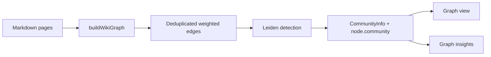

# Requirements - Leiden Community Detection

**Version**: v0.1
**Date**: 2026-05-15
**Author**: User + AI
**Status**: Confirmed
**Task List**: [tasks.md](./tasks.md)

---

## 1. Background

llm wiki v2 currently detects knowledge clusters in the graph view with Louvain community detection via `graphology-communities-louvain`. The cluster assignment is used for community coloring, legends, cohesion scoring, sparse-cluster warnings, cross-community edge insights, and bridge-node insights.

For wiki graphs, Louvain can produce communities whose internal connectivity is weak. This matters because wiki pages often include hub or bridge pages such as indexes, summaries, sources, and high-level concepts. Those nodes can merge adjacent knowledge areas into a cluster that is visually convenient but structurally misleading.

Leiden improves on Louvain by adding a refinement phase intended to produce better-connected communities. The goal of this change is to replace the existing Louvain implementation with Leiden while preserving the current graph API and UI behavior.

---

## 2. Goals

### 2.1 In Scope

- Replace Louvain community detection with Leiden in the wiki graph build path.
- Keep the existing `GraphNode.community` and `CommunityInfo` public data shape stable.
- Preserve cohesion scoring, community renumbering, graph color mode, insights, and existing graph rendering behavior.
- Update dependencies and lockfile to remove Louvain and add a Leiden implementation.
- Update README references and code comments from Louvain to Leiden.
- Add or update tests that verify Leiden-backed community detection without depending on unstable numeric community ids.

### 2.2 Out of Scope

- No redesign of the graph visualization UI.
- No rewrite of graph relevance, typed relationship extraction, search, or chat context expansion.
- No user-facing setting to choose Louvain vs Leiden.
- No native, WASM, Python, or Rust sidecar community detection.
- No changes to saved wiki data format.

### 2.3 Success Criteria

- `buildWikiGraph` assigns communities using a Leiden implementation.
- Project dependency metadata no longer includes `graphology-communities-louvain`.
- README and README_CN describe Leiden community detection.
- Fast deterministic tests cover the graph community behavior.
- `npm run typecheck` passes.
- Relevant Vitest coverage passes.

---

## 3. User Stories

### 3.1 Graph View Cluster Inspection

**Role**: llm wiki v2 user

**Preconditions**: A project contains interlinked wiki pages across multiple topics.

**Steps**:
1. User opens the graph view.
2. System builds the wiki graph from markdown pages and typed relationships.
3. System runs Leiden community detection.
4. User switches the graph color mode to community.

**Expected Result**: Nodes are grouped into knowledge clusters using Leiden, with existing community colors and legend behavior preserved.

### 3.2 Graph Insight Review

**Role**: llm wiki v2 user

**Preconditions**: A wiki graph has sparse clusters, bridge nodes, or cross-community edges.

**Steps**:
1. User opens graph insights.
2. System evaluates nodes and edges using assigned community ids.

**Expected Result**: Existing insight categories continue to work with Leiden community assignments.

---

## 4. Functional Requirements

### F1: Leiden-backed Community Detection

**Description**: Replace the Louvain algorithm call with a Leiden community detection implementation compatible with the existing graph build path.

**Input**: Preliminary graph nodes and deduplicated weighted edges.

**Behavior**:
- Construct an undirected `graphology` graph as before.
- Add nodes and deduplicated edges with weight attributes.
- Run Leiden with resolution 1.
- Use edge weights if the selected Leiden library requires an explicit option.
- Convert returned assignments into `Map<string, number>`.

**Output**: Community assignments and `CommunityInfo[]`.

**Acceptance Criteria**:
- [ ] No production code imports `graphology-communities-louvain`.
- [ ] Production graph detection imports a Leiden library.
- [ ] Existing return shape from `buildWikiGraph` is unchanged.

### F2: Stable Community Metadata

**Description**: Preserve downstream expectations for community ids and community summaries.

**Input**: Leiden assignments and graph edges.

**Behavior**:
- Group nodes by assigned community.
- Compute cohesion as intra-community edge density.
- Compute top nodes by `linkCount`.
- Sort communities by descending node count.
- Renumber community ids sequentially from 0.

**Output**: Stable `CommunityInfo[]` shape and remapped node community ids.

**Acceptance Criteria**:
- [ ] `CommunityInfo` remains `{ id, nodeCount, cohesion, topNodes }`.
- [ ] `GraphNode.community` remains a number.
- [ ] Tests avoid depending on raw algorithm community id values.

### F3: Documentation Alignment

**Description**: Update project documentation and comments to accurately describe Leiden.

**Acceptance Criteria**:
- [ ] README feature list names Leiden community detection.
- [ ] README_CN feature list names Leiden community detection.
- [ ] Implementation comments no longer describe the algorithm as Louvain.

### F4: Verification

**Description**: Add or update tests for Leiden-backed graph clustering.

**Acceptance Criteria**:
- [ ] Relevant graph tests pass.
- [ ] TypeScript typecheck passes.
- [ ] Final review records findings and fixes in `review-round-1.md`.

---

## 5. Non-Functional Requirements

### 5.1 Performance

- The implementation should remain in-process TypeScript/JavaScript and suitable for client-side Tauri frontend execution.
- No native addon, Python process, JVM, or WASM runtime may be introduced.
- Community detection should remain bounded to the existing graph build operation.

### 5.2 Security

- No network calls during community detection.
- No new handling of secrets or external user data.

### 5.3 Accessibility

- No direct UI changes are planned. Existing graph controls and legends should remain unchanged.

### 5.4 Internationalization

- Documentation updates must keep English and Chinese README files aligned.

### 5.5 Observability

- No new runtime telemetry is required.
- Test output and final review document provide implementation traceability.

---

## 6. Technical Stack and Dependencies

### 6.1 Selection

| Dimension | Selection | Version | Rationale |
|---|---|---:|---|
| Frontend runtime | Vite + React + TypeScript | existing | Preserve current app architecture. |
| Graph data structure | `graphology` | `^0.26.0` | Already used for graph construction and ForceAtlas2 layout. |
| Community detection | `@aflsolutions/graphology-communities-leiden` | `1.1.1` | Graphology-compatible Leiden implementation, MIT licensed, minimal integration cost. |

### 6.2 New Dependencies

| Package | Version | Purpose |
|---|---:|---|
| `@aflsolutions/graphology-communities-leiden` | `1.1.1` | Leiden community detection for `graphology`. |

### 6.3 Removed Dependencies

| Package | Reason |
|---|---|
| `graphology-communities-louvain` | Replaced by Leiden. |

### 6.4 Environment Variables

No new environment variables.

---

## 7. Architecture Overview

### 7.1 Flow

### 7.2 Modules

| Module | Responsibility |
|---|---|
| `src/lib/wiki-graph.ts` | Build graph, run Leiden, compute community metadata. |
| `src/lib/wiki-graph.test.ts` | Verify graph construction and community behavior. |
| `README.md` / `README_CN.md` | User-facing feature documentation. |
| `package.json` / `package-lock.json` | Dependency metadata. |

---

## 8. Open Risks

| Risk | Probability | Impact | Mitigation |
|---|---|---|---|
| New Leiden package behavior differs from Louvain in existing tests | Medium | Medium | Update tests to assert semantic grouping rather than exact ids. |
| New Leiden package is young | Medium | Medium | Prefer Graphology-compatible MIT package, lock version, cover behavior with tests. |
| Weighted behavior differs unless enabled explicitly | Medium | Low | Inspect package docs/types and set `weighted: true` if available. |

---

## 9. Open Questions

- None. User confirmed replacing Louvain with Leiden.

---

## 10. References

- Traag, Waltman, and van Eck. "From Louvain to Leiden: Guaranteeing well-connected communities." Scientific Reports, 2019. https://www.nature.com/articles/s41598-019-41695-z
- `@aflsolutions/graphology-communities-leiden` npm package metadata and README.
- Existing implementation: `src/lib/wiki-graph.ts`.

---

## Change History

| Date | Version | Change |
|---|---:|---|
| 2026-05-15 | v0.1 | Initial confirmed requirements. |
