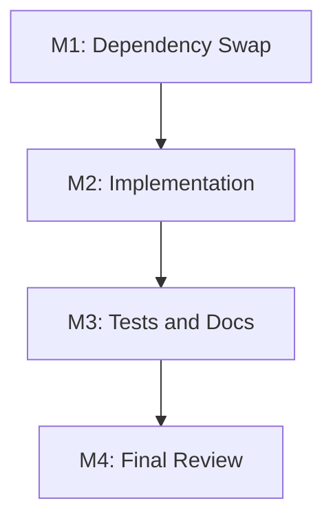

# Tasks - Leiden Community Detection

**Requirements**: [requirements.md](./requirements.md)
**Estimated Scope**: Small (final review rounds: 1)
**Overall Progress**: 🚧 2 / 4

---

## Status Legend

| Emoji | Status | Meaning |
|---|---|---|
| ⏳ | Pending | Not started |
| 🚧 | In progress | Currently being worked on |
| ✅ | Done | Implemented, self-reviewed, and verified |
| ⚠️ | Blocked | Waiting for external decision or unresolved blocker |
| 🔍 | Review | Ready for review |

---

## Milestone Dependency Graph

---

## Milestone 1: Dependency Swap

**Goal**: Replace Louvain dependency metadata with the selected Leiden package.
**Dependencies**: None
**Status**: ✅

### Task 1.1 ✅ Update package dependencies

**Description**: Remove `graphology-communities-louvain` and add `@aflsolutions/graphology-communities-leiden@1.1.1`.

**Depends on**: None
**Blocks**: T2.1

**Estimate**: 20m

**Files / Modules**:
- `package.json`
- `package-lock.json`

**Acceptance**:
- [ ] `package.json` includes the Leiden package.
- [ ] `package.json` no longer includes Louvain.
- [ ] Lockfile is updated by npm.

#### Notes

- 🐛 **Issues**:
- 🔧 **Implementation**:
- 🎯 **Decisions**:

---

## Milestone 2: Implementation

**Goal**: Run Leiden in the existing graph build path without changing downstream data shapes.
**Dependencies**: M1
**Status**: ✅

### Task 2.1 ✅ Replace graph community algorithm

**Description**: Update `src/lib/wiki-graph.ts` to import Leiden, call it on the existing `graphology` graph, and keep current community metadata behavior.

**Depends on**: T1.1
**Blocks**: T3.1, T3.2

**Estimate**: 45m

**Files / Modules**:
- `src/lib/wiki-graph.ts`

**Acceptance**:
- [ ] Production code imports a Leiden package.
- [ ] Louvain import and comments are removed.
- [ ] `GraphNode` and `CommunityInfo` shapes are unchanged.
- [ ] Community ids are still renumbered sequentially.

#### Notes

- 🐛 **Issues**: Initial concurrent npm commands left both Louvain and Leiden in `package.json`; resolved by manually removing Louvain and rerunning `npm install`.
- 🔧 **Implementation**: Added `@aflsolutions/graphology-communities-leiden@1.1.1`, removed `graphology-communities-louvain`, and regenerated `package-lock.json`.
- 🎯 **Decisions**: Kept the Leiden package exact-pinned because this is a new algorithm dependency and community partitions may shift across versions.

---

## Milestone 3: Tests and Documentation

**Goal**: Verify behavior and align public documentation.
**Dependencies**: M2
**Status**: 🚧

### Task 3.1 ✅ Update graph tests

**Description**: Update or add tests for Leiden-backed community detection while avoiding fragile exact community id assertions.

**Depends on**: T2.1
**Blocks**: T4.1

**Estimate**: 45m

**Files / Modules**:
- `src/lib/wiki-graph.test.ts`

**Acceptance**:
- [ ] Relevant graph test cases pass.
- [ ] Tests validate semantic community grouping or metadata shape.
- [ ] Tests avoid hardcoding raw Leiden community ids.

#### Notes

- 🐛 **Issues**: None after dependency update; the Leiden package exposes the expected default function and TypeScript declarations.
- 🔧 **Implementation**: Replaced the Louvain import/call in `src/lib/wiki-graph.ts` with `@aflsolutions/graphology-communities-leiden`, preserving the existing undirected graph construction and community metadata pipeline.
- 🎯 **Decisions**: Enabled `weighted: true` so existing relevance weights continue to affect clustering, and supplied a fixed-seed RNG to make repeated graph builds deterministic for a given input.

---

### Task 3.2 ⏳ Update README references

**Description**: Replace Louvain references with Leiden in English and Chinese project documentation.

**Depends on**: T2.1
**Blocks**: T4.1

**Estimate**: 25m

**Files / Modules**:
- `README.md`
- `README_CN.md`

**Acceptance**:
- [ ] English README describes Leiden community detection.
- [ ] Chinese README describes Leiden community detection.
- [ ] Image alt text and feature bullets are aligned.

#### Notes

- 🐛 **Issues**: None; the semantic fixture produced the expected two-community partition.
- 🔧 **Implementation**: Added a six-page wiki fixture with two dense neighborhoods connected by one weak bridge and asserted Leiden groups each neighborhood while preserving sequential community ids and cohesion metadata.
- 🎯 **Decisions**: Asserted semantic partition relationships instead of raw algorithm community labels so tests remain robust to equivalent id assignments.

---

## Milestone 4: Final Review

**Goal**: Run verification and document one final review round.
**Dependencies**: M3
**Status**: ⏳

### Task 4.1 ⏳ Verify and final review

**Description**: Run typecheck and relevant tests, inspect diffs, fix issues, and write final review report.

**Depends on**: T3.1, T3.2
**Blocks**: None

**Estimate**: 45m

**Files / Modules**:
- `docs/leiden-community-detection/review-round-1.md`

**Acceptance**:
- [ ] `npm run typecheck` passes.
- [ ] Relevant Vitest graph tests pass.
- [ ] Final review report exists with findings and fixes.

#### Notes

- 🐛 **Issues**:
- 🔧 **Implementation**:
- 🎯 **Decisions**:

---

## Progress Overview

| Milestone | Task | Done | Total | Status |
|---|---|---:|---:|---|
| M1 | Dependency Swap | 1 | 1 | ✅ |
| M2 | Implementation | 1 | 1 | ✅ |
| M3 | Tests and Documentation | 0 | 2 | 🚧 |
| M4 | Final Review | 0 | 1 | ⏳ |
| **Total** | | **2** | **4** | **🚧** |

---

## Change Log

| Date | Change |
|---|---|
| 2026-05-15 | Initial task list with 4 tasks. |

---

## Final Review Index

| Round | Focus | Status | Report |
|---|---|---|---|
| 1 | Functional + type/test/docs | ⏳ | - |
