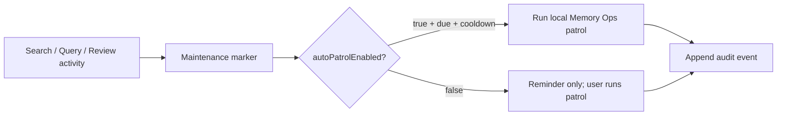

# LLM Wiki v2 Auto Patrol Closure Requirements

## Background

The latest local hardening pass promoted Memory Ops from reminder-only maintenance into a policy-gated patrol runner. The product direction is accepted: ordinary local projects may use automatic patrol by default, while high-accuracy or highly governed knowledge bases must be able to disable automatic patrol and keep patrol execution manual.

This closure aligns user-facing documentation and small safety edges with that accepted boundary.

## Goals

- Document automatic patrol as an accepted, local, policy-gated capability.
- Preserve `autoPatrolEnabled: false` as the strict-mode escape hatch: routine events may update due state and reminders, but must not run patrol automatically.
- Remove README language that still claims patrol is always explicit/manual.
- Make provenance repair avoid reading arbitrary absolute source references outside the project.
- Clarify that consolidation queue "applied" is a status marker, not a page write.
- Clarify that JSON audit export contains full selected audit events and should be treated as sensitive local output.

## Non-Goals

- Do not add cron, daemon, cloud sync, ACLs, or multi-user scheduling.
- Do not auto-apply Memory Ops suggestions or self-healing actions.
- Do not change the default from automatic patrol to manual patrol.
- Do not redesign the Maintenance UI.

## Functional Requirements

- FR1: README and README_CN describe automatic patrol as default-on, event/time/cooldown gated, local-only, and configurable.
- FR2: README and README_CN describe strict/high-accuracy mode with `autoPatrolEnabled: false`, where events only update reminders and due state.
- FR3: Claim provenance repair must ignore source references outside the project root, including absolute paths.
- FR4: Claim provenance repair must keep reading project-local relative and absolute paths that resolve inside the project.
- FR5: Consolidation queue UI copy must say that marking applied only records status after the user has handled the candidate elsewhere.
- FR6: Audit Timeline export UI copy must say JSON includes selected event details and should remain local unless reviewed.

## Non-Functional Requirements

- Preserve current local-first source-of-truth boundary: Markdown remains durable truth; `.llm-wiki/*` files are derived/audit state.
- Preserve deterministic behavior and existing policy tests.
- Keep changes small and regression-tested with focused Vitest plus TypeScript typecheck.

## Architecture Notes

The automatic patrol capability remains event-driven inside the app process. It is not a daemon and does not apply suggestions. Strict projects turn it off through the existing Memory Ops Policy panel.

## Risks And Mitigations

- Surprise background work: documentation must distinguish default automatic patrol from daemon/cron behavior and expose the strict-mode toggle.
- Source path leakage: provenance repair now constrains readable source paths to the project root.
- Export sensitivity: JSON audit export is explicit and local, but UI copy should make the sensitivity visible.
