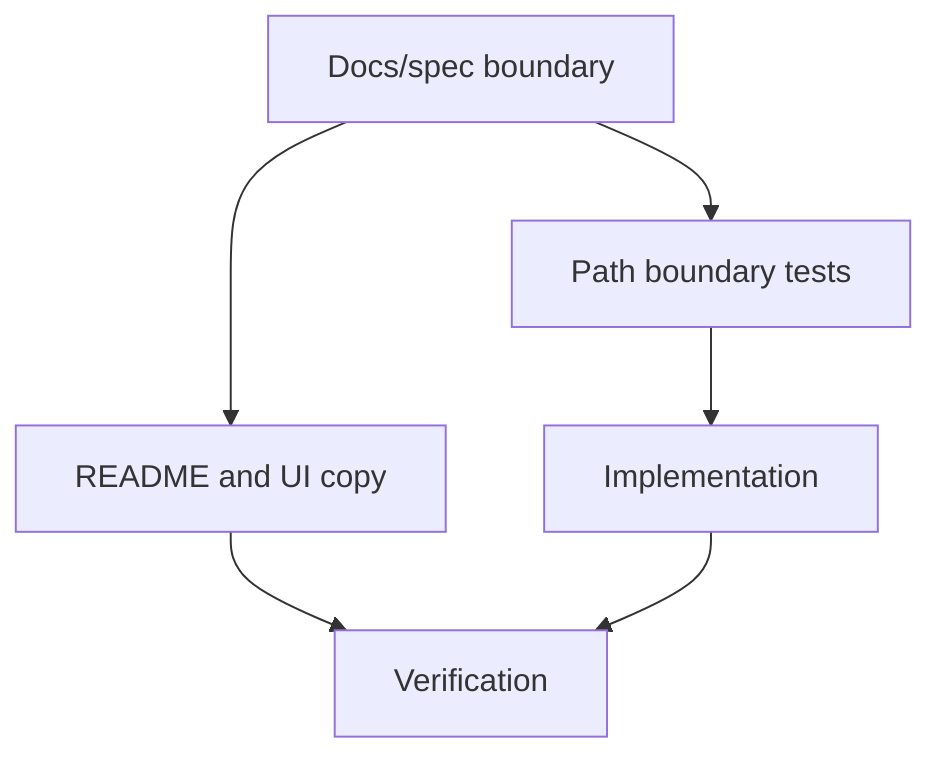

# LLM Wiki v2 Auto Patrol Closure Tasks

## Dependency Graph

## Milestone 1: Boundary Documentation

### ✅ Task 1: Write closure requirements and task list

- Depends on: user acceptance of default automatic patrol with strict-mode opt-out.
- Blocks: all implementation tasks.

#### Notes

- 🐛 Encountered: Previous README still described Memory Ops patrol as explicit/manual only.
- 🔧 Final implementation logic: Added this dev-spec-flow closure spec and task list under `docs/llm-wiki-v2-auto-patrol-closure/`.
- 🎯 Key decision: Default automatic patrol is accepted, but `autoPatrolEnabled: false` is the high-accuracy/manual-confirmation mode.

### ✅ Task 2: Update README and README_CN

- Depends on: Task 1.
- Blocks: final verification.

#### Notes

- 🐛 Encountered: README and README_CN still said patrol was always explicit/manual from Maintenance.
- 🔧 Final implementation logic: Updated the Memory Ops section to describe event/time/cooldown-gated automatic patrol, no daemon, and strict-mode `autoPatrolEnabled: false` reminder-only behavior.
- 🎯 Key decision: Automatic patrol stays the default convenience mode; high-accuracy knowledge bases can turn it off and require manual confirmation.

## Milestone 2: Safety And UX Closure

### ✅ Task 3: Restrict provenance repair source paths

- Depends on: Task 1.
- Blocks: final verification.

#### Notes

- 🐛 Encountered: Claim provenance repair accepted absolute source refs directly.
- 🔧 Final implementation logic: Source ref candidates now resolve to a single project-local path; external absolute paths produce an unreadable source result without calling `readFile`.
- 🎯 Key decision: Provenance repair remains local and conservative; it does not infer or inspect source material outside the active project root.

### ✅ Task 4: Clarify export and queue UI copy

- Depends on: Task 1.
- Blocks: final verification.

#### Notes

- 🐛 Encountered: "Mark applied" and JSON export could be read as stronger or safer than they are.
- 🔧 Final implementation logic: Added Maintenance UI copy explaining that queue applied status does not write pages and JSON export contains full selected audit event details.
- 🎯 Key decision: Keep the existing controls but make their local/status-only boundary visible in UI and tests.

## Milestone 3: Verification

### ✅ Task 5: Run focused regression checks

- Depends on: Tasks 2-4.
- Blocks: completion.

#### Notes

- 🐛 Encountered: No verification failures in the focused closure checks.
- 🔧 Final implementation logic: Ran TypeScript typecheck and focused Vitest coverage for Memory Ops policy, Memory Ops auto patrol, provenance repair, consolidation queue UI, audit timeline UI, and policy UI.
- 🎯 Key decision: Focused regression is sufficient for this scoped closure because no Rust/Tauri command path or ingest pipeline behavior changed.
