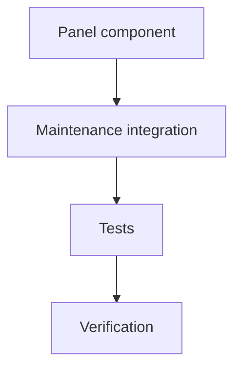

# Consolidation Queue UI Tasks

## Dependency Graph

## Tasks

### ✅ T1 Panel Component

- Dependencies: none
- Blocks: T2
- Create a queue panel that renders items, counts, warnings, and status actions.

Notes:
- Bugs: Queue candidates had no dedicated review surface.
- Implementation: Added a panel component that renders queue counts, warnings, item metadata, target paths, reasons, and status actions.
- Decisions: Status buttons only mark queue status; they do not write digest pages.

### ✅ T2 Maintenance Integration

- Dependencies: T1
- Blocks: T3
- Add a `consolidation` workbench tab.
- Load queue items and wire refresh/status handlers.

Notes:
- Bugs: Maintenance workbench had no tab for queued consolidation candidates.
- Implementation: Added a `consolidation` tab, queue load/refresh state, status update handler, and i18n labels.
- Decisions: Marking `applied` records target paths as applied metadata only; page creation remains a separate explicit flow.

### ✅ T3 Tests

- Dependencies: T2
- Blocks: T4
- Add focused component tests for queue display and actions.

Notes:
- Bugs: No component coverage existed for queue review UI.
- Implementation: Added SSR component tests for populated, empty/warning, and error/project states.
- Decisions: Test at panel boundary; Maintenance wiring is covered by typecheck plus i18n/tab integration.

### ✅ T4 Verification

- Dependencies: T3
- Blocks: completion audit
- Run typecheck and mocked tests.
- Update final review residual risk.

Notes:
- Bugs: Previous final review listed missing queue management UI as residual risk.
- Implementation: Ran focused queue tests, full typecheck, full mocked tests, and Rust tests.
- Decisions: This closes the queue-review product gap while preserving local-review-first behavior.
