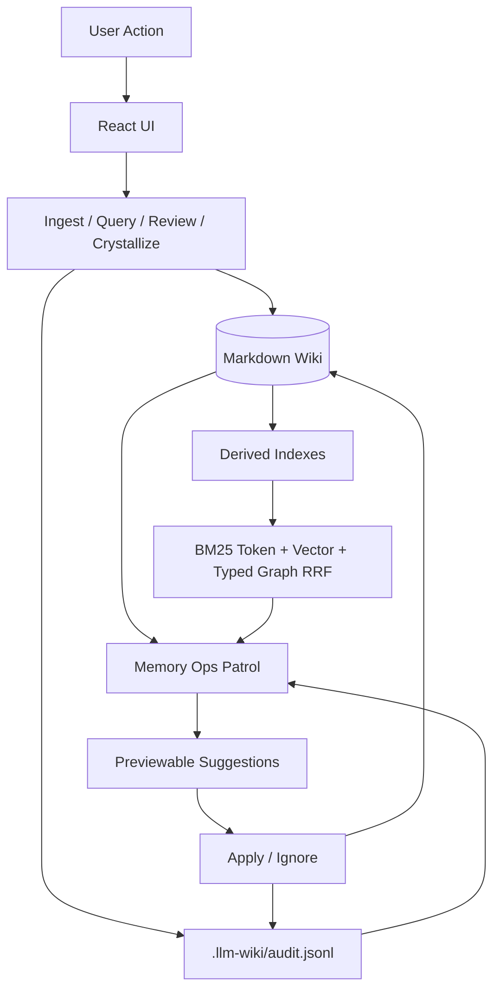
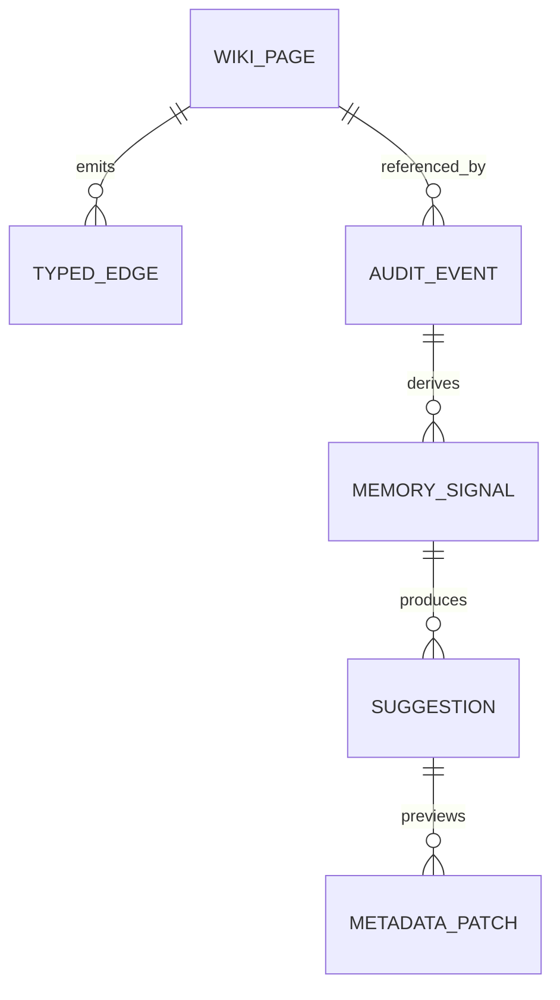

# 需求文档 - LLM Wiki v2 工程化闭环

**版本**: v0.1
**日期**: 2026-05-07
**作者**: user + AI
**状态**: 评审中
**关联任务列表**: [tasks.md](./tasks.md)

---

## 1. 背景

当前项目已经把 Karpathy 的 LLM Wiki pattern 落成了桌面应用，并且已经实现了一批 Rohit LLM Wiki v2 思路：页面级 lifecycle metadata、typed relationship graph、token/vector/graph RRF search、append-only audit、Memory Ops patrol、crystallization candidate 等。

本轮改造不从零重写，也不把系统迁移到 Neo4j、LightRAG 或外部 memory server。目标是把已存在的 v2 slice 做成更完整的工程化闭环：事件能沉淀为 audit，audit 能反哺 lifecycle，检索能解释和回归评估，矛盾/陈旧/低质量知识能被建议、预览、审计地处理。

收益对象是本地个人知识库用户和后续 AI agent 维护流程。用户仍然保有最终编辑权；系统负责发现、评分、建议和生成安全的 dry-run 变更。

### 1.1 当前 v2 能力矩阵

| v2 主题 | 当前已落地 | 本轮缺口 | 本轮处理 |
|---------|------------|----------|----------|
| Memory lifecycle | `src/lib/lifecycle.ts` 已支持 lifecycle tier、confidence、last_confirmed、reinforcement、supersession、review_status、scope，并在 ingest/crystallize/review/source fallback 中补齐 metadata。 | 评分还是 page-level，reinforcement 主要靠已写入字段和少量 audit 回推；retention、archive/deprioritize、last_confirmed refresh 还不完整。 | 增加 evidence summary 和 deterministic suggestions，不强制拆成 claim database。 |
| Typed graph | `src/lib/typed-graph.ts` 已从 frontmatter typed arrays、`related`、`sources`、wikilink 派生 typed edges，visual graph 和 retrieval graph 已消费这些关系。 | `contradicts` / `supersedes` 更像普通边，缺少专门的关系修复、反向字段补齐、候选裁决说明。 | 增加 contradiction/supersession resolver 和 relation cleanup 规则。 |
| Hybrid search | `src/lib/search.ts` 已融合 token search、optional LanceDB vector search、typed graph traversal，并通过 RRF 排序。 | lexical 层不是严格 BM25；结果缺少可展示的 per-stream contribution；调权依赖测试但 report 不够集中。 | 抽象 lexical retriever，实现本地 BM25 scorer，输出 RRF explanation 和 eval summary。 |
| Automation hooks | clip watcher、ingest queue、deep research auto-ingest、crystallization candidate 已存在。 | query/search/review 等行为的 audit 结构不统一；manual patrol 仍是主要维护入口；缺少 cooldown/reminder。 | 统一 event logger，轻量 hook 只写 audit 或提示，不在高频路径全量扫描。 |
| Quality/self-correction | Lint、review queue、Memory Ops patrol、metadata patch preview/apply 已存在。 | 质量建议分散在 lint/review/memory ops；low-confidence、retention、contradiction 修复建议不完整。 | 扩展 Memory Ops rules，保持正文修复走人工确认。 |
| Governance | `audit-redaction.ts` 已支持 secret/private redaction，metadata executor 有 path sandbox。 | Tauri asset scope 和 HTTP capability 较宽；bulk action safety 和权限保留理由未集中审计。 | 做 security hardening review，能收窄则收窄，不能收窄则记录原因。 |
| Crystallization | `crystallize-candidates.ts` 已能从 chat/research/review 评分候选并复用 Save to Wiki。 | 候选评分和 audit/reinforcement 的闭环还不完整。 | 将 crystallization event 纳入统一 audit contract 和 reinforcement evidence。 |
| Source of truth | Markdown wiki 仍是 durable store，LanceDB/graph/search 都是派生层。 | 文档需要更清楚地区分 source-of-truth 与 derived indexes，避免误解为要上 Neo4j/LightRAG。 | 更新 README/template，明确本轮是本地闭环，不是外部记忆平台迁移。 |

---

## 2. 目标

### 2.1 范围内

- ✅ 建立统一 Memory Ops 事件模型，把 ingest、query、search、crystallize、review、manual patrol 等操作统一写入 audit timeline。
- ✅ 扩展 lifecycle / retention 规则，让 confidence、quality、last_confirmed、reinforcement、staleness、supersession 有可解释的更新建议。
- ✅ 增强 typed graph 和 contradiction handling，让 `contradicts` / `supports` / `supersedes` 能进入巡检、检索解释和建议生成。
- ✅ 将 token search 升级为更接近 BM25 的本地 lexical retriever，并继续与 vector + graph 通过 RRF 融合。
- ✅ 建立 search evaluation report 和 Memory Ops report，让调权、回归和用户确认有可审计证据。
- ✅ 收紧 governance：权限面、audit 脱敏、private/shared scope、bulk action dry-run 和 rollback 说明。
- ✅ 更新 README / schema template / i18n，使用户能理解 v2 工程化闭环怎么用。

### 2.2 范围外

- ❌ 不引入 Neo4j、LightRAG、Postgres、Redis 或远程 memory server。
- ❌ 不做多用户实时协作、mesh sync、权限系统或云端同步。
- ❌ 不做自动无确认改写正文；高风险动作必须 preview/apply/audit。
- ❌ 不重写 Tauri/Rust 后端和 React UI 架构。
- ❌ 不大规模升级依赖版本；除非某个任务明确需要新依赖。
- ❌ 不把 Markdown source of truth 替换为数据库 source of truth。

### 2.3 成功标准

- 用户可以在 Settings -> Maintenance 看到一次完整 Memory Ops report：事件统计、stale/contradiction/retention 建议、typed relation 问题、search evaluation 摘要。
- 每条建议都能解释原因，支持打开目标页、预览 frontmatter diff、apply 或 ignore，并写入 `.llm-wiki/audit.jsonl`。
- 查询、保存到 Wiki、研究结果保存、review 操作都会产生一致的 audit event，reinforcement 规则可从 audit 中回推。
- Search 在现有 mock scenario 下保持通过，并新增 BM25 / typed-graph / contradiction / CJK 场景。
- `npm run typecheck`、`npm run test:mocks` 通过；涉及 Rust 命令时补跑 `cargo test`。
- README_CN / README / schema template 与实现保持一致。

---

## 3. 用户场景 / 用户故事

### 3.1 场景 1: 用户运行维护巡检

**角色**: 本地知识库用户

**前置条件**: 已打开一个 LLM Wiki project，项目中有若干 wiki pages 和 audit events。

**步骤**:
1. 用户进入 Settings -> Maintenance。
2. 用户点击 Memory Ops patrol。
3. 系统扫描 wiki pages、typed graph、review state、chat/research state、audit timeline。
4. 系统展示分类建议：生命周期、矛盾、关系清理、retention、search health。
5. 用户选择一条建议查看原因和 dry-run diff。
6. 用户 apply 或 ignore。

**预期结果**: 操作不会静默改正文档；apply/ignore 均进入 audit timeline。

**异常分支**:
- 如果 audit jsonl 有坏行，系统展示 warning 但继续处理有效事件。
- 如果目标页不存在，建议标记为 stale target，不能 apply。

### 3.2 场景 2: 用户查询后强化知识

**角色**: 本地知识库用户

**前置条件**: 用户已经有多轮 chat，搜索结果引用了若干 wiki pages。

**步骤**:
1. 用户提出一个问题。
2. 系统执行 token/BM25 + vector + graph retrieval。
3. 系统记录 query/search audit event，包括 query、使用页面、检索流来源、scope 摘要。
4. 如果回答引用了页面，后续 patrol 能基于 audit 增加 reinforcement_count 建议。
5. 如果回答质量高且有引用，系统可提示 crystallization candidate。

**预期结果**: 查询行为能成为 lifecycle 的证据，但不泄漏密钥或 private 正文。

### 3.3 场景 3: 新资料与旧知识冲突

**角色**: 研究型用户

**前置条件**: 项目中已有页面 A，新 ingest 的 source 生成页面 B，并通过 `contradicts` 或 `supersedes` 指向 A。

**步骤**:
1. ingest prompt 生成 typed relation 和 lifecycle metadata。
2. 系统写入 ingest / lifecycle audit。
3. Memory Ops patrol 发现 contradiction/supersession 链。
4. 系统给出候选裁决：哪个 claim/page 更新、哪个标 stale/contradicted、是否设置 superseded_by。
5. 用户预览并确认 metadata patch。

**预期结果**: 冲突被显式建模，不靠正文里的模糊说明。

### 3.4 场景 4: 搜索调权可验证

**角色**: 开发者 / 高级用户

**前置条件**: 项目有搜索评估 fixture。

**步骤**:
1. 开发者运行 mock tests。
2. Search eval 覆盖 title exact、alias、BM25-only、vector-only、graph-only、CJK、contradiction/deprioritize 场景。
3. 评估 report 给出 recall/top-k/失败项。

**预期结果**: 每次检索算法调整都能通过确定性场景防回归。

---

## 4. 功能需求

### F1: 统一 Memory Ops audit event schema

**描述**: 定义本地事件 schema，统一 query/search/ingest/review/crystallize/patrol/apply/ignore 的 audit 写入。

**输入**: 操作类型、目标路径、引用页面、检索来源、变更 diff、scope。

**行为**:
- 标准化 action 命名。
- 统一 path 字段和 reason 字段。
- 对 private scope 和敏感字段做脱敏。
- 保持 append-only JSONL，容忍坏行读取。

**输出**: `.llm-wiki/audit.jsonl` 中可解析事件。

**验收标准**:
- [ ] 至少覆盖 query/search、ingest lifecycle、crystallize、review action、memory_ops apply/ignore。
- [ ] private scope event 不写入正文和敏感 detail。
- [ ] 现有 audit tests 通过，并新增 schema 归一测试。

### F2: Lifecycle evidence model v2

**描述**: 在现有页面级 lifecycle 基础上增加 evidence summary，支持 retention、reinforcement、source recency、contradiction、supersession 的可解释建议。

**输入**: frontmatter、typed graph、audit events、review items。

**行为**:
- 从 audit 统计 reinforcement 和 recent use。
- 从 sources / last_confirmed / supersession 计算 staleness。
- 从 `contradicts`、`superseded_by`、review status 计算风险。
- 生成 metadata patch 建议，不自动改正文。

**输出**: Memory Ops suggestions。

**验收标准**:
- [ ] stale、contradicted、low-confidence、promote、archive/deprioritize 均有确定性测试。
- [ ] 每条建议包含 reasons 和 proposedOperation。
- [ ] 不修改正文，除非用户显式 apply。

### F3: Contradiction and supersession resolver

**描述**: 对 `contradicts` / `supersedes` / `superseded_by` 关系生成可操作建议。

**输入**: typed graph edges、source dates、confidence、review_status。

**行为**:
- 检测 dangling supersession。
- 检测单向 supersession，建议补反向字段。
- 对 contradiction pairs 生成 review 建议。
- 按 recency、source count、confidence 给出候选判断。

**输出**: contradiction/supersession suggestion cards。

**验收标准**:
- [ ] dangling target 和 alias candidate 能分开显示。
- [ ] 单向 supersession 能生成可预览 metadata patch。
- [ ] contradiction 不会自动 resolve，只给 review/action suggestion。

### F4: BM25 lexical retriever adapter

**描述**: 将现有 token score 抽象成 retriever adapter，并实现本地 BM25 scorer。

**输入**: wiki markdown pages、query、aliases/keywords。

**行为**:
- 建立 per-search 或 cached document stats。
- 对 title、filename、aliases、body 分字段加权。
- CJK tokenization 继续保留。
- 返回 ranked list 供 RRF 使用。

**输出**: token/BM25 rank map。

**验收标准**:
- [ ] filename exact 仍然优先。
- [ ] CJK scenario 不退化。
- [ ] BM25-only 场景能超过旧 substring scoring。
- [ ] 不强制启用 vector search。

### F5: RRF explanation and search health report

**描述**: 给 search result 和 eval report 增加解释信息。

**输入**: token/BM25 rank、vector rank、graph rank、final RRF score。

**行为**:
- 在 SearchResult 中携带 retriever contribution。
- Search UI 或 report 能显示结果来自哪些流。
- Memory Ops patrol 汇总 search eval 结果。

**输出**: search explanations 和 search health summary。

**验收标准**:
- [ ] RRF tests 覆盖三流贡献。
- [ ] UI 不因 explanation 缺失报错。
- [ ] eval report 可被 Memory Ops report 引用。

### F6: Event-driven maintenance hooks

**描述**: 在关键操作结束后触发轻量事件记录和可选低频维护。

**输入**: query done、ingest done、crystallize done、review resolved、app startup。

**行为**:
- 统一调用 event logger。
- 避免在高频路径跑重扫描。
- 对 scheduled patrol 加 cooldown。
- 所有自动动作只生成建议或 audit，不静默改页面。

**输出**: audit events、activity items、可选 patrol reminder。

**验收标准**:
- [ ] query/search 不明显增加延迟。
- [ ] cooldown 可测试。
- [ ] app startup 不阻塞首屏。

### F7: Governance and permission hardening

**描述**: 检查并收窄权限面，强化 audit 脱敏和 bulk action safety。

**输入**: Tauri config、capabilities、asset scope、HTTP permission、audit events。

**行为**:
- 评估 `assetProtocol.scope` 和 HTTP allowlist 是否能收窄。
- 对不能收窄的权限写明理由。
- bulk metadata apply 必须有 dry-run plan 和 rollback note。

**输出**: config/code changes、security review notes。

**验收标准**:
- [ ] 不破坏本地文件预览、web search、LLM provider 请求。
- [ ] 安全审核报告列出保留宽权限的原因或收窄结果。
- [ ] secret/private redaction tests 覆盖新增事件。

### F8: UI integration for Memory Ops v2

**描述**: 扩展 Maintenance 页面，展示新分类、新报告和解释。

**输入**: MemoryOpsPatrolReport v2。

**行为**:
- 分类展示 lifecycle、relations、contradictions、retention、search health。
- 每条建议可 open、preview、apply、ignore。
- 显示最近 audit activity。

**输出**: 可操作维护面板。

**验收标准**:
- [ ] 中文/英文 i18n 文案齐全。
- [ ] loading/error/empty/applied/ignored 状态完整。
- [ ] 长标题和长 reason 不撑坏布局。

### F9: Documentation and schema alignment

**描述**: 更新项目文档和 project template，使 v2 工程化规则可复用。

**输入**: README、README_CN、schema/purpose templates、AGENTS-like wiki schema prompt。

**行为**:
- 写清 Markdown source of truth + derived indexes。
- 写清 lifecycle / typed relation / audit / patrol 的使用方式。
- 说明不需要 Neo4j/LightRAG 才能获得本地闭环。

**输出**: 更新后的文档和模板。

**验收标准**:
- [ ] README 与真实实现一致。
- [ ] 新建项目 schema.md 包含 v2 规则。
- [ ] docs 中记录技术决策和限制。

---

## 5. 非功能需求

### 5.1 性能

- Search p95 不应因为 BM25/explanation 增加超过 30%。
- Query path 只写轻量 audit，不同步运行全项目 patrol。
- Memory Ops patrol 在 500 个 markdown pages 内应保持可交互；UI 需显示 running 状态。
- 大文件读取继续走现有搜索限制和 Tauri IPC 并发控制。

### 5.2 安全

- Audit event 必须经过统一 redaction。
- Private scope 事件只保留 action、路径、摘要和原因，不保存正文 diff。
- LLM 生成的 metadata patch 必须通过 path sandbox 和 frontmatter parser。
- Tauri 权限调整必须验证不破坏文件预览和网络请求。

### 5.3 可访问性

- Memory Ops suggestion cards 必须可键盘导航。
- 操作按钮要有明确文字或 icon label。
- Warning/error 状态不能只靠颜色表达。
- 文案需支持中文和英文。

### 5.4 国际化

- UI 文案更新 `src/i18n/en.json` 和 `src/i18n/zh.json`。
- 生成文档默认中文；README 保持中英同步摘要。

### 5.5 可观测性

- 所有关键维护动作进入 audit timeline。
- Activity panel 显示 patrol/report 状态。
- Search eval 输出可在测试和 Memory Ops summary 中定位失败场景。

---

## 6. 技术栈与依赖

### 6.1 现有选型

| 维度 | 选型 | 当前版本 | 理由 |
|------|------|----------|------|
| Desktop | Tauri | 2.10.1 API / 2.x Rust | 现有跨平台桌面壳和 Rust 命令层 |
| Frontend | React | 19.2.4 | 现有 UI 栈 |
| TypeScript | TypeScript | 5.9.3 | 类型安全和现有 build |
| Build | Vite | 8.0.3 | 现有开发/构建工具 |
| State | Zustand | 5.0.12 | 现有 project/chat/review/settings state |
| Graph | graphology | 0.26.0 | 已承载 visual graph 和 typed graph |
| Vector DB | LanceDB | 0.27.2 Rust crate | 已承载 optional vector chunks |
| Test | Vitest | 4.1.4 | 现有 mock/real LLM 测试 |
| UI | Tailwind CSS | 4.2.2 | 现有样式体系 |

### 6.2 新增依赖

| 包名 | 版本 | 用途 | 决策 |
|------|------|------|------|
| 无 | - | - | 本期优先自研 BM25 adapter，避免为搜索小步改造引入新依赖 |

备选但本期不默认引入：

| 包名 | 当前最新 | 用途 |
|------|----------|------|
| `minisearch` | 7.2.0 | 浏览器/Node 本地全文检索，可作为后续 BM25-like index 替代实现 |
| `wink-bm25-text-search` | 3.1.2 | 明确 BM25 text search，但需要评估浏览器打包和中文 tokenization |

### 6.3 环境变量

本期不新增必需环境变量。现有 LLM、embedding、web search 配置继续走应用 Settings 和 project store。

---

## 7. 架构概览

### 7.1 整体架构图

### 7.2 数据模型

| 模型 | 说明 |
|------|------|
| Wiki page | Markdown 文件，source of truth，frontmatter 保存 lifecycle 和 typed relation |
| Typed edge | 从 frontmatter 和 wikilink 派生，不替代 Markdown |
| Audit event | append-only JSONL，记录操作、原因、路径、脱敏摘要 |
| Memory signal | 从 audit/frontmatter/graph 计算出的中间信号 |
| Suggestion | 可展示、可忽略、可应用的维护建议 |
| Metadata patch | frontmatter-only dry-run/apply 单元 |

### 7.3 关键模块边界

| 模块 | 职责 |
|------|------|
| `src/lib/audit-timeline.ts` | append/read/filter audit events |
| `src/lib/audit-redaction.ts` | 统一脱敏 |
| `src/lib/lifecycle.ts` | lifecycle metadata 计算和 lint |
| `src/lib/typed-graph.ts` | typed graph extraction/traversal |
| `src/lib/search.ts` | retrieval 和 RRF fusion |
| `src/lib/memory-ops.ts` | snapshot + patrol orchestration |
| `src/lib/memory-ops-rules.ts` | deterministic suggestion rules |
| `src/lib/memory-ops-executor.ts` | metadata patch preview/apply/rollback |
| `src/components/settings/sections/maintenance-section.tsx` | UI integration |

---

## 8. 开放风险 / 开放问题

1. **BM25 是否自研到底**: 初期自研 adapter 最稳；如果测试显示维护复杂度高，再单独评估 `minisearch`。
2. **自动巡检频率**: 默认建议用 manual + cooldown reminder，不建议后台频繁全量扫描。
3. **权限收窄边界**: 当前 HTTP 和 asset scope 较宽，能否收窄取决于文件预览、LLM provider、自定义 endpoint、web search 是否受影响。
4. **claim-level 粒度**: 本期先做 page-level evidence summary，不强制把正文拆成原子 claims。
5. **正文自愈**: 本期只允许 metadata patch 自动 apply；正文修复仍走 review/LLM proposal。

---

## 9. 验证计划

- `npm run typecheck`
- `npm run test:mocks`
- 针对改动模块补跑精确测试，例如：
  - `npx vitest run src/lib/lifecycle.test.ts src/lib/memory-ops-rules.test.ts`
  - `npx vitest run src/lib/search-rrf.test.ts src/lib/search-eval.test.ts`
  - `npx vitest run src/lib/audit-redaction.test.ts src/lib/audit-timeline.test.ts`
- 如修改 Rust/Tauri config：
  - `cd src-tauri && cargo test`

---

## 10. 参考依据

- Karpathy LLM Wiki gist: raw sources / wiki / schema, ingest/query/lint, index/log。
- Rohit LLM Wiki v2 gist: lifecycle、typed graph、hybrid search、automation、quality/self-correction、collaboration、governance、crystallization。
- 当前仓库代码：`lifecycle.ts`、`typed-graph.ts`、`search.ts`、`memory-ops.ts`、`audit-timeline.ts`、`crystallize-candidates.ts`。
- Tauri v2 capabilities / runtime authority docs：权限应以 capability 为边界做最小化。
