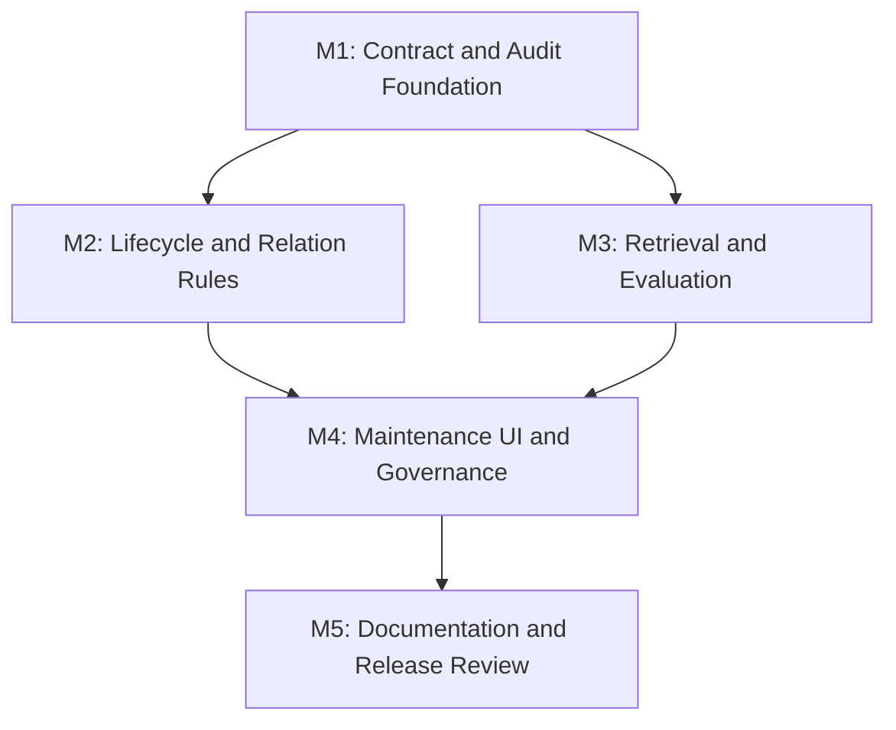

# 任务列表 - LLM Wiki v2 工程化闭环

**关联需求**: [requirements.md](./requirements.md)
**估算量级**: 中 (审核轮数: 5)
**总体进度**: 🚧 14 / 16

---

## 状态图例

| Emoji | 状态 | 含义 |
|-------|------|------|
| ⏳ | 待开始 | 还没开始 |
| 🚧 | 进行中 | 当前正在做 |
| ✅ | 已完成 | 自检通过、commit/push 完毕 |
| ⚠️ | 阻塞中 | 等待外部决策 / 修不动 |
| 🔍 | 待审核 | 自己做完了等用户 review |

---

## 里程碑依赖图

---

## Milestone 1: Contract and Audit Foundation

**目标**: 先稳定事件 schema 和现状矩阵，后续规则都从同一套 audit/snapshot 输入派生。
**依赖**: 无
**状态**: ✅

### Task 1.1 ✅ 建立现有 v2 能力矩阵

**描述**: 梳理当前已实现的 lifecycle、typed graph、RRF search、Memory Ops、audit、crystallization，写入本 feature docs，作为后续任务边界。

**依赖**: 无
**阻塞**: T1.2, T2.1, T3.1, T4.1

**预估**: 1h

**关联文件 / 模块**:
- `docs/llm-wiki-v2-engineering/requirements.md`
- `docs/llm-wiki-v2-engineering/tasks.md`
- `src/lib/lifecycle.ts`
- `src/lib/typed-graph.ts`
- `src/lib/search.ts`
- `src/lib/memory-ops.ts`

**验收**:
- [x] 明确列出已存在能力和缺口。
- [x] 后续任务不重复实现已有能力。

#### 备注

- 🐛 **遇到的问题**: `docs/` 在 `.gitignore` 中，普通 `git status` 不显示新 feature docs；后续提交需要 `git add -f`。
- 🔧 **最终实现逻辑**: 在 `requirements.md` 增加“当前 v2 能力矩阵”，逐项对齐 lifecycle、typed graph、hybrid search、automation hooks、quality/governance、crystallization 和 Markdown source of truth。
- 🎯 **关键决策**: 本轮按“补闭环”推进，不重做已存在的 Rohit/v2 slice，也不引入 Neo4j/LightRAG/外部 memory server。

---

### Task 1.2 ✅ 定义统一 audit event contract

**描述**: 抽象 Memory Ops 事件命名、path 字段、scope、reason、diff summary 和 retriever metadata。

**依赖**: T1.1
**阻塞**: T1.3, T2.1, T4.2

**预估**: 3h

**关联文件 / 模块**:
- `src/lib/audit-timeline.ts`
- `src/lib/audit-redaction.ts`
- `src/lib/audit-timeline.test.ts`
- `src/lib/audit-redaction.test.ts`

**验收**:
- [x] audit event type 覆盖 query/search/ingest/review/crystallize/patrol/apply/ignore。
- [x] private scope 和 secret redaction 有测试。
- [x] 坏行容忍行为保持不变。

#### 备注

- 🐛 **遇到的问题**: 红灯测试暴露两类缺口：旧 audit JSON 没有 schema/category/path normalization，private scope redaction 会丢掉 contract 字段；typecheck 还发现 retrieval result summary 需要允许 snippet 字段。
- 🔧 **最终实现逻辑**: 在 `audit-timeline.ts` 增加 schema version、category、actor、retrieval、changes 等统一类型，append 时补 `schemaVersion: 1`、按 action 推导 category、归一化 path 字段、去重 reasons，再进入 redaction；在 `audit-redaction.ts` 保留 private summary 的 schema/category/actor。
- 🎯 **关键决策**: 保持 append-only JSONL 和坏行容忍不变；对旧事件读取不做强制迁移，只规范新写入事件。

---

### Task 1.3 ✅ 接入 query/search/review/crystallize 事件写入

**描述**: 在关键用户操作结束后写入统一 audit event，避免每个模块自定义零散结构。

**依赖**: T1.2
**阻塞**: T2.2, T2.3, T4.1

**预估**: 4h

**关联文件 / 模块**:
- `src/components/chat/chat-panel.tsx`
- `src/lib/search.ts`
- `src/lib/crystallize.ts`
- `src/components/review/review-view.tsx`
- `src/lib/deep-research.ts`

**验收**:
- [x] query/search 写入引用页面和 retriever summary。
- [x] review resolve / save 写入 audit。
- [x] crystallize 保持现有 audit，并符合新 contract。
- [x] 高频 query 不触发全量 patrol。

#### 备注

- 🐛 **遇到的问题**: Search UI 是按 Enter 显式搜索，不是输入即搜；因此可以记录 `search.run`。ChatPanel 的 stream callback 不能 await audit 写入，需 fire-and-forget 并吞掉 audit 失败。
- 🔧 **最终实现逻辑**: 新增 `src/lib/audit-events.ts`，封装 `appendSearchAuditEvent`、`appendQueryAuditEvent`、`appendReviewResolveAuditEvent`；SearchView 在显式搜索完成后记录 search event，ChatPanel 在回答完成后记录 query event，ReviewView 用 `resolveWithAudit` 统一记录 review resolve，crystallize audit 补 `actor: "system"`。
- 🎯 **关键决策**: 不在 `searchWiki()` 内隐式写 audit，避免未来高频调用或评估测试污染 timeline；只在明确用户操作完成处记录。

---

## Milestone 2: Lifecycle and Relation Rules

**目标**: 把 Rohit v2 的 lifecycle、retention、supersession、contradiction 做成可解释、可预览的本地规则。
**依赖**: M1
**状态**: ✅

### Task 2.1 ✅ 扩展 Memory Ops snapshot 和 evidence summary

**描述**: 在 scanMemoryOpsProject 中派生 page evidence summary，包括最近使用、reinforcement、source support、staleness、contradiction/supersession risk。

**依赖**: T1.2
**阻塞**: T2.2, T2.3, T4.1

**预估**: 4h

**关联文件 / 模块**:
- `src/lib/memory-ops.ts`
- `src/lib/lifecycle.ts`
- `src/lib/memory-ops.test.ts`

**验收**:
- [x] snapshot stats 包含 evidence summary 统计。
- [x] evidence 只从本地 wiki/audit/review/graph 派生。
- [x] 空项目和坏 audit 都能稳定返回。

#### 备注

- 🐛 **遇到的问题**: `review_status: ok` 可能是手工旧状态，不能掩盖 `last_confirmed` 已过期；因此 evidence 的 stale 需要独立暴露年龄风险。`memory-ops-rules.test.ts` 手工 snapshot helper 也需要补齐新增 stats 字段。
- 🔧 **最终实现逻辑**: `scanMemoryOpsProject` 在读取 wiki、audit、review 和 typed graph 后为每个 page 附加 `evidence`，包含 recent use、reinforcement、source support、staleness 和 risk flags；snapshot stats 增加 evidence page、recent use、reinforcement、source support、stale 和 risk 计数。
- 🎯 **关键决策**: evidence 只做本地派生摘要，不读取 raw sources、不触发 LLM、不修改正文；audit path 同时支持相对路径和项目绝对路径，便于兼容新旧事件。

---

### Task 2.2 ✅ 增强 lifecycle / retention 建议规则

**描述**: 增加 low-confidence、archive/deprioritize、last_confirmed refresh、reinforcement update、promotion/demotion 等建议。

**依赖**: T2.1
**阻塞**: T4.1

**预估**: 4h

**关联文件 / 模块**:
- `src/lib/memory-ops-rules.ts`
- `src/lib/memory-ops-rules.test.ts`
- `src/lib/lifecycle.test.ts`

**验收**:
- [x] stale/low-confidence/archive/promotion 建议均有 tests。
- [x] 所有建议都包含 reasons 和 proposedOperation。
- [x] 不自动修改正文。

#### 备注

- 🐛 **遇到的问题**: query/search audit 的页面引用主要落在 `retrieval.results`，旧 reinforcement 统计只看 direct path，导致 query/search 不能回写 reinforcement。Archive/deprioritize 也需要避免覆盖 contradiction、supersession、open review 等需要人工判断的风险。
- 🔧 **最终实现逻辑**: 增加 low-confidence review patch、last_confirmed refresh、retrieval-result reinforcement 计数、stale unsupported page archive/deprioritize；保留既有 stale 和 promotion 规则，所有 lifecycle 建议都带 reasons 和 metadata patch。
- 🎯 **关键决策**: `last_confirmed` refresh 只在有 source support 且无 contradiction/supersession/open-review 风险时建议；archive 只处理无来源、无 recent use、无 reinforcement 的 stale 页面，把它作为 lifecycle demotion，而不是删除正文。

---

### Task 2.3 ✅ 增强 contradiction / supersession resolver

**描述**: 针对 `contradicts`、`supersedes`、`superseded_by` 生成关系修复、反向字段补齐和人工 review 建议。

**依赖**: T2.1
**阻塞**: T4.1

**预估**: 4h

**关联文件 / 模块**:
- `src/lib/typed-graph.ts`
- `src/lib/memory-ops-rules.ts`
- `src/lib/typed-graph.test.ts`
- `src/lib/memory-ops-rules.test.ts`

**验收**:
- [x] dangling target、alias candidate、single-sided supersession 分别覆盖。
- [x] contradiction 只建议 review，不静默裁决。
- [x] suggestion detail 能说明 recency/source/confidence 依据。

#### 备注

- 🐛 **遇到的问题**: 旧 resolver 对已解析关系直接跳过，所以 single-sided supersession 和 resolved contradiction 都不会产生建议。`objectContaining({ proposedOperation: undefined })` 对缺失字段不稳定，测试改为单独断言 `toBeUndefined()`。
- 🔧 **最终实现逻辑**: resolver 增加 resolved relation 分支；`supersedes` / `superseded_by` 生成 reciprocal metadata patch，`contradicts` 生成 `review-action` suggestion；detail 和 reasons 带 sources、confidence、last_confirmed。
- 🎯 **关键决策**: contradiction 不生成 metadata patch，也不自动裁决哪一页更新，只进入 review-only；supersession 只补显式反向字段，保留正文内容和用户最终确认入口。

---

### Task 2.4 ✅ 强化 metadata patch executor 的 safety

**描述**: 确认 metadata patch preview/apply 的 path sandbox、diff、rollback note、private scope 行为，并补缺口。

**依赖**: T1.2, T2.2
**阻塞**: T4.1, T4.2

**预估**: 3h

**关联文件 / 模块**:
- `src/lib/memory-ops-executor.ts`
- `src/lib/memory-ops-executor.test.ts`
- `src/components/settings/sections/maintenance-section.tsx`

**验收**:
- [x] target path 不能逃逸项目根。
- [x] dry-run diff 和 apply result 都可审计。
- [x] private scope 不写正文 diff 到 audit。

#### 备注

- 🐛 **遇到的问题**: 原 UI 只在 apply 成功后手写 `memory_ops.apply` audit，preview 没有 dry-run audit；apply 失败会在写 audit 前抛错，无法审计失败结果。
- 🔧 **最终实现逻辑**: `createMetadataPatchPlan` 派生 `scope`，新增 `buildMemoryOpsPatchAuditEvent` 统一生成 preview/apply audit event；Settings preview 写 `memory_ops.preview`，apply 无论成功/失败都先记录 result audit，再更新 UI。
- 🎯 **关键决策**: private scope 的 audit event 在 helper 层不带 diff，同时继续依赖 audit redaction 做最终兜底；executor 仍只处理 metadata patch，不把正文 before/after 放进 audit。

---

## Milestone 3: Retrieval and Evaluation

**目标**: 把 search 从 substring/token score 升级为可评估、可解释、可回归的三流 retrieval。
**依赖**: M1
**状态**: ✅

### Task 3.1 ✅ 抽象 lexical retriever adapter

**描述**: 将现有 token scoring 从 `searchWiki` 主流程中拆出，形成可单测 adapter，便于切换 BM25。

**依赖**: T1.1
**阻塞**: T3.2, T3.3

**预估**: 4h

**关联文件 / 模块**:
- `src/lib/search.ts`
- `src/lib/search.scenarios.test.ts`
- `src/lib/search-rrf.test.ts`

**验收**:
- [x] 拆分后现有 search tests 保持通过。
- [x] filename exact、title phrase、CJK token 行为不退化。
- [x] adapter 返回 rank 和 explain metadata。

#### 备注

- 🐛 **遇到的问题**: 旧 token scoring 藏在 `searchFiles` / `scoreFile` 内部，无法不 mock IO 地验证 filename exact、phrase、CJK token 的 breakdown，也不方便 T3.2 替换 BM25。
- 🔧 **最终实现逻辑**: 新增 `rankLexicalDocuments` 纯 adapter 和 `LexicalMatchExplanation` / `LexicalScoreBreakdown`，`searchWiki` 继续通过同一 `scoreLexicalDocument` 路径产出 token results。
- 🎯 **关键决策**: T3.1 不改变排序权重、不引入 BM25；只把现有 token scorer 抽象成可替换、可解释的 lexical stream，BM25 实现留给 T3.2。

---

### Task 3.2 ✅ 实现本地 BM25 scorer

**描述**: 在不新增依赖的前提下实现字段加权 BM25：filename/title/aliases/keywords/body。

**依赖**: T3.1
**阻塞**: T3.3, T3.4

**预估**: 5h

**关联文件 / 模块**:
- `src/lib/search.ts`
- `src/lib/search-bm25.test.ts` (新建)
- `src/test-helpers/scenarios/search-scenarios.ts`

**验收**:
- [x] BM25 排名有确定性测试。
- [x] 中文 tokenization 使用现有 tokenizer。
- [x] 小项目和空项目无异常。
- [x] 不依赖 vector search。

#### 备注

- 🐛 **遇到的问题**: BM25 需要 term frequency，不能直接复用 `tokenizeQuery` 的去重结果作为文档 field tokens；否则正文重复词不会饱和计分。
- 🔧 **最终实现逻辑**: 新增 `rankBm25Documents`，按 filename/title/aliases/keywords/body 分字段计算 BM25；每个 hit 返回 rank、fieldScores、matchedTokensByField 和 queryTokens。
- 🎯 **关键决策**: 本任务只实现本地 BM25 scorer，不替换默认 `searchWiki` 排序；T3.3 再把 BM25/vector/graph contribution 接到 RRF explanation，降低排序回归风险。

---

### Task 3.3 ✅ 增加 RRF contribution explanation

**描述**: SearchResult 携带 token/BM25、vector、graph 的 rank/score/path contribution，供 UI 和 report 使用。

**依赖**: T3.1, T3.2
**阻塞**: T3.4, T4.1

**预估**: 3h

**关联文件 / 模块**:
- `src/lib/search.ts`
- `src/components/search/search-view.tsx`
- `src/lib/search-rrf.test.ts`

**验收**:
- [x] RRF tests 验证 contribution。
- [x] Search UI 对旧结果和新 explanation 都兼容。
- [x] graph path explanation 保持可用。

#### 备注

- 🐛 **遇到的问题**: 首版把 BM25 rank 作为 lexical 主贡献后，`phrase-in-content-beats-scattered-tokens` 场景退化，短语命中页被 BM25 词频页反超。
- 🔧 **最终实现逻辑**: `SearchResult.retrieval` 增加 token/BM25/vector/graph 的 rank、rawScore、RRF contribution；graph explanation 同步携带 path/pathTypes/pathDirections，并保留旧 `graphPath*` 字段兼容现有 UI。
- 🎯 **关键决策**: lexical RRF contribution 继续按 token/phrase scorer 优先，BM25 在 token 命中时只暴露解释字段不重复加分；只有 token 缺席时 BM25 作为 lexical 兜底贡献，避免排序语义在 T3.3 被隐式替换。

---

### Task 3.4 ✅ 扩展 search evaluation harness

**描述**: 增加 BM25-only、typed relation、contradiction deprioritize、CJK、vector-only、graph-only 的评估场景和 report summary。

**依赖**: T3.2, T3.3
**阻塞**: T4.1, T5.1

**预估**: 4h

**关联文件 / 模块**:
- `src/lib/search-eval.ts`
- `src/lib/search-eval.test.ts`
- `src/test-helpers/scenarios/search-scenarios.ts`

**验收**:
- [x] eval report 包含 pass/fail 和 top-k evidence。
- [x] Memory Ops 可读取 summary。
- [x] 失败场景能定位 query 和期望页面。

#### 备注

- 🐛 **遇到的问题**: 旧 eval report 只保留 ranked path，失败时缺少 top-k evidence 和 stream contribution；Memory Ops 也没有稳定的 compact summary 可读。
- 🔧 **最终实现逻辑**: `runSearchEval` 为每个场景生成 `topResults` evidence，包含 path/title/score 和 token/BM25/vector/graph stream contribution；新增 `expectedOutsideTopK` 支持 contradiction deprioritize 场景；新增 `summarizeSearchEvalForMemoryOps` 输出 pass/fail、streamCounts 和失败场景摘要。
- 🎯 **关键决策**: report 内部继续保留完整 rankedPaths 便于精确断言，展示和 Memory Ops summary 使用 `wiki/...` 形式的短路径，避免临时目录污染报告。

---

## Milestone 4: Maintenance UI and Governance

**目标**: 将新规则和报告交给用户可理解、可操作地处理，并完成安全边界检查。
**依赖**: M2, M3
**状态**: 🚧

### Task 4.1 ✅ 升级 Memory Ops patrol report 和 UI

**描述**: 扩展 Maintenance 面板，分类展示 lifecycle、relation、contradiction、retention、search health，并支持新 explanation。

**依赖**: T2.2, T2.3, T3.4
**阻塞**: T4.2, T5.1

**预估**: 6h

**关联文件 / 模块**:
- `src/components/settings/sections/maintenance-section.tsx`
- `src/components/settings/sections/memory-ops-patrol-block.tsx`
- `src/lib/memory-ops-ui.ts`
- `src/i18n/en.json`
- `src/i18n/zh.json`

**验收**:
- [x] 新 suggestion 分类展示清楚。
- [x] empty/loading/error/applied/ignored 状态完整。
- [x] 中英文文案齐全。
- [x] 长文本不破坏布局。

#### 备注

- 🐛 **遇到的问题**: 原 Maintenance 面板把所有 suggestions 平铺展示，无法区分 lifecycle、relation、contradiction、retention/search health，也没有显示 ignored/applied 后的已处理数量。
- 🔧 **最终实现逻辑**: 在 `memory-ops-ui.ts` 增加 suggestion category/group helper 和 categoryCounts summary；Patrol UI 按分类展示建议，补 stale/risk/handled 统计、relation evidence、reasons 列表和长路径 `break-all` 处理；同步补中英文文案。
- 🎯 **关键决策**: 分类只放在展示层派生，不改 `MemoryOpsSuggestion` core contract；这样 T4.1 不影响规则生成和 executor 的安全边界。

---

### Task 4.2 ✅ Governance / Tauri permission hardening review

**描述**: 检查 Tauri capability、HTTP permission、assetProtocol scope、audit 脱敏和 bulk action 安全，能收窄则收窄，不能收窄则记录理由。

**依赖**: T1.2, T2.4
**阻塞**: T5.1, Phase 4 Round 4

**预估**: 4h

**关联文件 / 模块**:
- `src-tauri/tauri.conf.json`
- `src-tauri/capabilities/default.json`
- `src/lib/audit-redaction.ts`
- `docs/llm-wiki-v2-engineering/review-round-4.md`

**验收**:
- [x] 文件预览、LLM provider、web search 不被破坏。
- [x] 权限保留/收窄有文档说明。
- [x] secret/private 事件测试覆盖新增路径。

#### 备注

- 🐛 **遇到的问题**: Tauri HTTP capability 里存在多组重复 glob；`assetProtocol.scope` 理论上过宽，但项目路径是用户运行时选择的，静态收窄会破坏任意目录项目的文件预览。
- 🔧 **最终实现逻辑**: 将 HTTP allow 列表收敛为 `http://**` / `https://**` 两条等价规则；新增 `review-round-4.md` 记录保留 asset scope、CSP、dialog/opener/store 的理由；audit redaction 增加 credentialed URL userinfo 脱敏。
- 🎯 **关键决策**: 不把 provider/web-search/local endpoint 硬编码到 capability allowlist，避免破坏用户自定义 LLM、embedding、vision、web search 和本地网关；当前 hardening 先做等价收敛与审计脱敏，asset scope 留给后续项目根 broker 设计。

---

### Task 4.3 ✅ Event-driven maintenance cooldown

**描述**: 增加轻量 hook/cooldown，避免每个事件触发全量 scan，同时能提示用户何时该 patrol。

**依赖**: T1.3, T4.1
**阻塞**: T5.1

**预估**: 3h

**关联文件 / 模块**:
- `src/lib/memory-ops.ts`
- `src/lib/project-store.ts`
- `src/components/layout/activity-panel.tsx`
- `src/components/settings/sections/maintenance-section.tsx`

**验收**:
- [x] 高频 query 不触发重扫描。
- [x] cooldown 可测试。
- [x] 用户能看到 patrol reminder 或 recent status。

#### 备注

- 🐛 **遇到的问题**: 维护巡检原来只有手动入口，query/search/review 等高频事件没有轻量 dirty 状态，也没有避免全量 scan 的 cooldown 模型。
- 🔧 **最终实现逻辑**: 增加 Memory Ops maintenance cooldown reducer、project-store 持久化、audit event 侧的轻量事件记录；达到阈值只写 activity reminder，不触发 `runMemoryOpsPatrol`；手动 patrol 成功后重置 dirty 计数，Maintenance 面板显示 recent status。
- 🎯 **关键决策**: 事件驱动只负责提示，不自动扫描；避免高频 query/search 把全量 `scanMemoryOpsProject` 变成后台常驻负载。

---

## Milestone 5: Documentation and Release Review

**目标**: 文档、模板、测试和最终审核闭环。
**依赖**: M4
**状态**: 🚧

### Task 5.1 ✅ 更新 README、schema template 和使用说明

**描述**: 让用户清楚知道本地 v2 工程化闭环如何使用，以及为什么仍然以 Markdown 为 source of truth。

**依赖**: T4.1, T4.2, T4.3
**阻塞**: T5.2, Phase 4

**预估**: 3h

**关联文件 / 模块**:
- `README.md`
- `README_CN.md`
- `src/lib/templates.ts`
- `src-tauri/src/commands/project.rs`

**验收**:
- [x] README 与真实功能一致。
- [x] 新建项目 schema 包含 lifecycle/typed relation/audit/patrol 规则。
- [x] 中文说明不含未实现承诺。

#### 备注

- 🐛 **遇到的问题**: README 已经有 v2/Memory Ops 段落，但检索链路没有写出 BM25 evidence 与 per-channel contribution；模板 schema 只有 lifecycle 和 typed relation 字段，没有说明 audit/patrol 的 source-of-truth 边界。
- 🔧 **最终实现逻辑**: 更新中英文 README 的检索、Memory Ops、技术栈和项目结构说明；在 TS 场景模板和 Rust 新建项目 schema 中加入 Markdown source of truth、`.llm-wiki/audit.jsonl`、patrol 建议边界、frontmatter diff 预览、private scope 脱敏和 `last_confirmed`/`reinforcement_count` 规则；补充 Rust schema 单测断言。
- 🎯 **关键决策**: 文档不承诺后台自动全量扫描，也不把 BM25 描述成替代 token/phrase 排序；patrol 只产生可预览的 metadata 建议，apply/ignore 才进入 audit。

---

### Task 5.2 ⏳ 全量验证和提交前清理

**描述**: 跑完整 mock 验证、必要 Rust 测试、检查文件长度、更新任务备注和状态。

**依赖**: T5.1
**阻塞**: Phase 4

**预估**: 3h

**关联文件 / 模块**:
- `docs/llm-wiki-v2-engineering/tasks.md`
- 所有本轮变更文件

**验收**:
- [ ] `npm run typecheck` 通过。
- [ ] `npm run test:mocks` 通过。
- [ ] 如改 Rust/Tauri config，`cd src-tauri && cargo test` 通过。
- [ ] 每个任务备注块填完。
- [ ] `docs/` 在 `.gitignore` 中，提交本 feature docs 时使用 `git add -f docs/llm-wiki-v2-engineering/...`。

#### 备注

- 🐛 **遇到的问题**:
- 🔧 **最终实现逻辑**:
- 🎯 **关键决策**:

---

## 进度总览

| 里程碑 | 任务 | 完成 | 总数 | 状态 |
|--------|------|------|------|------|
| M1 | Contract and Audit Foundation | 3 | 3 | ✅ |
| M2 | Lifecycle and Relation Rules | 4 | 4 | ✅ |
| M3 | Retrieval and Evaluation | 4 | 4 | ✅ |
| M4 | Maintenance UI and Governance | 3 | 3 | ✅ |
| M5 | Documentation and Release Review | 1 | 2 | 🚧 |
| **总计** | | **15** | **16** | **🚧** |

---

## 变更记录

| 日期 | 变更 |
|------|------|
| 2026-05-07 | 初稿，16 个任务，按中量级 5 轮审核 |

---

## 最终审核索引

| Round | 视角 | 状态 | 报告 |
|-------|------|------|------|
| 1 | 功能 | ⏳ | `review-round-1.md` |
| 2 | 类型 & 静态分析 | ⏳ | `review-round-2.md` |
| 3 | 性能 | ⏳ | `review-round-3.md` |
| 4 | 安全 | ⏳ | `review-round-4.md` |
| 5 | UX & a11y / 文档对齐 | ⏳ | `review-round-5.md` |
