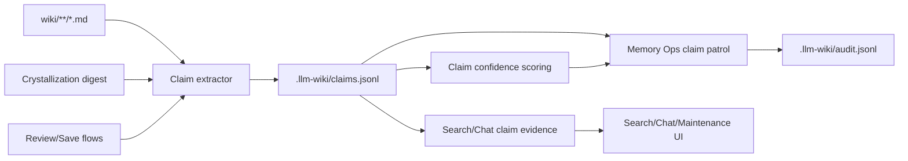
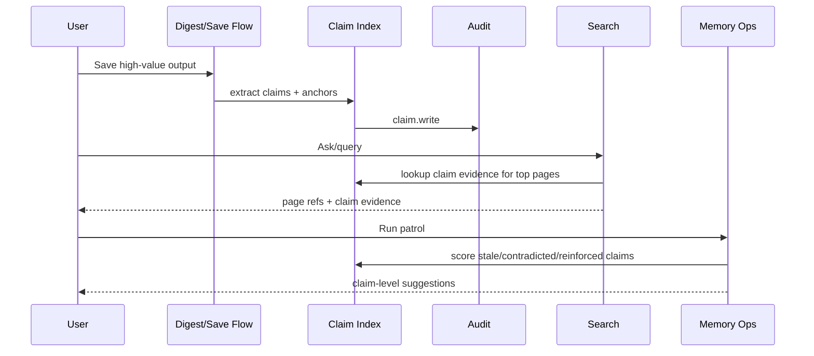

# 需求文档 - LLM Wiki v2 事实级可信度

**版本**: v1.0
**日期**: 2026-05-08
**作者**: user + AI
**状态**: 已完成
**关联任务列表**: [tasks.md](./tasks.md)

---

## 1. 背景

当前 LLM Wiki v2 已经完成本地工程化主干：Markdown source of truth、page-level lifecycle/confidence metadata、typed relationship arrays、typed graph traversal、lexical/BM25/vector/graph RRF search、schema contract、Memory Ops patrol、audit timeline、crystallization digest 和 Maintenance workbench。

这套实现已经能回答“页面整体是否新、旧、低置信、被 superseded、值得 promotion”。但长期知识库的可信度问题往往不是整页级别的：同一个页面可能同时包含强事实、弱解释、旧版本结论和待确认推断。只用 page-level confidence 会导致两个问题：一是弱 claim 会拖累整页；二是搜索和回答时无法解释“具体用了哪条事实、它为什么可信”。

本阶段目标是补上 **事实级可信度**。它不是把 wiki 替换成数据库，也不是一次性从所有历史页面抽取所有句子；而是在现有 Markdown-first 架构旁边增加一个可审计、可重建、可测试的 claim 层，让高价值事实拥有独立的来源、置信度、时效、强化、冲突和 supersession 状态。

### 1.1 当前能力与缺口

| 主题 | 当前已有 | 本阶段缺口 | 本阶段处理 |
|------|----------|------------|------------|
| Page lifecycle | `src/lib/lifecycle.ts` 能为页面计算 confidence、quality、stale、supersession。 | 不能区分同一页内不同事实的可信度。 | 新增 claim-level metadata 和 scoring，page-level 继续保留。 |
| Markdown source of truth | `wiki/**/*.md` 仍是用户可读、Git-friendly、Obsidian-compatible 的 durable store。 | 机器可读 claim 如果直接塞正文，可能污染页面。 | 采用 `.llm-wiki/claims.jsonl` 派生索引 + Markdown claim anchors 的轻量方案。 |
| Typed graph | `typed-graph.ts` 支持 page-level relation arrays 和 wikilinks。 | 关系边不能指向具体 claim。 | 本期 claim relation 保持轻量：claim 引用 page slug / related claim id，claim graph 作为派生辅助，不重写 visual graph。 |
| Search evidence | `search.ts` 能显示 token/BM25/vector/graph contribution 和 graph path。 | 搜索结果无法暴露 claim evidence。 | 增加 claim evidence retrieval 和 search result explanation，先作为 result metadata/diagnostic，不替代现有排序。 |
| Memory Ops | Patrol 能基于页面 metadata、audit、review 和 typed graph 生成建议。 | 不能只标记某条事实 stale/contradicted。 | 增加 claim evidence summary 和 claim-level patrol suggestions。 |
| Crystallization | Digest 能提取 lessons/decisions/entities/relations 并保存 query/synthesis page。 | 保存的 lessons/decisions 没有稳定 claim identity。 | 让 digest/Save to Wiki 为高价值 lessons/decisions 写入 claim records。 |

### 1.2 与 Spec B 的关系

本阶段只做事实级可信度基础设施。下一阶段 **Pre-Write Conflict Handling** 会依赖这些 claim records，在 ingest/crystallize 写入前判断候选事实是 new、reinforcement、update、contradiction 还是 supersession。

因此本阶段要提供稳定接口，但不把完整写入前冲突 gate 纳入范围。

---

## 2. 目标

### 2.1 范围内

- ✅ 定义 `ClaimRecord` 数据模型，覆盖 claim id、所在页面、正文摘要、来源、可选 source span、confidence、reasons、last_confirmed、reinforcement、supersession、contradiction、scope 和 status。
- ✅ 增加本地 `.llm-wiki/claims.jsonl` 派生索引读写层，append/read/filter/rebuild 均可测试，并与 audit redaction 边界兼容。
- ✅ 在 Markdown 页面中支持轻量 claim anchors，使 claim record 能回指具体页面位置；不要求把每条正文都改写成 claim block。
- ✅ 增加 claim parser/extractor，从新 ingest、crystallization digest、review-created pages 和 explicit Save to Wiki 流程中提取高价值 claims。
- ✅ 增加 claim confidence scoring，复用 page lifecycle 思路但按 claim 粒度计算 source support、age、reinforcement、contradiction、supersession 和 scope。
- ✅ 将 claim evidence 接入 search/chat 的结果解释，让用户能看到回答引用了哪些 claim 及其可信度。
- ✅ 将 claim summary 接入 Memory Ops patrol，生成 stale/low-confidence/contradicted/superseded/reinforced claim suggestions。
- ✅ 增加 Maintenance UI 的 claim evidence preview，展示 claim 状态和相关页面，不自动修改正文。
- ✅ 更新 schema contract/templates/ingest prompt，说明 claim anchors 和 `.llm-wiki/claims.jsonl` 是本地派生可信度层。
- ✅ 增加 focused tests、typecheck、mock regression 和 5 轮最终审核。

### 2.2 范围外

- ❌ 不引入 Neo4j、LightRAG、Postgres、Qdrant、Redis、MCP memory server 或远程后端。
- ❌ 不一次性从所有历史页面自动抽取所有 claim；只覆盖新写入、高价值 digest、review/save 和可手动 rebuild 的轻量路径。
- ❌ 不做 span-level PDF 坐标或全文 quote database；本期只支持可选 source path、line-ish anchor、section anchor 或 source snippet hash。
- ❌ 不让 claim confidence 自动裁决事实真假；contradiction/supersession 只进入 review 或下一阶段 pre-write gate。
- ❌ 不重写 visual graph、chat graph 或现有 page-level RRF 排序；claim evidence 先作为解释和二级信号接入。
- ❌ 不做自动删除、自动正文重写、自动合并矛盾 claim。
- ❌ 不新增真实 LLM 调用测试；real LLM 仍保持 opt-in。

### 2.3 成功标准

- 新的 claim data model 能稳定序列化到 `.llm-wiki/claims.jsonl`，坏行不会阻断读取，private scope 不泄漏正文。
- 新 ingest/crystallization/review-save 路径能为高价值事实写入 claim records，并保留页面 anchor、source、confidence reasons 和 audit event。
- Search/chat result explanation 能显示 claim evidence，包括 claim text、confidence、status、source/page target 和 downgrade reasons。
- Memory Ops patrol 能输出 claim-level stale/low-confidence/contradicted/superseded/reinforced summaries，并把安全 metadata 建议与 review-only 建议分开。
- Claim index rebuild 能从 wiki pages 和 anchors 重建可用索引，或明确标记 orphan/stale claim record。
- `npm run typecheck`、focused Vitest suites、`npm run test:mocks` 通过；若 Rust scaffold/template 有改动，`cd src-tauri && cargo test` 通过。
- README/README_CN 或 plans 文档说明 claim 层是本地派生治理层，不是替代 Markdown 的事实数据库。

---

## 3. 用户场景 / 用户故事

### 3.1 场景 1: 用户查看一个回答用了哪些可信事实

**角色**: 研究型用户

**前置条件**: 项目中已经有 claim records，用户提出一个问题。

**步骤**:
1. 用户在 Chat 中提问。
2. 系统运行现有 search pipeline，并补充 claim evidence lookup。
3. LLM 回答仍引用 wiki pages。
4. UI 在 references/evidence 中展示相关 claim、confidence、source、last_confirmed 和 status。

**预期结果**: 用户不只知道“用了哪个页面”，还能知道“用了页面里的哪条事实、它有多可信、为什么”。

**异常分支**:
- 如果没有 claim evidence，系统仍按现有 page-level references 工作。
- 如果 claim record 指向不存在页面，UI 标记 orphan，不阻断回答。

### 3.2 场景 2: Memory Ops 只标记一条过期事实

**角色**: 长期维护知识库的用户

**前置条件**: 某页面里只有一条 claim 已过期，其它内容仍有效。

**步骤**:
1. 用户运行 Memory Ops patrol。
2. 系统读取 `.llm-wiki/claims.jsonl`，计算 claim staleness。
3. 系统生成 claim-level stale suggestion，而不是把整页标成 stale。
4. 用户打开 claim evidence preview，查看目标页面和来源。
5. 用户选择 ignore、mark needs-review 或等待下一阶段 conflict handling。

**预期结果**: 维护建议粒度更精确，不误伤整页。

### 3.3 场景 3: Crystallization digest 沉淀经验为 claims

**角色**: 经常用 Chat/Deep Research/Review 做总结的用户

**前置条件**: 用户保存一个高价值 digest。

**步骤**:
1. 系统从 digest 的 lessons/decisions 中生成候选 claim records。
2. 保存 query/synthesis page 时写入 Markdown anchors。
3. 系统写入 `.llm-wiki/claims.jsonl` 并记录 `claim.write` / `memory.write` audit。
4. 后续 search/chat 可以把这些 lessons/decisions 当作 claim evidence。

**预期结果**: “经验反刍”不只是保存一篇总结，而是形成可追踪、可强化、可过期处理的事实/经验单元。

### 3.4 场景 4: 用户看到 claim 被多次强化

**角色**: 研究用户 / 产品用户

**前置条件**: 同一 claim 被多次搜索、引用或新来源支持。

**步骤**:
1. 用户运行 Memory Ops patrol。
2. 系统从 audit events、supports relations、claim references 统计 reinforcement。
3. 系统提高 claim confidence 或建议从 working/episodic claim 晋升为 semantic claim。
4. 用户在 Maintenance 中查看 reinforcement evidence。

**预期结果**: 反复被使用和支持的经验可以逐步巩固，而不是停留在一次性聊天输出。

### 3.5 场景 5: 用户重建 claim index

**角色**: 开发者 / 高级用户

**前置条件**: `.llm-wiki/claims.jsonl` 被损坏、丢失或与 wiki 页面漂移。

**步骤**:
1. 用户在 Maintenance 中运行 claim index scan/rebuild。
2. 系统从 wiki pages 的 claim anchors、digest pages、frontmatter 和 known patterns 重建可恢复 records。
3. 系统列出无法恢复的 orphan claims。
4. 用户确认写入新的 claim index artifact 或只查看报告。

**预期结果**: claim index 是可重建派生层，不会成为不可修复的单点事实来源。

---

## 4. 功能需求

### F1: Claim data model and serialization

**描述**: 定义事实级可信度的稳定数据模型和 JSONL 读写协议。

**输入**: claim text、page path、page anchor、source refs、scope、status、relations。

**行为**:
- 生成稳定 `claim_id`，优先基于 page path + anchor + normalized claim text hash。
- 支持 `working | episodic | semantic | procedural | archived` lifecycle。
- 支持 `ok | needs-review | stale | contradicted | superseded` status。
- 支持 source refs、source snippets/hash、confidence reasons、reinforcement count、supersedes/superseded_by/contradicts/supports。
- 读取 JSONL 时容忍坏行并返回 warnings。

**输出**: `ClaimRecord`、`ClaimIndexReadResult`。

**验收标准**:
- [ ] ClaimRecord 类型和 normalize helper 有单测。
- [ ] JSONL append/read/filter 对坏行容忍。
- [ ] private scope claim 的 body/snippet 在 audit 中脱敏。
- [ ] claim id 对同一输入稳定，对不同 anchors 不碰撞。

### F2: Claim anchors in Markdown pages

**描述**: 为 claim record 提供能回指 Markdown 的轻量 anchor 约定。

**输入**: page content、candidate claim text、claim id。

**行为**:
- 支持 HTML comment anchor，例如 `<!-- claim:claim_xxx -->`。
- 对 digest/Save to Wiki 新写页面自动插入 anchors。
- 对已有页面不强制全量改写；没有 anchor 的 claim 可以回指 page path + heading。
- 提供 anchor resolver，判断 claim 是否 orphan。

**输出**: anchored markdown content、anchor resolution report。

**验收标准**:
- [ ] 插入 anchor 不破坏 Markdown 渲染。
- [ ] resolver 能找到 anchor、heading fallback 和 orphan。
- [ ] repeated save 不重复插入同一 claim anchor。
- [ ] i18n/CJK 内容 anchor hash 稳定。

### F3: Claim extraction from controlled write paths

**描述**: 只从可控的新写入路径提取高价值 claims。

**输入**: ingest generation output、crystallization digest plan、review-created page、explicit Save to Wiki body。

**行为**:
- 从 digest lessons/decisions 直接创建 claims。
- 从 source summary / synthesis / comparison 页面抽取带 conclusion/decision/finding 信号的 bullet 或 paragraph。
- 限制每次写入 claims 数量，避免噪声。
- 为 claim record 关联 page path、source refs、supporting wiki refs 和 candidate metadata。

**输出**: `ClaimExtractionResult`。

**验收标准**:
- [ ] digest lessons/decisions 生成 claims。
- [ ] 普通短页面不会生成低价值 claims。
- [ ] 每页 claim 数量有上限且可测试。
- [ ] extraction 失败不阻断原写入。

### F4: Claim confidence scoring

**描述**: 按 claim 粒度计算可信度和质量信号。

**输入**: ClaimRecord、today、audit reinforcement、source support、relations。

**行为**:
- 来源越多、reinforcement 越多、被 supports 越多，confidence 增加。
- 年龄、contradicts、superseded_by、needs-review、private scope 可影响 confidence 或 review status。
- 输出 human-readable reasons。
- 不自动裁决 contradicted claim 的真假。

**输出**: `ClaimCredibilityMetadata`。

**验收标准**:
- [ ] fixed today 下 scoring 稳定。
- [ ] superseded/contradicted claim 被降权。
- [ ] reinforced claim 被升权。
- [ ] reasons 足够解释主要加减分因素。

### F5: Claim index lifecycle operations

**描述**: 提供 claim index 的 append、merge、rebuild、orphan detection。

**输入**: project path、claim records、wiki pages、existing index。

**行为**:
- 新写入 claims 时 merge by claim id。
- 支持 tombstone/archived 状态，不物理删除历史 claim。
- 支持 rebuild dry-run，列出 recovered/orphan/stale records。
- 写入 audit event。

**输出**: `ClaimIndexOperationResult`。

**验收标准**:
- [ ] merge 不重复 claim。
- [ ] rebuild dry-run 不写文件。
- [ ] orphan claim 有 warning 和 target path。
- [ ] 操作写入 audit，audit 失败不阻断主流程。

### F6: Claim evidence in search and chat

**描述**: 在现有 search/chat evidence 中加入 claim evidence。

**输入**: search results、claim index、query、top-k pages。

**行为**:
- 对 top-k page results lookup related claims。
- 根据 query token/BM25-ish match、page match、claim confidence 排序 claim evidence。
- 在 `SearchResult.retrieval` 或扩展字段中暴露 claim evidence。
- Chat references panel 展示 claim evidence。

**输出**: `ClaimEvidence[]`。

**验收标准**:
- [ ] 没有 claim index 时 search/chat 行为不变。
- [ ] claim evidence 不替代现有 page result 排序。
- [ ] UI 显示 confidence/status/source/page target。
- [ ] CJK claim text 可被匹配。

### F7: Claim-level Memory Ops patrol

**描述**: 将 claim evidence summary 接入 Memory Ops。

**输入**: project snapshot、claim index、audit events、review items、policy。

**行为**:
- 统计 claim count、stale count、contradicted count、superseded count、orphan count、reinforced count。
- 生成 claim-level suggestions。
- 对安全 metadata changes 生成 preview-only patch；高风险事项进入 review-only。
- Patrol summary 展示 claim health。

**输出**: `ClaimOpsSummary`、`MemoryOpsSuggestion[]`。

**验收标准**:
- [ ] stale claim 不必导致整页 stale。
- [ ] contradicted/superseded claim suggestion 是 review-only，除非只是 status metadata patch。
- [ ] orphan claim detection 有测试。
- [ ] Maintenance UI 能展示 claim summary。

### F8: Schema/template/prompt updates

**描述**: 让新项目和 LLM 生成内容知道 claim 层约定。

**输入**: TS templates、Rust project scaffold、ingest generation prompt、schema contract。

**行为**:
- 在 schema 中说明 claim anchors 和 `.llm-wiki/claims.jsonl`。
- 在 ingest/generation prompt 中要求对高价值 findings/decisions 标注 claim-friendly content。
- 更新 schema contract，声明 claim layer 是 derived governance artifact。

**输出**: 更新后的 templates/prompts。

**验收标准**:
- [ ] TS/Rust template parity 测试通过。
- [ ] Prompt 测试覆盖 claim 字段/anchor 说明。
- [ ] README/plans 不把 claim index 描述成 source of truth。

### F9: Migration and rebuild notes

**描述**: 旧项目在没有 claim index 的情况下也能继续使用，并且能通过显式维护入口恢复派生索引。

**输入**: legacy project、缺失或损坏的 `.llm-wiki/claims.jsonl`、已有 Markdown anchors。

**行为**:
- 旧项目没有 `.llm-wiki/claims.jsonl` 时，search/chat/Memory Ops 回退到 page-level evidence。
- 新写入路径逐步增加 claim anchors 和 claim records，不触发历史全量重写。
- claim index scan/rebuild 从 `wiki/**/*.md` 和 anchors 恢复可恢复记录，列出 orphan/stale/bad-line warnings。
- rebuild apply 写入 `claim.rebuild` audit；dry-run 不写文件。

**输出**: README/plans migration notes、scan/rebuild 操作说明。

**验收标准**:
- [ ] README/README_CN 说明旧项目无需立即迁移。
- [ ] README/README_CN 说明 claim index 是可重建派生层，不是事实数据库。
- [ ] 文档说明 scan/rebuild 不读取大型 `raw/sources/`。
- [ ] 文档说明 pre-write conflict gate 是下一阶段，不属于本期。

### F10: Review and audit integration

**描述**: Claim 相关操作必须可审计、可进入 review。

**输入**: claim write/update/archive/rebuild、Memory Ops suggestion、review item。

**行为**:
- 定义 `claim.write`、`claim.update`、`claim.rebuild`、`claim.review` audit actions。
- Contradiction/supersession 不自动裁决，生成 review item 或 review-only suggestion。
- Audit redaction 覆盖 private claims。

**输出**: audit events、review items。

**验收标准**:
- [ ] claim audit action 被 timeline 分类。
- [ ] private claim 不泄漏 text/snippet。
- [ ] contradiction claim 能生成 review-only suggestion。
- [ ] bad audit line 不影响 claim patrol。

---

## 5. 非功能需求

### 5.1 性能

- Claim lookup 只针对 search/chat top-k pages，默认不扫描全库正文。
- Claim index read 应能容忍数千条 claim；大项目后续可加缓存，但本期先保持简单 JSONL。
- Memory Ops claim patrol 不读取 `raw/sources/` 大文件。
- Rebuild 操作必须显式触发，不能在 query/search 高频路径自动运行。

### 5.2 安全与隐私

- `.llm-wiki/claims.jsonl` 不写 API key、provider config、完整 private body。
- `scope: private` claim 在 audit 中只保留最小 locator、status 和 redacted summary。
- 所有写入必须限制在 project root 内。
- Claim snippets 如果来自用户私密内容，默认只存 hash 或短摘要；完整正文仍在 Markdown 页面中由用户控制。

### 5.3 可访问性

- Claim evidence UI 需要键盘可达。
- 状态不只靠颜色表达，必须显示 status/confidence 文本。
- 长 claim 文本和长路径要可换行，不撑破 Maintenance/Chat/Search 面板。

### 5.4 国际化

- UI 文案同步更新 `src/i18n/en.json` 和 `src/i18n/zh.json`。
- Claim extraction 和 matching 需要支持中英文；CJK 内容不能因 slug/hash 逻辑损坏。

### 5.5 可观测性

- claim write/update/rebuild/review 操作写入 `.llm-wiki/audit.jsonl`。
- Claim index scan/rebuild 报告包含 counts、warnings、orphan paths 和 changed count。
- Search/chat 可在 debug/explanation 中看到 claim evidence count。

---

## 6. 技术栈与依赖

### 6.1 选型

| 维度 | 选型 | 版本 | 理由 |
|------|------|------|------|
| 前端/业务逻辑 | TypeScript | repo 当前 `typescript` | 现有核心逻辑在 `src/lib`，便于 Vitest 覆盖。 |
| 桌面框架 | Tauri v2 | repo 当前 `@tauri-apps/*` | 继续复用本地文件读写能力。 |
| 存储 | Markdown + `.llm-wiki/claims.jsonl` | 本地文件 | 保持 Markdown source of truth，claim index 是派生治理层。 |
| 测试 | Vitest | repo 当前 `vitest` | 已有大量 deterministic tests。 |
| 审计 | `.llm-wiki/audit.jsonl` | 现有 contract | 复用 append-only audit 和 redaction。 |

### 6.2 新增依赖

本阶段默认 **不新增 npm/Rust 依赖**。Claim id/hash、JSONL、parser、scoring、UI 均使用现有工具和标准库。

### 6.3 环境变量

无新增环境变量。

---

## 7. 架构概览

### 7.1 整体架构图



### 7.2 Claim 数据模型

```ts
interface ClaimRecord {
  claim_id: string
  text: string
  page_path: string
  page_anchor?: string
  page_title?: string
  source_refs: ClaimSourceRef[]
  lifecycle: "working" | "episodic" | "semantic" | "procedural" | "archived"
  status: "ok" | "needs-review" | "stale" | "contradicted" | "superseded"
  confidence: string
  confidence_reasons: string[]
  last_confirmed: string
  reinforcement_count: string
  supports: string[]
  contradicts: string[]
  supersedes: string[]
  superseded_by: string[]
  scope: "private" | "shared"
  created_at: string
  updated_at: string
}
```

### 7.3 关键流程



### 7.4 模块划分

| 模块 | 责任 |
|------|------|
| `src/lib/claims.ts` | Claim types, normalization, id, JSONL read/write/filter. |
| `src/lib/claim-anchors.ts` | Markdown anchor insertion/resolution/orphan detection. |
| `src/lib/claim-extract.ts` | Controlled write-path extraction from digest/save/review/ingest outputs. |
| `src/lib/claim-confidence.ts` | Claim scoring and reasons. |
| `src/lib/claim-evidence.ts` | Search/chat claim evidence lookup and ranking. |
| `src/lib/claim-ops.ts` | Memory Ops claim summary and suggestions. |
| `src/components/...` | Claim evidence UI in Search/Chat/Maintenance. |

---

## 8. 开放风险

| 风险 | 概率 | 影响 | 缓解方案 |
|------|------|------|----------|
| Claim 粒度过细导致噪声 | 中 | 高 | 只从高价值受控写入路径提取；每页/每次写入设上限。 |
| Claim index 与 Markdown 漂移 | 中 | 中 | Anchor resolver、orphan detection、显式 rebuild dry-run。 |
| UI 信息过载 | 中 | 中 | 默认折叠 claim evidence，只展示 top claims 和 status。 |
| Confidence 被误解为事实真伪裁决 | 中 | 高 | 文案明确是可信度/维护信号，不自动判真；contradiction 进入 review。 |
| 性能退化 | 中 | 中 | search/chat 只查 top-k pages；rebuild 手动触发。 |
| Private 内容泄漏 | 低 | 高 | audit redaction、private minimal summary、snippet hash 默认策略。 |

---

## 9. 开放问题 / 待用户拍板

当前建议已在本文中直接定案，无需额外拍板：

- Claim 存储使用 `.llm-wiki/claims.jsonl` 派生索引 + Markdown anchors，不引入数据库。
- 本期只覆盖高价值新写入路径，不做历史全量 claim extraction。
- Claim evidence 先作为 search/chat explanation 和 Memory Ops 信号，不替换现有 page-level retrieval。

如果评审时要改动，优先讨论这三个架构点。

---

## 10. 参考资料

- Rohit LLM Wiki v2 gist: https://gist.github.com/rohitg00/2067ab416f7bbe447c1977edaaa681e2
- 当前 v2 deep dive: [`../../plans/llm-wiki-v2-deep-dive.md`](../../plans/llm-wiki-v2-deep-dive.md)
- 当前 completion audit: [`../../plans/llm-wiki-v2-completion-audit.md`](../../plans/llm-wiki-v2-completion-audit.md)
- Existing lifecycle implementation: `src/lib/lifecycle.ts`
- Existing Memory Ops implementation: `src/lib/memory-ops.ts`
- Existing crystallization implementation: `src/lib/crystallization-digest.ts`

---

## 变更历史

| 日期 | 版本 | 变更 |
|------|------|------|
| 2026-05-08 | v0.2 | 补充 README/plans/migration notes 要求，明确 claim index 派生边界和写入前冲突 gate 非目标。 |
| 2026-05-08 | v0.1 | 初稿，定义事实级可信度中量级 spec。 |
