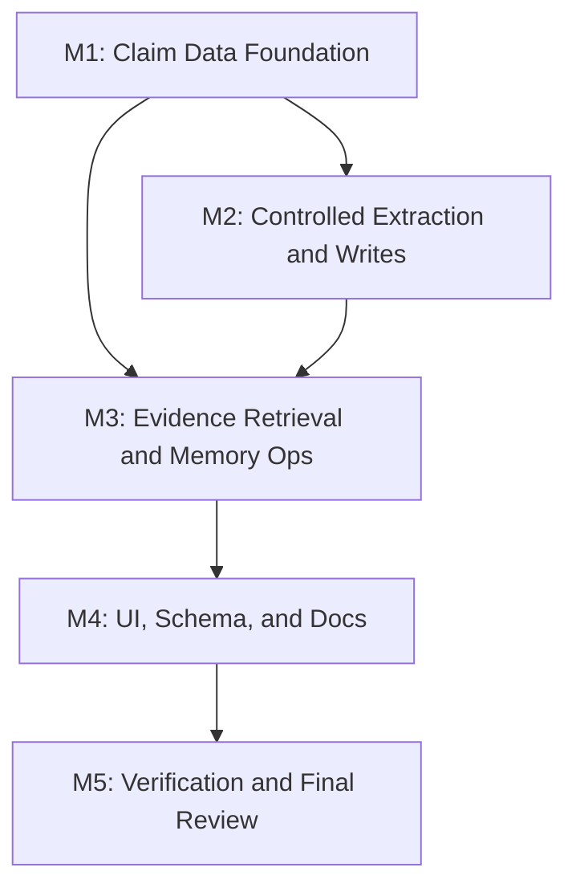

# 任务列表 - LLM Wiki v2 事实级可信度

**关联需求**: [requirements.md](./requirements.md)
**估算量级**: 中 (审核轮数: 5)
**总体进度**: 🚧 9 / 15

---

## 状态图例

| Emoji | 状态 | 含义 |
|-------|------|------|
| ⏳ | 待开始 | 还没开始 |
| 🚧 | 进行中 | 当前正在做 |
| ✅ | 已完成 | 自检通过、commit/push 完毕 |
| ⚠️ | 阻塞中 | 等待外部决策 / 修不动 |
| 🔍 | 待审核 | 自己做完了等用户 review |

---

## 里程碑依赖图

---

## Milestone 1: Claim Data Foundation

**目标**: 建立事实级可信度的类型、存储、anchor 和评分基础，不接入写入路径。
**依赖**: 无
**状态**: ✅

### Task 1.1 ✅ 定义 ClaimRecord contract

**描述**: 新建 claim 类型、字段归一化、稳定 claim id、scope/status/lifecycle 枚举和 JSON 序列化约束。

**依赖**: 无
**阻塞**: T1.2, T1.3, T2.1, T3.1

**预估**: 3h

**关联文件 / 模块**:
- `src/lib/claims.ts` (新建)
- `src/lib/claims.test.ts` (新建)

**验收**:
- [ ] `ClaimRecord` 覆盖需求 F1 字段。
- [ ] claim id 对同一 page/anchor/text 稳定。
- [ ] normalize 对坏 status/lifecycle/scope 返回默认值和 warning。
- [ ] CJK claim text hash 稳定。

#### 备注

- 🐛 **遇到的问题**: 首个 RED 测试按预期失败在 `./claims` 模块缺失；实现后 focused test 通过，并补跑 `npm run typecheck` 确认类型没有被 Vitest 转译掩盖。
- 🔧 **最终实现逻辑**: 新增 `src/lib/claims.ts` 和 `src/lib/claims.test.ts`，定义 `ClaimRecord`、lifecycle/status/scope 枚举、稳定 claim id、source refs 归一化、数组去重、score/date/default normalize。
- 🎯 **关键决策**: Claim 默认更保守：缺失或非法 status 归一到 `needs-review`，非法 lifecycle 归一到 `working`，非法 scope 归一到 `shared`；claim id 基于 normalized page path、anchor 和 claim text hash 生成。

---

### Task 1.2 ✅ 实现 `.llm-wiki/claims.jsonl` 读写层

**描述**: 增加 claim JSONL append/read/filter/merge helpers，容忍坏行，保持派生索引可重建。

**依赖**: T1.1
**阻塞**: T2.2, T3.1, T3.3

**预估**: 4h

**关联文件 / 模块**:
- `src/lib/claims.ts`
- `src/lib/claims.test.ts`
- `src/lib/audit-redaction.ts`

**验收**:
- [x] 读取坏 JSONL 行返回 warnings，不阻断结果。
- [x] append/merge by claim id 不重复记录。
- [x] private scope claim 的 audit summary 不泄漏正文/snippet。
- [x] 缺失 `.llm-wiki/claims.jsonl` 时返回空索引。

#### 备注

- 🐛 **遇到的问题**: RED 测试按预期失败在 `claimIndexPath/readClaimIndex/appendClaimRecords/mergeClaimRecords/claimRecordAuditSummary` 未导出；补实现后 focused test 通过，并补跑 `npm run typecheck`。
- 🔧 **最终实现逻辑**: 在 `src/lib/claims.ts` 增加 project-local `claims.jsonl` path、容错读取、append 写入、claim id merge、private audit redaction summary；新增测试覆盖坏 JSONL 行、缺失文件、写入目录、数组去重合并和 private scope 脱敏。
- 🎯 **关键决策**: `.llm-wiki/claims.jsonl` 保持派生索引定位：读失败返回空索引，坏行只进入 warnings；private claim 的 audit 摘要只暴露 id/path/status/lifecycle/scope，不暴露正文或 snippet hash。

---

### Task 1.3 ✅ 实现 Markdown claim anchors

**描述**: 支持 claim anchor 插入、解析、定位和 orphan detection，避免把正文改造成复杂 DSL。

**依赖**: T1.1
**阻塞**: T2.1, T3.3, T4.1

**预估**: 4h

**关联文件 / 模块**:
- `src/lib/claim-anchors.ts` (新建)
- `src/lib/claim-anchors.test.ts` (新建)

**验收**:
- [x] `<!-- claim:<id> -->` anchor 插入不破坏 Markdown 渲染。
- [x] 重复插入同一 claim id 不产生重复 anchor。
- [x] resolver 支持 anchor、heading fallback、orphan 三种状态。
- [x] Windows 换行和 CJK 内容测试通过。

#### 备注

- 🐛 **遇到的问题**: RED 测试按预期失败在 `./claim-anchors` 模块缺失；实现后 focused test 通过，并补跑 `npm run typecheck`。
- 🔧 **最终实现逻辑**: 新增 `src/lib/claim-anchors.ts` 和 `src/lib/claim-anchors.test.ts`，支持 claim comment 格式化、解析、按正文/heading 插入、重复插入去重，以及 explicit anchor / heading fallback / orphan resolution。
- 🎯 **关键决策**: Markdown 只写轻量 HTML comment `<!-- claim:<id> -->`，不把正文改造成 claim block DSL；没有 explicit anchor 时允许用 heading fallback 定位，找不到时明确返回 orphan。

---

### Task 1.4 ✅ 实现 claim confidence scoring

**描述**: 新建 claim-level scoring，按 source support、age、reinforcement、contradiction、supersession 和 scope 输出 confidence/reasons。

**依赖**: T1.1, T1.2
**阻塞**: T3.2, T3.3

**预估**: 4h

**关联文件 / 模块**:
- `src/lib/claim-confidence.ts` (新建)
- `src/lib/claim-confidence.test.ts` (新建)
- `src/lib/lifecycle.ts`

**验收**:
- [x] fixed today 下结果稳定。
- [x] source/reinforcement/supports 能提高 confidence。
- [x] age/contradicts/superseded_by 能降低 confidence。
- [x] reasons 能解释主要加减分因素。

#### 备注

- 🐛 **遇到的问题**: RED 测试按预期失败在 `./claim-confidence` 模块缺失；实现后 focused test 通过，并补跑 `npm run typecheck`。
- 🔧 **最终实现逻辑**: 新增 `src/lib/claim-confidence.ts` 和 `src/lib/claim-confidence.test.ts`，按 claim lifecycle、source refs、supports、reinforcement、age、contradiction、supersession、scope 计算 confidence/status/reasons，并提供 `applyClaimCredibility` 写回 `ClaimRecord` 字段。
- 🎯 **关键决策**: 评分沿用 page lifecycle 的保守思路，但 status 优先级按 claim 粒度处理：superseded > contradicted > stale > needs-review > ok；评分只提供解释和 review 信号，不自动裁决事实真假。

---

## Milestone 2: Controlled Extraction and Writes

**目标**: 只从受控写入路径生成高价值 claims，并保证失败不影响原功能。
**依赖**: M1
**状态**: ✅

### Task 2.1 ✅ 实现 claim extraction helper

**描述**: 从 digest lessons/decisions、review-created pages、saved query/synthesis 和部分 ingest 输出中提取高价值 claim candidates。

**依赖**: T1.1, T1.3
**阻塞**: T2.2, T2.3, T2.4

**预估**: 5h

**关联文件 / 模块**:
- `src/lib/claim-extract.ts` (新建)
- `src/lib/claim-extract.test.ts` (新建)
- `src/lib/crystallization-digest.ts`

**验收**:
- [x] digest lessons/decisions 可生成 claim candidates。
- [x] 普通短文本不会生成 claim。
- [x] 每次写入有 claim 数量上限。
- [x] extraction 返回 warnings，不抛出到主写入流程。

#### 备注

- 🐛 **遇到的问题**: RED 测试按预期失败在 `./claim-extract` 模块缺失；实现后 focused test 通过，并补跑 `npm run typecheck`。
- 🔧 **最终实现逻辑**: 新增 `src/lib/claim-extract.ts` 和 `src/lib/claim-extract.test.ts`，从 digest decisions/lessons 和带 finding/conclusion/recommendation 信号的 Markdown 行生成 bounded claim candidates，附带 evidence source refs、warnings 和 skipped count。
- 🎯 **关键决策**: extraction helper 保持纯函数，不写文件、不调用 LLM、不接入副作用；普通短文本不生成 claim，避免把低价值正文噪声写入 `.llm-wiki/claims.jsonl`。

---

### Task 2.2 ✅ 接入 crystallization digest 和 Save to Wiki

**描述**: 保存 digest/query/synthesis 页面时写入 anchors 和 claim records，并记录 claim audit。

**依赖**: T1.2, T1.3, T2.1
**阻塞**: T3.1, T3.2

**预估**: 5h

**关联文件 / 模块**:
- `src/lib/crystallization-digest.ts`
- `src/lib/crystallize.ts`
- `src/lib/claims.ts`
- `src/lib/crystallize.test.ts`
- `src/lib/crystallization-digest.test.ts`

**验收**:
- [x] digest save 生成 claim records 和 anchors。
- [x] `writeCrystallizedQueryPage` 保持现有 lifecycle/supports/sources 行为。
- [x] claim 写入失败不阻断页面保存，但有 warning/audit。
- [x] `reinforcement_count` 与 claim supports 不互相覆盖。

#### 备注

- 🐛 **遇到的问题**: 初次接入后 digest 同时从 plan 和页面正文重复抽取 claim；已收敛为“有 digest plan 时只信 plan”。另一个噪声是自动生成 claim id 的内部 warning，已从 extraction 正常路径中过滤。
- 🔧 **最终实现逻辑**: `writeCrystallizedQueryPage` 现在会提取 claim candidates、给正文插入 `<!-- claim:<id> -->` anchors、写入 `.llm-wiki/claims.jsonl`，并追加 `claim.write` audit；`saveCrystallizationDigestPage` 将 plan decisions/lessons 传给 claim extraction。
- 🎯 **关键决策**: claim 写入是附属治理 artifact：页面 `writeFile` 先成功，claim index/audit 失败只回填 `claimWrite.error/auditError`，不阻断 Save to Wiki；page-level `supports/sources/reinforcement_count` 保持原逻辑。

---

### Task 2.3 ✅ 接入 ingest / review-created page 写入路径

**描述**: 在 auto-ingest content pages 和 review create page helper 中为高价值 findings/decisions 写入 claim records。

**依赖**: T1.2, T2.1
**阻塞**: T3.1, T4.2

**预估**: 5h

**关联文件 / 模块**:
- `src/lib/ingest.ts`
- `src/lib/review-page.ts`
- `src/lib/source-summary.ts`
- `src/lib/ingest-execute-writes.test.ts`
- `src/lib/review-page.test.ts`

**验收**:
- [x] ingest 写入 content pages 后 best-effort 生成 claims。
- [x] review-created pages 包含 claim-friendly anchors。
- [x] index/log/overview 等 listing pages 不生成 claims。
- [x] claim extraction 失败不阻断 ingest。

#### 备注

- 🐛 **遇到的问题**: 需要避免复制 T2.2 的 best-effort claim 写入逻辑；已抽出 `writeExtractedClaimArtifacts` 供 crystallize 和 ingest 共用。
- 🔧 **最终实现逻辑**: ingest content page 写入分支在 lifecycle enrich 后提取 claim、插入 anchors、写入 claim index/audit；review-created page builder 为 claim-friendly description 插入 anchors；index/log/overview listing pages 保持跳过。
- 🎯 **关键决策**: claim artifact 写入失败只追加 ingest warning，不进入 hard failure，也不影响原页面写入和 memory.write audit；review page builder 只负责页面 anchor，不在纯 builder 中做文件副作用。

---

### Task 2.4 ✅ 定义 claim audit actions 和 review handoff

**描述**: 增加 `claim.write`、`claim.update`、`claim.rebuild`、`claim.review` audit actions；contradicted/superseded claim 可进入 review-only。

**依赖**: T1.2, T2.1
**阻塞**: T3.3, T4.1

**预估**: 3h

**关联文件 / 模块**:
- `src/lib/audit-timeline.ts`
- `src/lib/audit-timeline-ui.ts`
- `src/lib/audit-events.ts`
- `src/stores/review-store.ts`
- `src/lib/claims.test.ts`

**验收**:
- [x] claim audit actions 被 timeline 分类。
- [x] private claim audit 不泄漏 text/snippet。
- [x] contradicted/superseded claim 能生成 review-only handoff。
- [x] bad audit line 不影响 claim index scan。

#### 备注

- 🐛 **遇到的问题**: `claim.*` action 初始仍被 audit timeline 归类为 `other`；新增 category 后 focused test 通过。
- 🔧 **最终实现逻辑**: `AuditEventCategory` 增加 `claim`，`categoryFromAction` 识别 `claim.*`；新增 `claim-review.ts` 将 contradicted/superseded claim 转成 review-only draft item；audit read 测试覆盖坏行不阻断 claim events。
- 🎯 **关键决策**: claim review handoff 只提供 Open page / Mark reviewed，不做自动合并、删除或裁决；private claim 文本在 handoff description 中脱敏。

---

## Milestone 3: Evidence Retrieval and Memory Ops

**目标**: 让 claim 成为 search/chat evidence 和 Memory Ops patrol 的可解释信号。
**依赖**: M1, M2
**状态**: 🚧

### Task 3.1 ✅ 实现 claim evidence lookup

**描述**: 基于 search/chat top-k page results，从 claim index 中查找相关 claims 并排序。

**依赖**: T1.2, T2.2, T2.3
**阻塞**: T3.2, T4.1

**预估**: 5h

**关联文件 / 模块**:
- `src/lib/claim-evidence.ts` (新建)
- `src/lib/claim-evidence.test.ts` (新建)
- `src/lib/search-types.ts`

**验收**:
- [x] 没有 claim index 时返回空 evidence，不改变现有搜索。
- [x] 能按 page path、query tokens、confidence/status 排序。
- [x] CJK claim text 可匹配。
- [x] orphan claim 不进入普通 evidence，进入 warning。

#### 备注

- 🐛 **遇到的问题**: RED 测试按预期失败在 `./claim-evidence` 模块缺失；实现后 focused test 通过，并补跑 `npm run typecheck`。
- 🔧 **最终实现逻辑**: 新增 `src/lib/claim-evidence.ts` 和 `src/lib/claim-evidence.test.ts`，基于 top-k page paths、query terms、claim confidence/status 生成排序 evidence，并将 missing page claim 作为 orphan warning。
- 🎯 **关键决策**: claim evidence 只作为解释层二级信号，不改现有 RRF 排序；private claim evidence 默认正文/source refs 脱敏。

---

### Task 3.2 ⏳ 接入 search/chat evidence explanation

**描述**: 扩展 search result 和 chat references，让用户看到 claim evidence。

**依赖**: T3.1, T1.4
**阻塞**: T4.1, T5.1

**预估**: 5h

**关联文件 / 模块**:
- `src/lib/search.ts`
- `src/lib/search-types.ts`
- `src/components/search/search-view.tsx`
- `src/components/chat/chat-message.tsx`
- `src/components/chat/chat-panel.tsx`
- `src/lib/search-rrf.test.ts`

**验收**:
- [ ] `SearchResult` 可携带 `claimEvidence`。
- [ ] Search UI 展示 claim confidence/status/source/page target。
- [ ] Chat references panel 展示 claim evidence，默认不过度展开。
- [ ] 现有 search RRF 排序不因 claim evidence 退化。

#### 备注

- 🐛 **遇到的问题**:
- 🔧 **最终实现逻辑**:
- 🎯 **关键决策**:

---

### Task 3.3 ⏳ 接入 Memory Ops claim patrol

**描述**: Memory Ops snapshot 读取 claim index，生成 claim health summary 和 claim-level suggestions。

**依赖**: T1.2, T1.4, T2.4
**阻塞**: T4.1, T5.1

**预估**: 6h

**关联文件 / 模块**:
- `src/lib/memory-ops.ts`
- `src/lib/memory-ops-rules.ts`
- `src/lib/memory-ops-ui.ts`
- `src/lib/memory-ops-rules.test.ts`
- `src/components/settings/sections/memory-ops-patrol-block.tsx`

**验收**:
- [ ] Patrol stats 包含 claim count/stale/contradicted/superseded/orphan/reinforced。
- [ ] stale claim suggestion 不自动 demote 整页。
- [ ] contradicted/superseded claim suggestion 默认 review-only。
- [ ] Maintenance UI 展示 claim health summary。

#### 备注

- 🐛 **遇到的问题**:
- 🔧 **最终实现逻辑**:
- 🎯 **关键决策**:

---

### Task 3.4 ⏳ 实现 claim index scan / rebuild dry-run

**描述**: 提供显式 claim index scan/rebuild，列出 recovered/orphan/stale records，确认前不写文件。

**依赖**: T1.2, T1.3, T3.3
**阻塞**: T4.1, T5.1

**预估**: 4h

**关联文件 / 模块**:
- `src/lib/claim-ops.ts` (新建)
- `src/lib/claim-ops.test.ts` (新建)
- `src/lib/memory-ops.ts`

**验收**:
- [ ] rebuild dry-run 不写 `.llm-wiki/claims.jsonl`。
- [ ] orphan/recovered/stale counts 稳定。
- [ ] apply rebuild 写 audit，并保留坏行 warnings。
- [ ] 不读取 `raw/sources/` 大文件。

#### 备注

- 🐛 **遇到的问题**:
- 🔧 **最终实现逻辑**:
- 🎯 **关键决策**:

---

## Milestone 4: UI, Schema, and Docs

**目标**: 把 claim evidence 做成可理解入口，并更新 schema/prompt/documentation。
**依赖**: M3
**状态**: ⏳

### Task 4.1 ⏳ 增加 claim evidence UI 组件

**描述**: 在 Search、Chat、Maintenance 中复用 claim evidence 展示组件，默认折叠，支持状态/置信度/source/path。

**依赖**: T3.1, T3.2, T3.3
**阻塞**: T5.1

**预估**: 5h

**关联文件 / 模块**:
- `src/components/claims/claim-evidence-list.tsx` (新建)
- `src/components/search/search-view.tsx`
- `src/components/chat/chat-message.tsx`
- `src/components/settings/sections/memory-ops-patrol-block.tsx`
- `src/i18n/en.json`
- `src/i18n/zh.json`

**验收**:
- [ ] 键盘可达，状态不只靠颜色表达。
- [ ] 长 claim/path 不撑破布局。
- [ ] private/redacted claim 显示最小摘要。
- [ ] 中英文文案齐全。

#### 备注

- 🐛 **遇到的问题**:
- 🔧 **最终实现逻辑**:
- 🎯 **关键决策**:

---

### Task 4.2 ⏳ 更新 schema contract、templates 和 ingest prompt

**描述**: 让新项目 schema 和 LLM prompt 知道 claim anchors、claim index 和高价值 claim 生成约束。

**依赖**: T2.3, T3.3
**阻塞**: T5.1

**预估**: 4h

**关联文件 / 模块**:
- `src/lib/schema-contract.ts`
- `src/lib/templates.ts`
- `src-tauri/src/commands/project.rs`
- `src/lib/ingest.ts`
- `src/lib/templates.test.ts`
- `src/lib/ingest.prompt.test.ts`

**验收**:
- [ ] TS/Rust schema template parity 测试通过。
- [ ] Schema 明确 claim index 是 derived governance artifact。
- [ ] Prompt 要求 only high-value findings/decisions become claim-friendly content。
- [ ] 不承诺历史全量 claim extraction。

#### 备注

- 🐛 **遇到的问题**:
- 🔧 **最终实现逻辑**:
- 🎯 **关键决策**:

---

### Task 4.3 ⏳ 更新 README / plans / migration notes

**描述**: 更新文档说明事实级可信度的边界、操作方式、非目标和与 Spec B 的关系。

**依赖**: T4.1, T4.2
**阻塞**: T5.1

**预估**: 3h

**关联文件 / 模块**:
- `README.md`
- `README_CN.md`
- `plans/llm-wiki-v2-deep-dive.md`
- `plans/llm-wiki-v2-completion-audit.md`
- `docs/llm-wiki-v2-fact-credibility/requirements.md`
- `docs/llm-wiki-v2-fact-credibility/tasks.md`

**验收**:
- [ ] 文档说明 claim 层不是数据库替代品。
- [ ] 文档说明本期不做 pre-write conflict gate。
- [ ] 旧项目 migration/rebuild 行为写清楚。
- [ ] README 不夸大自动事实裁决能力。

#### 备注

- 🐛 **遇到的问题**:
- 🔧 **最终实现逻辑**:
- 🎯 **关键决策**:

---

## Milestone 5: Verification and Final Review

**目标**: 完成回归验证、文档对齐和 5 轮最终审核。
**依赖**: M4
**状态**: ⏳

### Task 5.1 ⏳ 运行 focused tests、typecheck、mock regression 和 Rust tests

**描述**: 跑 claim 相关 focused suites、全量 typecheck、mock regression；如果 Rust scaffold 改动，跑 cargo test。

**依赖**: T4.3
**阻塞**: T5.2

**预估**: 4h

**关联文件 / 模块**:
- `src/lib/claims.test.ts`
- `src/lib/claim-*.test.ts`
- `src/lib/search-rrf.test.ts`
- `src/lib/memory-ops-rules.test.ts`
- `src/i18n/i18n-parity.test.ts`
- `src-tauri/src/commands/project.rs`

**验收**:
- [ ] Focused Vitest suites 通过。
- [ ] `npm run typecheck` 通过。
- [ ] `npm run test:mocks` 通过或明确记录失败和原因。
- [ ] Rust scaffold 有改动时 `cd src-tauri && cargo test` 通过。

#### 备注

- 🐛 **遇到的问题**:
- 🔧 **最终实现逻辑**:
- 🎯 **关键决策**:

---

### Task 5.2 ⏳ 五轮最终审核与 completion audit

**描述**: 按中型项目执行 5 轮最终审核：功能、类型/静态分析、性能、安全、UX/a11y，并补齐发现。

**依赖**: T5.1
**阻塞**: 无

**预估**: 5h

**关联文件 / 模块**:
- `docs/llm-wiki-v2-fact-credibility/review-round-1.md` (新建)
- `docs/llm-wiki-v2-fact-credibility/review-round-2.md` (新建)
- `docs/llm-wiki-v2-fact-credibility/review-round-3.md` (新建)
- `docs/llm-wiki-v2-fact-credibility/review-round-4.md` (新建)
- `docs/llm-wiki-v2-fact-credibility/review-round-5.md` (新建)
- `docs/llm-wiki-v2-fact-credibility/completion-audit.md` (新建)

**验收**:
- [ ] 5 轮 review reports 存在。
- [ ] 每轮发现修复或明确记录为 follow-up/非目标。
- [ ] completion audit 对照 F1-F9 和验证命令。
- [ ] 文档顶部进度和底部进度总览一致。

#### 备注

- 🐛 **遇到的问题**:
- 🔧 **最终实现逻辑**:
- 🎯 **关键决策**:

---

## 进度总览 (开发中实时维护)

| 里程碑 | 任务 | 完成 | 总数 | 状态 |
|--------|------|------|------|------|
| M1 | Claim Data Foundation | 4 | 4 | ✅ |
| M2 | Controlled Extraction and Writes | 4 | 4 | ✅ |
| M3 | Evidence Retrieval and Memory Ops | 1 | 4 | 🚧 |
| M4 | UI, Schema, and Docs | 0 | 3 | ⏳ |
| M5 | Verification and Final Review | 0 | 2 | ⏳ |
| **总计** | | **9** | **15** | **🚧** |

---

## 变更记录

| 日期 | 变更 |
|------|------|
| 2026-05-08 | 完成 T3.1：claim evidence lookup 和 orphan warning。 |
| 2026-05-08 | 完成 T2.4：claim audit category 和 review-only handoff。 |
| 2026-05-08 | 完成 T2.3：ingest/review-created page 接入 claim anchors 和 best-effort claim artifacts。 |
| 2026-05-08 | 完成 T2.2：digest/Save to Wiki 写入 claim anchors、claim records 和 claim audit。 |
| 2026-05-08 | 完成 T2.1：受控写入路径 claim extraction helper。 |
| 2026-05-08 | 完成 T1.4：claim-level confidence scoring 和写回 helper。 |
| 2026-05-08 | 完成 T1.3：Markdown claim anchors 插入、解析和定位。 |
| 2026-05-08 | 完成 T1.2：claim JSONL 读写、merge 和 private audit summary。 |
| 2026-05-08 | 初稿，15 个任务，按中量级 5 轮审核。 |

---

## 最终审核索引 (Phase 4 期间填)

| Round | 视角 | 状态 | 报告 |
|-------|------|------|------|
| 1 | 功能 | ⏳ | <-> |
| 2 | 类型 & 静态分析 | ⏳ | <-> |
| 3 | 性能 | ⏳ | <-> |
| 4 | 安全 | ⏳ | <-> |
| 5 | UX & a11y | ⏳ | <-> |
