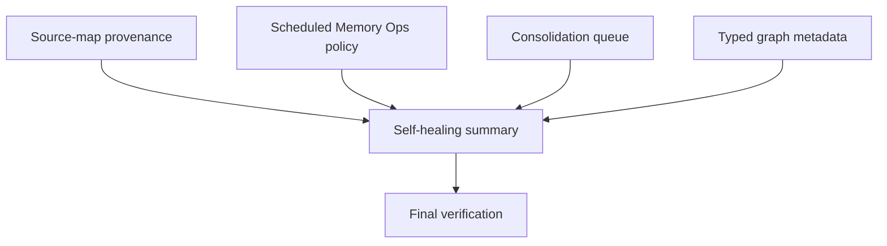

# LLM Wiki v2 Final 5 Percent Tasks

## Dependency Graph

## Tasks

### ✅ T1 Source-Map Provenance

- Dependencies: none
- Blocks: T5
- Add deterministic source location helpers.
- Enrich claim source refs with page/line/offset metadata when source text supports it.
- Add focused tests for Markdown and PDF-style extracted text.

Notes:
- Bugs: Existing source refs only carried path/hash/anchor, so PDF-derived claims could not point back to page or offsets.
- Implementation: Added optional page/line/char fields to claim refs, deterministic source snippet location helpers, UI formatting, and tests for Markdown/PDF-style extracted text.
- Decisions: Use current Rust `## Page N` extraction markers for page anchors; do not store raw snippets.

### ✅ T2 Scheduled Memory Ops Policy

- Dependencies: none
- Blocks: T5
- Extend policy shape and normalization.
- Make due-state reduction explain event/time/cooldown reasons.
- Wire auto-patrol gating to policy schedule.
- Add tests for due and not-due branches.

Notes:
- Bugs: Auto-patrol cadence was hard-coded around event count and reminder cooldown only.
- Implementation: Added policy schedule fields, normalization warnings, due reasons, time-based interval, minimum patrol interval, UI controls, and tests.
- Decisions: Keep defaults matching prior behavior plus a 24h time-based safety interval; old policy files still normalize.

### ✅ T3 Consolidation Queue

- Dependencies: none
- Blocks: T5
- Add local queue store helpers.
- Add digest-plan queueing with stable IDs and statuses.
- Integrate session-end digest preview with queue add.
- Add audit events and tests.

Notes:
- Bugs: Session-end digest candidates were audit-only and could be missed after the activity timeline moved on.
- Implementation: Added durable `.llm-wiki/consolidation-queue.json`, stable queue IDs, dedupe, status updates, audit events, and session-end queue integration.
- Decisions: Queue stores only digest metadata and target candidates, not full assistant/source body text.

### ✅ T4 Typed Graph Metadata

- Dependencies: none
- Blocks: T5
- Add node aliases/tags/lifecycle/last-confirmed/source count fields.
- Add edge provenance/confidence/source-field metadata.
- Preserve traversal and visual graph compatibility.
- Add tests for metadata.

Notes:
- Bugs: Typed graph edges were traversable but not very explainable; nodes lacked lifecycle/tag/source-count metadata.
- Implementation: Added node aliases/tags/lifecycle/last-confirmed/source count/review flags and edge provenance fields for frontmatter and wikilink edges.
- Decisions: Preserve existing traversal rank shape; metadata is additive and optional for current callers.

### ✅ T5 Conservative Self-Healing Summary

- Dependencies: T1, T2, T3, T4
- Blocks: T6
- Add dry-run summary aggregating safe repair candidates.
- Surface counts in Memory Ops scan/patrol stats.
- Audit dry-run summary without applying page rewrites.
- Add tests.

Notes:
- Bugs: Safe repair opportunities were split across multiple tools and not visible in one maintenance summary.
- Implementation: Added read-only self-healing summary, Memory Ops stats/audit integration, UI counters, and tests.
- Decisions: New summary is dry-run only; existing explicit apply buttons remain the only mutation paths.

### ✅ T6 Final Verification

- Dependencies: T5
- Blocks: release readiness
- Run focused tests while developing.
- Run `npm run typecheck`.
- Run `npm run test:mocks`.
- Run `cargo test --manifest-path src-tauri/Cargo.toml`.
- Write 5 review reports: functionality, type safety, performance, security/privacy, UX/observability.

Notes:
- Bugs: Typecheck initially exposed incomplete fixtures and one TypeScript narrowing issue; all were fixed.
- Implementation: Ran full TypeScript, mocked Vitest, Rust tests, and wrote five review reports.
- Decisions: Did not auto-apply self-healing or queue actions; final state stays local-review-first.
