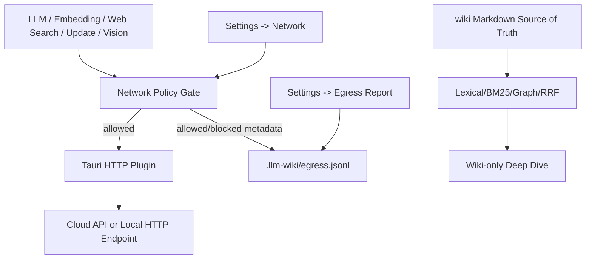

# 需求文档 — LLM Wiki v2 Local-First Storage + Transparent Cloud Compute

**版本**: v0.1
**日期**: 2026-05-10
**作者**: user + AI
**状态**: Phase 3 部分执行中；定位已修正为 local-first storage + transparent cloud compute
**关联任务列表**: [`tasks.md`](./tasks.md)

---

## 1. 背景

上一轮 `llm-wiki-v2-rohit-local-first` 已经把 **存储层 local-first** 收口：`wiki/` 是 Markdown source of truth，`.llm-wiki/` 保存可重建的派生状态，app-resident local maintenance daemon 只在 app 运行期每 15 分钟做轻量 due check，并保持 human-gated 写入。

这次 comment 提出了一个更高层的问题：**local-first storage 不等于 offline-only compute**。本项目的目标不是排除 OpenAI、Anthropic、Google、Tavily 等云端能力，而是确保知识库、索引、审计、维护状态和 chat 状态本地优先，同时让云端 LLM / 搜索 / vision / update-check 作为可选计算后端变得透明、可控、可关闭、可审计。

本规格不推翻上一轮结论，而是把产品契约明确为 **Local-first storage + transparent cloud compute**。`local-only` 是严格离线/敏感场景的模式，不是默认产品承诺；默认产品承诺是用户能明确选择 provider，并知道哪些请求会出网、为什么出网、能否被 Network Policy 阻断，以及后续能否在 Egress Report 中审计。Rohit gist 里的 lifecycle、automation、hybrid search、privacy/audit、collaboration 仍作为参考，但 mesh sync、远程 memory server、多用户 ACL 不进入本期实现。

## 2. Phase 1 代码证据摘要

| 维度 | 当前证据 | 判断 |
|------|----------|------|
| 统一 HTTP 入口 | `src/lib/tauri-fetch.ts` 是 LLM、embedding、web search、update check、captioning 共享的 Tauri HTTP helper | 有良好收口点；policy gate 是透明云计算治理的执行点 |
| Tauri 出网能力 | `src-tauri/capabilities/default.json` 允许 `http://**` 和 `https://**` | capability 层是全开放，必须在 app 层约束 |
| Proxy | `src-tauri/src/proxy.rs` / `src/lib/proxy-config.ts` 已集中配置 HTTP_PROXY / HTTPS_PROXY | 是路由配置，不是 offline/allowlist 策略 |
| Update check | `src/stores/update-store.ts` 默认 `enabled: true`；`src/App.tsx` 启动 1.5 秒后请求 GitHub Releases API；About 面板已有 toggle | comment 的“未披露/默认联网”基本成立，但“没有开关”不准确 |
| Web search | `src/lib/web-search.ts` 只支持 Tavily / SerpApi / none | 云 provider 合理，但需要 policy、披露和后续本地 SearXNG 选项 |
| Deep Research | `src/lib/deep-research.ts` 强依赖 `webSearch`，无 wiki-only fallback | 云研究合理，但 local-only 模式需要 wiki-only 降级路线 |
| Embedding | `src/lib/embedding.ts` 是 OpenAI-compatible HTTP client；默认 disabled，endpoint 为空 | 默认不发请求，但缺本地 Ollama 一键预设 |
| Vector store | LanceDB 在 Rust/Tauri 本地侧，embedding 生成取决于 endpoint | 存储本地，embedding compute 可本地也可云端 |
| Vision caption | `src/stores/wiki-store.ts` 有独立 `multimodalConfig`，但默认 `useMainLlm: true` | comment 的“没有独立 provider”不准确；应改为“已有但默认和标注不足” |
| Claude Code CLI | `src/components/settings/llm-presets.ts` 标注 “Claude Code CLI (local)”；`claude-cli-transport.ts` 说明本地 `claude` 进程转发到 Claude CLI | UI 需要改成 “local process, remote model” |
| Chat history | `.llm-wiki/conversations.json` 和 `.llm-wiki/chats/<id>.json` 持久化；`audit-redaction.ts` 只处理 audit 事件 | chat 隐私策略需要单独声明和可选 redaction |
| Audit redaction | `src/lib/audit-redaction.ts` 脱敏 secret、private block、private scope | 可复用，但目前没有覆盖 chat persist / egress log |
| Scope | `memory-ops-executor.ts` 支持 `scope?: private/shared`；README 已写 no mesh sync | 需要明确 sync 依赖用户自带 git/Syncthing/iCloud，app 不内建 mesh |
| Git | fs 侧跳过 `.git` 防止误摄入，但没有 git init/commit UI 或 audit commit hash | auto-git 是新系统，适合 P2 |
| Egress report | 未发现 `.llm-wiki/egress.jsonl` 或出网审计 UI | transparent cloud compute 的核心缺口，优先级高于单纯增加本地替代 provider |

## 3. Comment 采纳分级

### 3.1 直接采纳

- 缺一个全局 `networkPolicy`，统一约束并解释 LLM、embedding、web-search、update-check、deep-research、vision caption 等出网点。
- `tauri-fetch.ts` 是最合适的执行点，但现状只是 HTTP helper，没有 allowlist/denylist。
- embedding 需要本地 Ollama 一键预设，降低用户选择 local compute 的摩擦，但云 embedding 不是缺口，只要透明受控即可。
- update-check 默认启用且走 GitHub，应纳入 Network Policy，并在 README 的 local/cloud 表格里披露。
- Web search / Deep Research 是 cloud-dependent 功能，README 和 UI 应明确标注；local-only 下提供禁用或 wiki-only 降级。
- Claude Code CLI 当前“local”标签容易误导，应改成 “Local process, remote model”。
- mesh sync 不内建不是 bug，但 README 应说清楚 sync 依赖用户自带 git/Syncthing/iCloud。
- egress report、chat 隐私策略、auto-git 是 local-first storage + transparent cloud compute 可证明性的关键后续。

### 3.2 修正后采纳

- “Embedding 会静默倒向 OpenAI”需要修正：当前默认 `enabled=false` 且 endpoint 为空，不会默认出网；真实问题是没有本地默认预设。
- “Update check 没有设置开关”需要修正：About 面板已有开关；真实问题是默认启用且此前未受 Network Policy 约束。
- “Vision caption 没有独立 provider”需要修正：代码已有独立 `multimodalConfig`；真实问题是默认 `useMainLlm=true`、UI/README 对隐私边界说明不足。
- “网络边界只靠 Rust HTTP”需要修正：Rust proxy 和 Tauri plugin 只是通道；真正的 policy 应在前端 typed wrapper 约束 HTTP 调用，并对 Claude CLI 这类 subprocess 传输做单独披露或 gating。

### 3.3 保留为 Non-Goal

- 不内建 mesh sync、多用户 ACL、远程 memory server。
- 不做 OS 级常驻 daemon / LaunchAgent。
- 不抓取 HTTPS payload 内容，不做 MITM 式请求审计。
- 不强制用户 git commit；auto-git 必须 opt-in，可回滚、可关闭。

## 4. 目标

### 4.1 范围内

- 设计并实现 `networkPolicy: "local-only" | "allowlist" | "any"`：`local-only` 是严格模式，`allowlist` 和 `any` 支持透明云计算。
- 在 `tauri-fetch.ts` 入口执行 host/scheme policy gate，让云 API 调用可控、可阻断、可解释。
- 将 update-check、web-search、deep-research、embedding、vision caption、LLM provider 请求纳入同一 policy/metadata 体系。
- 给 cloud-dependent 功能加 UI/README 标注；local-only 下禁用、阻断或降级。
- 提供本地默认预设：Ollama embedding、local SearXNG、local VLM/Ollama vision，作为云 compute 的低摩擦替代，而不是唯一正确路径。
- 增加 egress audit/report：记录 host、provider、reason、timestamp、policy decision、粗略 bytes，不记录 secret 或 payload，使云调用可验证。
- 明确 chat history 的本地持久化和 redaction 策略，提供可配置选项。
- 增加可选 auto-git 快照设计：ingest / memory-op 后可生成 Git commit，并把 commit hash 写入 audit。
- 补 README / README_CN 的 “Local vs Cloud” 表格和 sync 边界说明。

### 4.2 范围外

- 不新建远程服务，不引入远程 memory backend。
- 不让 app 代替用户做跨设备同步或权限管理。
- 不在 local-only 下自动改写用户 endpoint；只阻止不符合 policy 的请求，并给出可操作提示。
- 不记录请求 payload、API key、Authorization header、prompt 全文或图片 bytes。
- 不把 private scope 自动推送到远端；private/shared 与 Git 的关系先通过目录/ignore 策略和文档收口。

### 4.3 成功标准

- 用户能一眼看到当前项目的网络策略，并知道哪些功能会出网、走哪个 provider、为什么出网。
- `local-only` 下默认只允许 loopback / localhost / 用户明确 allowlist 的 LAN 地址，不允许 GitHub、Tavily、SerpApi、OpenAI、Anthropic、Google 等云 host。
- 所有通过 `getHttpFetch()` 的请求都带上 `egress reason`，无法归类的调用在 typecheck 或测试中失败。
- update-check 不再 silent egress；默认策略、设置项和 README 表格一致。
- Deep Research 在 local-only 下不再直接失败，至少提供 wiki-only deep dive 或清晰 disabled state。
- Embedding 和 vision caption 提供本地 preset，同时云 provider 明确标注并受 policy 管控。
- `.llm-wiki/egress.jsonl` 能让用户回答“过去 7 天 app 连过哪些 host、为什么连、是否被 policy 允许”。
- `npm run typecheck`、`npm run test:mocks`、相关 Rust tests 通过。

## 5. 用户场景

### 5.1 场景 1：严格离线用户

用户在 Settings → Network 选择 `local-only`。这是严格模式，用于不希望 app 访问公网的场景。之后：

1. LLM provider 只能选择 Ollama/local custom loopback。
2. Embedding 一键使用 `http://localhost:11434/v1/embeddings` + `nomic-embed-text`。
3. Web Search / cloud Deep Research / update-check 显示 disabled state。
4. Vision caption 只能走本地 VLM，或关闭 caption。
5. Egress report 只显示 localhost / 127.0.0.1 请求，云 host 均为 blocked。

### 5.2 场景 2：允许少量自托管服务

用户选择 `allowlist`，添加：

- `http://192.168.1.50:11434`
- `http://localhost:8080`（SearXNG）
- `http://127.0.0.1:19827`（clip server）

系统允许这些 host，阻止未列入 allowlist 的 Tavily、GitHub update check 和云 LLM endpoint。

### 5.3 场景 3：普通云用户但需要透明披露

用户选择 `any`，或在 `allowlist` 中加入明确 cloud host。所有已配置 cloud provider 可用，但：

1. README 和 Settings 显示 cloud-dependent / remote model 标识。
2. 每次 web search、update-check、embedding、vision caption 都写 egress log。
3. Egress report 按 host/provider/reason 聚合。

### 5.4 场景 4：需要可回滚 bulk operation

用户打开 auto-git：

1. ingest 前检查 project 是否 git repo；不是则提示 git init。
2. ingest / memory-op apply 后自动生成 commit。
3. audit event 记录 commit hash。
4. 回滚时可从 app 打开对应 git diff 或提示用户执行 git revert。

## 6. 功能需求

### F1: Network Policy 数据模型

**描述**: 增加项目级或全局 network policy 配置。

**字段**:
- `mode`: `"local-only" | "allowlist" | "any"`
- `allowedHosts`: host 或 origin 列表，支持 loopback 默认项。
- `allowLan`: 是否允许 RFC1918 LAN 地址。
- `blockUpdateCheck`: 是否在非 `any` 模式下阻止 update-check。
- `policyVersion`: 配置 schema 版本。

**验收标准**:
- [ ] 新项目有明确默认策略，不能隐式等同 `any`。
- [ ] 旧项目迁移不会破坏现有用户，但会显示一次 disclosure。
- [ ] policy 持久化到 `app-state.json` 或 project state，读取/写入有测试。

### F2: `tauri-fetch` Policy Gate

**描述**: 所有 app HTTP 请求走同一个 typed wrapper，先检查 policy，再调用 Tauri plugin fetch。

**行为**:
- 调用方必须传 `reason`、`feature`、`provider`、`url`。
- policy 决定 allow/block。
- block 时抛出可 UI 展示的 `NetworkPolicyBlockedError`。
- allow/block 都可以写 egress event，但 block event 不包含 payload。

**验收标准**:
- [ ] `local-only` 阻止公网 HTTPS。
- [ ] `local-only` 允许 loopback。
- [ ] `allowlist` 只允许配置中的 origin/host。
- [ ] `any` 允许但记录 egress reason。
- [ ] 现有直接 `getHttpFetch()` 调用全部迁移到带 metadata 的 wrapper。

### F3: Update Check 透明化

**描述**: update-check 默认和 Network Policy 对齐，避免 silent GitHub egress。

**行为**:
- 首启或升级后明确显示 update-check 状态。
- `local-only` 下自动禁用或 block 自动 update-check，保留手动按钮但显示 blocked reason。
- About 面板写明 GitHub Releases API host。

**验收标准**:
- [ ] 启动不会在 local-only 下请求 GitHub。
- [ ] 手动 check 会写 egress log。
- [ ] README/README_CN 明确 update-check 是 cloud-dependent。

### F4: Cloud-Dependent 功能标注

**描述**: README、Settings、Deep Research、Web Search、LLM provider picker 显示 local/cloud 边界。

**验收标准**:
- [ ] README/README_CN 有 “Local by default / Optional local / Cloud-dependent” 表格。
- [ ] Claude Code CLI 标签改为 “Local process, remote model”。
- [ ] Ollama Local 与 Ollama Cloud 明确区分。
- [ ] cloud provider 在 local-only 下 disabled 或有明确 blocked 提示。

### F5: Embedding Local Preset

**描述**: Settings → Embedding 提供本地 Ollama preset，降低选择本地 embedding compute 的成本；云 embedding 仍可用但必须透明受 policy 管控。

**默认建议**:
- endpoint: `http://localhost:11434/v1/embeddings`
- model: `nomic-embed-text`
- apiKey: 空

**验收标准**:
- [ ] 一键填入本地 preset。
- [ ] 本地 preset 在 local-only 下可用。
- [ ] 云 endpoint 在 local-only 下保存时给出 warning 或运行时 block。

### F6: Web Search Local Provider

**描述**: 增加 SearXNG provider。

**行为**:
- provider: `searxng`
- endpoint: 用户自填，默认 `http://localhost:8080/search`
- 输出复用 `WebSearchResult`。

**验收标准**:
- [ ] SearXNG JSON 响应可归一化。
- [ ] local-only 下只允许 loopback/allowlist SearXNG。
- [ ] Tavily/SerpApi 在 local-only 下禁用。

### F7: Strict Local-Only Deep Research 降级

**描述**: Deep Research 在 local-only 下提供 wiki-only deep dive；默认模式仍允许透明 cloud search + cloud LLM compute。

**行为**:
- 不调用 web search。
- 使用 local lexical/BM25/typed graph/RRF 检索现有 wiki。
- LLM 合成仍受 LLM provider policy 约束；若无本地 LLM，则显示 disabled state。

**验收标准**:
- [ ] local-only 下不调用 Tavily/SerpApi。
- [ ] wiki-only 模式能保存 `wiki/queries/*.md`，并标注来源为 local wiki。
- [ ] 用户能看出 cloud research 与 wiki-only deep dive 的差别。

### F8: Vision Caption Local Boundary

**描述**: 收紧 multimodal caption 的隐私说明和默认路线。

**行为**:
- 默认推荐独立 local VLM provider，而不是复用 main LLM。
- cloud vision provider 显示“images may be sent to provider”。
- local-only 下复用 main cloud LLM 时阻止 caption。

**验收标准**:
- [ ] UI 明确 caption 会发送 image bytes。
- [ ] local-only 下只允许 local/allowlist VLM。
- [ ] 失败时不影响 ingest 主流程。

### F9: Egress Audit and Report

**描述**: 增加 `.llm-wiki/egress.jsonl` 和 Settings 可视化。这是 transparent cloud compute 的核心证据层。

**字段**:
- `timestamp`
- `feature`
- `provider`
- `reason`
- `urlHost`
- `urlScheme`
- `decision`: `allowed | blocked`
- `approxRequestBytes`
- `approxResponseBytes`
- `policyMode`

**验收标准**:
- [ ] 不记录 path query 中的 secret，不记录 headers，不记录 payload。
- [ ] 过去 7 天按 host/provider 聚合。
- [ ] private scope / secret 文本使用 redaction。
- [ ] export 支持 JSONL/CSV。

### F10: Chat History Privacy

**描述**: 明确 `.llm-wiki/chats/*.json` 的本地持久化策略，并提供控制项。

**行为**:
- Settings 增加 “Persist chat history” 和 “Redact private blocks in persisted chat”。
- 默认保持现有行为但文档披露。
- redaction 复用 `audit-redaction.ts` 的 secret/private block 规则。

**验收标准**:
- [ ] 用户可关闭 chat history 持久化。
- [ ] 开启 redaction 后 `<private>` 和 secret 不落盘。
- [ ] Memory Ops 读取 chat history 时尊重该策略。

### F11: Optional Auto-Git Snapshot

**描述**: 把 gist “wiki is just a git repo” 落成可选 Git 集成。

**行为**:
- 检测 project 是否 git repo。
- 支持手动 “Snapshot now”。
- 可选 ingest / memory-op apply 后 auto commit。
- audit event 记录 commit hash。

**验收标准**:
- [ ] 未安装 git 或非 git repo 时有可操作提示。
- [ ] auto-git 默认关闭。
- [ ] private path 默认不进入自动 commit，除非用户显式允许。
- [ ] commit 失败不影响 ingest 主流程，只写 warning/activity。

### F12: Sync Boundary Documentation

**描述**: README 明确 app 不内建 mesh sync，用户可自带 git/Syncthing/iCloud。

**验收标准**:
- [ ] README/README_CN 写清楚 sync 不是 app 功能。
- [ ] `scope: private/shared` 的含义与 Git ignore 建议一致。
- [ ] private 目录建议方案写明，例如 `wiki/private/` 默认 `.gitignore`。

## 7. 非功能需求

### 7.1 安全与隐私

- Policy gate 必须按用户选择执行：`local-only` 拒绝公网，`allowlist` 只允许明确 host，`any` 允许配置的云 compute 但仍记录 reason。
- Egress log 不记录 API key、Authorization、cookies、prompt 全文、response 正文、image bytes。
- 所有错误提示不得回显 secret。
- `private` scope 不应被 auto-git 默认提交。

### 7.2 可观测性

- 所有 egress 入口必须可归因到 feature/reason。
- Blocked request 需要可见：UI toast、Activity item 或 Settings report。
- Update-check、web-search、embedding、vision caption、LLM chat 都能在 egress report 里区分。

### 7.3 可用性

- local-only 不能让 UI 变成一堆运行时错误；按钮应提前 disabled 或给出明确替代路径。
- 本地 preset 必须一键可用，降低不使用云 compute 的门槛；但云 compute 是被支持的正常路径。
- 新策略对老用户要温和迁移：保留现有配置，但提示确认网络策略。

### 7.4 i18n

- README / README_CN 同步。
- Settings 新增文案进入 `src/i18n/en.json` / `src/i18n/zh.json`。
- `Cloud-dependent`、`Local process, remote model`、`Blocked by local-only policy` 等核心提示中英一致。

### 7.5 性能

- Policy check 必须是同步/轻量的 URL parse + set lookup。
- Egress log 写入采用 append-only best-effort，不阻塞主请求太久。
- Egress report 读取 7 天窗口，避免大文件一次性全量渲染。

## 8. 架构概览

## 9. 分阶段路线

| 阶段 | 目标 | 说明 |
|------|------|------|
| P0 | 产品边界 | README/Settings 明确 local-first storage + transparent cloud compute；Cloud labels；Network Policy 执行点 |
| P1 | 可证明性 | egress report、provider/reason 聚合、blocked/allowed 可视化 |
| P2 | 严格本地体验 | local-only disabled states、wiki-only deep dive、本地 preset |
| P3 | 本地能力增强 | SearXNG、local VLM、chat privacy controls、auto-git snapshot、sync docs、egress export |

## 10. 开放问题

- 默认策略继续 `allowlist`，还是首启 wizard 让用户明确选择 cloud compute posture？
- 是否把 `any` 明确命名成 `cloud-enabled`，降低误解？
- `allowLan` 是否默认关闭，还是把 LAN Ollama 作为常见 local compute 场景允许？
- auto-git 是否只对 `wiki/` 生效，还是同时提交 `.llm-wiki/audit.jsonl`？
- chat history redaction 默认是否开启？开启会影响 Memory Ops 的 digest/crystallization 质量。
- egress report 是否按 project 存储，还是全局 app state 存储？
