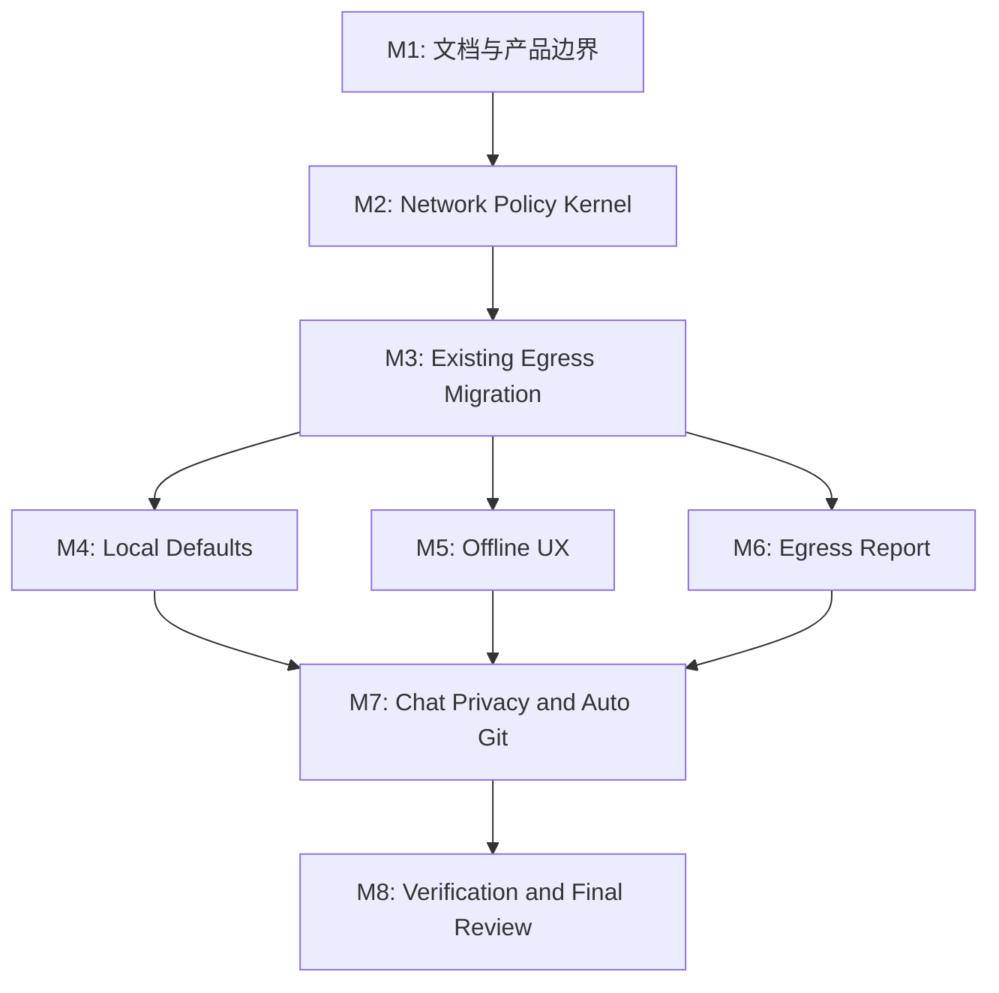

# 任务列表 — LLM Wiki v2 Local-First Compute Closure

**关联需求**: [`requirements.md`](./requirements.md)
**估算量级**: 超大 (审核轮数：10+)
**总体进度**: 🚧 4 / 28
**执行状态**: 先建档，Phase 3 暂缓；后续按批次推进

---

## 状态图例

| Emoji | 状态 | 含义 |
|-------|------|------|
| ⏳ | 待开始 | 还没开始 |
| 🚧 | 进行中 | 当前正在做 |
| ✅ | 已完成 | 自检通过、commit/push 完毕 |
| ⚠️ | 阻塞中 | 等待外部决策 / 修不动 |
| 🔍 | 待审核 | 自己做完了等用户 review |

## 执行纪律

- 每个行为变更必须先写 failing test，再实现，再跑 focused test。
- 所有出网路径必须通过带 metadata 的 policy-aware fetch wrapper；禁止新增裸 `fetch` / 裸 `getHttpFetch()`。
- 每个任务完成后更新本文件状态和备注块。
- 每个任务完成后单独 commit + push。
- local-first 边界不可破：不引入远程 memory server、多用户 sync、自动 Markdown 重写或 payload 级网络审计。
- `docs/` 被 gitignore；提交文档时必须 `git add -f docs/llm-wiki-v2-local-first-compute-closure/...`。

## 里程碑依赖图

---

## Milestone 1: 文档与产品边界

**目标**: 先把 comment 转成准确的产品/技术边界，避免后续实现跑偏。
**依赖**: 无
**状态**: 🚧

### Task 1.1 ✅ 固化 comment triage 文档

**描述**: 把 comment 里的 10 个缺口逐项归类为“直接采纳 / 修正后采纳 / Non-Goal”。

**依赖**: 无
**阻塞**: T1.2, T2.1

**关联文件 / 模块**:
- `docs/llm-wiki-v2-local-first-compute-closure/requirements.md`
- `docs/llm-wiki-v2-local-first-compute-closure/tasks.md`

**验收**:
- [x] 文档引用真实代码路径，不把 comment 原文当成事实。
- [x] 明确存储 local-first 已完成，计算/出网 local-first 未完成。
- [x] 明确 Phase 3 暂缓，不在本任务里改 runtime。

#### 备注

- 🐛 **遇到的问题**: comment 大方向成立，但个别点需要按代码修正：update-check 已有开关但默认启用；vision caption 已有独立 config 但默认复用 main LLM；embedding 默认 disabled，不会自动倒向云端。
- 🔧 **最终实现逻辑**: 新建 `requirements.md` 和 `tasks.md`，把 10 个缺口按直接采纳、修正后采纳、Non-Goal 分级，并把后续实现拆成 8 个里程碑 / 28 个任务。
- 🎯 **关键决策**: 先建档不改 runtime；后续优先 P0 network policy + fetch gate，再推进 local presets、offline UX、egress report、chat privacy 和 auto-git。

---

### Task 1.2 ⏳ README / README_CN 增加 Local vs Cloud 表格

**描述**: 在设计哲学附近补一张清晰表格，说明哪些能力纯本地、哪些可选本地、哪些云依赖。

**依赖**: T1.1
**阻塞**: T5.1

**关联文件 / 模块**:
- `README.md`
- `README_CN.md`

**验收**:
- [ ] 表格包含 LLM chat、embedding、vector store、web search、deep research、vision caption、update check、clip server、maintenance daemon。
- [ ] Web Search / Deep Research / Update Check 标为 cloud-dependent 或 policy-gated。
- [ ] README_CN 同步。

#### 备注

- 🐛 **遇到的问题**:
- 🔧 **最终实现逻辑**:
- 🎯 **关键决策**:

---

### Task 1.3 ⏳ 修正 Claude Code CLI 标签

**描述**: 将 “Claude Code CLI (local)” 改成更准确的 “Claude Code CLI (local process, remote model)”。

**依赖**: T1.1
**阻塞**: T5.2

**关联文件 / 模块**:
- `src/components/settings/llm-presets.ts`
- `src/i18n/en.json`
- `src/i18n/zh.json`
- `src/components/settings/preset-resolver.test.ts`

**验收**:
- [ ] UI 不再暗示 Claude CLI 是本机推理。
- [ ] hint 明确本地 `claude` 进程仍会请求 Anthropic/Claude Code backend。
- [ ] 相关 preset 测试通过。

#### 备注

- 🐛 **遇到的问题**:
- 🔧 **最终实现逻辑**:
- 🎯 **关键决策**:

---

### Task 1.4 ⏳ Sync 边界说明

**描述**: 明确 app 不内建 mesh sync，跨设备同步依赖用户自带 git/Syncthing/iCloud。

**依赖**: T1.1
**阻塞**: T7.4

**关联文件 / 模块**:
- `README.md`
- `README_CN.md`
- `.gitignore` 或新建 project template docs

**验收**:
- [ ] README 说明 `scope: private/shared` 不是内建 ACL。
- [ ] 给出 `wiki/private/` 默认 gitignore 建议。
- [ ] 不承诺 app 会自动同步或解决跨设备冲突。

#### 备注

- 🐛 **遇到的问题**:
- 🔧 **最终实现逻辑**:
- 🎯 **关键决策**:

---

## Milestone 2: Network Policy Kernel

**目标**: 建立 local-first compute 的硬执行边界。
**依赖**: M1
**状态**: 🚧

### Task 2.1 ✅ 新增 network policy 类型和持久化

**描述**: 增加 `NetworkPolicyConfig`、默认值、迁移和 project-store 持久化。

**依赖**: T1.1
**阻塞**: T2.2, T2.3, T3.x

**关联文件 / 模块**:
- `src/lib/network-policy.ts` (新建)
- `src/lib/network-policy.test.ts` (新建)
- `src/stores/wiki-store.ts`
- `src/lib/project-store.ts`
- `src/components/settings/settings-types.ts`

**验收**:
- [x] `mode` 支持 `local-only | allowlist | any`。
- [x] loopback 默认允许。
- [x] 旧配置迁移有测试。
- [x] 持久化读写有测试。

#### 备注

- 🐛 **遇到的问题**: `project-store` 直接依赖 Tauri plugin-store，单测需要轻量 mock；Settings UI 尚未实现，但 draft/save 类型必须先接上，否则后续 UI 无法保存。
- 🔧 **最终实现逻辑**: 新增 `NetworkPolicyConfig`、`DEFAULT_NETWORK_POLICY`、`normalizeNetworkPolicy`，接入 `wiki-store`、`settings-types` 和 `project-store` 的 `saveNetworkPolicyConfig` / `loadNetworkPolicyConfig`。
- 🎯 **关键决策**: 默认使用 `allowlist` 且 `allowLan=false`，保留现有用户迁移空间；真正可操作 UI 留给 Task 2.4。

---

### Task 2.2 ✅ URL 分类和 allowlist 判断

**描述**: 实现 URL parse、loopback/LAN/public host 分类、allowlist 匹配。

**依赖**: T2.1
**阻塞**: T2.3

**关联文件 / 模块**:
- `src/lib/network-policy.ts`
- `src/lib/network-policy.test.ts`

**验收**:
- [x] `http://localhost:11434` 和 `http://127.0.0.1:11434` 判为 loopback。
- [x] `[::1]` 判为 loopback。
- [x] `192.168.x.x` / `10.x.x.x` / `172.16-31.x.x` 判为 LAN。
- [x] `https://api.openai.com` 判为 public。
- [x] allowlist 支持 origin 级匹配。

#### 备注

- 🐛 **遇到的问题**: URL allowlist 需要同时支持 `https://api.example.com` 这种 origin，也支持 `localhost:11434` 这种用户常写的 host:port。
- 🔧 **最终实现逻辑**: 新增 `classifyNetworkUrl` 和 `evaluateNetworkPolicy`，支持 loopback、RFC1918 LAN、public、invalid 四类，并按 `local-only` / `allowlist` / `any` 输出可测试 decision reason。
- 🎯 **关键决策**: allowlist 模式默认仍允许 loopback；LAN 只有 `allowLan=true` 或显式 allowlist 时放行。

---

### Task 2.3 ✅ 新增 policy-aware HTTP wrapper

**描述**: 在 `tauri-fetch.ts` 上层增加必须传 metadata 的 `policyFetch`。

**依赖**: T2.1, T2.2
**阻塞**: M3, M6

**关联文件 / 模块**:
- `src/lib/tauri-fetch.ts`
- `src/lib/tauri-fetch.test.ts`
- `src/lib/network-policy.ts`
- `src/lib/egress-log.ts` (后续 T6.1 可先 stub)

**验收**:
- [x] 调用方必须传 `feature/provider/reason`。
- [x] local-only 阻止 public URL。
- [x] block 抛出 `NetworkPolicyBlockedError`。
- [ ] allow/block 都能调用 egress logger 的 safe stub。

#### 备注

- 🐛 **遇到的问题**: egress logger 属于 M6，当前还没有 `egress-log.ts`；本切片先建立 block/allow 执行点，避免为了 stub 提前引入半成品日志格式。
- 🔧 **最终实现逻辑**: 在 `tauri-fetch.ts` 新增 `policyFetch` 和 `NetworkPolicyBlockedError`，调用方必须传 `feature`、`provider`、`reason`、`policy`；测试用 injectable `fetchImpl` 验证 block 前不触发真实请求。
- 🎯 **关键决策**: 这次不迁移现有出网调用，避免一次性改动 LLM/embedding/web/update/vision；迁移放在 M3。

---

### Task 2.4 ✅ Settings → Network policy UI

**描述**: 在 Network 设置页暴露 policy mode、allowlist、LAN 选项。

**依赖**: T2.1
**阻塞**: T5.1

**关联文件 / 模块**:
- `src/components/settings/sections/network-section.tsx`
- `src/components/settings/settings-view.tsx`
- `src/i18n/en.json`
- `src/i18n/zh.json`
- `src/components/settings/sections/network-section.test.tsx`

**验收**:
- [x] 用户能切换 `local-only / allowlist / any`。
- [x] allowlist 可增删 host/origin。
- [x] UI 明确 `any` 会允许 cloud egress。
- [x] 保存后立刻影响 runtime，并且冷启动会 hydrate 已保存 policy。
- [x] UI 不夸大 M3 前的 enforcement 范围：明确现有集成仍在迁移中。

#### 备注

- 🐛 **遇到的问题**: Settings 保存路径已经接入 `networkPolicyConfig`，但 `App.tsx` 启动时没有加载 `loadNetworkPolicyConfig`；如果只做 UI，重启后用户选择会回到默认值。实现中还发现核心 allowlist matcher 对公网 `host:port`（例如 `api.example.com:8443`）匹配失败，因为旧逻辑会被 `new URL()` 误判为 scheme。
- 🔧 **最终实现逻辑**: `NetworkSection` 新增 outbound policy 面板，支持三种 mode、allowlist 增删、LAN toggle 和 `any` cloud egress warning；保留 proxy 面板但明确 proxy 重启生效且不会覆盖 policy。新增 `startup-settings.ts` 承载启动设置 hydrate，`App.tsx` 通过它加载 LLM/search/embedding/multimodal/proxy/network policy，并用测试锁住 active preset fallback 行为。`network-policy.ts` 导出共享 `normalizeNetworkAllowlistEntry`，UI 和 matcher 复用同一规范化规则。
- 🎯 **关键决策**: UI 文案明确“policy-aware requests”而非“全应用已强制拦截”，因为现有 LLM/embedding/web/update/vision 调用迁移到 `policyFetch` 属于 M3；Task 2.4 只保证保存后的 runtime store 和已接入 wrapper 的请求立即使用新 policy。

---

## Milestone 3: Existing Egress Migration

**目标**: 把所有现有出网点迁移到 policy gate。
**依赖**: M2
**状态**: ✅

### Task 3.1 ✅ 迁移 LLM provider 请求

**关联文件 / 模块**:
- `src/lib/llm-client.ts`
- `src/lib/llm-providers.ts`
- `src/lib/claude-cli-transport.ts`
- `src/lib/llm-client.test.ts`

**验收**:
- [x] OpenAI/Anthropic/Google/custom/Minimax/Ollama HTTP 请求都有 egress metadata。
- [x] Ollama local 在 local-only 下可用。
- [x] cloud provider 在 local-only 下被 block。
- [x] Claude CLI 记录为 subprocess/cloud-dependent，不伪装成本地 HTTP。

#### 备注

- 🐛 **遇到的问题**: `streamChat` 调用点很多，如果全链路显式传参会扩散到 chat、ingest、lint、review、deep research、vision caption 等模块；同时 `RequestOverrides` 会进入 provider body，新增控制字段必须避免被透传到模型 API。
- 🔧 **最终实现逻辑**: `streamChat` 内部统一从 `requestOverrides.networkPolicy` 或 `useWikiStore.getState().networkPolicyConfig` 取当前策略，并调用 `policyFetch`，metadata 使用 `feature=llm`、`provider=config.provider`、`reason=chat completion`。`RequestOverrides` 新增测试用 `fetchImpl` / `networkPolicy`，provider body 构造时通过 `stripWireAgnosticOverrides` 去除。
- 🎯 **关键决策**: 不逐个改所有 `streamChat` 调用点；先在统一 LLM transport 层读取当前 store policy，保证真实 LLM 出网立即受 gate 约束，同时保留显式注入能力用于测试和后续更严格的调用链治理。

---

### Task 3.2 ✅ 迁移 embedding 请求

**关联文件 / 模块**:
- `src/lib/embedding.ts`
- `src/lib/embedding.test.ts`
- `src/components/settings/sections/embedding-section.tsx`

**验收**:
- [x] embedding endpoint 走 policy gate。
- [x] local-only 下 public embedding endpoint 被 block，错误在 Settings 可见。
- [x] `getLastEmbeddingError()` 不泄漏 secret。

#### 备注

- 🐛 **遇到的问题**: embedding 测试原本 mock `getHttpFetch`，如果直接替换生产代码但不调整 mock，会测不到 policy gate；此外 embedding 错误需要进入 `lastEmbeddingError`，供 Settings 展示 fallback 原因。
- 🔧 **最终实现逻辑**: `fetchEmbedding`、`embedPage`、`embedAllPages`、`searchByEmbedding` 增加可选 `NetworkPolicyConfig`，默认从 `wiki-store` 读取；HTTP 请求改走 `policyFetch`，metadata 使用 `feature=embedding`、`provider=openai-compatible`、`reason=embedding request`。测试 mock 轻量实现 `policyFetch`，验证 public endpoint 在 local-only 下 block 前不会调用 fetch，loopback endpoint 可用。
- 🎯 **关键决策**: block 错误只写 hostname / endpoint policy 信息，不写 Authorization、payload 或 embedding input，保持 Settings 可见但不泄漏 secret。

---

### Task 3.3 ✅ 迁移 web-search 请求

**关联文件 / 模块**:
- `src/lib/web-search.ts`
- `src/lib/web-search.test.ts`
- `src/components/settings/sections/web-search-section.tsx`

**验收**:
- [x] Tavily/SerpApi 请求带 `feature=web-search`。
- [x] local-only 下 Tavily/SerpApi disabled 或 block。
- [x] 错误提示区分“未配置”和“被 local-only policy 阻止”。

#### 备注

- 🐛 **遇到的问题**: 默认 store policy 是 allowlist，旧测试不显式传 policy 时会被新 gate 正确阻断；因此测试里的“真实请求归一化”用 `any` policy，阻断测试用 `local-only` policy，避免把 policy 默认值和 parser 行为绑死。
- 🔧 **最终实现逻辑**: `webSearch` 增加可选 `NetworkPolicyConfig`，默认读取 `wiki-store`；Tavily 与 SerpApi 均改走 `policyFetch`，metadata 使用 `feature=web-search`、`provider=tavily|serpapi`、`reason=web search`。local-only public endpoint 在构造完 URL 后、发出 fetch 前被阻断。
- 🎯 **关键决策**: “未配置 provider/key”仍使用原有配置错误；policy block 单独抛出包含 provider 与 hostname 的用户可读错误，不包含 query、API key 或 response body。

---

### Task 3.4 ✅ 迁移 update-check 请求

**关联文件 / 模块**:
- `src/lib/update-check.ts`
- `src/App.tsx`
- `src/components/settings/sections/about-section.tsx`
- `src/lib/update-check.test.ts`

**验收**:
- [x] local-only 启动不请求 GitHub。
- [x] 手动 check 需要用户确认或显示 blocked reason。
- [x] update-check 状态持久化与 policy 一致。

#### 备注

- 🐛 **遇到的问题**: `fetchLatestRelease` 设计为“失败返回 null、不 throw”，如果只在内部吞掉 policy block，About 手动检查仍会显示泛化的 GitHub unreachable，无法区分策略阻断。
- 🔧 **最终实现逻辑**: `fetchLatestRelease` 改走 `policyFetch`，metadata 使用 `feature=update-check`、`provider=github`、`reason=release check`；`checkForUpdates` 在 fetch 前执行同一 policy preflight，local-only 下直接返回 `UpdateStatus.kind="error"` 与 blocked reason。About 时间戳行对 network-policy 错误显示具体 reason，对普通网络失败继续显示 muted unreachable。
- 🎯 **关键决策**: 不改变 update-check 持久化结构，只保存 enabled / lastCheckedAt / dismissedVersion；blocked 结果仍按一次检查尝试记录时间，避免启动循环里反复重试 GitHub。

---

### Task 3.5 ✅ 迁移 vision caption 请求

**关联文件 / 模块**:
- `src/lib/vision-caption.ts`
- `src/lib/image-caption-pipeline.ts`
- `src/lib/vision-caption.test.ts`
- `src/components/settings/sections/multimodal-section.tsx`

**验收**:
- [x] caption 请求带 `feature=vision-caption`。
- [x] local-only 下 cloud vision provider 被 block。
- [x] 失败仍保持 per-image fault tolerance，不中断 ingest 主流程。

#### 备注

- 🐛 **遇到的问题**: vision caption 复用 `streamChat`，如果只依赖 LLM 默认 metadata，未来 egress report 会把图片 caption 混成普通 chat；同时新增 metadata 不能泄漏进 OpenAI/Gemini/Anthropic 请求体。
- 🔧 **最终实现逻辑**: `RequestOverrides` 增加 `networkFeature/networkProvider/networkReason`，`streamChat` 将其传给 `policyFetch`，provider body 构造统一剥离这些 wire-agnostic 字段；`captionImage` 传入 `vision-caption / <llm provider> / image caption` metadata。既有 `captionImage` error rethrow 与 batch 调用方 try/catch 路径保持不变。
- 🎯 **关键决策**: 不为 vision caption 复制一套 policy gate；只在共享 LLM transport 上打标签，保证 cloud VLM 被 local-only 阻断，本地 VLM 仍按 loopback 策略放行。

---

## Milestone 4: Local Defaults

**目标**: 让“选本地”比“选云”更容易。
**依赖**: M3
**状态**: ⏳

### Task 4.1 ⏳ Embedding 本地 Ollama 预设

**关联文件 / 模块**:
- `src/components/settings/sections/embedding-section.tsx`
- `src/i18n/en.json`
- `src/i18n/zh.json`
- `src/components/settings/sections/embedding-section.test.tsx`

**验收**:
- [ ] 一键填入 `http://localhost:11434/v1/embeddings`。
- [ ] 一键填入 `nomic-embed-text`。
- [ ] 文案说明需先 `ollama pull nomic-embed-text`。

#### 备注

- 🐛 **遇到的问题**:
- 🔧 **最终实现逻辑**:
- 🎯 **关键决策**:

---

### Task 4.2 ⏳ SearXNG provider

**关联文件 / 模块**:
- `src/stores/wiki-store.ts`
- `src/lib/web-search.ts`
- `src/lib/web-search.test.ts`
- `src/components/settings/sections/web-search-section.tsx`

**验收**:
- [ ] `SearchProvider` 增加 `searxng`。
- [ ] 默认 endpoint 可填 `http://localhost:8080/search`。
- [ ] JSON results 归一化到 `WebSearchResult[]`。

#### 备注

- 🐛 **遇到的问题**:
- 🔧 **最终实现逻辑**:
- 🎯 **关键决策**:

---

### Task 4.3 ⏳ Local VLM preset

**关联文件 / 模块**:
- `src/components/settings/sections/multimodal-section.tsx`
- `src/stores/wiki-store.ts`
- `src/i18n/en.json`
- `src/i18n/zh.json`

**验收**:
- [ ] 提供 Ollama/LLaVA 或 Qwen2.5-VL 本地 preset。
- [ ] 文案明确 image bytes 会发给所选 provider。
- [ ] 默认不强制复用 main LLM。

#### 备注

- 🐛 **遇到的问题**:
- 🔧 **最终实现逻辑**:
- 🎯 **关键决策**:

---

## Milestone 5: Offline UX

**目标**: local-only 下不要运行时才失败，而是提前禁用或降级。
**依赖**: M3, M4
**状态**: ⏳

### Task 5.1 ⏳ Cloud-dependent disabled states

**关联文件 / 模块**:
- `src/components/settings/sections/web-search-section.tsx`
- `src/components/settings/sections/about-section.tsx`
- `src/components/settings/sections/embedding-section.tsx`
- `src/components/settings/sections/multimodal-section.tsx`
- `src/i18n/en.json`
- `src/i18n/zh.json`

**验收**:
- [ ] local-only 下 Tavily/SerpApi/update-check/cloud embedding/cloud vision 显示 disabled reason。
- [ ] allowlist 下未匹配 host 显示配置入口。
- [ ] any 下显示 cloud egress disclosure。

#### 备注

- 🐛 **遇到的问题**:
- 🔧 **最终实现逻辑**:
- 🎯 **关键决策**:

---

### Task 5.2 ⏳ Wiki-only Deep Dive

**关联文件 / 模块**:
- `src/lib/deep-research.ts`
- `src/lib/search.ts`
- `src/lib/search-bm25.ts`
- `src/components/graph` 或 Deep Research 入口组件
- `src/lib/deep-research.test.ts`

**验收**:
- [ ] local-only 下不调用 web search。
- [ ] 使用本地 wiki search/RRF 生成 context。
- [ ] 保存页面时标注 `origin: wiki-only-deep-dive`。
- [ ] 无本地 LLM provider 时显示 disabled state。

#### 备注

- 🐛 **遇到的问题**:
- 🔧 **最终实现逻辑**:
- 🎯 **关键决策**:

---

## Milestone 6: Egress Report

**目标**: local-first 可证明，用户能看出 app 连过哪里。
**依赖**: M2, M3
**状态**: ⏳

### Task 6.1 ⏳ Egress append-only log

**关联文件 / 模块**:
- `src/lib/egress-log.ts` (新建)
- `src/lib/egress-log.test.ts` (新建)
- `.llm-wiki/egress.jsonl`

**验收**:
- [ ] append-only JSONL。
- [ ] 记录 host/scheme/feature/provider/reason/decision/policyMode。
- [ ] 不记录 headers、payload、query secret。
- [ ] malformed line 读取时跳过。

#### 备注

- 🐛 **遇到的问题**:
- 🔧 **最终实现逻辑**:
- 🎯 **关键决策**:

---

### Task 6.2 ⏳ Egress report UI

**关联文件 / 模块**:
- `src/components/settings/sections/egress-report-panel.tsx` (新建)
- `src/components/settings/sections/network-section.tsx`
- `src/i18n/en.json`
- `src/i18n/zh.json`

**验收**:
- [ ] 展示过去 7 天 host/provider/reason 聚合。
- [ ] 区分 allowed 和 blocked。
- [ ] 支持清理 derived egress log。
- [ ] 不显示敏感 path/query。

#### 备注

- 🐛 **遇到的问题**:
- 🔧 **最终实现逻辑**:
- 🎯 **关键决策**:

---

### Task 6.3 ⏳ Egress export

**关联文件 / 模块**:
- `src/lib/egress-export.ts` (新建)
- `src/lib/egress-export.test.ts` (新建)
- `src/components/settings/sections/egress-report-panel.tsx`

**验收**:
- [ ] 支持 JSONL export。
- [ ] 支持 CSV export。
- [ ] 导出继续 redaction，不输出 secret。

#### 备注

- 🐛 **遇到的问题**:
- 🔧 **最终实现逻辑**:
- 🎯 **关键决策**:

---

## Milestone 7: Chat Privacy and Auto Git

**目标**: 补齐本地敏感状态和可回滚 bulk operation。
**依赖**: M4, M5, M6
**状态**: ⏳

### Task 7.1 ⏳ Chat history privacy policy

**关联文件 / 模块**:
- `src/lib/persist.ts`
- `src/lib/persist.integration.test.ts`
- `src/lib/audit-redaction.ts`
- `src/components/settings/sections/interface-section.tsx` 或新 privacy section
- `src/i18n/en.json`
- `src/i18n/zh.json`

**验收**:
- [ ] 用户能关闭 chat history 持久化。
- [ ] 用户能开启 persisted chat redaction。
- [ ] `<private>` blocks 和常见 secret 不落盘。
- [ ] Memory Ops 读取 chat history 时尊重设置。

#### 备注

- 🐛 **遇到的问题**:
- 🔧 **最终实现逻辑**:
- 🎯 **关键决策**:

---

### Task 7.2 ⏳ Git repo detection and manual snapshot

**关联文件 / 模块**:
- `src-tauri/src/commands/git.rs` (新建或扩展 commands)
- `src/components/settings/sections/git-snapshot-panel.tsx` (新建)
- `src/lib/git-snapshot.ts` (新建)

**验收**:
- [ ] 检测 project 是否 git repo。
- [ ] 未初始化时提示 `git init`。
- [ ] 手动 snapshot 运行 `git status` / `git add` / `git commit`。
- [ ] commit hash 写入 activity/audit。

#### 备注

- 🐛 **遇到的问题**:
- 🔧 **最终实现逻辑**:
- 🎯 **关键决策**:

---

### Task 7.3 ⏳ Optional auto-git after ingest / memory-op

**关联文件 / 模块**:
- `src/lib/ingest.ts`
- `src/lib/memory-ops-executor.ts`
- `src/lib/wiki-automation-events.ts`
- `src/lib/audit-timeline.ts`

**验收**:
- [ ] auto-git 默认关闭。
- [ ] ingest 成功后可自动 commit。
- [ ] memory_ops.apply 后可自动 commit。
- [ ] commit 失败不影响主流程，只写 warning/activity。
- [ ] private path 默认不 commit。

#### 备注

- 🐛 **遇到的问题**:
- 🔧 **最终实现逻辑**:
- 🎯 **关键决策**:

---

### Task 7.4 ⏳ Private/shared file strategy

**关联文件 / 模块**:
- `src/lib/templates.ts`
- project scaffold / README docs
- `.gitignore` 生成逻辑（如存在）

**验收**:
- [ ] 新 project 可生成 `wiki/private/` ignore 建议。
- [ ] docs 解释 `scope: private/shared` 与 Git 同步的关系。
- [ ] 不把 scope 字段误描述成 app ACL。

#### 备注

- 🐛 **遇到的问题**:
- 🔧 **最终实现逻辑**:
- 🎯 **关键决策**:

---

## Milestone 8: Verification and Final Review

**目标**: 超大任务完成后做 10+ 轮最终审核。
**依赖**: M1-M7
**状态**: ⏳

### Task 8.1 ⏳ 全量静态检查和 mock tests

**验收**:
- [ ] `npm run typecheck` 通过。
- [ ] `npm run test:mocks` 通过。
- [ ] Rust tests 通过，至少覆盖新增 git/network 命令。
- [ ] real LLM tests 如跳过，说明原因。

#### 备注

- 🐛 **遇到的问题**:
- 🔧 **最终实现逻辑**:
- 🎯 **关键决策**:

---

### Task 8.2 ⏳ 10+ 轮最终审核

**报告路径**:
- `docs/llm-wiki-v2-local-first-compute-closure/review-round-1.md`
- `docs/llm-wiki-v2-local-first-compute-closure/review-round-2.md`
- `docs/llm-wiki-v2-local-first-compute-closure/review-round-3.md`
- `docs/llm-wiki-v2-local-first-compute-closure/review-round-4.md`
- `docs/llm-wiki-v2-local-first-compute-closure/review-round-5.md`
- `docs/llm-wiki-v2-local-first-compute-closure/review-round-6.md`
- `docs/llm-wiki-v2-local-first-compute-closure/review-round-7.md`
- `docs/llm-wiki-v2-local-first-compute-closure/review-round-8.md`
- `docs/llm-wiki-v2-local-first-compute-closure/review-round-9.md`
- `docs/llm-wiki-v2-local-first-compute-closure/review-round-10.md`

**验收**:
- [ ] Round 1 功能完整性。
- [ ] Round 2 类型安全。
- [ ] Round 3 network policy bypass audit。
- [ ] Round 4 privacy/redaction。
- [ ] Round 5 offline UX。
- [ ] Round 6 egress report correctness。
- [ ] Round 7 git snapshot safety。
- [ ] Round 8 performance。
- [ ] Round 9 i18n/a11y。
- [ ] Round 10 docs/code alignment。

#### 备注

- 🐛 **遇到的问题**:
- 🔧 **最终实现逻辑**:
- 🎯 **关键决策**:

---

## 进度总览

| 里程碑 | 任务 | 完成 | 总数 | 状态 |
|--------|------|------|------|------|
| M1 | 文档与产品边界 | 1 | 4 | 🚧 |
| M2 | Network Policy Kernel | 3 | 4 | 🚧 |
| M3 | Existing Egress Migration | 5 | 5 | ✅ |
| M4 | Local Defaults | 0 | 3 | ⏳ |
| M5 | Offline UX | 0 | 2 | ⏳ |
| M6 | Egress Report | 0 | 3 | ⏳ |
| M7 | Chat Privacy and Auto Git | 0 | 4 | ⏳ |
| M8 | Verification and Final Review | 0 | 2 | ⏳ |
| **总计** | | **9** | **28** | **🚧** |

## 变更记录

| 日期 | 变更 |
|------|------|
| 2026-05-10 | 初稿，按 comment 建立 local-first compute / egress closure 路线图，Phase 3 暂缓 |
| 2026-05-10 | 完成 Task 1.1 comment triage 建档：直接采纳 / 修正后采纳 / Non-Goal 分级 |
| 2026-05-10 | 完成 M2 内核切片：network policy 类型/持久化、URL 分类、policy-aware fetch wrapper；Settings UI 与现有出网迁移后续执行 |
| 2026-05-11 | 完成 M3 既有出网迁移：LLM、embedding、web-search、update-check、vision-caption 均接入 `policyFetch` 或共享 transport metadata |
