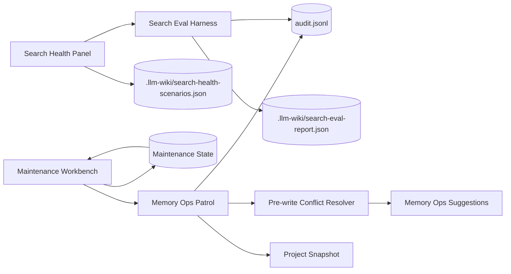
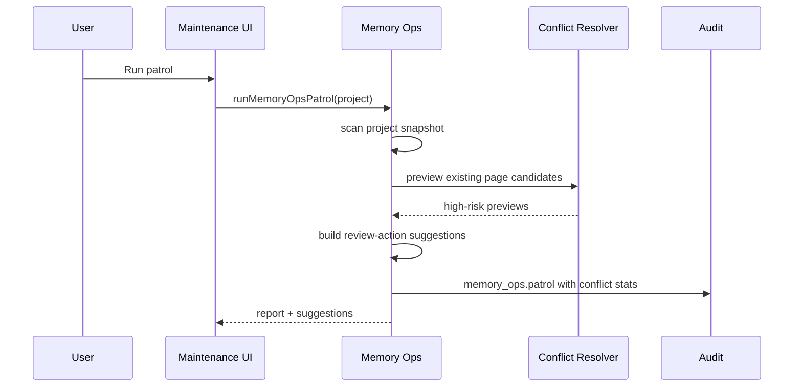
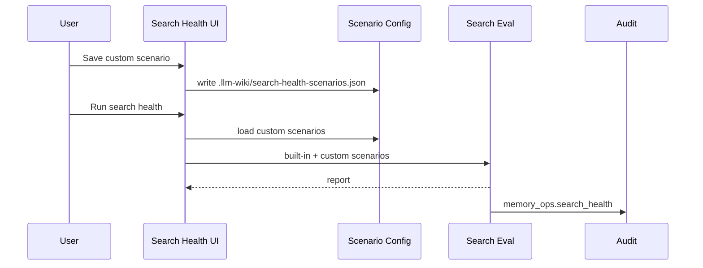

# 需求文档 — LLM Wiki v2 Maintenance Closure

**版本**: v0.1
**日期**: 2026-05-08
**作者**: 用户 + AI
**状态**: 评审中
**关联任务列表**: [`tasks.md`](./tasks.md)

---

## 1. 背景

LLM Wiki v2 已经完成 Markdown source of truth、page lifecycle、typed graph、hybrid search、audit timeline、Schema & Quality、Memory Ops、claim-level credibility 和 pre-write conflict gate。当前剩下的最高优先级缺口不是继续堆新概念，而是把维护闭环补完整：历史遗留知识需要能被巡检发现，检索健康度需要用户能保护自己的关键 query，维护提醒需要能在合适时间把用户拉回到手动 patrol。

参考 Rohit LLM Wiki v2 gist 的方向，本期仍保持当前项目的产品边界：本地优先、可审计、人工确认、无后台 daemon、无自动事实裁决。也就是说，系统可以发现重复页、疑似冲突、过期巡检和检索回归，但不会自动合并页面、自动判定事实真假或在后台扫描大型项目。

本期目标是把三个闭环缺口落在既有 Maintenance Workbench 中：Memory Ops 复用 pre-write conflict resolver 做历史冲突/重复页巡检；Search Health 支持项目级自定义 scenario；patrol reminder 在项目打开、事件阈值和 cooldown 到达时给出清晰提示和一键运行入口。

参考资料：
- Rohit gist: https://gist.github.com/rohitg00/2067ab416f7bbe447c1977edaaa681e2
- Spec A: [`../llm-wiki-v2-fact-credibility/completion-audit.md`](../llm-wiki-v2-fact-credibility/completion-audit.md)
- Spec B: [`../llm-wiki-v2-pre-write-conflict/completion-audit.md`](../llm-wiki-v2-pre-write-conflict/completion-audit.md)

---

## 2. 目标

### 2.1 范围内 (in scope)

- ✅ Memory Ops patrol 复用 pre-write conflict resolver，发现历史遗留 duplicate、possible-contradiction、supersession、uncertain 风险。
- ✅ 历史冲突巡检只生成 review-action suggestion，不自动写 Markdown、不自动合并、不自动裁决事实真假。
- ✅ Search Health 支持项目级自定义 scenarios，能保存、加载、校验、运行并写入 audit/report。
- ✅ Search Health 运行时合并 built-in scenarios 和 custom scenarios，并展示 skipped / invalid custom scenario。
- ✅ Patrol reminder 在项目打开或进入 Maintenance 时清晰显示 needs patrol / reminder due / cooldown 状态，并提供一键 patrol。
- ✅ 所有新增维护事件、搜索健康运行、巡检结果都保留 audit trail。
- ✅ 补齐 focused tests、typecheck、`npm run test:mocks` 和中量级 5 轮最终审核报告。

### 2.2 范围外 (out of scope)

- ❌ 不做后台 daemon、cron、常驻 worker 或自动定时扫描。
- ❌ 不做自动事实裁决、自动合并重复页、自动删除或自动改写冲突正文。
- ❌ 不引入云同步、多人协作、团队 ACL、外部 memory server 或新数据库。
- ❌ 不改变 search ranking 算法；Search Health 只负责评估和报告。
- ❌ 不做完整测试平台或复杂 wizard；自定义 scenario UI 保持 Maintenance 内的紧凑编辑体验。
- ❌ 不做 slide deck / CSV / JSON export 工作流，本期只维护现有 report artifact。

### 2.3 成功标准

- Memory Ops patrol 能发现至少一类历史 duplicate / contradiction / supersession 风险，并以 review-action suggestion 呈现。
- Same-target page update 不会被误报为历史冲突。
- 用户能在 Search Health 面板新增/编辑/删除自定义 scenario，保存后再次打开仍可加载。
- Search Health report 和 audit 能区分 built-in / custom / skipped / invalid scenario 数量。
- 项目有维护事件积累时，Maintenance 中能清楚提示 patrol due；运行 patrol 后状态复位。
- `npm run typecheck`、相关 Vitest、`npm run test:mocks` 通过。
- 5 轮最终审核报告和 completion audit 落盘。

---

## 3. 用户场景 / 用户故事

### 3.1 场景 1: 发现历史遗留重复页或冲突页

**角色**: 知识库维护者

**前置条件**: 项目中已经存在多个主题相近页面，或 claim/page metadata 中有 contradiction / supersession 线索。

**步骤**:
1. 用户进入 Settings -> Maintenance。
2. 用户运行 Memory Ops patrol。
3. 系统读取当前 wiki pages、claim index、audit、review state 和 typed graph。
4. 系统为已有页面构建 maintenance candidate，并复用 pre-write conflict resolver 做 bounded preview。
5. 系统将高风险 preview 转为 review-action suggestion。

**预期结果**: 用户看到“Review historical duplicate/conflict”类建议，能打开目标页、查看原因和证据摘要，并决定 ignore 或后续人工处理。

**异常分支**:
- 如果 claim index 不可读，巡检继续使用页面证据并记录 warning。
- 如果 resolver 返回 same-target update，Memory Ops 不生成冲突 suggestion。

### 3.2 场景 2: 用户保护自己的关键检索 query

**角色**: 重度使用 Search 的用户

**前置条件**: 用户知道某个业务 query 应该命中指定 wiki 页面。

**步骤**:
1. 用户打开 Search Health 面板。
2. 用户新增自定义 scenario：query、expected path、topK。
3. 用户保存 scenario。
4. 用户运行 Search Health。
5. 系统合并 built-in 和 custom scenarios，写入 report 和 audit。

**预期结果**: Search Health 显示自定义 scenario 的通过/失败情况；报告中包含该 scenario，未来调检索权重时能复跑。

**异常分支**:
- 如果自定义 scenario 配置不完整或路径非法，该条 scenario 被 skipped，内置场景仍可运行。
- 如果 report 写入失败，UI 仍显示本次运行结果并记录 writeError。

### 3.3 场景 3: 项目活动积累后提示用户巡检

**角色**: 经常 query/search/review/ingest 的用户

**前置条件**: 项目上次 patrol 后已有多次维护相关事件。

**步骤**:
1. 用户打开项目或进入 Maintenance。
2. 系统读取本地 maintenance state。
3. 如果事件数达到阈值且 cooldown 已到，系统显示 reminder due。
4. 用户点击 Run Memory Ops patrol。
5. patrol 完成后，事件计数归零，last patrol 更新时间更新。

**预期结果**: 用户不会被后台扫描打断，但能清楚知道该运行维护；运行后提示复位。

---

## 4. 功能需求

### F1: Memory Ops maintenance candidate

**描述**: 将已有 wiki page 转换为 pre-write conflict 可复用的 maintenance candidate。

**输入**: `MemoryOpsWikiPage`、project path、可选 claim summaries。

**行为**:
- 新增或复用明确的 candidate kind，例如 `maintenance-page`。
- target path 使用项目相对 `wiki/**/*.md`。
- title 从 frontmatter title、一级标题或文件名推断。
- content summary 继续走 `summarizePreWriteContent` 脱敏和限长。

**输出**: `PreWriteCandidate`。

**验收标准**:
- [ ] page content 不以 raw body 形式进入 suggestion/audit。
- [ ] candidate id 对同一 page 稳定。
- [ ] 类型不引入 `any`。

### F2: Memory Ops historical conflict patrol

**描述**: 在 Memory Ops patrol 中复用 pre-write resolver 和 classifier 检查历史遗留风险。

**输入**: `MemoryOpsProjectSnapshot`。

**行为**:
- 对 bounded pages 构建 candidate。
- 使用 `createPreWriteEvidenceResolverCache` 避免重复读取 claim index 和 page summaries。
- 只保留 `duplicate`、`possible-contradiction`、`supersession`、`uncertain`。
- 过滤 `update`、`new`、`reinforcement` 和 same-target-only evidence。

**输出**: historical conflict previews。

**验收标准**:
- [ ] 同路径已有页不触发 duplicate suggestion。
- [ ] 不同路径同标题或冲突 claim 会触发 review candidate。
- [ ] resolver 异常不会阻断整个 patrol。

### F3: Historical conflict suggestions

**描述**: 将 high-risk pre-write preview 转换为 Memory Ops review-action suggestion。

**输入**: `PreWriteConflictPreview`。

**行为**:
- suggestion kind 为 `review-action`。
- severity: possible-contradiction / supersession / uncertain 为 warning；duplicate 可为 warning。
- title、detail、reasons 包含 classification、decision、target path、evidence summary。
- 不生成 `proposedOperation`，避免 batch apply 直接改文件。

**输出**: `MemoryOpsSuggestion[]`。

**验收标准**:
- [ ] suggestion 可被 ignore / open，但不可 batch apply。
- [ ] reasons 足够解释为什么需要人工 review。
- [ ] private claim/page content 不进入 detail。

### F4: Patrol stats and audit

**描述**: Memory Ops patrol report 和 audit 体现历史冲突巡检结果。

**输入**: patrol report。

**行为**:
- stats 增加 conflict candidate / conflict suggestion 计数。
- audit `memory_ops.patrol` after.stats 包含新增计数。
- UI summary 显示冲突建议数量。

**输出**: 更新后的 patrol report / audit。

**验收标准**:
- [ ] audit 不记录完整页面正文或完整 claim text。
- [ ] 搜索 audit timeline 时能看到巡检建议数量。

### F5: Custom Search Health scenario model

**描述**: 定义可持久化的项目级 Search Health scenario 配置。

**输入**: `.llm-wiki/search-health-scenarios.json`。

**行为**:
- 支持 `id`、`query`、`expectedTopPaths`、`expectedInTopK`、`expectedOutsideTopK`、`excludedPaths`、`topK`。
- normalize path 和 topK。
- 跳过缺 query、缺 expectation、重复 id、非法 topK 的 scenario，并返回 warning。

**输出**: normalized custom scenarios + warnings。

**验收标准**:
- [ ] 坏配置不阻断 Search Health built-in scenarios。
- [ ] 保存格式稳定、可读、可 git diff。
- [ ] 不新增依赖。

### F6: Custom Search Health storage

**描述**: 提供 load/save helpers。

**输入**: project path、scenario config。

**行为**:
- 默认路径为 `.llm-wiki/search-health-scenarios.json`。
- 保存前创建 `.llm-wiki`。
- 写入 pretty JSON。
- 保存成功/失败返回明确结果。

**输出**: load/save result。

**验收标准**:
- [ ] 文件不存在时返回空 scenarios。
- [ ] JSON parse error 返回 warning，不抛到 UI。
- [ ] save 写 audit 或由调用方写 audit。

### F7: Search Health combined run

**描述**: Search Health 运行时合并 built-in 和 custom scenarios。

**输入**: built-in scenarios、custom scenarios、skipped warnings。

**行为**:
- built-in 和 custom id 去重。
- report/audit 记录 builtInScenarioCount、customScenarioCount、skippedScenarioCount。
- custom scenario 失败与 built-in 失败同样展示。

**输出**: `SearchHealthRunResult`。

**验收标准**:
- [ ] 只有 custom scenarios 时也可运行。
- [ ] custom scenario failure 出现在 failedScenarios。
- [ ] skipped custom scenario 出现在 UI skipped list。

### F8: Search Health custom scenario UI

**描述**: 在现有 Search Health panel 增加紧凑自定义 scenario 编辑区。

**输入**: custom scenarios state。

**行为**:
- 用户可新增、编辑、删除 scenario。
- 每条 scenario 至少支持 id、query、expected path、expectation type、topK。
- 保存按钮写入项目配置。
- 禁用状态和错误状态清晰。

**输出**: 更新后的 scenario config。

**验收标准**:
- [ ] 键盘可操作。
- [ ] 文案补齐 en/zh i18n。
- [ ] 长路径/长 query 不撑破布局。

### F9: Patrol reminder status model

**描述**: 扩展维护状态摘要，让 UI 能区分 clean、dirty、reminder due。

**输入**: `PersistedMemoryOpsMaintenanceState`。

**行为**:
- 继续使用 event threshold 和 reminder cooldown。
- 暴露 `needsPatrol`、`reminderDue`、`eventCountSincePatrol`、`lastPatrolAt`、`lastReminderAt`。
- 不触发自动 patrol。

**输出**: `MemoryOpsMaintenanceStatus`。

**验收标准**:
- [ ] reducer 单元测试覆盖 threshold 和 cooldown。
- [ ] project open / Maintenance render 只读取状态，不扫描 wiki。

### F10: Patrol reminder UI

**描述**: 在 Maintenance Patrol block 中更清楚地展示 reminder due。

**输入**: `MemoryOpsMaintenanceStatus`。

**行为**:
- clean 显示 last patrol。
- dirty 未到 cooldown 显示待巡检事件数。
- reminder due 显示更醒目的提示和 Run patrol 入口。
- patrol 完成后状态刷新。

**输出**: UI 状态。

**验收标准**:
- [ ] 用户能理解为什么建议运行 patrol。
- [ ] reminder due 不依赖颜色传达。
- [ ] i18n 覆盖 en/zh。

### F11: Documentation and completion audit

**描述**: 更新 README、README_CN、plans 和本 spec completion audit。

**输入**: 实现结果。

**行为**:
- 写明历史冲突巡检、custom Search Health、lightweight reminder 已落地。
- 写明仍然没有 daemon、自动裁决或自动合并。
- completion audit 对照 F1-F10。

**输出**: 文档更新。

**验收标准**:
- [ ] README 不夸大成多人协作或后台系统。
- [ ] 后续项清晰。

---

## 5. 非功能需求

### 5.1 性能

- Memory Ops historical conflict patrol 默认只扫描 bounded pages / claims / evidence，不做全库远程调用。
- 单次 patrol 复用 resolver cache，避免每页重复读取 claim index 和 page summaries。
- Search Health custom scenarios 默认不限制太小，但 UI 至少提示场景数量；实现中应保留可测试上限或 normalize。

### 5.2 安全

- audit、suggestion、report 不写完整 Markdown 正文、不写完整 private claim text。
- 所有自定义 scenario path 必须 normalize，不允许项目外路径。
- 配置解析失败时降级为 skipped/warning，不把异常堆栈写入用户可见 artifact。

### 5.3 可访问性

- 新增 UI 控件必须有文本 label，不只靠 icon 或颜色。
- reminder due 必须用文本说明，不只靠黄色/红色。
- 自定义 scenario editor 中按钮、输入、删除操作应键盘可达。

### 5.4 国际化

- 新增 Search Health、Memory Ops 文案补齐 `src/i18n/en.json` 和 `src/i18n/zh.json`。
- 测试覆盖或复用既有 i18n parity 检查。

### 5.5 可观测性

- Memory Ops patrol audit 包含新增 conflict stats。
- Search Health save/run audit 包含 built-in/custom/skipped counts。
- Maintenance reminder 继续通过 activity item 和 persisted maintenance state 表达，不新增后台日志通道。

---

## 6. 技术栈与依赖

### 6.1 选型

| 维度 | 选型 | 版本 | 理由 |
|------|------|------|------|
| 语言 | TypeScript | 继承项目配置 | 与现有 lib/UI 一致 |
| 测试 | Vitest | 继承锁文件 | 现有 deterministic test harness |
| 存储 | Markdown + `.llm-wiki/*.json/jsonl` | 现有格式 | 保持本地、可审计、Git-friendly |
| UI | React + existing Maintenance components | 继承项目配置 | 复用 Maintenance Workbench |
| Audit | `.llm-wiki/audit.jsonl` | 现有模块 | 统一治理轨迹 |

### 6.2 新增依赖

| 包名 | 版本 | 用途 |
|------|------|------|
| 无 | 无 | 本期只使用现有依赖 |

### 6.3 环境变量

| 名称 | 必需? | 用途 | 示例 |
|------|-------|------|------|
| 无 | 否 | 本期不新增环境变量 | - |

---

## 7. 架构概览

### 7.1 整体架构图



### 7.2 数据模型

| 类型 | 字段 | 说明 |
|------|------|------|
| `MemoryOpsHistoricalConflictSummary` | `candidateCount, suggestionCount, classifications` | patrol 的历史冲突摘要 |
| `SearchHealthScenarioConfig` | `id, query, expectations, topK` | 用户自定义检索健康场景 |
| `SearchHealthScenarioLoadResult` | `scenarios, skipped, warnings` | 自定义 scenario 加载结果 |
| `MemoryOpsMaintenanceStatus` | `needsPatrol, reminderDue, eventCountSincePatrol, lastPatrolAt, lastReminderAt` | 维护提醒状态 |

### 7.3 关键流程





### 7.4 模块划分

```
src/lib/
├── memory-ops-conflicts.ts        ← existing pages -> pre-write conflict suggestions
├── memory-ops.ts                  ← patrol integration, stats, reminder status
├── memory-ops-rules.ts            ← suggestion model reuse
├── search-health-scenarios.ts     ← custom scenario load/save/normalize
├── search-health.ts               ← combined run, report/audit metadata
└── prewrite-conflict*.ts          ← reused resolver/classifier

src/components/settings/sections/
├── memory-ops-patrol-block.tsx    ← reminder + conflict stats UI
├── search-health-panel.tsx        ← custom scenario editor
└── maintenance-section.tsx        ← orchestration/load/save/run
```

---

## 8. 开放风险

| 风险 | 概率 | 影响 | 缓解方案 |
|------|------|------|----------|
| 历史冲突巡检误报过多 | 中 | 中 | 只输出高风险 classification；same-target update 不报；suggestion 可 ignore |
| Patrol 性能变差 | 中 | 中 | bounded scan + resolver cache + focused performance review |
| Custom scenario UI 过复杂 | 中 | 中 | 第一版只做 compact editor，不做完整测试平台 |
| 自定义配置损坏 | 中 | 低 | normalize + skipped warnings，built-in scenario 继续运行 |
| Reminder 被理解成后台自动化 | 低 | 中 | UI/README 明确无 daemon、用户手动运行 patrol |

---

## 9. 开放问题 / 待用户拍板

- [x] 采用中量级落地，5 轮最终审核。
- [x] 三个缺口合并为一个 Maintenance Closure spec。
- [x] 仍保持手动 patrol / review-only / audit-first 边界。

---

## 10. 参考资料

- Rohit gist: https://gist.github.com/rohitg00/2067ab416f7bbe447c1977edaaa681e2
- `src/lib/memory-ops.ts`
- `src/lib/prewrite-conflict-resolver.ts`
- `src/lib/search-health.ts`
- `src/components/settings/sections/maintenance-section.tsx`

---

## 变更历史

| 日期 | 版本 | 变更 |
|------|------|------|
| 2026-05-08 | v0.1 | 初稿，覆盖历史冲突巡检、自定义 Search Health scenario、轻量 patrol reminder |
