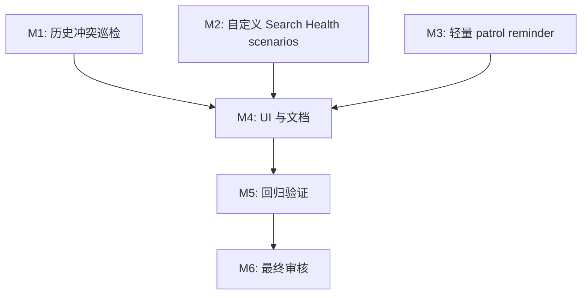

# 任务列表 — LLM Wiki v2 Maintenance Closure

**关联需求**: [`requirements.md`](./requirements.md)
**估算量级**: 中 (审核轮数：5)
**总体进度**: ✅ 19 / 19

---

## 状态图例

| Emoji | 状态 | 含义 |
|-------|------|------|
| ⏳ | 待开始 | 还没开始 |
| 🚧 | 进行中 | 当前正在做 |
| ✅ | 已完成 | 自检通过、commit/push 完毕 |
| ⚠️ | 阻塞中 | 等待外部决策 / 修不动 |
| 🔍 | 待审核 | 自己做完了等用户 review |

---

## 里程碑依赖图

---

## Milestone 1: 历史冲突巡检

**目标**: 让 Memory Ops 复用 pre-write conflict resolver，发现历史遗留 duplicate / contradiction / supersession 风险。
**依赖**: Spec A/B 已完成
**状态**: ✅

### Task 1.1 ✅ 建立 maintenance candidate builder

**描述**: 将已有 wiki page 转成 `PreWriteCandidate`，支持历史巡检场景。

**依赖**: 无
**阻塞**: T1.2

**预估**: 2h

**关联文件 / 模块**:
- `src/lib/prewrite-conflict.ts`
- `src/lib/memory-ops-conflicts.ts` (新建)
- `src/lib/memory-ops-conflicts.test.ts` (新建)

**验收**:
- [x] 支持 `maintenance-page` 或等价明确 kind。
- [x] candidate id 对同一 page 稳定。
- [x] content summary 脱敏并限长。

#### 备注

- 🐛 **遇到的问题**: TDD 首轮按预期失败在 `./memory-ops-conflicts` 模块不存在。
- 🔧 **最终实现逻辑**: `PreWriteCandidateKind` 增加 `maintenance-page`；新增 `buildMemoryOpsConflictCandidate`，把 `MemoryOpsWikiPage` 转成稳定 target/title/content summary candidate。
- 🎯 **关键决策**: 历史巡检复用 pre-write candidate 模型，而不是新建一套 Memory Ops 专用冲突类型，后续 resolver/classifier 可以直接复用。

---

### Task 1.2 ✅ 实现 historical conflict preview

**描述**: 对 snapshot pages 调用 pre-write resolver/classifier，过滤安全分类和 same-target-only evidence。

**依赖**: T1.1
**阻塞**: T1.3

**预估**: 3h

**关联文件 / 模块**:
- `src/lib/memory-ops-conflicts.ts`
- `src/lib/prewrite-conflict-resolver.ts`

**验收**:
- [x] duplicate / possible-contradiction / supersession / uncertain 被保留。
- [x] new / reinforcement / update 不生成历史冲突 preview。
- [x] resolver 异常不阻断整个 patrol。

#### 备注

- 🐛 **遇到的问题**: RED 测试先失败在 `previewMemoryOpsHistoricalConflicts` 未导出，符合预期。
- 🔧 **最终实现逻辑**: `previewMemoryOpsHistoricalConflicts` 逐页构建 maintenance candidate，默认复用 `previewPreWriteConflict` 和单次 resolver cache；只保留 review-only 的 duplicate/possible-contradiction/supersession/uncertain，逐页异常转 warning。
- 🎯 **关键决策**: same-target-only evidence 不算历史冲突，避免已有页面被自身证据误报为需要人工处理。

---

### Task 1.3 ✅ 转换为 Memory Ops review-action suggestion

**描述**: 将 high-risk historical conflict preview 转为 `MemoryOpsSuggestion`。

**依赖**: T1.2
**阻塞**: T1.4, T4.1

**预估**: 2h

**关联文件 / 模块**:
- `src/lib/memory-ops-conflicts.ts`
- `src/lib/memory-ops-rules.ts`

**验收**:
- [x] suggestion kind 为 `review-action`。
- [x] 不带 `proposedOperation`，不能 batch apply。
- [x] reasons 包含 classification、target path 和 evidence summary。

#### 备注

- 🐛 **遇到的问题**: RED 测试先失败在 `preWritePreviewToMemoryOpsSuggestion` 未导出，符合预期。
- 🔧 **最终实现逻辑**: 新增纯函数 converter，把 high-risk preview 转成 `review-action` suggestion，detail/reasons 只包含 classification、decision、target 和 evidence summary，不复制完整 claim/page text。
- 🎯 **关键决策**: 不设置 `proposedOperation`，让历史冲突建议只能 open/ignore/review，不能进入 batch apply 改写 Markdown。

---

### Task 1.4 ✅ 接入 Memory Ops patrol stats / audit

**描述**: `runMemoryOpsPatrol` 合并历史冲突 suggestions，并在 stats/audit 中记录数量。

**依赖**: T1.3
**阻塞**: T4.1, T5.1

**预估**: 2h

**关联文件 / 模块**:
- `src/lib/memory-ops.ts`
- `src/lib/memory-ops.test.ts`

**验收**:
- [x] report stats 包含 conflict candidate / suggestion count。
- [x] audit `memory_ops.patrol` after.stats 包含新增计数。
- [x] 现有 lifecycle / claim / relation suggestions 行为不回归。

#### 备注

- 🐛 **遇到的问题**: 接入后 typecheck 暴露旧测试 fixture 缺少新增 stats 字段，以及 `.at(-1)` 不符合当前 TS lib；已同步 fixture 并改为索引取最后一次 mock call。
- 🔧 **最终实现逻辑**: `runMemoryOpsPatrol` 调用 `previewMemoryOpsHistoricalConflicts`，合并 review-action suggestions，并把 historical conflict candidate/suggestion/warning count 写入 report stats 和 `memory_ops.patrol` audit。
- 🎯 **关键决策**: 历史冲突检查在显式 patrol 中运行，不进入 project open 或普通 search/query 高频路径。

---

## Milestone 2: 自定义 Search Health scenarios

**目标**: 让用户能保存并运行自己的检索健康场景。
**依赖**: 无
**状态**: ✅

### Task 2.1 ✅ 定义 custom scenario schema / normalize

**描述**: 新建 custom scenario 模型和 normalize/load result。

**依赖**: 无
**阻塞**: T2.2, T2.3

**预估**: 2h

**关联文件 / 模块**:
- `src/lib/search-health-scenarios.ts` (新建)
- `src/lib/search-health-scenarios.test.ts` (新建)

**验收**:
- [x] 支持 `id/query/expectedTopPaths/expectedInTopK/expectedOutsideTopK/excludedPaths/topK`。
- [x] 坏 scenario 返回 skipped/warning，不抛出。
- [x] 重复 id 有确定性处理。

#### 备注

- 🐛 **遇到的问题**: TDD 首轮按预期失败在 `./search-health-scenarios` 模块不存在。
- 🔧 **最终实现逻辑**: 新增 `normalizeSearchHealthScenarioConfig`，将项目级 custom scenarios 归一为 `SearchEvalScenario[]`，并对缺 query、缺 expectation、重复 id、非法 topK 生成 skipped/warnings。
- 🎯 **关键决策**: normalize 层不做文件 IO，坏配置只跳过对应 scenario，避免阻断 built-in Search Health。

---

### Task 2.2 ✅ 实现 custom scenario load/save

**描述**: 从 `.llm-wiki/search-health-scenarios.json` 读写 pretty JSON。

**依赖**: T2.1
**阻塞**: T2.3, T4.2

**预估**: 2h

**关联文件 / 模块**:
- `src/lib/search-health-scenarios.ts`
- `src/lib/search-health-scenarios.test.ts`

**验收**:
- [x] 文件不存在时返回空列表。
- [x] JSON parse error 返回 warning。
- [x] save 前创建 `.llm-wiki`。

#### 备注

- 🐛 **遇到的问题**: RED 测试先失败在 load/save/path helper 未导出，符合预期。
- 🔧 **最终实现逻辑**: 新增 `searchHealthScenarioConfigPath`、`loadSearchHealthScenarioConfig`、`saveSearchHealthScenarioConfig`，默认读写 `.llm-wiki/search-health-scenarios.json`，文件缺失返回空结果，坏 JSON 返回 warning。
- 🎯 **关键决策**: save helper 只返回 `{ path, error? }`，audit 由更高层 run/save UI 调用链负责，避免存储层耦合审计。

---

### Task 2.3 ✅ Search Health 合并 built-in + custom scenarios

**描述**: 扩展 `runSearchHealth` 调用链，让 custom scenarios 和 built-in scenarios 一起运行并进入 report/audit。

**依赖**: T2.1, T2.2
**阻塞**: T2.4, T5.1

**预估**: 2h

**关联文件 / 模块**:
- `src/lib/search-health.ts`
- `src/lib/search-health.test.ts`
- `src/components/settings/sections/maintenance-section.tsx`

**验收**:
- [x] 只有 custom scenarios 时也能运行。
- [x] audit/report 记录 built-in/custom/skipped counts。
- [x] invalid custom scenario 不阻断 built-in scenarios。

#### 备注

- 🐛 **遇到的问题**: RED 测试先失败在 `combineSearchHealthScenarios` 未实现，符合预期。
- 🔧 **最终实现逻辑**: 新增 `combineSearchHealthScenarios`，`runSearchHealth` 支持 `sourceCounts` 并写入 audit；Maintenance handler 加载 `.llm-wiki/search-health-scenarios.json`，把 custom scenarios 与 built-in scenarios 合并运行。
- 🎯 **关键决策**: custom 配置 warnings 进入 skippedScenarios，不阻断 built-in Search Health，保持“配置坏一条不影响整体健康检查”的边界。

---

### Task 2.4 ✅ Search Health custom scenario UI

**描述**: 在 Search Health panel 增加紧凑编辑区，支持新增、编辑、删除、保存。

**依赖**: T2.2, T2.3
**阻塞**: T4.2

**预估**: 4h

**关联文件 / 模块**:
- `src/components/settings/sections/search-health-panel.tsx`
- `src/components/settings/sections/search-health-panel.test.tsx`
- `src/i18n/en.json`
- `src/i18n/zh.json`

**验收**:
- [x] 用户可编辑 id/query/expected path/type/topK。
- [x] 保存成功/失败状态可见。
- [x] 长文本不撑破 UI。
- [x] en/zh i18n 补齐。

#### 备注

- 🐛 **遇到的问题**: RED 测试先失败在 custom scenario i18n key 缺失，typecheck 同时暴露 `MaintenanceSection` 尚未传入新增 props。
- 🔧 **最终实现逻辑**: `SearchHealthPanel` 增加 custom scenario 紧凑编辑区；`MaintenanceSection` 负责加载、编辑、归一化保存 `.llm-wiki/search-health-scenarios.json`，并把 source counts 展示到 Search Health 结果摘要。
- 🎯 **关键决策**: UI 保存时先 normalize，坏场景转 warning 并从保存结果中剔除；运行 Search Health 仍读取已保存配置，避免未保存草稿悄悄参与评估。

---

## Milestone 3: 轻量 patrol reminder

**目标**: 把现有 dirty/cooldown 状态变成清晰的用户可见维护提醒，不引入 daemon。
**依赖**: 无
**状态**: ✅

### Task 3.1 ✅ 强化 maintenance status model

**描述**: 明确 clean / dirty / reminder due 三种状态，补 reducer 和 summary 测试。

**依赖**: 无
**阻塞**: T3.2

**预估**: 1.5h

**关联文件 / 模块**:
- `src/lib/memory-ops.ts`
- `src/lib/memory-ops.test.ts`

**验收**:
- [x] threshold 未到时 dirty 但不 reminder。
- [x] threshold 到且 cooldown 到时 reminderDue。
- [x] patrol 完成后状态复位。

#### 备注

- 🐛 **遇到的问题**: RED 测试先失败在 maintenance status 缺少明确 `status` 字段，只有 `needsPatrol/reminderDue` 两个布尔值。
- 🔧 **最终实现逻辑**: 新增 `MemoryOpsMaintenanceStatusKind = clean | dirty | reminder-due`，`summarizeMemoryOpsMaintenanceStatus` 统一计算 status、needsPatrol、reminderDue。
- 🎯 **关键决策**: 状态模型仍只基于轻量持久化计数和 cooldown，不触发 patrol scan；巡检完成继续通过 `completeMemoryOpsPatrolCooldown` 复位。

---

### Task 3.2 ✅ Patrol reminder UI

**描述**: Memory Ops patrol block 显示更清楚的 reminder due 提示和一键运行入口。

**依赖**: T3.1
**阻塞**: T4.1

**预估**: 2h

**关联文件 / 模块**:
- `src/components/settings/sections/memory-ops-patrol-block.tsx`
- `src/components/settings/sections/memory-ops-patrol-block.test.tsx`
- `src/i18n/en.json`
- `src/i18n/zh.json`

**验收**:
- [x] reminder due 不只靠颜色表达。
- [x] clean/dirty/due 三种文案明确。
- [x] Run patrol 后状态刷新。

#### 备注

- 🐛 **遇到的问题**: RED 测试显示现有 UI 对 reminder-due 仍复用普通 `patrolDue` 文案，没有明确标题。
- 🔧 **最终实现逻辑**: `MemoryOpsPatrolBlock` 新增 `MaintenanceStatusNotice`，按 clean/dirty/reminder-due 三态展示不同标题、图标和说明；en/zh i18n 同步补齐。
- 🎯 **关键决策**: reminder-due 使用文字标题 + amber 边框/图标，避免只用颜色表达状态；运行入口继续复用显式 `Run Memory Ops patrol` 按钮。

---

### Task 3.3 ✅ 保持无后台扫描边界

**描述**: 检查 project open / Maintenance render / automation event 路径，确保只刷新状态不自动 run patrol。

**依赖**: T3.1, T3.2
**阻塞**: T5.1

**预估**: 1h

**关联文件 / 模块**:
- `src/components/settings/sections/maintenance-section.tsx`
- `src/lib/wiki-automation-events.ts`
- 相关测试

**验收**:
- [x] 项目打开不会触发 `runMemoryOpsPatrol`。
- [x] 事件记录只更新 dirty/cooldown state。
- [x] README 明确无 daemon。

#### 备注

- 🐛 **遇到的问题**: 现有代码边界已基本正确，但测试没有显式防止 automation event 路径误调用 `runMemoryOpsPatrol`。
- 🔧 **最终实现逻辑**: `wiki-automation-events.test` mock `runMemoryOpsPatrol` 并断言 memory.write automation event 只调用 `recordMemoryOpsMaintenanceEvent`；README/README_CN 强化“无 cron/daemon/后台全量扫描”说明。
- 🎯 **关键决策**: 保存 lifecycle policy 后的 patrol rerun 保持为用户在 Maintenance 内的显式操作链路；普通 project open/render/automation event 只刷新状态和 marker。

---

## Milestone 4: UI 与文档整合

**目标**: 把三个闭环缺口汇入 Maintenance Workbench，并更新项目说明。
**依赖**: M1, M2, M3
**状态**: ✅

### Task 4.1 ✅ Memory Ops UI 展示 historical conflict summary

**描述**: Patrol summary 展示历史冲突候选/建议数量，并保证 suggestion group 可读。

**依赖**: T1.4, T3.2
**阻塞**: T5.1

**预估**: 2h

**关联文件 / 模块**:
- `src/components/settings/sections/memory-ops-patrol-block.tsx`
- `src/lib/memory-ops-ui.ts`
- `src/i18n/en.json`
- `src/i18n/zh.json`

**验收**:
- [x] 用户能看到 conflict suggestion 数量。
- [x] review-action suggestion 可打开目标页。
- [x] long reason/path 不破坏布局。

#### 备注

- 🐛 **遇到的问题**: RED 测试显示 historical conflict stats 已在 patrol report，但 UI summary 没有消费这些计数。
- 🔧 **最终实现逻辑**: `summarizeMemoryOpsPatrolReport` 暴露 historical conflict candidate/suggestion/warning counts，`MemoryOpsPatrolBlock` 在 summary 行展示冲突候选、冲突审阅建议和冲突警告数量。
- 🎯 **关键决策**: historical conflict suggestions 保持 `review-action`/review-only 行为，沿用现有 open/ignore 控件；长路径和 reason 继续使用 `break-words`/`break-all` 约束。

---

### Task 4.2 ✅ README / plans / completion audit 更新

**描述**: 更新 README、README_CN、deep dive plan 和本 spec completion audit。

**依赖**: T4.1, T2.4, T3.3
**阻塞**: T5.1

**预估**: 1.5h

**关联文件 / 模块**:
- `README.md`
- `README_CN.md`
- `plans/llm-wiki-v2-deep-dive.md`
- `plans/llm-wiki-v2-completion-audit.md`
- `docs/llm-wiki-v2-maintenance-closure/completion-audit.md`

**验收**:
- [x] 文档说明三项闭环缺口已落地。
- [x] 文档说明仍无 daemon / 自动裁决 / 自动合并。
- [x] completion audit 对照 F1-F10。

#### 备注

- 🐛 **遇到的问题**: README/deep-dive 原先仍把 historical conflict scan 描述为后续项，没有反映本轮手动 patrol 版本已经落地。
- 🔧 **最终实现逻辑**: 更新 README/README_CN、deep-dive、completion audit，并新增本 spec `completion-audit.md`，按 F1-F11 对照实现证据和边界。
- 🎯 **关键决策**: 文档明确 historical conflict patrol 是手动、bounded、review-only；custom Search Health 是本地评估配置；reminder 不是 daemon/cron。

---

## Milestone 5: 回归验证

**目标**: 跑 focused suites、typecheck、mock regression，并收口任务状态。
**依赖**: M4
**状态**: ✅

### Task 5.1 ✅ Focused regression / typecheck / test:mocks

**描述**: 验证 Memory Ops conflicts、Search Health custom scenarios、reminder UI 和文档相关回归。

**依赖**: T4.2
**阻塞**: M6

**预估**: 2h

**关联文件 / 模块**:
- `docs/llm-wiki-v2-maintenance-closure/tasks.md`
- 测试命令输出

**验收**:
- [x] Focused Vitest 通过。
- [x] `npm run typecheck` 通过。
- [x] `npm run test:mocks` 通过。
- [x] 如未改 Rust，记录无需 `cargo test`。

#### 备注

- 🐛 **遇到的问题**: 未发现阻塞；`.dev-spec-flow/` 仍是既有未跟踪目录，未纳入本轮提交。
- 🔧 **最终实现逻辑**: Focused Vitest 覆盖 historical conflicts、Search Health custom scenarios、reminder UI、automation boundary 和 Memory Ops UI；随后跑完整 TypeScript typecheck 和 mock regression。
- 🎯 **关键决策**: 本轮未改 Rust/Tauri 代码，最终验证记录为无需 `cargo test`；M6 继续做 5 轮中量级审核。

---

## Milestone 6: 最终审核

**目标**: 按中量级 5 轮审核，从不同视角补齐缺漏。
**依赖**: M5
**状态**: ✅

### Task 6.1 ✅ Round 1 功能审核

**描述**: 对照 requirements F1-F11，检查三个闭环缺口是否完整。

**依赖**: T5.1
**阻塞**: T6.2

**预估**: 1h

**关联文件 / 模块**:
- `docs/llm-wiki-v2-maintenance-closure/review-round-1.md`

**验收**:
- [x] 报告列出发现和修复。
- [x] 如有修复，单独 commit。

#### 备注

- 🐛 **遇到的问题**: 发现 custom Search Health scenario path normalize 不够严格，项目绝对路径和 `../` 逃逸没有被正确处理。
- 🔧 **最终实现逻辑**: normalize 增加 projectPath 感知，项目绝对路径转项目相对路径，逃逸路径转 skipped/warning；报告见 `review-round-1.md`。
- 🎯 **关键决策**: custom scenario path 只允许项目相对路径参与 eval，坏 path 不阻断 built-in scenarios。

---

### Task 6.2 ✅ Round 2 类型 & 静态分析审核

**描述**: 检查类型边界、`any`、schema normalize、UI props 和导出范围。

**依赖**: T6.1
**阻塞**: T6.3

**预估**: 1h

**关联文件 / 模块**:
- `docs/llm-wiki-v2-maintenance-closure/review-round-2.md`

**验收**:
- [x] `npm run typecheck` 通过。
- [x] 报告记录结果。

#### 备注

- 🐛 **遇到的问题**: 未发现新增类型问题；新增代码无 `any`/`as any`。
- 🔧 **最终实现逻辑**: 运行静态扫描和 typecheck，报告见 `review-round-2.md`。
- 🎯 **关键决策**: normalize 继续以 `unknown` 输入 + 类型守卫收窄，不把外部 JSON 配置强转为可信类型。

---

### Task 6.3 ✅ Round 3 性能审核

**描述**: 检查 patrol resolver cache、bounded scan、Search Health scenario 数量和 UI 高频路径。

**依赖**: T6.2
**阻塞**: T6.4

**预估**: 1h

**关联文件 / 模块**:
- `docs/llm-wiki-v2-maintenance-closure/review-round-3.md`

**验收**:
- [x] 报告说明上限和热点。
- [x] 必要性能修复已落地。

#### 备注

- 🐛 **遇到的问题**: 未发现需要修复的性能问题。
- 🔧 **最终实现逻辑**: 审查 patrol resolver cache、bounded evidence 上限、Search Health 显式运行路径和 UI 展示截断；报告见 `review-round-3.md`。
- 🎯 **关键决策**: 暂不新增 custom scenario 数量硬上限；它是显式 eval 工具，未来如项目规模增大可加软提示或 policy cap。

---

### Task 6.4 ✅ Round 4 安全审核

**描述**: 检查 path normalize、private content redaction、audit/report 泄漏和无自动改写边界。

**依赖**: T6.3
**阻塞**: T6.5

**预估**: 1h

**关联文件 / 模块**:
- `docs/llm-wiki-v2-maintenance-closure/review-round-4.md`

**验收**:
- [x] 报告记录泄漏检查。
- [x] 高风险问题修复并验证。

#### 备注

- 🐛 **遇到的问题**: 发现 custom Search Health path normalize 对项目外绝对路径和 `//server/...` 样式路径不够严格。
- 🔧 **最终实现逻辑**: `normalizeScenarioPath` 先识别绝对路径/UNC，再只允许当前 project root 下的绝对路径转为项目相对路径；其他逃逸路径转 skipped/warning；报告见 `review-round-4.md`。
- 🎯 **关键决策**: Search Health custom scenario expectation 只接受项目内路径；historical conflict suggestion 保持 review-only，不写入 raw claim/page text，也不进入 batch apply。

---

### Task 6.5 ✅ Round 5 UX & 可访问性审核

**描述**: 检查 Search Health editor、patrol reminder、suggestion 文案、i18n 和键盘可达性。

**依赖**: T6.4
**阻塞**: 无

**预估**: 1h

**关联文件 / 模块**:
- `docs/llm-wiki-v2-maintenance-closure/review-round-5.md`
- `docs/llm-wiki-v2-maintenance-closure/completion-audit.md`

**验收**:
- [x] 用户能理解三种维护状态和 Search Health 失败原因。
- [x] completion audit 写明最终边界和剩余后续项。
- [x] 所有任务状态更新为 ✅。

#### 备注

- 🐛 **遇到的问题**: 未发现需要修复的 UX/a11y 问题；custom scenario editor 仍是紧凑单 expectation 表单，复杂场景留作后续增强。
- 🔧 **最终实现逻辑**: 审查 Search Health editor、patrol reminder、historical conflict suggestion 文案和 en/zh i18n parity；报告见 `review-round-5.md`，completion audit 更新为最终完成。
- 🎯 **关键决策**: 暂不扩展为多 expectation 高级编辑器，保持本轮 closure gap 的中量级范围。

---

## 进度总览 (开发中实时维护)

| 里程碑 | 任务 | 完成 | 总数 | 状态 |
|--------|------|------|------|------|
| M1 | 历史冲突巡检 | 4 | 4 | ✅ |
| M2 | 自定义 Search Health scenarios | 4 | 4 | ✅ |
| M3 | 轻量 patrol reminder | 3 | 3 | ✅ |
| M4 | UI 与文档整合 | 2 | 2 | ✅ |
| M5 | 回归验证 | 1 | 1 | ✅ |
| M6 | 最终审核 | 5 | 5 | ✅ |
| **总计** | | **19** | **19** | **✅** |

---

## 变更记录

| 日期 | 变更 |
|------|------|
| 2026-05-08 | 完成 T6.5：Round 5 UX & 可访问性审核；全部任务完成 |
| 2026-05-08 | 完成 T6.4：Round 4 安全审核；修正任务总数统计为 19 |
| 2026-05-08 | 完成 T6.3：Round 3 性能审核 |
| 2026-05-08 | 完成 T6.2：Round 2 类型 & 静态分析审核 |
| 2026-05-08 | 完成 T6.1：Round 1 功能审核 |
| 2026-05-08 | 完成 T5.1：Focused regression / typecheck / test:mocks |
| 2026-05-08 | 完成 T4.2：README / plans / completion audit 更新 |
| 2026-05-08 | 完成 T4.1：Memory Ops UI 展示 historical conflict summary |
| 2026-05-08 | 完成 T3.3：保持无后台扫描/无 daemon 边界 |
| 2026-05-08 | 完成 T3.2：Patrol reminder UI 三态提示 |
| 2026-05-08 | 完成 T3.1：maintenance status model clean/dirty/reminder-due |
| 2026-05-08 | 完成 T2.4：Search Health custom scenario UI |
| 2026-05-08 | 完成 T2.3：Search Health 合并 built-in/custom scenarios |
| 2026-05-08 | 完成 T2.2：custom Search Health scenario load/save |
| 2026-05-08 | 完成 T2.1：custom Search Health scenario schema / normalize |
| 2026-05-08 | 完成 T1.4：Memory Ops patrol 接入 historical conflict stats / audit |
| 2026-05-08 | 完成 T1.3：historical conflict review-action suggestion |
| 2026-05-08 | 完成 T1.2：historical conflict preview |
| 2026-05-08 | 完成 T1.1：maintenance page candidate builder |
| 2026-05-08 | 初稿，18 个任务，按中量级 5 轮审核 |

---

## 最终审核索引 (Phase 4 期间填)

| Round | 视角 | 状态 | 报告 |
|-------|------|------|------|
| 1 | 功能 | ✅ | [review-round-1.md](./review-round-1.md) |
| 2 | 类型 & 静态分析 | ✅ | [review-round-2.md](./review-round-2.md) |
| 3 | 性能 | ✅ | [review-round-3.md](./review-round-3.md) |
| 4 | 安全 | ✅ | [review-round-4.md](./review-round-4.md) |
| 5 | UX & a11y | ✅ | [review-round-5.md](./review-round-5.md) |
