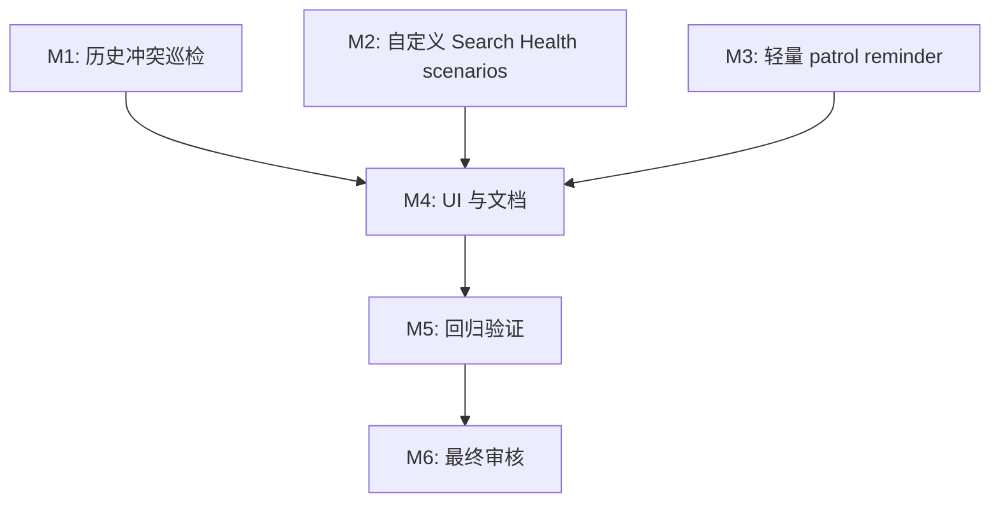

# 任务列表 — LLM Wiki v2 Maintenance Closure

**关联需求**: [`requirements.md`](./requirements.md)
**估算量级**: 中 (审核轮数：5)
**总体进度**: ⏳ 0 / 18

---

## 状态图例

| Emoji | 状态 | 含义 |
|-------|------|------|
| ⏳ | 待开始 | 还没开始 |
| 🚧 | 进行中 | 当前正在做 |
| ✅ | 已完成 | 自检通过、commit/push 完毕 |
| ⚠️ | 阻塞中 | 等待外部决策 / 修不动 |
| 🔍 | 待审核 | 自己做完了等用户 review |

---

## 里程碑依赖图

---

## Milestone 1: 历史冲突巡检

**目标**: 让 Memory Ops 复用 pre-write conflict resolver，发现历史遗留 duplicate / contradiction / supersession 风险。
**依赖**: Spec A/B 已完成
**状态**: ⏳

### Task 1.1 ⏳ 建立 maintenance candidate builder

**描述**: 将已有 wiki page 转成 `PreWriteCandidate`，支持历史巡检场景。

**依赖**: 无
**阻塞**: T1.2

**预估**: 2h

**关联文件 / 模块**:
- `src/lib/prewrite-conflict.ts`
- `src/lib/memory-ops-conflicts.ts` (新建)
- `src/lib/memory-ops-conflicts.test.ts` (新建)

**验收**:
- [ ] 支持 `maintenance-page` 或等价明确 kind。
- [ ] candidate id 对同一 page 稳定。
- [ ] content summary 脱敏并限长。

#### 备注

- 🐛 **遇到的问题**:
- 🔧 **最终实现逻辑**:
- 🎯 **关键决策**:

---

### Task 1.2 ⏳ 实现 historical conflict preview

**描述**: 对 snapshot pages 调用 pre-write resolver/classifier，过滤安全分类和 same-target-only evidence。

**依赖**: T1.1
**阻塞**: T1.3

**预估**: 3h

**关联文件 / 模块**:
- `src/lib/memory-ops-conflicts.ts`
- `src/lib/prewrite-conflict-resolver.ts`

**验收**:
- [ ] duplicate / possible-contradiction / supersession / uncertain 被保留。
- [ ] new / reinforcement / update 不生成历史冲突 preview。
- [ ] resolver 异常不阻断整个 patrol。

#### 备注

- 🐛 **遇到的问题**:
- 🔧 **最终实现逻辑**:
- 🎯 **关键决策**:

---

### Task 1.3 ⏳ 转换为 Memory Ops review-action suggestion

**描述**: 将 high-risk historical conflict preview 转为 `MemoryOpsSuggestion`。

**依赖**: T1.2
**阻塞**: T1.4, T4.1

**预估**: 2h

**关联文件 / 模块**:
- `src/lib/memory-ops-conflicts.ts`
- `src/lib/memory-ops-rules.ts`

**验收**:
- [ ] suggestion kind 为 `review-action`。
- [ ] 不带 `proposedOperation`，不能 batch apply。
- [ ] reasons 包含 classification、target path 和 evidence summary。

#### 备注

- 🐛 **遇到的问题**:
- 🔧 **最终实现逻辑**:
- 🎯 **关键决策**:

---

### Task 1.4 ⏳ 接入 Memory Ops patrol stats / audit

**描述**: `runMemoryOpsPatrol` 合并历史冲突 suggestions，并在 stats/audit 中记录数量。

**依赖**: T1.3
**阻塞**: T4.1, T5.1

**预估**: 2h

**关联文件 / 模块**:
- `src/lib/memory-ops.ts`
- `src/lib/memory-ops.test.ts`

**验收**:
- [ ] report stats 包含 conflict candidate / suggestion count。
- [ ] audit `memory_ops.patrol` after.stats 包含新增计数。
- [ ] 现有 lifecycle / claim / relation suggestions 行为不回归。

#### 备注

- 🐛 **遇到的问题**:
- 🔧 **最终实现逻辑**:
- 🎯 **关键决策**:

---

## Milestone 2: 自定义 Search Health scenarios

**目标**: 让用户能保存并运行自己的检索健康场景。
**依赖**: 无
**状态**: ⏳

### Task 2.1 ⏳ 定义 custom scenario schema / normalize

**描述**: 新建 custom scenario 模型和 normalize/load result。

**依赖**: 无
**阻塞**: T2.2, T2.3

**预估**: 2h

**关联文件 / 模块**:
- `src/lib/search-health-scenarios.ts` (新建)
- `src/lib/search-health-scenarios.test.ts` (新建)

**验收**:
- [ ] 支持 `id/query/expectedTopPaths/expectedInTopK/expectedOutsideTopK/excludedPaths/topK`。
- [ ] 坏 scenario 返回 skipped/warning，不抛出。
- [ ] 重复 id 有确定性处理。

#### 备注

- 🐛 **遇到的问题**:
- 🔧 **最终实现逻辑**:
- 🎯 **关键决策**:

---

### Task 2.2 ⏳ 实现 custom scenario load/save

**描述**: 从 `.llm-wiki/search-health-scenarios.json` 读写 pretty JSON。

**依赖**: T2.1
**阻塞**: T2.3, T4.2

**预估**: 2h

**关联文件 / 模块**:
- `src/lib/search-health-scenarios.ts`
- `src/lib/search-health-scenarios.test.ts`

**验收**:
- [ ] 文件不存在时返回空列表。
- [ ] JSON parse error 返回 warning。
- [ ] save 前创建 `.llm-wiki`。

#### 备注

- 🐛 **遇到的问题**:
- 🔧 **最终实现逻辑**:
- 🎯 **关键决策**:

---

### Task 2.3 ⏳ Search Health 合并 built-in + custom scenarios

**描述**: 扩展 `runSearchHealth` 调用链，让 custom scenarios 和 built-in scenarios 一起运行并进入 report/audit。

**依赖**: T2.1, T2.2
**阻塞**: T2.4, T5.1

**预估**: 2h

**关联文件 / 模块**:
- `src/lib/search-health.ts`
- `src/lib/search-health.test.ts`
- `src/components/settings/sections/maintenance-section.tsx`

**验收**:
- [ ] 只有 custom scenarios 时也能运行。
- [ ] audit/report 记录 built-in/custom/skipped counts。
- [ ] invalid custom scenario 不阻断 built-in scenarios。

#### 备注

- 🐛 **遇到的问题**:
- 🔧 **最终实现逻辑**:
- 🎯 **关键决策**:

---

### Task 2.4 ⏳ Search Health custom scenario UI

**描述**: 在 Search Health panel 增加紧凑编辑区，支持新增、编辑、删除、保存。

**依赖**: T2.2, T2.3
**阻塞**: T4.2

**预估**: 4h

**关联文件 / 模块**:
- `src/components/settings/sections/search-health-panel.tsx`
- `src/components/settings/sections/search-health-panel.test.tsx`
- `src/i18n/en.json`
- `src/i18n/zh.json`

**验收**:
- [ ] 用户可编辑 id/query/expected path/type/topK。
- [ ] 保存成功/失败状态可见。
- [ ] 长文本不撑破 UI。
- [ ] en/zh i18n 补齐。

#### 备注

- 🐛 **遇到的问题**:
- 🔧 **最终实现逻辑**:
- 🎯 **关键决策**:

---

## Milestone 3: 轻量 patrol reminder

**目标**: 把现有 dirty/cooldown 状态变成清晰的用户可见维护提醒，不引入 daemon。
**依赖**: 无
**状态**: ⏳

### Task 3.1 ⏳ 强化 maintenance status model

**描述**: 明确 clean / dirty / reminder due 三种状态，补 reducer 和 summary 测试。

**依赖**: 无
**阻塞**: T3.2

**预估**: 1.5h

**关联文件 / 模块**:
- `src/lib/memory-ops.ts`
- `src/lib/memory-ops.test.ts`

**验收**:
- [ ] threshold 未到时 dirty 但不 reminder。
- [ ] threshold 到且 cooldown 到时 reminderDue。
- [ ] patrol 完成后状态复位。

#### 备注

- 🐛 **遇到的问题**:
- 🔧 **最终实现逻辑**:
- 🎯 **关键决策**:

---

### Task 3.2 ⏳ Patrol reminder UI

**描述**: Memory Ops patrol block 显示更清楚的 reminder due 提示和一键运行入口。

**依赖**: T3.1
**阻塞**: T4.1

**预估**: 2h

**关联文件 / 模块**:
- `src/components/settings/sections/memory-ops-patrol-block.tsx`
- `src/components/settings/sections/memory-ops-patrol-block.test.tsx`
- `src/i18n/en.json`
- `src/i18n/zh.json`

**验收**:
- [ ] reminder due 不只靠颜色表达。
- [ ] clean/dirty/due 三种文案明确。
- [ ] Run patrol 后状态刷新。

#### 备注

- 🐛 **遇到的问题**:
- 🔧 **最终实现逻辑**:
- 🎯 **关键决策**:

---

### Task 3.3 ⏳ 保持无后台扫描边界

**描述**: 检查 project open / Maintenance render / automation event 路径，确保只刷新状态不自动 run patrol。

**依赖**: T3.1, T3.2
**阻塞**: T5.1

**预估**: 1h

**关联文件 / 模块**:
- `src/components/settings/sections/maintenance-section.tsx`
- `src/lib/wiki-automation-events.ts`
- 相关测试

**验收**:
- [ ] 项目打开不会触发 `runMemoryOpsPatrol`。
- [ ] 事件记录只更新 dirty/cooldown state。
- [ ] README 明确无 daemon。

#### 备注

- 🐛 **遇到的问题**:
- 🔧 **最终实现逻辑**:
- 🎯 **关键决策**:

---

## Milestone 4: UI 与文档整合

**目标**: 把三个闭环缺口汇入 Maintenance Workbench，并更新项目说明。
**依赖**: M1, M2, M3
**状态**: ⏳

### Task 4.1 ⏳ Memory Ops UI 展示 historical conflict summary

**描述**: Patrol summary 展示历史冲突候选/建议数量，并保证 suggestion group 可读。

**依赖**: T1.4, T3.2
**阻塞**: T5.1

**预估**: 2h

**关联文件 / 模块**:
- `src/components/settings/sections/memory-ops-patrol-block.tsx`
- `src/lib/memory-ops-ui.ts`
- `src/i18n/en.json`
- `src/i18n/zh.json`

**验收**:
- [ ] 用户能看到 conflict suggestion 数量。
- [ ] review-action suggestion 可打开目标页。
- [ ] long reason/path 不破坏布局。

#### 备注

- 🐛 **遇到的问题**:
- 🔧 **最终实现逻辑**:
- 🎯 **关键决策**:

---

### Task 4.2 ⏳ README / plans / completion audit 更新

**描述**: 更新 README、README_CN、deep dive plan 和本 spec completion audit。

**依赖**: T4.1, T2.4, T3.3
**阻塞**: T5.1

**预估**: 1.5h

**关联文件 / 模块**:
- `README.md`
- `README_CN.md`
- `plans/llm-wiki-v2-deep-dive.md`
- `plans/llm-wiki-v2-completion-audit.md`
- `docs/llm-wiki-v2-maintenance-closure/completion-audit.md`

**验收**:
- [ ] 文档说明三项闭环缺口已落地。
- [ ] 文档说明仍无 daemon / 自动裁决 / 自动合并。
- [ ] completion audit 对照 F1-F10。

#### 备注

- 🐛 **遇到的问题**:
- 🔧 **最终实现逻辑**:
- 🎯 **关键决策**:

---

## Milestone 5: 回归验证

**目标**: 跑 focused suites、typecheck、mock regression，并收口任务状态。
**依赖**: M4
**状态**: ⏳

### Task 5.1 ⏳ Focused regression / typecheck / test:mocks

**描述**: 验证 Memory Ops conflicts、Search Health custom scenarios、reminder UI 和文档相关回归。

**依赖**: T4.2
**阻塞**: M6

**预估**: 2h

**关联文件 / 模块**:
- `docs/llm-wiki-v2-maintenance-closure/tasks.md`
- 测试命令输出

**验收**:
- [ ] Focused Vitest 通过。
- [ ] `npm run typecheck` 通过。
- [ ] `npm run test:mocks` 通过。
- [ ] 如未改 Rust，记录无需 `cargo test`。

#### 备注

- 🐛 **遇到的问题**:
- 🔧 **最终实现逻辑**:
- 🎯 **关键决策**:

---

## Milestone 6: 最终审核

**目标**: 按中量级 5 轮审核，从不同视角补齐缺漏。
**依赖**: M5
**状态**: ⏳

### Task 6.1 ⏳ Round 1 功能审核

**描述**: 对照 requirements F1-F11，检查三个闭环缺口是否完整。

**依赖**: T5.1
**阻塞**: T6.2

**预估**: 1h

**关联文件 / 模块**:
- `docs/llm-wiki-v2-maintenance-closure/review-round-1.md`

**验收**:
- [ ] 报告列出发现和修复。
- [ ] 如有修复，单独 commit。

#### 备注

- 🐛 **遇到的问题**:
- 🔧 **最终实现逻辑**:
- 🎯 **关键决策**:

---

### Task 6.2 ⏳ Round 2 类型 & 静态分析审核

**描述**: 检查类型边界、`any`、schema normalize、UI props 和导出范围。

**依赖**: T6.1
**阻塞**: T6.3

**预估**: 1h

**关联文件 / 模块**:
- `docs/llm-wiki-v2-maintenance-closure/review-round-2.md`

**验收**:
- [ ] `npm run typecheck` 通过。
- [ ] 报告记录结果。

#### 备注

- 🐛 **遇到的问题**:
- 🔧 **最终实现逻辑**:
- 🎯 **关键决策**:

---

### Task 6.3 ⏳ Round 3 性能审核

**描述**: 检查 patrol resolver cache、bounded scan、Search Health scenario 数量和 UI 高频路径。

**依赖**: T6.2
**阻塞**: T6.4

**预估**: 1h

**关联文件 / 模块**:
- `docs/llm-wiki-v2-maintenance-closure/review-round-3.md`

**验收**:
- [ ] 报告说明上限和热点。
- [ ] 必要性能修复已落地。

#### 备注

- 🐛 **遇到的问题**:
- 🔧 **最终实现逻辑**:
- 🎯 **关键决策**:

---

### Task 6.4 ⏳ Round 4 安全审核

**描述**: 检查 path normalize、private content redaction、audit/report 泄漏和无自动改写边界。

**依赖**: T6.3
**阻塞**: T6.5

**预估**: 1h

**关联文件 / 模块**:
- `docs/llm-wiki-v2-maintenance-closure/review-round-4.md`

**验收**:
- [ ] 报告记录泄漏检查。
- [ ] 高风险问题修复并验证。

#### 备注

- 🐛 **遇到的问题**:
- 🔧 **最终实现逻辑**:
- 🎯 **关键决策**:

---

### Task 6.5 ⏳ Round 5 UX & 可访问性审核

**描述**: 检查 Search Health editor、patrol reminder、suggestion 文案、i18n 和键盘可达性。

**依赖**: T6.4
**阻塞**: 无

**预估**: 1h

**关联文件 / 模块**:
- `docs/llm-wiki-v2-maintenance-closure/review-round-5.md`
- `docs/llm-wiki-v2-maintenance-closure/completion-audit.md`

**验收**:
- [ ] 用户能理解三种维护状态和 Search Health 失败原因。
- [ ] completion audit 写明最终边界和剩余后续项。
- [ ] 所有任务状态更新为 ✅。

#### 备注

- 🐛 **遇到的问题**:
- 🔧 **最终实现逻辑**:
- 🎯 **关键决策**:

---

## 进度总览 (开发中实时维护)

| 里程碑 | 任务 | 完成 | 总数 | 状态 |
|--------|------|------|------|------|
| M1 | 历史冲突巡检 | 0 | 4 | ⏳ |
| M2 | 自定义 Search Health scenarios | 0 | 4 | ⏳ |
| M3 | 轻量 patrol reminder | 0 | 3 | ⏳ |
| M4 | UI 与文档整合 | 0 | 2 | ⏳ |
| M5 | 回归验证 | 0 | 1 | ⏳ |
| M6 | 最终审核 | 0 | 5 | ⏳ |
| **总计** | | **0** | **18** | **⏳** |

---

## 变更记录

| 日期 | 变更 |
|------|------|
| 2026-05-08 | 初稿，18 个任务，按中量级 5 轮审核 |

---

## 最终审核索引 (Phase 4 期间填)

| Round | 视角 | 状态 | 报告 |
|-------|------|------|------|
| 1 | 功能 | ⏳ | - |
| 2 | 类型 & 静态分析 | ⏳ | - |
| 3 | 性能 | ⏳ | - |
| 4 | 安全 | ⏳ | - |
| 5 | UX & a11y | ⏳ | - |
