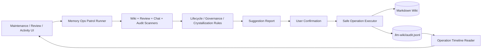
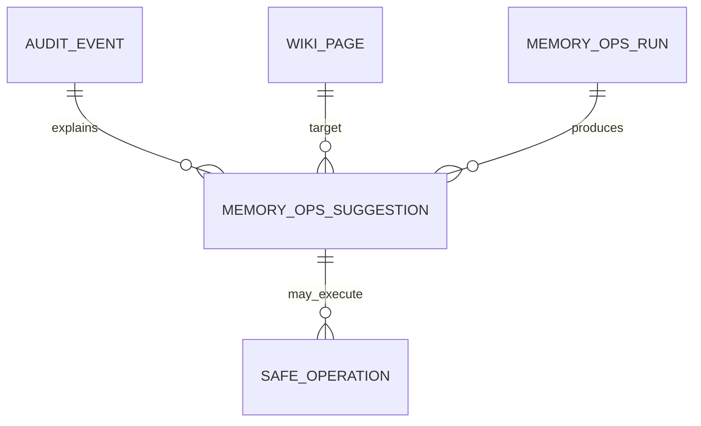
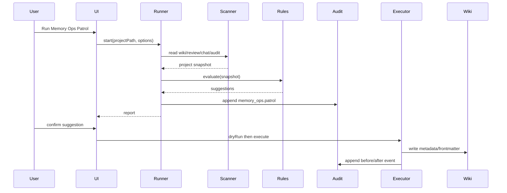

# 需求文档 — LLM Wiki v2.1 Memory Ops

**版本**: v0.1
**日期**: 2026-05-07
**作者**: user + AI
**状态**: 评审中
**关联任务列表**: [`tasks.md`](./tasks.md)

---

## 1. 背景

当前 `llm_wiki_v2` 已经不是 Karpathy 原始 LLM Wiki 的直接实现，而是已经落地了一轮 Rohit LLM Wiki v2 的本地切片：Markdown 仍是 durable source of truth，应用已经有 page-level lifecycle/confidence metadata、typed relationship arrays、typed graph traversal、graph-aware RRF search、append-only audit helper、显式 crystallization、lint/review/merge/delete 等维护路径。

Rohit v2 与 agentmemory 的后续价值不在于继续让 LLM 生成更多页面，而在于把“记忆”变成持续运转的工程系统：自动捕获、定期巡检、生命周期衰减、巩固、可观察、可审计、可回滚、隐私过滤，以及必要时的人类确认。本期选择不引入 agentmemory/iii 作为运行时依赖，也不把桌面知识库改造成多 agent memory server；目标是在现有 Tauri/React/Markdown 架构里补一个本地优先、可解释、可测试的 Memory Ops 层。

本期默认策略是“先建议和标记，再自动改写；先手动触发，再周期运行；先审计可回滚，再批量操作”。这样能承接 Rohit v2 的工程化方向，同时保护用户对个人知识库的信任。

---

## 2. 目标

### 2.1 范围内 (in scope)

- ✅ 建立统一 Operation Timeline：把 ingest、query/crystallize、lint、dedup、delete、maintenance 等关键操作写入 `.llm-wiki/audit.jsonl`，并提供读取、过滤、摘要能力。
- ✅ 新增 Memory Ops patrol：用户可手动运行一次综合巡检，生成 stale/low-confidence/superseded/broken-relation/missing-crystallization 等候选建议。
- ✅ 实现 lifecycle retention/consolidation 的确定性规则：只更新 metadata、review item 或建议，不自动删除用户内容。
- ✅ 扩展 crystallization：对高价值 chat/research/review 输出给出“建议保存到 Wiki”的候选，由用户确认后写入现有 crystallization 流程。
- ✅ 加入 privacy/governance guardrails：敏感信息过滤、dry-run、before/after audit、可回滚报告，覆盖批量维护入口。
- ✅ 增强检索质量度量：提供本地 search evaluation harness，用固定场景验证 lexical/vector/graph RRF 不退化；只在必要时调整 BM25-like lexical scoring。
- ✅ 在现有 UI 中展示 Memory Ops：优先放在 Settings → Maintenance / Activity / Review / Search evidence，不新增大型独立产品面。
- ✅ 补齐确定性测试、i18n 文案和 Phase 4 五轮审核报告。

### 2.2 范围外 (out of scope)

- ❌ 不引入 agentmemory、iii-engine、Neo4j、Postgres、Qdrant 或新的长期运行后端服务。
- ❌ 不做 MCP/REST memory server，也不做多 agent mesh sync、lease、signal、team feed。
- ❌ 不做自动破坏性删除；任何删除、合并、归档都必须可见、可审计，并尽量可回滚。
- ❌ 不做 claim/span-level provenance；本期仍以 page-level metadata 和 page-level references 为粒度。
- ❌ 不做完整 ACL/多用户权限系统；`scope: private | shared` 仍是本地元数据，不代表访问控制。
- ❌ 不把所有 chat session 自动保存；本期只做候选建议 + 用户确认。

### 2.3 成功标准

- 用户能在 Maintenance 中手动运行 Memory Ops patrol，并看到候选问题、建议动作、影响页面和审计入口。
- 每个自动或半自动 metadata 变更都有 `.llm-wiki/audit.jsonl` 记录，包含 action、timestamp、target、before/after 摘要和 reasons。
- Lifecycle 巡检能确定性识别 stale、low-confidence、superseded、contradicted、archivable 等状态，并生成 review item 或 metadata 建议。
- Crystallization 建议不会自动写 Wiki；用户确认后复用现有 `writeCrystallizedQueryPage` 路径。
- 敏感内容过滤能阻止常见 API key/token/password/secret 模式进入 audit 和 generated suggestions。
- `npm run typecheck`、相关 Vitest focused suites、`npm run test:mocks` 通过；如果 Rust 侧有改动，`cargo test` 通过。
- 五轮最终审核报告落在本目录下，且每轮发现的问题已修复或明确记录为非目标。

---

## 3. 用户场景 / 用户故事

### 3.1 场景 1: 手动运行 Memory Ops patrol

**角色**: 个人知识库用户

**前置条件**: 已打开一个项目，项目内已有 wiki 页面和 `.llm-wiki/` 状态目录。

**步骤**:
1. 用户进入 Settings → Maintenance。
2. 用户点击 Run Memory Ops Patrol。
3. 系统扫描 wiki frontmatter、typed graph、audit timeline、review items 和 saved chats/research。
4. 系统生成候选建议：stale pages、low confidence pages、supersession cleanup、missing crystallization、broken typed relations。
5. 用户逐项确认、忽略或稍后处理。

**预期结果**: 用户获得一份可解释的维护清单，不需要记得手动跑多种工具。

**异常分支**:
- 如果项目没有 wiki 目录，显示空状态，不报错。
- 如果 audit 文件损坏，跳过坏行并显示 warning。
- 如果 LLM 未配置，仅运行确定性巡检，不触发语义分析。

### 3.2 场景 2: 让旧知识自然降权而不是删除

**角色**: 长期积累研究资料的用户

**前置条件**: 某些页面 `last_confirmed` 很早，或被 `superseded_by` 指向。

**步骤**:
1. 用户运行 patrol。
2. 系统按 lifecycle half-life、last_confirmed、reinforcement_count、supersession 状态计算建议。
3. 系统建议把页面标记为 `review_status: stale`、`lifecycle: archived`，或增加 review item。
4. 用户确认 metadata 更新。
5. 系统写入 page frontmatter，并记录 audit before/after。

**预期结果**: 旧知识不会被悄悄删除，但在搜索、review 和图谱解释里被明确降权或标记。

**异常分支**:
- 如果页面已经 `scope: private`，audit 摘要不应泄露正文。
- 如果用户取消确认，不写文件，只记录 dry-run 可选摘要。

### 3.3 场景 3: 高价值回答建议 crystallize

**角色**: 经常用 Chat/Deep Research 产出分析的用户

**前置条件**: 用户得到一条较长、有引用、有明确结论的 assistant/research/review 输出。

**步骤**:
1. 系统在本地计算 crystallization candidate score。
2. 当输出满足阈值时，UI 显示 Save to Wiki 建议。
3. 用户确认标题、tags、引用页面和目标路径。
4. 系统调用现有 crystallization helper 写入 `wiki/queries/`，并可选触发 auto-ingest。
5. 系统记录 audit event。

**预期结果**: 探索成果可以复利进入 wiki，但用户保留最终决定权。

**异常分支**:
- 如果没有引用或内容过短，不提示。
- 如果写入路径冲突，使用现有 Unicode-safe timestamp filename 策略。

### 3.4 场景 4: 批量维护前先 dry-run

**角色**: 对数据安全敏感的用户

**前置条件**: Patrol 发现多个页面可归档或关系可清理。

**步骤**:
1. 用户选择一组建议动作。
2. 系统显示 dry-run diff：将改哪些文件、哪些字段、影响多少 relation/search/audit 记录。
3. 用户确认执行。
4. 系统逐项写入，任何失败保留错误结果。
5. 用户可打开 rollback report 查看如何手动恢复或自动恢复 metadata 变更。

**预期结果**: 批量维护可控、可解释、可追溯。

---

## 4. 功能需求

### F1: Operation Timeline Registry

**描述**: 统一 `.llm-wiki/audit.jsonl` 的读写协议，覆盖现有 lifecycle/crystallize audit，并扩展到维护操作。

**输入**: 操作类型、目标路径、before/after 摘要、reason、scope、dry-run 标记。

**行为**:
- 追加 JSONL，不重写历史。
- 读取时容忍坏行，返回有效事件和 parse warning。
- 对敏感字段做脱敏后再写 audit。

**输出**: 可过滤的 `AuditEvent[]`、timeline summary、warning list。

**验收标准**:
- [ ] append/read/list/filter 单元测试覆盖正常、坏行、敏感信息脱敏。
- [ ] 已有 `appendLifecycleAuditEvent` 调用兼容新 schema。
- [ ] 不因 audit 写失败阻断 ingest/crystallize 主流程。

### F2: Memory Ops Patrol Runner

**描述**: 提供一次性巡检入口，聚合确定性检查结果并形成候选建议。

**输入**: project path、当前 dataVersion、patrol options、LLM config 可选。

**行为**:
- 扫描 wiki pages/frontmatter/typed graph/review/audit。
- 生成 typed suggestions：metadata update、review item、crystallize candidate、relation cleanup、archive candidate。
- 支持 cancel/retry，并把运行状态显示到 activity/maintenance UI。

**输出**: `MemoryOpsPatrolReport`，包含 suggestions、stats、warnings。

**验收标准**:
- [ ] 无 LLM 时可运行确定性巡检。
- [ ] 巡检不会直接改 wiki 文件。
- [ ] 项目切换时不会跨项目污染。

### F3: Lifecycle Retention and Consolidation Rules

**描述**: 让现有 lifecycle metadata 具备可操作的衰减、归档、巩固建议。

**输入**: page frontmatter、audit usage events、references、last_confirmed、reinforcement_count。

**行为**:
- 根据 lifecycle tier 使用不同 half-life。
- 结合 audit/search/chat/crystallize events 增强 reinforcement signal。
- 生成建议而不是直接删除：mark stale、archive、promote semantic/procedural、needs review。

**输出**: `LifecycleSuggestion[]` 和可执行 metadata patch。

**验收标准**:
- [ ] 规则纯函数可测试，固定 today 时输出稳定。
- [ ] 不覆盖用户已有明确 metadata，除非用户确认执行。
- [ ] `scope: private` 页面只输出最小摘要。

### F4: Crystallization Candidate Suggestions

**描述**: 对 chat/research/review 输出进行轻量评分，提示用户保存高价值结果。

**输入**: message/research/review content、references、origin、timestamp。

**行为**:
- 用确定性信号评分：长度、引用数、结论结构、是否包含 action/decision、是否已经保存。
- 生成候选标题、tags、supports、sources。
- 用户确认后调用现有 crystallization helper。

**输出**: `CrystallizationCandidate` 和 confirmed write result。

**验收标准**:
- [ ] 不自动保存任意对话。
- [ ] 同一内容不会重复提示。
- [ ] 保存后 audit event 包含 candidate score 和 reasons。

### F5: Governance Guardrails

**描述**: 给批量维护和 audit 写入加隐私过滤、dry-run、rollback 报告。

**输入**: proposed operations、page content/frontmatter、audit event。

**行为**:
- 对 API key、token、password、secret、private block 等常见模式脱敏。
- 执行前生成 dry-run diff。
- 执行后生成 rollback report，至少可恢复 metadata/frontmatter 变更。

**输出**: sanitized event、dry-run report、rollback report。

**验收标准**:
- [ ] 常见 secret 模式不会进入 audit/suggestion detail。
- [ ] Dry-run 不写文件。
- [ ] 执行失败时保留 partial result，不吞错误。

### F6: Search Evaluation and Lexical Scoring Guard

**描述**: 以固定场景保护现有 lexical/vector/graph RRF 检索行为，必要时引入 BM25-like lexical scoring。

**输入**: temp wiki scenario、query、expected top results、embedding disabled/enabled mocks。

**行为**:
- 构造本地 deterministic evaluation cases。
- 输出 recall/top-k/ranking regression summary。
- 若现有 token scoring 明显不足，替换为不新增依赖的 BM25-like scoring 或局部增强。

**输出**: `SearchEvalReport` 和测试结果。

**验收标准**:
- [ ] 覆盖 exact title、alias、typed relation、graph-only、vector-only、CJK query。
- [ ] 不读取 raw/sources 大文件回退路径。
- [ ] 现有 `search-rrf` 行为不退化。

### F7: UI Integration

**描述**: 在现有 UI 上展示 Memory Ops，而不是新增复杂产品面。

**输入**: patrol report、audit summary、suggestions、operation status。

**行为**:
- Settings → Maintenance 增加 Memory Ops Patrol 区块。
- Activity panel 显示 patrol running/done/error。
- Review 或 Maintenance 卡片展示建议动作和影响范围。
- Frontmatter/Search evidence 可链接到相关 audit/suggestion。

**输出**: 用户可执行、可忽略、可确认的维护界面。

**验收标准**:
- [ ] UI 文案中英双语。
- [ ] 小屏/窄面板不重叠。
- [ ] 无项目、无 LLM、audit 损坏、空建议都有明确状态。

---

## 5. 非功能需求

### 5.1 性能

- Patrol 默认只读取 `wiki/**/*.md`、`.llm-wiki/*.json*` 和必要索引，不读取 `raw/sources/` 大文件。
- 1000 个 wiki pages 的确定性巡检目标 p95 < 3s，不含可选 LLM 语义检查。
- Search evaluation 只在测试/手动诊断中运行，不影响普通搜索输入延迟。

### 5.2 安全

- 所有 audit/suggestion/detail 写入前必须经过 secret redaction。
- 批量操作必须 dry-run first。
- 默认不删除、不外发、不上传。
- `scope: private` 是本地显示和脱敏信号，不是访问控制；文档和 UI 必须避免误导。

### 5.3 可访问性 (a11y)

- Patrol、confirm、ignore、rollback 等操作必须可键盘访问。
- 状态不能只靠颜色表达，必须有图标/文本。
- 确认类按钮必须有明确 label，避免误触。

### 5.4 国际化

- 新增 UI 文案写入 `src/i18n/en.json` 和 `src/i18n/zh.json`。
- Audit action type 用稳定英文枚举；用户可见文案走 i18n。

### 5.5 可观测性

- Activity item 记录 patrol 进度、建议数量、失败原因。
- Audit timeline 可按 action/page/time/scope 查询。
- 测试中能验证 audit event 的 shape 和 redaction。

---

## 6. 技术栈与依赖

### 6.1 选型

| 维度 | 选型 | 版本 | 理由 |
|------|------|------|------|
| 桌面壳 | Tauri | `@tauri-apps/api` 2.10.1 / CLI 2.10.1 | 现有跨平台桌面架构 |
| 前端 | React | 19.0.0 | 现有 UI 栈 |
| 构建 | Vite | 8.0.0 | 现有构建链 |
| 类型系统 | TypeScript | 5.7.3 | 现有类型安全基础 |
| 测试 | Vitest | 4.1.4 | 现有单元/集成测试 |
| 图谱 | graphology / sigma | 0.26.0 / 3.0.2 | 现有 graph/search 依赖 |
| 状态 | Zustand | 5.0.12 | 现有 store |
| 存储 | Markdown + `.llm-wiki/*.jsonl` | 无新增服务 | 保持 Git-friendly、local-first |

### 6.2 新增依赖

| 包名 | 版本 | 用途 |
|------|------|------|
| 无 | 无 | 本期优先使用现有依赖和纯函数实现 |

### 6.3 环境变量

| 名称 | 必需? | 用途 | 示例 |
|------|-------|------|------|
| 无新增 | 否 | 本期不新增运行时环境变量 | - |

---

## 7. 架构概览

### 7.1 整体架构图



### 7.2 数据模型



核心类型草案：

| 类型 | 关键字段 | 说明 |
|------|----------|------|
| `AuditEvent` | `id, timestamp, action, targetPath, before, after, reasons, redacted` | 统一 audit 事件 |
| `MemoryOpsRun` | `id, projectPath, startedAt, finishedAt, status, stats` | 一次 patrol 执行 |
| `MemoryOpsSuggestion` | `id, kind, severity, targetPath, title, detail, proposedOperation` | 巡检建议 |
| `SafeOperation` | `kind, dryRun, before, after, rollback` | 可执行维护动作 |
| `CrystallizationCandidate` | `origin, title, score, reasons, references, dedupeKey` | 保存建议 |

### 7.3 关键流程



### 7.4 模块划分

```
src/lib/
├── audit-timeline.ts          ← audit schema, append/read/filter/redaction
├── memory-ops.ts              ← patrol runner and report assembly
├── memory-ops-rules.ts        ← lifecycle/retention/consolidation rules
├── memory-ops-executor.ts     ← dry-run, apply, rollback report
├── crystallize-candidates.ts  ← save-to-wiki suggestion scoring
└── search-eval.ts             ← deterministic retrieval scenarios

src/components/settings/sections/
└── maintenance-section.tsx    ← Memory Ops UI block

src/i18n/
├── en.json
└── zh.json
```

---

## 8. 开放风险

| 风险 | 概率 | 影响 | 缓解方案 |
|------|------|------|----------|
| 自动化误改知识库 | 中 | 高 | 默认 dry-run + 用户确认；不自动删除 |
| lifecycle score 被误读成事实真伪 | 中 | 中 | UI 展示 reasons，文案说明是维护信号 |
| audit 泄露敏感信息 | 中 | 高 | 写入前 redaction；private scope 摘要化 |
| patrol 扫描大项目变慢 | 中 | 中 | 只扫 wiki 和 `.llm-wiki`，避免 raw 大文件 |
| UI 面积膨胀 | 中 | 中 | 复用 Maintenance/Review/Activity，不新增大屏 |
| 与现有 ingest/dedup queue 交叉污染 | 低 | 高 | 项目路径 + projectId 双重 guard；测试项目切换 |

---

## 9. 开放问题 / 待用户拍板

- [x] 默认不引入 agentmemory/iii/Neo4j 等新运行时依赖。
- [x] 默认自动化先手动触发，周期运行放后续。
- [x] 默认忘记策略为 stale/archive/deprioritize，不删除。
- [x] 默认 MCP/REST 多 agent 协调放后续。
- [x] 本期不新增只读 Audit Timeline 大面板，先在 Maintenance 建议卡片中显示最近事件摘要；完整 timeline reader 先作为库能力。
- [x] 本期不提供“一键执行全部”批量按钮，即使是低风险 metadata-only 建议也逐条确认；批量执行留给后续。
