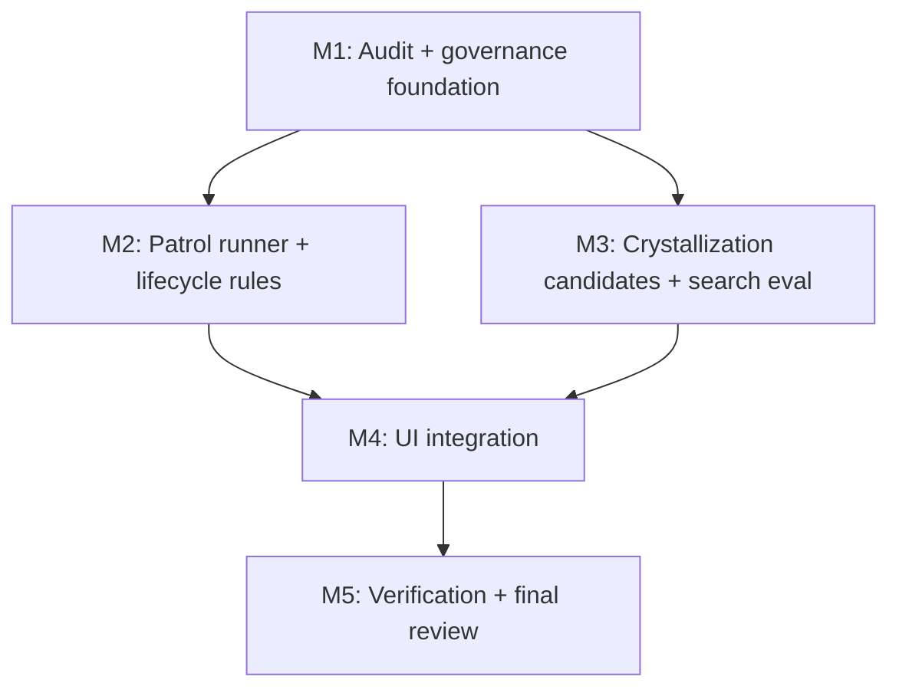

# 任务列表 — LLM Wiki v2.1 Memory Ops

**关联需求**: [`requirements.md`](./requirements.md)
**估算量级**: 中 (审核轮数：5)
**总体进度**: 🚧 1 / 18

---

## 状态图例

| Emoji | 状态 | 含义 |
|-------|------|------|
| ⏳ | 待开始 | 还没开始 |
| 🚧 | 进行中 | 当前正在做 |
| ✅ | 已完成 | 自检通过、commit/push 完毕 |
| ⚠️ | 阻塞中 | 等待外部决策 / 修不动 |
| 🔍 | 待审核 | 自己做完了等用户 review |

---

## 里程碑依赖图

---

## Milestone 1: Audit + Governance Foundation

**目标**: 把 audit、redaction、dry-run/rollback 基础能力先做成纯函数和可测试模块。
**依赖**: 无
**状态**: 🚧

### Task 1.1 ✅ Define unified audit timeline schema

**描述**: 新建 `src/lib/audit-timeline.ts`，定义统一 `AuditEvent`、append/read/filter、bad-line tolerance，并兼容现有 lifecycle audit shape。

**依赖**: 无
**阻塞**: T1.2, T1.3, T2.1, T4.1

**预估**: 3h

**关联文件 / 模块**:
- `src/lib/audit-timeline.ts` (新建)
- `src/lib/lifecycle.ts`
- `src/lib/lifecycle.test.ts`
- `src/lib/audit-timeline.test.ts` (新建)

**验收**:
- [ ] 可 append/read `.llm-wiki/audit.jsonl`。
- [ ] 坏 JSONL 行不会导致整个读取失败。
- [ ] 现有 `appendLifecycleAuditEvent` 兼容或委托新模块。

#### 备注

- 🐛 **遇到的问题**: `docs/` 被 `.gitignore` 忽略，后续提交文档需要 `git add -f`；实现中还发现 lifecycle 原有 audit helper 需要保留旧调用入口。
- 🔧 **最终实现逻辑**: 新增 `src/lib/audit-timeline.ts`，提供统一 audit path、append、read、bad-line warning 和 action/path filter；`appendLifecycleAuditEvent` 委托到新模块保持兼容。
- 🎯 **关键决策**: T1.1 只做 schema/read/write/filter，不做 secret redaction；redaction 留给 T1.2，避免把两个行为混在一个测试周期里。

---

### Task 1.2 ⏳ Add secret redaction utilities

**描述**: 新建 secret redaction helper，覆盖 API key/token/password/private block 等常见敏感模式，用于 audit 和 suggestions。

**依赖**: T1.1
**阻塞**: T1.3, T2.3, T4.1

**预估**: 2h

**关联文件 / 模块**:
- `src/lib/audit-redaction.ts` (新建)
- `src/lib/audit-redaction.test.ts` (新建)
- `src/lib/audit-timeline.ts`

**验收**:
- [ ] 常见 secret 模式被替换为稳定占位符。
- [ ] 非敏感普通文本不被大面积误伤。
- [ ] `scope: private` 事件默认只保留摘要。

#### 备注

- 🐛 **遇到的问题**:
- 🔧 **最终实现逻辑**:
- 🎯 **关键决策**:

---

### Task 1.3 ⏳ Implement safe operation dry-run and rollback shape

**描述**: 新建 `memory-ops-executor` 的纯函数层，支持 metadata/frontmatter patch 的 dry-run diff、apply plan、rollback report 结构。

**依赖**: T1.1, T1.2
**阻塞**: T2.3, T4.2

**预估**: 4h

**关联文件 / 模块**:
- `src/lib/memory-ops-executor.ts` (新建)
- `src/lib/memory-ops-executor.test.ts` (新建)
- `src/lib/frontmatter.ts`

**验收**:
- [ ] Dry-run 不写文件。
- [ ] Metadata-only patch 能生成 before/after 和 rollback。
- [ ] 执行失败返回 partial result，不吞错误。

#### 备注

- 🐛 **遇到的问题**:
- 🔧 **最终实现逻辑**:
- 🎯 **关键决策**:

---

## Milestone 2: Patrol Runner + Lifecycle Rules

**目标**: 做出不依赖 LLM 的 Memory Ops 巡检核心，先生成建议，不直接改文件。
**依赖**: M1
**状态**: ⏳

### Task 2.1 ⏳ Build project snapshot scanner

**描述**: 新建 scanner，读取 wiki pages、frontmatter、typed graph、review items、audit events、chat/research summary，为 patrol 规则提供统一输入。

**依赖**: T1.1
**阻塞**: T2.2, T2.3, T3.1

**预估**: 4h

**关联文件 / 模块**:
- `src/lib/memory-ops.ts` (新建)
- `src/lib/typed-graph.ts`
- `src/lib/persist.ts`
- `src/stores/research-store.ts`
- `src/lib/memory-ops.test.ts` (新建)

**验收**:
- [ ] 空项目、无 `.llm-wiki`、坏 audit 行都能返回稳定 snapshot。
- [ ] 不读取 `raw/sources/` 大文件。
- [ ] project path/dataVersion 能用于缓存或去重，避免跨项目污染。

#### 备注

- 🐛 **遇到的问题**:
- 🔧 **最终实现逻辑**:
- 🎯 **关键决策**:

---

### Task 2.2 ⏳ Implement deterministic lifecycle patrol rules

**描述**: 新建 `memory-ops-rules.ts`，基于 lifecycle、confidence、last_confirmed、reinforcement、supersession、audit usage 生成 stale/archive/promote/review 建议。

**依赖**: T2.1
**阻塞**: T2.3, T4.2

**预估**: 5h

**关联文件 / 模块**:
- `src/lib/memory-ops-rules.ts` (新建)
- `src/lib/lifecycle.ts`
- `src/lib/memory-ops-rules.test.ts` (新建)

**验收**:
- [ ] 固定 today 时输出稳定。
- [ ] 不直接改写 wiki content。
- [ ] 可解释 reasons 覆盖年龄、来源、reinforcement、supersession。

#### 备注

- 🐛 **遇到的问题**:
- 🔧 **最终实现逻辑**:
- 🎯 **关键决策**:

---

### Task 2.3 ⏳ Wire patrol runner and activity status

**描述**: 聚合 scanner + rules + audit，暴露 `runMemoryOpsPatrol(projectPath, options)`，并把运行状态接入 Activity store。

**依赖**: T1.3, T2.1, T2.2
**阻塞**: T4.1, T4.2

**预估**: 4h

**关联文件 / 模块**:
- `src/lib/memory-ops.ts`
- `src/stores/activity-store.ts`
- `src/lib/memory-ops.test.ts`

**验收**:
- [ ] Patrol report 包含 stats、suggestions、warnings。
- [ ] 运行完成写入 `memory_ops.patrol` audit event。
- [ ] 异常路径更新 activity 为 error。

#### 备注

- 🐛 **遇到的问题**:
- 🔧 **最终实现逻辑**:
- 🎯 **关键决策**:

---

### Task 2.4 ⏳ Add relation cleanup suggestions

**描述**: 基于 typed graph 和 alias resolver 识别 broken typed relation、dangling supersession、孤立但应连接页面，生成建议而非自动修复。

**依赖**: T2.1, T2.2
**阻塞**: T4.2

**预估**: 3h

**关联文件 / 模块**:
- `src/lib/memory-ops-rules.ts`
- `src/lib/typed-graph.ts`
- `src/lib/wiki-alias-index.ts`

**验收**:
- [ ] 能识别 `uses`/`supports`/`supersedes` 等 typed relation 的 broken target。
- [ ] 能解释 suggestion 的目标字段和候选目标。
- [ ] 不重复现有 structural lint 的简单 broken wikilink 输出。

#### 备注

- 🐛 **遇到的问题**:
- 🔧 **最终实现逻辑**:
- 🎯 **关键决策**:

---

## Milestone 3: Crystallization Candidates + Search Evaluation

**目标**: 让探索成果可被建议保存，同时用评估保护检索质量。
**依赖**: M1
**状态**: ⏳

### Task 3.1 ⏳ Score crystallization candidates

**描述**: 新建 `crystallize-candidates.ts`，对 chat/research/review 输出进行确定性评分和去重，生成 Save to Wiki 建议。

**依赖**: T2.1
**阻塞**: T3.2, T4.3

**预估**: 4h

**关联文件 / 模块**:
- `src/lib/crystallize-candidates.ts` (新建)
- `src/lib/crystallize.ts`
- `src/stores/chat-store.ts`
- `src/stores/research-store.ts`
- `src/stores/review-store.ts`

**验收**:
- [ ] 短内容、无引用、已保存内容不会重复提示。
- [ ] 长内容、有引用、有结论的输出能生成 candidate。
- [ ] Candidate reasons 可显示给用户。

#### 备注

- 🐛 **遇到的问题**:
- 🔧 **最终实现逻辑**:
- 🎯 **关键决策**:

---

### Task 3.2 ⏳ Reuse confirmed crystallization write path

**描述**: 将用户确认后的 candidate 接到现有 `writeCrystallizedQueryPage`，记录 candidate score/reasons 到 audit。

**依赖**: T3.1
**阻塞**: T4.3

**预估**: 3h

**关联文件 / 模块**:
- `src/lib/crystallize.ts`
- `src/lib/crystallize-candidates.ts`
- `src/lib/crystallize.test.ts`

**验收**:
- [ ] 不新增第二套 query page 写入逻辑。
- [ ] Audit event 包含 candidate score/reasons。
- [ ] 路径冲突继续使用现有 Unicode-safe timestamp 策略。

#### 备注

- 🐛 **遇到的问题**:
- 🔧 **最终实现逻辑**:
- 🎯 **关键决策**:

---

### Task 3.3 ⏳ Add deterministic search evaluation harness

**描述**: 新建 `search-eval.ts` 和 scenario tests，覆盖 exact title、alias、typed relation、graph-only、vector-only、CJK query，形成检索回归保护。

**依赖**: 无
**阻塞**: T3.4, T5.1

**预估**: 4h

**关联文件 / 模块**:
- `src/lib/search-eval.ts` (新建)
- `src/lib/search.ts`
- `src/lib/search-rrf.test.ts`
- `src/lib/search-eval.test.ts` (新建)

**验收**:
- [ ] Evaluation 可在 mock FS/temp wiki 下运行。
- [ ] Embedding disabled/enabled mock 都有覆盖。
- [ ] 报告 top-k/rank failures，便于定位退化。

#### 备注

- 🐛 **遇到的问题**:
- 🔧 **最终实现逻辑**:
- 🎯 **关键决策**:

---

### Task 3.4 ⏳ Tune lexical scoring only if evaluation exposes gaps

**描述**: 如果 T3.3 暴露明显 lexical 排名问题，做不新增依赖的 BM25-like scoring 或局部 scoring 修正；否则记录无需改动。

**依赖**: T3.3
**阻塞**: T5.1

**预估**: 2h

**关联文件 / 模块**:
- `src/lib/search.ts`
- `src/lib/search-rrf.test.ts`
- `src/lib/search-eval.test.ts`

**验收**:
- [ ] exact filename/title 强匹配不退化。
- [ ] CJK token behavior 不退化。
- [ ] 不恢复读取 `raw/sources/` 大文件的慢路径。

#### 备注

- 🐛 **遇到的问题**:
- 🔧 **最终实现逻辑**:
- 🎯 **关键决策**:

---

## Milestone 4: UI Integration

**目标**: 把 Memory Ops 做成可用的现有界面扩展，而不是隐藏在库函数中。
**依赖**: M2, M3
**状态**: ⏳

### Task 4.1 ⏳ Add Memory Ops block in Maintenance settings

**描述**: 在 Settings → Maintenance 增加 Patrol 卡片，展示运行按钮、状态、summary、warnings 和最近 audit 摘要。

**依赖**: T2.3
**阻塞**: T4.2, T4.4

**预估**: 5h

**关联文件 / 模块**:
- `src/components/settings/sections/maintenance-section.tsx`
- `src/lib/memory-ops.ts`
- `src/i18n/en.json`
- `src/i18n/zh.json`

**验收**:
- [ ] 无项目、运行中、完成、失败、空建议状态可见。
- [ ] 中英双语文案齐全。
- [ ] 不破坏现有 duplicate detection UI。

#### 备注

- 🐛 **遇到的问题**:
- 🔧 **最终实现逻辑**:
- 🎯 **关键决策**:

---

### Task 4.2 ⏳ Render suggestions and confirm/ignore actions

**描述**: 展示 patrol suggestions，支持 ignore、confirm metadata-only operation、open target page、查看 dry-run diff。

**依赖**: T1.3, T2.3, T2.4, T4.1
**阻塞**: T4.4

**预估**: 6h

**关联文件 / 模块**:
- `src/components/settings/sections/maintenance-section.tsx`
- `src/lib/memory-ops-executor.ts`
- `src/stores/review-store.ts`

**验收**:
- [ ] Confirm 前能看到影响页面和字段。
- [ ] Ignore 不写 wiki，只更新本地 suggestion state 或 audit。
- [ ] 执行后刷新 dataVersion/file tree。

#### 备注

- 🐛 **遇到的问题**:
- 🔧 **最终实现逻辑**:
- 🎯 **关键决策**:

---

### Task 4.3 ⏳ Surface crystallization candidates in existing flows

**描述**: 在 chat/research/review 的现有保存入口附近显示 Save to Wiki 建议，用户确认后复用 crystallization helper。

**依赖**: T3.1, T3.2
**阻塞**: T4.4

**预估**: 5h

**关联文件 / 模块**:
- `src/components/chat/chat-message.tsx`
- `src/lib/deep-research.ts`
- `src/components/review/review-view.tsx`
- `src/lib/crystallize-candidates.ts`

**验收**:
- [ ] 不在每条普通短回复上打扰用户。
- [ ] Candidate reasons 和引用页面可见。
- [ ] 保存成功后不重复提示同一内容。

#### 备注

- 🐛 **遇到的问题**:
- 🔧 **最终实现逻辑**:
- 🎯 **关键决策**:

---

### Task 4.4 ⏳ UI polish, a11y, and i18n parity

**描述**: 收尾 UI 状态、键盘可达性、窄面板布局、i18n parity test。

**依赖**: T4.1, T4.2, T4.3
**阻塞**: T5.1

**预估**: 3h

**关联文件 / 模块**:
- `src/i18n/en.json`
- `src/i18n/zh.json`
- `src/i18n/i18n-parity.test.ts`
- UI touched files

**验收**:
- [ ] 新增 key 通过 i18n parity test。
- [ ] 操作按钮有明确 label，不只靠颜色表达状态。
- [ ] 窄面板下文本不重叠。

#### 备注

- 🐛 **遇到的问题**:
- 🔧 **最终实现逻辑**:
- 🎯 **关键决策**:

---

## Milestone 5: Verification + Final Review

**目标**: 跑完整验证，并按中量级要求完成 5 轮最终审核。
**依赖**: M4
**状态**: ⏳

### Task 5.1 ⏳ Run focused tests and full mock suite

**描述**: 跑 typecheck、focused Vitest、`npm run test:mocks`；如果 Rust 文件被改动则跑 `cargo test`。

**依赖**: T3.4, T4.4
**阻塞**: T5.2

**预估**: 2h

**关联文件 / 模块**:
- touched test suites
- `package.json`
- `src-tauri/` (如有 Rust 改动)

**验收**:
- [ ] `npm run typecheck` 通过。
- [ ] Focused tests 通过。
- [ ] `npm run test:mocks` 通过。
- [ ] 如改 Rust，`cargo test` 通过。

#### 备注

- 🐛 **遇到的问题**:
- 🔧 **最终实现逻辑**:
- 🎯 **关键决策**:

---

### Task 5.2 ⏳ Update docs and completion audit

**描述**: 更新 README/plan 文档中对 Memory Ops 的说明，并写本期 completion audit。

**依赖**: T5.1
**阻塞**: T5.3

**预估**: 2h

**关联文件 / 模块**:
- `README.md`
- `README_CN.md`
- `docs/llm-wiki-v2-memory-ops/completion-audit.md` (新建)
- `docs/llm-wiki-v2-memory-ops/tasks.md`

**验收**:
- [ ] 文档说明不夸大为 multi-agent memory server。
- [ ] Completion audit 映射每个功能点到文件和测试证据。
- [ ] tasks.md 备注和状态已更新。

#### 备注

- 🐛 **遇到的问题**:
- 🔧 **最终实现逻辑**:
- 🎯 **关键决策**:

---

### Task 5.3 ⏳ Phase 4 final review rounds

**描述**: 按中量级要求跑 5 轮最终审核，并为每轮写报告。

**依赖**: T5.2
**阻塞**: 无

**预估**: 5h

**关联文件 / 模块**:
- `docs/llm-wiki-v2-memory-ops/review-round-1.md`
- `docs/llm-wiki-v2-memory-ops/review-round-2.md`
- `docs/llm-wiki-v2-memory-ops/review-round-3.md`
- `docs/llm-wiki-v2-memory-ops/review-round-4.md`
- `docs/llm-wiki-v2-memory-ops/review-round-5.md`

**验收**:
- [ ] Round 1 功能视角完成并修复发现。
- [ ] Round 2 类型安全/静态分析完成并修复发现。
- [ ] Round 3 性能视角完成并修复发现。
- [ ] Round 4 安全/隐私视角完成并修复发现。
- [ ] Round 5 UX/a11y 视角完成并修复发现。

#### 备注

- 🐛 **遇到的问题**:
- 🔧 **最终实现逻辑**:
- 🎯 **关键决策**:

---

## 进度总览 (开发中实时维护)

| 里程碑 | 任务 | 完成 | 总数 | 状态 |
|--------|------|------|------|------|
| M1 | Audit + Governance Foundation | 1 | 3 | 🚧 |
| M2 | Patrol Runner + Lifecycle Rules | 0 | 4 | ⏳ |
| M3 | Crystallization Candidates + Search Evaluation | 0 | 4 | ⏳ |
| M4 | UI Integration | 0 | 4 | ⏳ |
| M5 | Verification + Final Review | 0 | 3 | ⏳ |
| **总计** | | **1** | **18** | **🚧** |

---

## 变更记录

| 日期 | 变更 |
|------|------|
| 2026-05-07 | 初稿，18 个任务，默认选择 app 内 Memory Ops，不引入外部 memory server |

---

## 最终审核索引 (Phase 4 期间填)

| Round | 视角 | 状态 | 报告 |
|-------|------|------|------|
| 1 | 功能 | ⏳ | `review-round-1.md` |
| 2 | 类型 & 静态分析 | ⏳ | `review-round-2.md` |
| 3 | 性能 | ⏳ | `review-round-3.md` |
| 4 | 安全 | ⏳ | `review-round-4.md` |
| 5 | UX & a11y | ⏳ | `review-round-5.md` |
