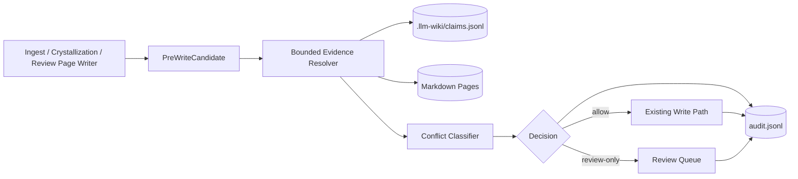
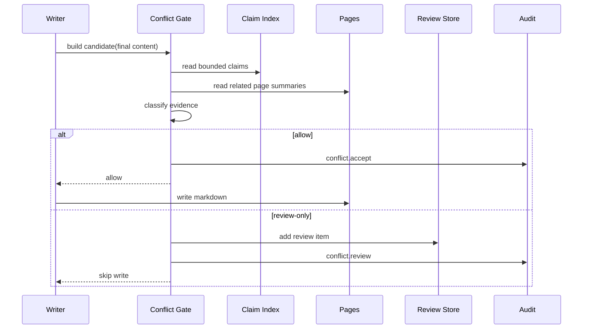

# 需求文档 — LLM Wiki v2 写入前冲突处理

**版本**: v0.1
**日期**: 2026-05-08
**作者**: 用户 + AI
**状态**: 已确认 / 实施中
**关联任务列表**: [`tasks.md`](./tasks.md)

---

## 1. 背景

LLM Wiki v2 已经完成 Markdown-first、派生索引、audit.jsonl、Memory Ops、事实级可信度等工程化改造。当前剩余的关键缺口是：写入链路仍主要在生成后直接落盘，再依赖后置 review 或 Memory Ops 发现问题。对于长期知识库，这会让“新内容覆盖旧内容”“疑似矛盾事实被静默合并”“同一主题重复成页”等问题进入源文件，之后再纠偏的成本更高。

参考 Rohit gist 中“把 LLM 产物落成可维护知识系统”的思想，以及本项目既有边界，本期要补的是一个轻量、确定性、写入前的冲突闸门。它不替代 Markdown 作为 source of truth，不引入 Neo4j / LightRAG 级别的中心图数据库，而是在 ingest、crystallization、review-created page 等写入点生成候选写入集，查询本地相关页面和 claim 索引，给出分类与处置：安全写入、带 audit 写入，或转人工 review。

本期必须延续 A 期事实级可信度的边界：claim 是细粒度证据层，audit 和 review 是派生维护层。系统可以阻止高风险写入直接覆盖 Markdown，但不能把不确定冲突自动“解决”为新的事实。

---

## 2. 目标

### 2.1 范围内 (in scope)

- ✅ 在主要写入路径前构建 `PreWriteCandidate`，覆盖 ingest FILE blocks、crystallization 保存页、review-created page。
- ✅ 基于目标路径、标题、claim 文本、claim relation、已有页面摘要和 `.llm-wiki/claims.jsonl` 做本地 bounded 检索。
- ✅ 将候选写入分类为 `new`、`reinforcement`、`update`、`duplicate`、`possible-contradiction`、`supersession`、`uncertain`。
- ✅ 对安全分类继续写入，并记录 conflict preview / accept audit。
- ✅ 对高风险分类禁止静默覆盖，创建 review item，并记录 conflict review audit。
- ✅ 所有失败都采用保守降级：不能确认安全时转 review，不丢原始候选信息。
- ✅ 补齐单元测试、写入路径回归测试、typecheck 和最终 5 轮审核报告。

### 2.2 范围外 (out of scope)

- ❌ 不做全库历史冲突重扫；Memory Ops 后续可以复用本模块做手动巡检。
- ❌ 不做自动事实裁决，不让模型在无人确认时改写旧事实。
- ❌ 不引入新的远程服务、数据库或后台常驻进程。
- ❌ 不做复杂 UI wizard；本期使用既有 review queue / audit timeline 呈现。
- ❌ 不改变 search ranking；冲突检索仅服务写入前判定。

### 2.3 成功标准

- 高风险 candidate 不会直接覆盖已有 Markdown 页面，而是进入 review queue。
- 安全 candidate 的原有写入体验基本不变，只增加可审计的 conflict 事件。
- 冲突分类逻辑可纯函数测试，写入路径有回归测试覆盖。
- `npm run typecheck`、相关 Vitest、`npm run test:mocks` 通过。
- 5 轮最终审核报告落盘，所有发现均处理或记录为明确后续项。

---

## 3. 用户场景 / 用户故事

### 3.1 场景 1: 新 ingest 内容与旧 claim 冲突

**角色**: 知识库维护者

**前置条件**: 项目已有一条 claim 标记某事实为 contradicted 或存在 `contradicts` relation。

**步骤**:
1. 用户导入一批新材料。
2. 系统生成 FILE block，准备写入目标页面。
3. 写入前闸门从候选内容抽取 claim，检索相关页面和 claim。
4. 系统识别 possible contradiction。
5. 系统跳过直接写入，生成 review item 和 audit 事件。

**预期结果**: Markdown 源文件未被高风险内容覆盖；review queue 中能看到目标页、关联页、原因和查询线索。

**异常分支**:
- 如果 claim 索引不可读，系统降级为页面级检测；不可确认时转 review。
- 如果 review-store 不可写，系统仍不得直接覆盖高风险目标，并写 audit warning。

### 3.2 场景 2: 新材料只是补强已有事实

**角色**: 知识库维护者

**前置条件**: 项目已有同主题页面和相似 active claim。

**步骤**:
1. 用户 ingest 新来源。
2. 系统发现 candidate claim 与已有 active claim 高相似。
3. 系统分类为 reinforcement。
4. 系统继续执行既有 merge/write 流程，并记录 accept audit。

**预期结果**: 页面正常更新；audit 能说明这是补强写入，不是无审查覆盖。

### 3.3 场景 3: Crystallization 保存疑似 supersession

**角色**: 使用 crystallization 保存长期知识的人

**前置条件**: 新 digest 明确声明某旧结论被更新或取代。

**步骤**:
1. 用户保存 crystallized query page。
2. 写入前闸门识别 candidate 或已有 claim 的 supersession relation。
3. 系统不静默改写旧页，而是将变更交给 review。

**预期结果**: 用户能在 review 中决定是否接受新版本、补充 supersedes metadata，或保留旧结论。

---

## 4. 功能需求

### F1: 写入候选集建模

**描述**: 所有受控写入路径在落盘前都要转成结构化 candidate。

**输入**: `projectPath`、`targetPath`、候选 Markdown、来源路径、写入类型、已抽取 claim。

**行为**:
- 生成稳定 candidate id。
- 保留目标路径、标题、来源、内容摘要、claim 摘要。
- 不持久化 raw source 全文。

**输出**: `PreWriteCandidate`。

**验收标准**:
- [ ] ingest FILE block 写入前能生成 candidate。
- [ ] crystallization 保存页写入前能生成 candidate。
- [ ] review-created page 写入前能生成 candidate。
- [ ] candidate 不包含未脱敏 warning 或 raw JSONL 内容。

### F2: 本地相关证据解析

**描述**: 在限定范围内找出可能相关的页面和 claim。

**输入**: candidate、项目路径、可选 claim index。

**行为**:
- 优先匹配 target path / title / alias。
- 其次使用 claim 文本 token overlap。
- 读取 `.llm-wiki/claims.jsonl` 的 active / contradicted / superseded 状态和 relation。
- 对扫描数量、摘要长度、证据条数设置上限。

**输出**: `PreWriteEvidence[]`。

**验收标准**:
- [ ] 相同路径或标题的已有页会成为证据。
- [ ] 高相似 active claim 会成为 reinforcement 证据。
- [ ] contradicted/superseded 或 relation claim 会成为风险证据。
- [ ] claim index 读取失败不会导致进程崩溃。

### F3: 冲突分类

**描述**: 将 candidate 和 evidence 归入明确的写入前类别。

**输入**: `PreWriteCandidate`、`PreWriteEvidence[]`。

**行为**:
- 无相关证据 => `new`。
- 相似 active claim => `reinforcement`。
- 同路径已有页且无风险证据 => `update`。
- 同标题/相同 claim 已存在但目标不同 => `duplicate`。
- contradicted evidence 或 `contradicts` relation => `possible-contradiction`。
- superseded/supersedes relation => `supersession`。
- 检索失败、证据不足但目标已存在 => `uncertain`。

**输出**: `PreWriteConflictPreview`。

**验收标准**:
- [ ] 分类规则有纯函数测试。
- [ ] 高风险分类包含人类可读 reasons。
- [ ] 分类结果稳定，不依赖对象遍历偶然顺序。

### F4: 写入决策与保守降级

**描述**: 根据分类决定是否允许自动写入。

**输入**: preview。

**行为**:
- `new`、`reinforcement`、`update` 允许写入。
- `duplicate` 允许写入或 review 取决于是否同路径；不同路径默认 review。
- `possible-contradiction`、`supersession`、`uncertain` 默认 review-only。
- 检查器自身失败时默认 review-only，而不是直接覆盖。

**输出**: `allow` 或 `review-only`。

**验收标准**:
- [ ] 高风险 candidate 不调用最终 `writeFile`。
- [ ] 安全 candidate 的原写入结果不变。
- [ ] 失败路径有 audit 和 warning。

### F5: Review queue 集成

**描述**: 高风险 preview 转为现有 `ReviewItem`。

**输入**: preview、sourcePath、targetPath。

**行为**:
- contradiction 转 `type: "contradiction"`。
- duplicate / uncertain / supersession 转 `type: "confirm"` 或 `type: "suggestion"`。
- 填入 affected pages、search queries、options。
- 复用 review-store 的去重逻辑。

**输出**: pending review item。

**验收标准**:
- [ ] review item 标题包含目标路径或标题。
- [ ] affected pages 包含目标页和相关页。
- [ ] 重复风险不会刷屏生成多条完全相同 review。

### F6: Audit timeline 集成

**描述**: 所有 preview / accept / review handoff 都要可审计。

**输入**: preview、decision、write result。

**行为**:
- 新增 conflict 类 audit 事件。
- 记录分类、目标路径、证据数量、review item id。
- 不记录 raw source、完整 page content 或未脱敏 claim index 行。

**输出**: `audit.jsonl` 事件。

**验收标准**:
- [ ] audit timeline 能把 `conflict.*` 归类为 conflict。
- [ ] safe write 有 `conflict.accept`。
- [ ] review-only 有 `conflict.review`。

### F7: Ingest 写入路径集成

**描述**: FILE block 写入前运行 conflict gate。

**输入**: 解析后的 FILE block、merged content、claim candidates。

**行为**:
- 先生成最终候选内容，再做 pre-write check。
- safe path 继续现有 write + claim artifact + lifecycle audit。
- risky path 跳过写入、写 review、写 conflict audit，并继续处理其他 block。

**输出**: 更新后的 ingest write result。

**验收标准**:
- [ ] 安全 ingest 回归测试通过。
- [ ] 风险 ingest 不覆盖已有文件。
- [ ] 多 FILE block 中一个风险不会阻塞其他安全 block。

### F8: Crystallization / Review-created page 集成

**描述**: 保存 digest/query page 和 review-created page 前运行同一 gate。

**输入**: 保存页内容、target path、claim candidates。

**行为**:
- safe path 保持原有保存语义。
- risky path 返回 review handoff 信息，不静默写入。

**输出**: 保存结果或 review-only 结果。

**验收标准**:
- [ ] crystallization 风险写入有测试覆盖。
- [ ] review-created page 风险写入有测试覆盖或明确保守处理。
- [ ] 返回类型对既有调用方保持兼容。

### F9: 文档和运行手册

**描述**: README、计划文档和 completion audit 说明冲突闸门边界。

**输入**: 实现结果。

**行为**:
- 更新 A/B 后的工程化结论。
- 写明 source-of-truth、review-only、安全降级和后续扩展。

**输出**: 文档更新。

**验收标准**:
- [ ] 用户能从 README/计划文档理解冲突处理不是自动事实裁决。
- [ ] 后续 Memory Ops 复用路径清晰。

---

## 5. 非功能需求

### 5.1 性能

- 单个 candidate 的本地证据解析默认不超过 40 条 claim、20 个页面摘要、10 条最终 evidence。
- 不在写入路径做全库 embedding 或远程调用。
- 多 FILE block 处理可复用本次 ingest 的读取缓存，避免重复全量扫描。

### 5.2 安全

- 不把 raw source、完整 Markdown、未脱敏 JSONL 错误行写入 audit。
- 路径必须继续使用现有 path sanitizer，不能新增绕过写入根目录的入口。
- 冲突检查失败时保守转 review，避免“检查器坏了所以直接覆盖”。

### 5.3 可访问性

- 本期不新增复杂 UI；review item 和 audit timeline 使用既有可访问结构。
- 若新增文案，必须补齐 i18n key。

### 5.4 可观测性

- audit 记录 `conflict.preview`、`conflict.accept`、`conflict.review`。
- 测试覆盖 audit 分类，避免 timeline 把 conflict 事件误归类为普通 lifecycle。

---

## 6. 技术栈与依赖

### 6.1 选型

| 维度 | 选型 | 版本 | 理由 |
|------|------|------|------|
| 运行时 | Node.js / Vite / Vitest | 继承项目锁文件 | 已有前端和 lib 测试栈 |
| 语言 | TypeScript | 继承项目配置 | 类型安全和现有代码一致 |
| 存储 | Markdown + `.llm-wiki/*.jsonl` | 继承项目格式 | 保持 source-of-truth 边界 |
| Review | `src/stores/review-store.ts` | 现有模块 | 复用去重和 pending 状态 |
| Audit | `src/lib/audit.ts` / `audit-timeline.ts` | 现有模块 | 复用工程审计轨迹 |

### 6.2 新增依赖

| 包名 | 版本 | 用途 |
|------|------|------|
| 无 | 无 | 本期只用项目现有依赖 |

### 6.3 环境变量

| 名称 | 必需? | 用途 | 示例 |
|------|-------|------|------|
| 无 | 否 | 本期不新增环境变量 | - |

---

## 7. 架构概览

### 7.1 整体架构图



### 7.2 数据模型

| 类型 | 字段 | 说明 |
|------|------|------|
| `PreWriteCandidate` | `id, kind, targetPath, title, sourcePath, contentSummary, claimSummaries` | 待写入内容的结构化摘要 |
| `PreWriteEvidence` | `kind, pagePath, claimId, status, relation, score, reasons` | 与 candidate 相关的页面或 claim 证据 |
| `PreWriteConflictPreview` | `candidate, classification, decision, severity, evidence, reasons` | 写入前判定结果 |
| `ReviewItem` | 复用现有字段 | 高风险写入转人工确认 |

### 7.3 关键流程



### 7.4 模块划分

```
src/lib/
├── prewrite-conflict.ts          ← candidate/evidence/classification pure logic
├── prewrite-conflict-resolver.ts ← bounded project evidence lookup
├── prewrite-conflict-review.ts   ← ReviewItem conversion and audit helpers
├── ingest.ts                     ← FILE block write gate integration
├── crystallize.ts                ← crystallization save gate integration
├── review-page.ts                ← review-created page gate integration
└── audit-timeline.ts             ← conflict category display
```

---

## 8. 开放风险

| 风险 | 概率 | 影响 | 缓解方案 |
|------|------|------|----------|
| 文本相似度误判导致过多 review | 中 | 中 | 分类只阻断高风险 relation/status；普通相似默认 reinforcement/update |
| 写入路径调用方依赖旧返回值 | 中 | 中 | 返回类型保持兼容，新增字段可选 |
| claim index 缺失或损坏 | 中 | 中 | 解析失败降级为页面级检测，并写 audit warning |
| 多 FILE block 性能变差 | 中 | 中 | bounded resolver + 单次缓存 + 测试覆盖 |
| review item 信息不够可操作 | 中 | 中 | affected pages、search queries、reasons 必填 |

---

## 9. 开放问题 / 待用户拍板

- [x] 采用中量级落地，5 轮最终审核。
- [x] 顺序为 A 事实级可信度完成后，再做 B 写入前冲突处理。
- [x] 本期默认保守策略：不确定就 review-only，不自动覆盖。
