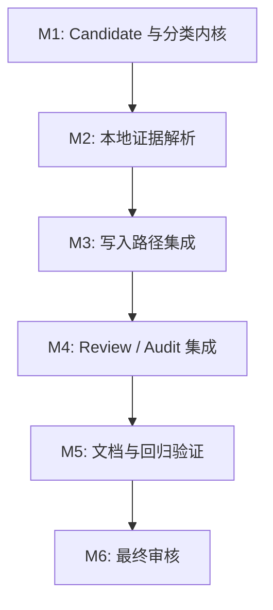

# 任务列表 — LLM Wiki v2 写入前冲突处理

**关联需求**: [`requirements.md`](./requirements.md)
**估算量级**: 中 (审核轮数：5)
**总体进度**: 🚧 10 / 15

---

## 状态图例

| Emoji | 状态 | 含义 |
|-------|------|------|
| ⏳ | 待开始 | 还没开始 |
| 🚧 | 进行中 | 当前正在做 |
| ✅ | 已完成 | 自检通过、commit/push 完毕 |
| ⚠️ | 阻塞中 | 等待外部决策 / 修不动 |
| 🔍 | 待审核 | 自己做完了等用户 review |

---

## 里程碑依赖图

---

## Milestone 1: Candidate 与分类内核

**目标**: 建立可纯函数测试的写入前冲突模型，先不碰主写入路径。
**依赖**: A 事实级可信度已完成
**状态**: ✅

### Task 1.1 ✅ 定义 PreWriteCandidate / Evidence / Preview 类型

**描述**: 新建 `src/lib/prewrite-conflict.ts`，定义候选写入、证据、分类、决策和摘要类型，并提供稳定 id / 文本摘要 helper。

**依赖**: 无
**阻塞**: T1.2, T2.1, T3.1

**预估**: 1h

**关联文件 / 模块**:
- `src/lib/prewrite-conflict.ts` (新建)
- `src/lib/prewrite-conflict.test.ts` (新建)

**验收**:
- [x] candidate id 对相同 kind + targetPath + title 稳定。
- [x] content summary 有长度上限，不保存 raw source 全文。
- [x] 类型不引入 `any`。

#### 备注 (开发期由 AI 填写)

- 🐛 **遇到的问题**: 先写测试时模块不存在，Vitest 按预期失败；随后补最小实现。
- 🔧 **最终实现逻辑**: `src/lib/prewrite-conflict.ts` 定义 candidate/evidence/preview 基础类型，使用 kind + normalized targetPath + normalized title 生成稳定 id，并对 content / claim summary 做长度限制和脱敏。
- 🎯 **关键决策**: Candidate id 不纳入正文和 sourcePath，避免同一目标页的内容迭代导致 preview 身份不稳定。

---

### Task 1.2 ✅ 实现纯函数冲突分类

**描述**: 基于 candidate + evidence 实现 `classifyPreWriteConflict`，覆盖 new、reinforcement、update、duplicate、possible-contradiction、supersession、uncertain。

**依赖**: T1.1
**阻塞**: T2.2, T3.1

**预估**: 2h

**关联文件 / 模块**:
- `src/lib/prewrite-conflict.ts`
- `src/lib/prewrite-conflict.test.ts`

**验收**:
- [x] 无证据分类为 `new` 且 allow。
- [x] active 高相似 claim 分类为 `reinforcement` 且 allow。
- [x] 同路径已有页分类为 `update` 且 allow。
- [x] 不同路径同标题或同 claim 分类为 `duplicate`。
- [x] contradicted / contradicts relation 分类为 `possible-contradiction` 且 review-only。
- [x] superseded / supersedes relation 分类为 `supersession` 且 review-only。

#### 备注

- 🐛 **遇到的问题**: 分类测试先因 `classifyPreWriteConflict` 未导出失败，符合 TDD 预期。
- 🔧 **最终实现逻辑**: 在 `src/lib/prewrite-conflict.ts` 实现分类优先级：contradiction > supersession > duplicate > reinforcement > update > uncertain > new，并对 evidence 做稳定排序和上限裁剪。
- 🎯 **关键决策**: 风险 relation/status 的优先级高于相似度，避免一条高相似但 contradicted 的 claim 被误当作 reinforcement。

---

### Task 1.3 ✅ 冲突判定失败的保守降级

**描述**: 提供 `buildUncertainPreWritePreview`，当 resolver 或分类器遇到不可恢复读取错误时返回 review-only preview。

**依赖**: T1.1
**阻塞**: T2.3, T3.1

**预估**: 1h

**关联文件 / 模块**:
- `src/lib/prewrite-conflict.ts`
- `src/lib/prewrite-conflict.test.ts`

**验收**:
- [x] 降级 preview 分类为 `uncertain`。
- [x] decision 为 `review-only`。
- [x] reason 不暴露 raw 异常文本中的路径外敏感片段。

#### 备注

- 🐛 **遇到的问题**: 先写失败测试时函数未实现；补实现后 focused test 和 typecheck 均通过。
- 🔧 **最终实现逻辑**: `buildUncertainPreWritePreview` 统一构造 `uncertain` / `review-only` / `blocking` preview，并把异常消息经 `redactSensitiveText` 后放入 reason 和 error evidence。
- 🎯 **关键决策**: 检查器异常不回退到 allow，后续写入集成必须把该 preview 当作人工确认路径。

---

## Milestone 2: 本地证据解析

**目标**: 从现有 Markdown 和 claim 索引中提取 bounded evidence。
**依赖**: M1
**状态**: ✅

### Task 2.1 ✅ 解析 claim index 证据

**描述**: 新建 resolver，从 `.llm-wiki/claims.jsonl` 读取 bounded claim evidence，匹配文本相似、status 和 relation。

**依赖**: T1.1
**阻塞**: T2.2

**预估**: 2h

**关联文件 / 模块**:
- `src/lib/prewrite-conflict-resolver.ts` (新建)
- `src/lib/prewrite-conflict-resolver.test.ts` (新建)
- `src/lib/claims.ts` (只复用，不改变 schema)

**验收**:
- [x] active 相似 claim 返回 reinforcement evidence。
- [x] contradicted/superseded claim 返回 risk evidence。
- [x] candidate claim relation 产生 relation evidence。
- [x] claim index 读取失败不抛到调用方。

#### 备注

- 🐛 **遇到的问题**: 首次实现只在显式 relation 命中时设置 supersession relation，测试暴露 `status: superseded` 本身也应形成风险；已补齐。
- 🔧 **最终实现逻辑**: `src/lib/prewrite-conflict-resolver.ts` 新增 `resolvePreWriteClaimEvidence`，读取 claim index，按文本 overlap、目标路径、status/relation 生成 bounded evidence，并保留 claim index warning。
- 🎯 **关键决策**: resolver 不抛出 claim index warning，而是把 warning 返回给上层；真正的异常降级由后续组合 preview 统一处理。

---

### Task 2.2 ✅ 解析页面级证据

**描述**: resolver 读取目标路径、同标题、alias/related 指向的页面摘要，生成 page evidence。

**依赖**: T2.1
**阻塞**: T2.3, T3.1

**预估**: 2h

**关联文件 / 模块**:
- `src/lib/prewrite-conflict-resolver.ts`
- `src/lib/prewrite-conflict-resolver.test.ts`
- `src/lib/wiki-alias-index.ts` (按需复用)

**验收**:
- [x] target path 已存在时返回 same-target evidence。
- [x] 同标题不同路径返回 duplicate evidence。
- [x] evidence 数量和摘要长度受限。

#### 备注

- 🐛 **遇到的问题**: 初始测试要求 `pageExcerpt` 字段，基础 evidence 类型未声明；已补入类型并保持摘要上限。
- 🔧 **最终实现逻辑**: `resolvePreWritePageEvidence` 读取 bounded wiki Markdown，解析 frontmatter/title/heading，生成 same-target 和 same-title-different-path evidence。
- 🎯 **关键决策**: 页面 resolver 只处理确定性证据，不做模糊全文相似扫描，避免写入路径性能和误报失控。

---

### Task 2.3 ✅ 组合 resolver 与 classifier

**描述**: 提供 `previewPreWriteConflict(projectPath, candidate)`，统一调用 resolver + classifier + 降级逻辑。

**依赖**: T1.2, T1.3, T2.2
**阻塞**: T3.1, T3.2, T3.3

**预估**: 1.5h

**关联文件 / 模块**:
- `src/lib/prewrite-conflict-resolver.ts`
- `src/lib/prewrite-conflict-resolver.test.ts`

**验收**:
- [x] 安全 candidate 得到 allow preview。
- [x] 高风险 candidate 得到 review-only preview。
- [x] resolver 异常得到 uncertain review-only preview。

#### 备注

- 🐛 **遇到的问题**: 初始异常测试把 claim index 缺失当失败，但现有 `readClaimIndex` 语义是缺索引返回空；已改为真实异常形态。
- 🔧 **最终实现逻辑**: `previewPreWriteConflict` 并行组合 claim/page resolver，再调用 `classifyPreWriteConflict`；异常统一降级为 `buildUncertainPreWritePreview`。
- 🎯 **关键决策**: 缺少 `.llm-wiki/claims.jsonl` 不触发 fail-closed，否则新项目首次写入会被不必要阻断。

---

## Milestone 3: 写入路径集成

**目标**: 在主要落盘点前执行 conflict gate，风险写入进入 review。
**依赖**: M2
**状态**: ✅

### Task 3.1 ✅ Ingest FILE block 写入前 gate

**描述**: 在 `writeFileBlocks` 生成最终 Markdown 之后、调用 `writeFile` 之前运行 conflict preview；safe 继续，risky 跳过写入。

**依赖**: T2.3
**阻塞**: T3.2, T4.1

**预估**: 3h

**关联文件 / 模块**:
- `src/lib/ingest.ts`
- `src/lib/ingest.test.ts` 或现有 ingest 写入测试
- `src/lib/prewrite-conflict-resolver.ts`

**验收**:
- [x] 安全 FILE block 写入行为不变。
- [x] 风险 FILE block 不覆盖目标文件。
- [x] 多 FILE block 中风险 block 不阻止安全 block。
- [x] 结果 warning 对用户可见但不泄漏 raw source。

#### 备注

- 🐛 **遇到的问题**: 首次接入后 safe write 被 `uncertain` 误拦；根因是测试未 mock `listDirectory` 且 resolver 对不相关 contradicted claim 过敏。已补测试默认和相关性门槛。
- 🔧 **最终实现逻辑**: 在 content-page 分支的 claim anchor 插入后、`writeFile` 前构建 `ingest-page` candidate 并调用 `previewPreWriteConflict`；`review-only` 时跳过当前 FILE block、加入 warning，并继续处理后续 block。
- 🎯 **关键决策**: T3.1 只负责阻断和 warning；review item 与 conflict audit 放到 T4，避免一次性扩大写入路径改动面。

---

### Task 3.2 ✅ Crystallization 保存页 gate

**描述**: 在 `writeCrystallizedQueryPage` 落盘前运行同一 gate，高风险结果返回 review-only 信息。

**依赖**: T3.1
**阻塞**: T3.3, T4.1

**预估**: 2h

**关联文件 / 模块**:
- `src/lib/crystallize.ts`
- `src/lib/crystallize.test.ts` 或相关保存测试

**验收**:
- [x] 安全保存页仍返回原有路径和结果。
- [x] 高风险保存页不覆盖已有文件。
- [x] 返回类型兼容既有调用方，可选暴露 conflict preview。

#### 备注

- 🐛 **遇到的问题**: 接入前新增测试显示 crystallize risk 写入仍无 conflict 返回；补 gate 后 focused + digest 回归通过。
- 🔧 **最终实现逻辑**: `writeCrystallizedQueryPage` 在 lifecycle enrich 后、`writeFile` 前构建 `crystallization-page` candidate；review-only 时返回可选 `conflict` 字段，不写页也不写 claim artifact。
- 🎯 **关键决策**: 返回类型只新增 optional 字段，保持既有调用方读取 `relativePath/supports/sources/claimWrite` 的兼容性。

---

### Task 3.3 ✅ Review-created page gate

**描述**: 在 `buildReviewCreatedPageWrite` / 实际写入调用链中接入 candidate 构建和 preview，避免人工 review 生成的新页绕过冲突检查。

**依赖**: T3.2
**阻塞**: T4.1

**预估**: 1.5h

**关联文件 / 模块**:
- `src/lib/review-page.ts`
- 相关 review-page 测试

**验收**:
- [x] review-created page 能生成 candidate。
- [x] 高风险 candidate 有 review handoff 或明确 safe bypass 理由。
- [x] 不破坏既有 claim anchor 插入。

#### 备注

- 🐛 **遇到的问题**: 原模块只构造 target/content，实际 UI 直接 `writeFile`；仅新增 helper 不足以覆盖写入链路。已把 Review create-page 分支切到 preview helper。
- 🔧 **最终实现逻辑**: `buildReviewCreatedPageWrite` 生成 target/content/prewrite candidate；`previewReviewCreatedPageWrite` 返回 preview + write payload；UI 在 review-only 时停止写入并 resolve 为 review-required。
- 🎯 **关键决策**: 保留原 `buildReviewCreatedPageContent/Target` 以兼容既有测试和调用，新增组合 helper 作为写入前入口。

---

## Milestone 4: Review / Audit 集成

**目标**: 让冲突 preview 的处置有可操作 review 和可追踪 audit。
**依赖**: M3
**状态**: 🚧

### Task 4.1 ✅ Review item 转换与去重

**描述**: 新建 `src/lib/prewrite-conflict-review.ts`，将 review-only preview 转为现有 `ReviewItem`。

**依赖**: T3.1
**阻塞**: T4.2

**预估**: 2h

**关联文件 / 模块**:
- `src/lib/prewrite-conflict-review.ts` (新建)
- `src/lib/prewrite-conflict-review.test.ts` (新建)
- `src/stores/review-store.ts` (只复用接口，尽量不改)

**验收**:
- [x] possible contradiction 转 `type: "contradiction"`。
- [x] duplicate/uncertain/supersession 转可确认 review。
- [x] affected pages、search queries、options 非空。

#### 备注

- 🐛 **遇到的问题**: 需要避免在纯转换层依赖 Zustand store；先实现 pure converter，再由 ingest/UI 调用。
- 🔧 **最终实现逻辑**: `preWriteConflictToReviewItem` 将 review-only preview 转成现有 ReviewItem draft；ingest risk 分支调用 `useReviewStore.getState().addItems`，复用 store 去重。
- 🎯 **关键决策**: contradiction 单独映射为 `type: "contradiction"`；duplicate/supersession/uncertain 先走 `confirm`，因为本期不自动裁决。

---

### Task 4.2 ⏳ Conflict audit 事件与 timeline 分类

**描述**: 写入 `conflict.preview`、`conflict.accept`、`conflict.review` audit，并让 timeline 按 conflict category 展示。

**依赖**: T4.1
**阻塞**: T5.1

**预估**: 1.5h

**关联文件 / 模块**:
- `src/lib/audit-timeline.ts`
- `src/lib/prewrite-conflict-review.ts`
- `src/lib/audit-timeline.test.ts`

**验收**:
- [ ] `conflict.*` 事件归类为 conflict。
- [ ] audit detail 不包含完整候选正文。
- [ ] safe 和 review-only 路径均有 audit 测试。

#### 备注

- 🐛 **遇到的问题**:
- 🔧 **最终实现逻辑**:
- 🎯 **关键决策**:

---

## Milestone 5: 文档与回归验证

**目标**: 更新项目说明并跑完整验证。
**依赖**: M4
**状态**: ⏳

### Task 5.1 ⏳ README / plans / completion audit 更新

**描述**: 更新 README、中文 README、deep dive plan 和 completion audit，说明 pre-write gate 的边界和使用方式。

**依赖**: T4.2
**阻塞**: T5.2

**预估**: 1.5h

**关联文件 / 模块**:
- `README.md`
- `README_CN.md`
- `plans/llm-wiki-v2-deep-dive.md`
- `plans/llm-wiki-v2-completion-audit.md`

**验收**:
- [ ] 文档明确 source-of-truth 仍是 Markdown。
- [ ] 文档明确高风险写入 review-only。
- [ ] 文档明确 Memory Ops 可复用但不自动后台扫描。

#### 备注

- 🐛 **遇到的问题**:
- 🔧 **最终实现逻辑**:
- 🎯 **关键决策**:

---

### Task 5.2 ⏳ 回归测试与任务收尾

**描述**: 跑 focused Vitest、`npm run typecheck`、`npm run test:mocks`，必要时补 Rust 测试；更新 tasks 状态。

**依赖**: T5.1
**阻塞**: M6

**预估**: 2h

**关联文件 / 模块**:
- `docs/llm-wiki-v2-pre-write-conflict/tasks.md`
- 测试命令输出

**验收**:
- [ ] focused Vitest 通过。
- [ ] `npm run typecheck` 通过。
- [ ] `npm run test:mocks` 通过。
- [ ] 如 Tauri 侧未变更，记录 Rust 测试无需重复；如变更则跑 `cargo test`。

#### 备注

- 🐛 **遇到的问题**:
- 🔧 **最终实现逻辑**:
- 🎯 **关键决策**:

---

## Milestone 6: 最终审核

**目标**: 按中量级 5 轮审核，从不同视角补齐缺漏。
**依赖**: M5
**状态**: ⏳

### Task 6.1 ⏳ Round 1 功能审核

**描述**: 对照 requirements 和写入路径，检查功能缺漏并修复。

**依赖**: T5.2
**阻塞**: T6.2

**预估**: 1h

**关联文件 / 模块**:
- `docs/llm-wiki-v2-pre-write-conflict/review-round-1.md`

**验收**:
- [ ] 报告列出检查范围、发现、修复。
- [ ] 如有修复，单独 commit。

#### 备注

- 🐛 **遇到的问题**:
- 🔧 **最终实现逻辑**:
- 🎯 **关键决策**:

---

### Task 6.2 ⏳ Round 2 类型 & 静态分析审核

**描述**: 检查类型、any、导出边界、测试类型覆盖。

**依赖**: T6.1
**阻塞**: T6.3

**预估**: 1h

**关联文件 / 模块**:
- `docs/llm-wiki-v2-pre-write-conflict/review-round-2.md`

**验收**:
- [ ] `npm run typecheck` 通过。
- [ ] 报告记录结果。

#### 备注

- 🐛 **遇到的问题**:
- 🔧 **最终实现逻辑**:
- 🎯 **关键决策**:

---

### Task 6.3 ⏳ Round 3 性能审核

**描述**: 检查 bounded resolver、扫描上限和多 FILE block 性能风险。

**依赖**: T6.2
**阻塞**: T6.4

**预估**: 1h

**关联文件 / 模块**:
- `docs/llm-wiki-v2-pre-write-conflict/review-round-3.md`

**验收**:
- [ ] 报告说明上限和潜在热点。
- [ ] 必要性能修复已落地。

#### 备注

- 🐛 **遇到的问题**:
- 🔧 **最终实现逻辑**:
- 🎯 **关键决策**:

---

### Task 6.4 ⏳ Round 4 安全审核

**描述**: 检查路径、脱敏、raw content/audit 泄漏和失败降级。

**依赖**: T6.3
**阻塞**: T6.5

**预估**: 1h

**关联文件 / 模块**:
- `docs/llm-wiki-v2-pre-write-conflict/review-round-4.md`

**验收**:
- [ ] 报告记录泄漏检查。
- [ ] 高风险问题修复并验证。

#### 备注

- 🐛 **遇到的问题**:
- 🔧 **最终实现逻辑**:
- 🎯 **关键决策**:

---

### Task 6.5 ⏳ Round 5 UX & 可访问性审核

**描述**: 检查 review item 文案、i18n、timeline 可读性，形成 completion audit。

**依赖**: T6.4
**阻塞**: 无

**预估**: 1h

**关联文件 / 模块**:
- `docs/llm-wiki-v2-pre-write-conflict/review-round-5.md`
- `docs/llm-wiki-v2-pre-write-conflict/completion-audit.md`

**验收**:
- [ ] 用户可理解为什么某次写入被转 review。
- [ ] completion audit 写明最终边界和剩余后续项。
- [ ] 所有任务状态更新为 ✅。

#### 备注

- 🐛 **遇到的问题**:
- 🔧 **最终实现逻辑**:
- 🎯 **关键决策**:

---

## 进度总览 (开发中实时维护)

| 里程碑 | 任务 | 完成 | 总数 | 状态 |
|--------|------|------|------|------|
| M1 | Candidate 与分类内核 | 3 | 3 | ✅ |
| M2 | 本地证据解析 | 3 | 3 | ✅ |
| M3 | 写入路径集成 | 3 | 3 | ✅ |
| M4 | Review / Audit 集成 | 1 | 2 | 🚧 |
| M5 | 文档与回归验证 | 0 | 2 | ⏳ |
| M6 | 最终审核 | 0 | 2 | ⏳ |
| **总计** | | **10** | **15** | **🚧** |

---

## 变更记录

| 日期 | 变更 |
|------|------|
| 2026-05-08 | 初稿，15 个任务，按中量级 5 轮审核 |

---

## 最终审核索引 (Phase 4 期间填)

| Round | 视角 | 状态 | 报告 |
|-------|------|------|------|
| 1 | 功能 | ⏳ | - |
| 2 | 类型 & 静态分析 | ⏳ | - |
| 3 | 性能 | ⏳ | - |
| 4 | 安全 | ⏳ | - |
| 5 | UX & a11y | ⏳ | - |
