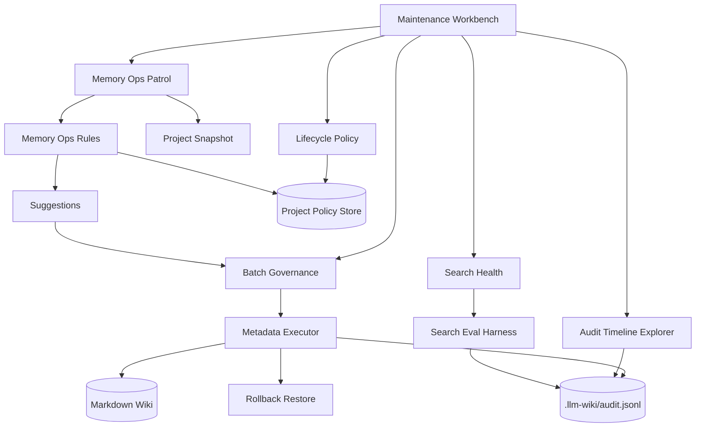
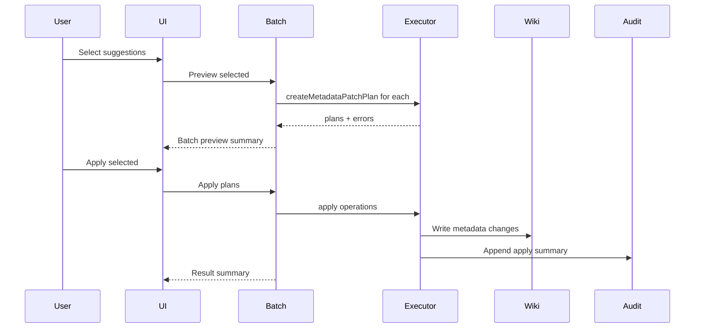
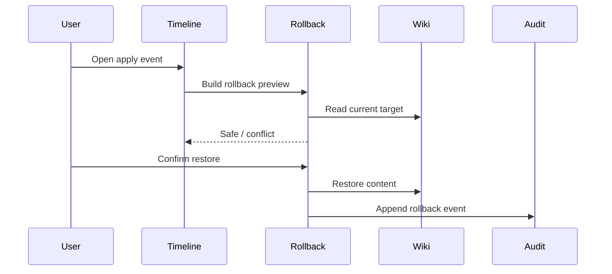

# 需求文档 - LLM Wiki v2 产品化治理闭环

**版本**: v0.1
**日期**: 2026-05-07
**作者**: user + AI
**状态**: 评审中
**关联任务列表**: [tasks.md](./tasks.md)

---

## 1. 背景

当前项目已经把 Karpathy LLM Wiki 的核心 pattern 落地成 Tauri/React 桌面应用，并且已经完成两轮 Rohit LLM Wiki v2 方向的工程化实现。已有能力包括 Markdown source of truth、page-level lifecycle/confidence metadata、typed relationship arrays、typed graph traversal、BM25/vector/graph RRF search、统一 audit JSONL、Memory Ops patrol、deterministic lifecycle/retention/relation suggestions、metadata patch preview/apply、search eval harness、显式 crystallization 和 Maintenance UI。

这意味着本轮不应该再重复实现 "v2 基础能力"。Rohit v2 后续真正缺口是产品化治理：用户能不能看懂发生过什么，能不能批量处理建议，能不能撤销误操作，能不能把 retention/promotion 策略调到适合自己的领域，能不能把检索质量作为持续健康指标，而不是只存在测试里。

本期目标是把已经存在的 Memory Ops 和 audit/search eval 能力继续往用户可操作的闭环推进：可浏览、可过滤、可批量、可回滚、可配置、可导出，同时保持本地优先和 Markdown source-of-truth 不变。

### 1.1 已有基础与本期边界

| 主题 | 已有基础 | 本期缺口 | 本期处理 |
|------|----------|----------|----------|
| Memory Ops Patrol | 能扫描 wiki/audit/review/graph，生成 lifecycle/relation/retention/contradiction 建议，并在 Maintenance 中展示。 | 建议处理仍偏逐项，缺少批量 preview/apply/ignore、风险分级和失败隔离摘要。 | 增加批量治理能力，但仍要求先 preview，再确认 apply。 |
| Metadata Patch Executor | 已支持 dry-run diff、apply、rollback snapshot shape、path sandbox、private diff redaction。 | rollback 只是 plan 里的数据结构，没有用户可执行的恢复动作和审计动作。 | 增加 rollback plan/apply helper 和 UI 入口。 |
| Audit Timeline | 已有 append/read/filter、schema normalization、bad-line tolerance、redaction、recent audit 摘要。 | 没有完整 timeline 浏览和过滤面板，用户难以追踪因果链。 | 在 Maintenance 中加入 audit timeline explorer。 |
| Search Eval | 已有 deterministic harness、RRF contribution、Memory Ops summary helper。 | 主要停留在测试层，没有用户可运行的诊断入口，也没有可持久化 report。 | 加入手动 search health run 和 report artifact。 |
| Lifecycle Policy | half-life、stale/archive/promotion 规则目前硬编码在 `lifecycle.ts` / `memory-ops.ts` / rules 中。 | 不同知识库的衰减节奏不同，用户无法理解或调整。 | 增加本地 policy 配置和解释，不做复杂规则引擎。 |
| Governance | secret redaction、private summary、dry-run audit 已存在。 | 批量操作和 rollback 的审计链还不完整。 | 所有 batch/apply/rollback/search-health run 写入 audit。 |

---

## 2. 目标

### 2.1 范围内

- ✅ 增加 Memory Ops 批量治理：按类别选择建议，批量 preview、apply、ignore，并保留逐项失败隔离。
- ✅ 将 rollback 从内部 shape 产品化为可执行、可审计的 metadata restore 操作。
- ✅ 增加 Audit Timeline Explorer：按 action/category/path/scope/status/时间过滤，展示操作因果和 warnings。
- ✅ 增加 Search Health 入口：用户可手动运行固定 eval scenarios，生成可读报告并写入 audit。
- ✅ 增加 Lifecycle Policy 配置：本地保存 half-life、low-confidence threshold、archive/promotion 阈值，Memory Ops 使用该配置生成建议。
- ✅ 更新 Maintenance UI，使 patrol summary、batch actions、rollback、timeline、search health 和 policy 配置形成一个可理解的工作台。
- ✅ 补齐 i18n、确定性测试、typecheck、mock test 和 5 轮最终审核报告。

### 2.2 范围外

- ❌ 不引入远程后端、agentmemory runtime、Neo4j、Qdrant、Postgres 或长期运行服务。
- ❌ 不做多用户 ACL、mesh sync、团队权限或云同步。
- ❌ 不做自动正文重写、自动删除、自动合并，除非用户明确确认具体操作。
- ❌ 不做 claim/span-level provenance 存储改造；仍保持 page-level metadata。
- ❌ 不把 audit/search eval 做成独立大型页面；优先集成在 Settings -> Maintenance。
- ❌ 不新增真实 LLM 调用测试。

### 2.3 成功标准

- 用户能在 Maintenance 中完成完整闭环：run patrol -> filter suggestions -> batch preview -> apply/ignore -> 查看 audit -> 必要时 rollback。
- Rollback 能恢复 metadata/frontmatter patch，并写入 `memory_ops.rollback` audit event。
- Audit Timeline Explorer 能过滤并展示最近操作、bad-line warnings、path/action/category/scope/status。
- Search Health run 能输出 pass/fail、top-k failures、retrieval stream counts，并记录 `memory_ops.search_health` audit event。
- Lifecycle Policy 配置能被 patrol 使用，固定 policy + fixed today 下输出稳定。
- 所有新增批量和恢复操作都不越过 project root，不泄漏 private diff，不因单项失败阻断完整结果返回。
- `npm run typecheck` 和相关 Vitest focused suites 通过；实现范围足够宽时跑 `npm run test:mocks`。

---

## 3. 用户场景 / 用户故事

### 3.1 场景 1: 批量处理巡检建议

**角色**: 长期维护知识库的用户

**前置条件**: 已打开项目，Memory Ops patrol 已生成多条建议。

**步骤**:
1. 用户进入 Settings -> Maintenance。
2. 用户运行 Memory Ops patrol。
3. 系统按 lifecycle、relation、contradiction、retention、search-health 分组展示建议。
4. 用户勾选一组 metadata-update 建议。
5. 用户点击 Batch Preview。
6. 系统展示每项 diff、风险、可应用数量、不可应用原因。
7. 用户确认 Apply Selected。
8. 系统逐项执行，成功、unchanged、error 分别记录。

**预期结果**: 批量处理不会静默失败；失败项保留错误，成功项进入 audit，UI 仍可继续处理剩余建议。

**异常分支**:
- 如果某条建议目标页已删除，该项标记 error，不影响其他项。
- 如果 private scope 页面参与批量操作，diff 在 audit 中脱敏，UI 只显示必要摘要。

### 3.2 场景 2: 撤销一次误应用的 metadata patch

**角色**: 谨慎维护知识库的用户

**前置条件**: 用户刚应用过 Memory Ops metadata patch。

**步骤**:
1. 用户在建议卡片或 audit timeline 中找到一次 `memory_ops.apply`。
2. 用户打开 rollback preview。
3. 系统展示将恢复的 target path 和 frontmatter/content snapshot 摘要。
4. 用户确认 rollback。
5. 系统恢复内容，并写入 `memory_ops.rollback` audit event。

**预期结果**: 用户能撤销 metadata/frontmatter 级维护操作；rollback 本身也可审计。

**异常分支**:
- 如果目标文件不存在，rollback 返回 error，不创建新文件。
- 如果目标文件已再次变化，系统提示冲突并要求用户明确确认覆盖；本期默认不自动覆盖。

### 3.3 场景 3: 查看一个页面为什么被标为 stale

**角色**: 研究型用户

**前置条件**: 某页面被 patrol 建议标记 stale。

**步骤**:
1. 用户打开 Audit Timeline Explorer。
2. 用户按 target path 过滤该页面。
3. 系统显示相关 ingest、search、query、crystallize、memory_ops events。
4. 用户查看最近确认时间、reinforcement、supersession 和 previous patch。

**预期结果**: 用户可以理解建议来源，而不是只看到一个孤立的 "stale" 标签。

### 3.4 场景 4: 调整知识生命周期策略

**角色**: 不同领域知识库用户

**前置条件**: 用户觉得当前 45/180/365 天 half-life 不适合自己的项目。

**步骤**:
1. 用户在 Maintenance 中打开 Lifecycle Policy。
2. 用户调整 working/episodic/semantic/procedural half-life、low-confidence threshold、archive threshold。
3. 用户保存策略。
4. 用户重新运行 patrol。
5. 系统用新策略生成建议，并在 report 中标明使用了哪个 policy 版本。

**预期结果**: 用户能让 Memory Ops 适配研究、项目管理、读书笔记等不同场景。

### 3.5 场景 5: 手动运行搜索健康检查

**角色**: 开发者 / 高级用户

**前置条件**: 项目已有 wiki 页面和 search eval scenarios。

**步骤**:
1. 用户在 Maintenance 中点击 Run Search Health。
2. 系统运行固定 scenarios。
3. 系统展示 pass/fail、失败 query、expected/actual ranks、stream contribution。
4. 系统将报告摘要写入 audit，可选写入 `.llm-wiki/search-eval-report.json`。

**预期结果**: 检索调权或图谱变更后，用户能看到是否出现实际退化。

---

## 4. 功能需求

### F1: Batch Suggestion Governance

**描述**: 支持用户在 Memory Ops Patrol 结果中批量处理同类建议。

**输入**: `MemoryOpsSuggestion[]`、用户选择集合、project path。

**行为**:
- 只允许有 `proposedOperation` 的 metadata-update 建议进入 batch apply。
- 支持 batch preview，生成每条 `MetadataPatchPlan`。
- 支持 batch apply，逐条调用 executor，返回 applied/unchanged/error。
- 支持 batch ignore，逐条写 `memory_ops.ignore` audit。
- UI 展示 selected count、applicable count、error count 和结果摘要。

**输出**: `BatchMemoryOpsPlan`、`BatchMemoryOpsResult`、audit events。

**验收标准**:
- [ ] 单项失败不阻断其他项。
- [ ] Batch preview 不写 wiki 文件。
- [ ] Batch apply 每项都有 result，并写入 batch summary audit。
- [ ] 不支持自动 apply review-only/contradiction suggestion。

### F2: Rollback Apply Path

**描述**: 将 `MetadataPatchPlan.rollback` 变成可执行恢复操作。

**输入**: rollback restore-content、target path、当前文件内容、可选 expected hash。

**行为**:
- 校验 target path 不逃逸 project root。
- 默认要求当前内容仍等于 apply 后内容或匹配 expected hash。
- 恢复 rollback.content。
- 写入 `memory_ops.rollback` audit event。

**输出**: `RollbackOperationResult`。

**验收标准**:
- [ ] 可以恢复 metadata patch。
- [ ] 目标文件不存在时返回 error。
- [ ] 当前内容已变更时默认拒绝覆盖。
- [ ] private scope 不在 audit 中写入完整 content。

### F3: Audit Timeline Explorer

**描述**: 在 Maintenance 中提供可过滤的 audit timeline 浏览器。

**输入**: `readAuditTimeline(projectPath)` 结果、filter state。

**行为**:
- 支持按 category/action/path/scope/status/text/time range 过滤。
- 展示 timestamp、action、actor、target、status、reasons、retrieval summary、diff summary。
- 展示 bad-line warnings。
- 支持从 timeline 打开相关 target file。

**输出**: 过滤后的 audit event list。

**验收标准**:
- [ ] 空 audit、有坏行、private event 都有合理 UI。
- [ ] 过滤逻辑有纯函数测试。
- [ ] Timeline 不阻塞 patrol 和 search health 操作。

### F4: Lifecycle Policy Configuration

**描述**: 提供本地 Memory Ops lifecycle policy 配置，并让 patrol/rules 使用配置。

**输入**: 用户配置或默认 policy。

**行为**:
- 定义 `MemoryOpsPolicy`，包含 lifecycle half-life、stale multiplier、low confidence threshold、promotion source/reinforcement thresholds、archive thresholds。
- 保存到 project store 或 `.llm-wiki/memory-ops-policy.json`。
- Patrol report 记录 policy version/name。
- rules 接受 policy 参数，默认行为保持兼容。

**输出**: policy-aware suggestions。

**验收标准**:
- [ ] 默认 policy 与当前行为兼容。
- [ ] 修改 half-life 会改变 stale/archive 建议测试结果。
- [ ] 无配置或坏配置时回退默认 policy 并显示 warning。

### F5: Search Health UI and Report Artifact

**描述**: 把已有 search eval harness 接入 Maintenance，提供手动运行入口和报告 artifact。

**输入**: project path、内置 scenarios 或项目自定义 scenarios。

**行为**:
- 运行 `runSearchWikiEval` 或封装 helper。
- 展示 summary、failure list、top result evidence、stream counts。
- 写入 `memory_ops.search_health` audit event。
- 可选写 `.llm-wiki/search-eval-report.json` 保存最近报告。

**输出**: `SearchEvalReport` 和 UI summary。

**验收标准**:
- [ ] Search Health 失败不影响 Memory Ops patrol。
- [ ] 报告包含 pass/fail、top-k paths、stream contribution。
- [ ] 没有 scenarios 时显示说明而不是报错。

### F6: Maintenance Workbench UI Polish

**描述**: 把 Memory Ops 相关功能整合为清晰工作台。

**输入**: patrol report、batch state、policy state、timeline state、search health state。

**行为**:
- 保持在 Settings -> Maintenance 内，不新增顶层页面。
- 使用 tabs/segmented control 分区：Patrol、Policy、Timeline、Search Health。
- 建议卡支持 checkbox、preview/apply/ignore、open target。
- 结果摘要紧凑显示，避免长列表把页面撑乱。

**输出**: 可用的维护工作台。

**验收标准**:
- [ ] 中英 i18n 文案完整。
- [ ] 无项目、空建议、错误、执行中、完成状态完整。
- [ ] 窄宽度下文本不重叠，按钮不撑破容器。

### F7: Documentation and Review Artifacts

**描述**: 更新用户文档和完成 5 轮审核。

**输入**: 本期实现、测试结果。

**行为**:
- 更新 README/README_CN 或现有 docs，说明 Memory Ops 产品化闭环。
- 记录 verification commands。
- 产出 5 轮 review report：功能、类型/静态、性能、安全、UX/a11y。

**输出**: 文档和审核报告。

**验收标准**:
- [ ] 文档不声称支持未实现的多用户/agentmemory server 能力。
- [ ] 五轮审核报告存在并引用实际发现/修复。
- [ ] 最终 completion summary 对照本需求。

---

## 5. 非功能需求

### 5.1 性能

- Batch preview/apply 按选择项数量线性执行；单项失败不重试阻塞。
- Audit Timeline Explorer 默认只显示最近 100 条，可本地过滤更多，但不在首屏渲染无限列表。
- Search Health 只手动运行，不随输入高频触发。
- Policy-aware patrol 不读取 `raw/sources/` 大文件。

### 5.2 安全

- 所有 batch、rollback、search health、policy update 写入 audit 前继续经过 redaction。
- Rollback 不允许 path traversal，不允许默认覆盖用户后续编辑。
- Private scope 不写完整 before/after content 到 audit。
- 本期新增功能不外发数据。

### 5.3 可访问性

- Batch selection、tabs、preview、apply、ignore、rollback、filter controls 必须可键盘操作。
- 执行中状态有文本，不只依赖 spinner。
- 错误状态用文本说明，不只依赖颜色。

### 5.4 国际化

- 新 UI 文案补齐 `src/i18n/en.json` 和 `src/i18n/zh.json`。
- 日期时间显示使用本地格式；audit 原始 timestamp 保持 ISO。

### 5.5 可观测性

- 关键操作写入 audit：`memory_ops.batch_preview`、`memory_ops.batch_apply`、`memory_ops.batch_ignore`、`memory_ops.rollback`、`memory_ops.policy_update`、`memory_ops.search_health`。
- Activity store 展示长任务 running/done/error。

---

## 6. 技术栈与依赖

### 6.1 选型

| 维度 | 选型 | 版本 | 理由 |
|------|------|------|------|
| 前端 | React | 19.0.0 | 现有栈 |
| 桌面 | Tauri | 2.10.1 | 现有栈 |
| 状态 | Zustand | 5.0.12 | 现有 store |
| 测试 | Vitest | 4.1.4 | 现有测试框架 |
| 图标 | lucide-react | 1.7.0 | 现有图标库 |

### 6.2 新增依赖

本期不计划新增 npm/Rust 依赖。

### 6.3 环境变量

本期不新增环境变量。

---

## 7. 架构概览

### 7.1 整体架构图



### 7.2 数据模型

| 模型 | 字段 | 说明 |
|------|------|------|
| `MemoryOpsPolicy` | `version, halfLives, staleMultiplier, lowConfidenceThreshold, promotionThresholds, archiveThresholds` | 本地生命周期策略 |
| `BatchMemoryOpsPlan` | `id, suggestionIds, plans, errors, createdAt` | 批量 dry-run 结果 |
| `BatchMemoryOpsResult` | `id, results, summary, auditEventId?` | 批量执行结果 |
| `RollbackOperation` | `targetPath, content, reason, expectedContentHash?` | 可执行 rollback |
| `AuditTimelineFilter` | `category, action, path, scope, status, text, dateFrom, dateTo` | UI 过滤条件 |
| `SearchHealthRun` | `report, summary, writtenPath?, auditEvent` | 一次 search eval 运行 |

### 7.3 关键流程





### 7.4 模块划分

```text
src/lib/
├── memory-ops-batch.ts       # batch preview/apply/ignore helpers
├── memory-ops-policy.ts      # policy defaults, parsing, persistence helpers
├── memory-ops-rollback.ts    # rollback preview/apply helpers
├── audit-timeline-ui.ts      # pure filtering/summarizing helpers
├── search-health.ts          # search eval run + audit/report persistence
└── existing modules...

src/components/settings/sections/
├── maintenance-section.tsx
├── memory-ops-patrol-block.tsx
├── memory-ops-suggestion-groups.tsx
├── memory-ops-policy-panel.tsx
├── audit-timeline-panel.tsx
└── search-health-panel.tsx
```

---

## 8. 开放风险

| 风险 | 概率 | 影响 | 缓解方案 |
|------|------|------|----------|
| Maintenance UI 变得过重 | 中 | 中 | 用 tabs/segmented controls 分区，默认折叠长详情 |
| Rollback 覆盖用户后续编辑 | 中 | 高 | expected hash/content check，冲突时默认拒绝 |
| Batch apply 误处理 review-only suggestion | 低 | 高 | 只允许 metadata `proposedOperation`，UI 禁用其他类型 |
| Policy 配置导致过多建议 | 中 | 中 | 提供恢复默认、report 显示 policy、规则测试覆盖 |
| Timeline 大文件渲染慢 | 中 | 中 | 默认最近 100 条，过滤后分页或截断 |
| Search eval scenarios 不存在 | 中 | 低 | 空状态说明，先支持内置 smoke scenarios |

---

## 9. 开放问题 / 待用户拍板

- [x] 本期优先集成在 Settings -> Maintenance，不新增顶层页面。
- [x] 本期不做 claim/span-level provenance 和多 agent sync。
- [ ] Search Health 是否要支持用户编辑项目自定义 scenarios？本期建议先内置 smoke scenarios + 后续扩展。
- [ ] Rollback 冲突是否允许用户强制覆盖？本期建议默认不做强制覆盖，只提示手动处理。

---

## 10. 参考资料

- Karpathy LLM Wiki: https://gist.github.com/karpathy/442a6bf555914893e9891c11519de94f
- Rohit LLM Wiki v2: https://gist.github.com/rohitg00/2067ab416f7bbe447c1977edaaa681e2
- 已有第一轮 v2 交付: `plans/llm-wiki-v2-SPEC.md`, `plans/llm-wiki-v2-completion-audit.md`
- 已有 Memory Ops 交付: `docs/llm-wiki-v2-memory-ops/`
- 已有工程化闭环交付: `docs/llm-wiki-v2-engineering/`

---

## 变更历史

| 日期 | 版本 | 变更 |
|------|------|------|
| 2026-05-07 | v0.1 | 初稿，聚焦 v2 产品化治理闭环 |
