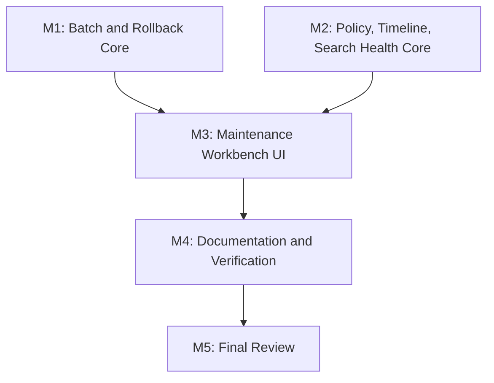

# 任务列表 - LLM Wiki v2 产品化治理闭环

**关联需求**: [requirements.md](./requirements.md)
**估算量级**: 中 (审核轮数: 5)
**总体进度**: 🚧 7 / 16

---

## 状态图例

| Emoji | 状态 | 含义 |
|-------|------|------|
| ⏳ | 待开始 | 还没开始 |
| 🚧 | 进行中 | 当前正在做 |
| ✅ | 已完成 | 自检通过、commit/push 完毕 |
| ⚠️ | 阻塞中 | 等待外部决策 / 修不动 |
| 🔍 | 待审核 | 自己做完了等用户 review |

---

## 里程碑依赖图

---

## Milestone 1: Batch and Rollback Core

**目标**: 先补齐批量 preview/apply/ignore 和 rollback 的纯逻辑，确保后续 UI 只编排稳定 API。
**依赖**: 无
**状态**: ✅

### Task 1.1 ✅ 实现 Memory Ops batch preview/apply/ignore helper

**描述**: 新建批量治理 helper，接收 selected suggestions，生成 batch dry-run plans，批量执行 metadata operations，支持批量 ignore，并返回逐项结果。

**依赖**: 无
**阻塞**: T1.2, T3.1, T3.2

**预估**: 4h

**关联文件 / 模块**:
- `src/lib/memory-ops-batch.ts` (新建)
- `src/lib/memory-ops-executor.ts`
- `src/lib/audit-timeline.ts`
- `src/lib/memory-ops-batch.test.ts` (新建)

**验收**:
- [x] 只处理带 `proposedOperation` 的 metadata suggestions。
- [x] Batch preview 不写 wiki 文件。
- [x] Batch apply 单项失败不阻断后续项。
- [x] Batch ignore 为每条 suggestion 写入可审计结果。
- [x] private scope 不把 diff 明文写进 audit。

#### 备注

- 🐛 **遇到的问题**: 本地缺少 `node_modules`，首次 Vitest 启动无法加载 `vite.config.ts`；已按仓库规范运行 `npm ci` 后重跑 focused tests。
- 🔧 **最终实现逻辑**: 新增 `src/lib/memory-ops-batch.ts`，提供 `previewMemoryOpsBatch`、`applyMemoryOpsBatch`、`ignoreMemoryOpsBatch` 和 applicability helper；batch preview 用现有 metadata patch plan，apply 逐项调用 executor 并写单项 audit，ignore 逐项写 `memory_ops.ignore`。
- 🎯 **关键决策**: T1.1 只做纯逻辑层，不改 UI；review-only / contradiction 等没有 metadata patch 的建议标为 `ineligible`，不允许批量 apply。

---

### Task 1.2 ✅ 为 batch 操作定义 audit summary contract

**描述**: 增加 `memory_ops.batch_preview`、`memory_ops.batch_apply`、`memory_ops.batch_ignore` 的统一 audit summary，避免只留下零散逐项事件。

**依赖**: T1.1
**阻塞**: T3.1, T3.4

**预估**: 2h

**关联文件 / 模块**:
- `src/lib/memory-ops-batch.ts`
- `src/lib/audit-timeline.ts`
- `src/lib/audit-timeline.test.ts`

**验收**:
- [x] batch summary 包含 selected/applied/unchanged/error/ignored counts。
- [x] summary 包含 suggestion category 分布。
- [x] 不重复泄漏 per-file private diff。

#### 备注

- 🐛 **遇到的问题**: T1.1 已经写单项 apply/ignore audit；本任务需要补 batch-level summary，同时避免把单项 private diff 再打包泄漏进 summary。
- 🔧 **最终实现逻辑**: 在 `memory-ops-batch.ts` 增加 `buildMemoryOpsBatchAuditEvent` 和 batch audit 写入路径；preview/apply/ignore 都追加一条 `memory_ops.batch_*` summary，包含 counts、category distribution 和 item status。
- 🎯 **关键决策**: Batch summary 只记录状态、目标、changed/error/auditError 等摘要，不携带 per-file diff；具体 metadata diff 仍由单项 audit helper 根据 scope/redaction 处理。

---

### Task 1.3 ✅ 实现 rollback preview/apply helper

**描述**: 新建 rollback helper，把 `MetadataPatchPlan.rollback` 恢复动作用作可执行操作，支持冲突检测和 audit。

**依赖**: 无
**阻塞**: T3.3, T3.4

**预估**: 4h

**关联文件 / 模块**:
- `src/lib/memory-ops-rollback.ts` (新建)
- `src/lib/memory-ops-executor.ts`
- `src/lib/audit-timeline.ts`
- `src/lib/memory-ops-rollback.test.ts` (新建)

**验收**:
- [x] target path 不能逃逸 project root。
- [x] 可恢复 metadata patch 的原内容。
- [x] 目标文件不存在返回 error。
- [x] 当前内容已变化时默认 conflict，不覆盖。
- [x] 成功和失败都写 `memory_ops.rollback` audit。

#### 备注

- 🐛 **遇到的问题**: 初版测试用 `not.toContain("after")` 判断内容未泄漏，但 audit contract 本身有合法 `after` 字段；改为断言具体内容字符串不出现。
- 🔧 **最终实现逻辑**: 新增 `src/lib/memory-ops-rollback.ts`，提供 `previewMemoryOpsRollback`、`applyMemoryOpsRollback` 和 `buildMemoryOpsRollbackAuditEvent`；复用 executor path sandbox，preview 判断 safe/conflict/missing/error，apply 仅 safe 时恢复内容。
- 🎯 **关键决策**: Rollback 默认不覆盖用户后续编辑；audit 只记录长度、状态、错误和 target，不写 before/current/rollback content。

---

## Milestone 2: Policy, Timeline, Search Health Core

**目标**: 补齐产品化治理所需的 policy、timeline filter 和 search health 运行核心。
**依赖**: 无
**状态**: ✅

### Task 2.1 ✅ 定义并接入 Memory Ops lifecycle policy

**描述**: 新建 policy 模块，定义默认 policy、解析/校验/持久化 helpers，并让 patrol/rules 接受 policy 参数。

**依赖**: 无
**阻塞**: T3.5, T4.1

**预估**: 5h

**关联文件 / 模块**:
- `src/lib/memory-ops-policy.ts` (新建)
- `src/lib/memory-ops.ts`
- `src/lib/memory-ops-rules.ts`
- `src/lib/project-store.ts`
- `src/lib/memory-ops-policy.test.ts` (新建)
- `src/lib/memory-ops-rules.test.ts`

**验收**:
- [x] 默认 policy 与当前 hard-coded 行为兼容。
- [x] fixed today + custom policy 会稳定改变 stale/archive/promotion 建议。
- [x] 坏配置回退默认 policy 并返回 warning。
- [x] patrol report 记录 policy version/name。

#### 备注

- 🐛 **遇到的问题**: `scanMemoryOpsProject` 是纯本地巡检路径，读取 project store policy 失败时不能让巡检失败；已降级为默认 policy 并记录 warning。
- 🔧 **最终实现逻辑**: 新增 `src/lib/memory-ops-policy.ts`，定义 default policy、normalize/load/save 和 lifecycle half-life resolver；`memory-ops.ts` 的 evidence staleness 与 patrol audit 接入 policy；`memory-ops-rules.ts` 的 low-confidence、promotion、archive 阈值改为 policy-driven。
- 🎯 **关键决策**: 不改 `lifecycle.ts` 的 durable metadata scoring，避免影响 ingest/crystallize 已有输出；本期 policy 只作用于 Memory Ops 巡检和建议生成。

---

### Task 2.2 ✅ 实现 audit timeline 过滤和摘要纯函数

**描述**: 新建 UI-agnostic helper，用于按 action/category/path/scope/status/text/time range 过滤 audit events，并生成展示摘要。

**依赖**: 无
**阻塞**: T3.4

**预估**: 3h

**关联文件 / 模块**:
- `src/lib/audit-timeline-ui.ts` (新建)
- `src/lib/audit-timeline.ts`
- `src/lib/audit-timeline-ui.test.ts` (新建)
- `src/lib/memory-ops-ui.ts`

**验收**:
- [x] 过滤 category/action/path/scope/status/text/time range。
- [x] 支持 bad-line warnings 摘要。
- [x] private event 摘要不显示被收缩字段。
- [x] 默认最近事件排序稳定。

#### 备注

- 🐛 **遇到的问题**: Timeline 过滤需要同时匹配直接 target/page/source path 和 retrieval result path，否则 search/query 事件无法按引用页面定位。
- 🔧 **最终实现逻辑**: 新增 `src/lib/audit-timeline-ui.ts`，提供 filter/sort/summary/warning summary helpers；过滤支持 category、action、path、scope、status、text、date range 和 limit。
- 🎯 **关键决策**: helper 保持 UI-agnostic，只返回摘要字符串和原事件引用；不在此层读取文件或触发审计写入。

---

### Task 2.3 ✅ 实现 Search Health runner 和报告持久化

**描述**: 封装现有 search eval harness，提供手动运行 search health 的 helper，写 audit，保存最近报告 artifact。

**依赖**: 无
**阻塞**: T3.6, T4.1

**预估**: 4h

**关联文件 / 模块**:
- `src/lib/search-health.ts` (新建)
- `src/lib/search-eval.ts`
- `src/lib/audit-timeline.ts`
- `src/lib/search-health.test.ts` (新建)

**验收**:
- [x] 无 scenarios 时返回 empty state，不报错。
- [x] 有 scenarios 时返回 pass/fail summary 和 stream counts。
- [x] 写入 `memory_ops.search_health` audit event。
- [x] 可写 `.llm-wiki/search-eval-report.json`，写失败不阻断 UI summary。

#### 备注

- 🐛 **遇到的问题**: Search Health 报告写盘失败不能吞掉 eval 结果，否则 UI 只能看到错误而不是实际检索健康状态。
- 🔧 **最终实现逻辑**: 新增 `src/lib/search-health.ts`，封装 `runSearchWikiEval` 和 `summarizeSearchEvalForMemoryOps`；空 scenarios 返回 skipped，有 scenarios 时生成 summary、best-effort 写 `.llm-wiki/search-eval-report.json`，并写 `memory_ops.search_health` audit。
- 🎯 **关键决策**: 报告 artifact 写失败不让整个 run 失败；audit 记录 `writeError` 和 summary，供后续 Timeline 面板解释。

---

### Task 2.4 ✅ 定义内置 search health smoke scenarios

**描述**: 提供无需用户配置的基础 search health scenarios，覆盖 exact title、alias/keyword、typed graph、CJK 和 contradiction deprioritize 的轻量 smoke set。

**依赖**: T2.3
**阻塞**: T3.6, T4.1

**预估**: 3h

**关联文件 / 模块**:
- `src/lib/search-health.ts`
- `src/lib/search-eval.ts`
- `src/lib/search-health.test.ts`
- `src/test-helpers/scenarios/search-scenarios.ts`

**验收**:
- [x] 内置 scenarios 能在小型 fixture 下运行。
- [x] 项目内容不足时跳过不可判定场景，而不是失败。
- [x] 报告明确区分 skipped 和 failed。

#### 备注

- 🐛 **遇到的问题**: 内置 smoke scenarios 不能假设每个项目都有 alias、typed relation、CJK 或 contradiction 页面；否则小项目会误报搜索失败。
- 🔧 **最终实现逻辑**: 扩展 `src/lib/search-health.ts`，新增 `buildBuiltInSearchHealthScenarios`，从 wiki markdown frontmatter/content 派生 title exact、alias/keyword、typed graph、CJK、contradiction-deprioritize scenarios；不可判定项进入 skipped list。
- 🎯 **关键决策**: skipped scenarios 随 Search Health result/audit 一起返回，和 failed scenarios 区分开；本期仍不做用户自定义 scenarios 编辑器。

---

## Milestone 3: Maintenance Workbench UI

**目标**: 把 batch、rollback、policy、timeline、search health 编排进 Settings -> Maintenance。
**依赖**: M1, M2
**状态**: ⏳

### Task 3.1 ⏳ 为建议卡增加 selection 和 batch action UI

**描述**: 扩展 Memory Ops suggestion groups，支持 checkbox selection、Batch Preview、Apply Selected、Ignore Selected。

**依赖**: T1.1, T1.2
**阻塞**: T3.2, T4.1

**预估**: 5h

**关联文件 / 模块**:
- `src/components/settings/sections/memory-ops-suggestion-groups.tsx`
- `src/components/settings/sections/memory-ops-patrol-block.tsx`
- `src/components/settings/sections/maintenance-section.tsx`
- `src/i18n/en.json`
- `src/i18n/zh.json`

**验收**:
- [ ] 只可选择 batch-applicable suggestions，review-only 项显示不可批量处理原因。
- [ ] Batch preview 后显示逐项 diff/error。
- [ ] Apply selected 后更新 applied/ignored 状态和 file tree。
- [ ] 执行中、空选择、部分失败状态文案完整。

#### 备注

- 🐛 **遇到的问题**:
- 🔧 **最终实现逻辑**:
- 🎯 **关键决策**:

---

### Task 3.2 ⏳ 显示 batch result 和失败隔离摘要

**描述**: 在 patrol block 中展示最近 batch 结果，包含 applied、unchanged、error、ignored 和可打开的错误详情。

**依赖**: T3.1
**阻塞**: T4.1

**预估**: 3h

**关联文件 / 模块**:
- `src/components/settings/sections/memory-ops-patrol-block.tsx`
- `src/lib/memory-ops-ui.ts`
- `src/lib/memory-ops-ui.test.ts`

**验收**:
- [ ] 部分失败不会把已成功项标回未处理。
- [ ] 错误项可继续逐项处理或忽略。
- [ ] UI 摘要不过度占用空间。

#### 备注

- 🐛 **遇到的问题**:
- 🔧 **最终实现逻辑**:
- 🎯 **关键决策**:

---

### Task 3.3 ⏳ 接入 rollback preview/apply UI

**描述**: 在 dry-run plan、applied suggestion 或 audit event 相关入口中提供 rollback preview/apply。

**依赖**: T1.3
**阻塞**: T4.1

**预估**: 4h

**关联文件 / 模块**:
- `src/components/settings/sections/memory-ops-suggestion-groups.tsx`
- `src/components/settings/sections/audit-timeline-panel.tsx` (新建或后续任务创建)
- `src/components/settings/sections/maintenance-section.tsx`
- `src/i18n/en.json`
- `src/i18n/zh.json`

**验收**:
- [ ] 可预览 rollback target 和冲突状态。
- [ ] conflict 时默认不能 apply。
- [ ] rollback 成功后刷新 file tree/dataVersion。
- [ ] rollback 成功/失败进入 audit。

#### 备注

- 🐛 **遇到的问题**:
- 🔧 **最终实现逻辑**:
- 🎯 **关键决策**:

---

### Task 3.4 ⏳ 增加 Audit Timeline Explorer 面板

**描述**: 在 Maintenance 中加入 Timeline 面板，展示可过滤 audit events 和 warnings，并支持打开目标文件。

**依赖**: T2.2
**阻塞**: T3.3, T4.1

**预估**: 5h

**关联文件 / 模块**:
- `src/components/settings/sections/audit-timeline-panel.tsx` (新建)
- `src/components/settings/sections/maintenance-section.tsx`
- `src/lib/audit-timeline-ui.ts`
- `src/i18n/en.json`
- `src/i18n/zh.json`

**验收**:
- [ ] 支持 action/category/path/scope/status/text 过滤。
- [ ] 默认显示最近 100 条。
- [ ] bad-line warnings 可见但不阻断事件列表。
- [ ] 目标文件可打开，找不到文件时显示错误。

#### 备注

- 🐛 **遇到的问题**:
- 🔧 **最终实现逻辑**:
- 🎯 **关键决策**:

---

### Task 3.5 ⏳ 增加 Lifecycle Policy 面板

**描述**: 在 Maintenance 中加入 policy 面板，支持查看默认策略、修改阈值、保存、恢复默认，并在 patrol 中使用。

**依赖**: T2.1
**阻塞**: T4.1

**预估**: 4h

**关联文件 / 模块**:
- `src/components/settings/sections/memory-ops-policy-panel.tsx` (新建)
- `src/components/settings/sections/maintenance-section.tsx`
- `src/lib/memory-ops-policy.ts`
- `src/i18n/en.json`
- `src/i18n/zh.json`

**验收**:
- [ ] 可编辑 half-life 和阈值，输入有合理 min/max。
- [ ] 保存后重新 patrol 使用新 policy。
- [ ] 可恢复默认。
- [ ] 坏配置有错误提示，不写入。

#### 备注

- 🐛 **遇到的问题**:
- 🔧 **最终实现逻辑**:
- 🎯 **关键决策**:

---

### Task 3.6 ⏳ 增加 Search Health 面板

**描述**: 在 Maintenance 中加入 search health 面板，用户可运行 eval、查看 summary/failures/stream counts 和最近 report。

**依赖**: T2.3, T2.4
**阻塞**: T4.1

**预估**: 4h

**关联文件 / 模块**:
- `src/components/settings/sections/search-health-panel.tsx` (新建)
- `src/components/settings/sections/maintenance-section.tsx`
- `src/lib/search-health.ts`
- `src/i18n/en.json`
- `src/i18n/zh.json`

**验收**:
- [ ] 无项目、无 scenarios、运行中、pass、fail、error 状态完整。
- [ ] failure 展示 expected/actual/top-k。
- [ ] report artifact 写入失败不会隐藏 run summary。

#### 备注

- 🐛 **遇到的问题**:
- 🔧 **最终实现逻辑**:
- 🎯 **关键决策**:

---

## Milestone 4: Documentation and Verification

**目标**: 补齐文档、测试和整体验证。
**依赖**: M3
**状态**: ⏳

### Task 4.1 ⏳ 更新文档与 i18n parity

**描述**: 更新 README/README_CN 或相关 docs，说明新的 Memory Ops 产品化治理闭环，并保证 i18n parity。

**依赖**: T3.1, T3.3, T3.4, T3.5, T3.6
**阻塞**: T4.2

**预估**: 3h

**关联文件 / 模块**:
- `README.md`
- `README_CN.md`
- `src/i18n/en.json`
- `src/i18n/zh.json`
- `src/i18n/i18n-parity.test.ts`

**验收**:
- [ ] 文档说明 batch、rollback、timeline、policy、search health。
- [ ] 不声称支持本期范围外能力。
- [ ] i18n parity test 通过。

#### 备注

- 🐛 **遇到的问题**:
- 🔧 **最终实现逻辑**:
- 🎯 **关键决策**:

---

### Task 4.2 ⏳ 运行 focused tests、typecheck 和 mock regression

**描述**: 运行新增和相关测试，并根据失败修复。

**依赖**: T4.1
**阻塞**: M5

**预估**: 3h

**关联文件 / 模块**:
- `src/lib/*memory-ops*.test.ts`
- `src/lib/audit-timeline*.test.ts`
- `src/lib/search-health.test.ts`
- `src/i18n/i18n-parity.test.ts`
- `package.json`

**验收**:
- [ ] Focused Vitest suites 通过。
- [ ] `npm run typecheck` 通过。
- [ ] `npm run test:mocks` 通过或明确记录失败和原因。
- [ ] 若 Rust 侧无改动，可记录未跑 `cargo test`；若有改动必须跑。

#### 备注

- 🐛 **遇到的问题**:
- 🔧 **最终实现逻辑**:
- 🎯 **关键决策**:

---

## Milestone 5: Final Review

**目标**: 按中型项目执行 5 轮最终审核并补齐发现。
**依赖**: M4
**状态**: ⏳

### Task 5.1 ⏳ 五轮最终审核与 completion audit

**描述**: 产出 5 轮审核报告，并修复或记录发现：功能、类型/静态分析、性能、安全、UX/a11y。

**依赖**: T4.2
**阻塞**: 无

**预估**: 5h

**关联文件 / 模块**:
- `docs/llm-wiki-v2-productization/review-round-1.md`
- `docs/llm-wiki-v2-productization/review-round-2.md`
- `docs/llm-wiki-v2-productization/review-round-3.md`
- `docs/llm-wiki-v2-productization/review-round-4.md`
- `docs/llm-wiki-v2-productization/review-round-5.md`
- `docs/llm-wiki-v2-productization/completion-audit.md`

**验收**:
- [ ] 5 轮 review reports 存在。
- [ ] completion audit 对照 F1-F7。
- [ ] 未完成项明确标为非目标或 follow-up。

#### 备注

- 🐛 **遇到的问题**:
- 🔧 **最终实现逻辑**:
- 🎯 **关键决策**:

---

## 进度总览 (开发中实时维护)

| 里程碑 | 任务 | 完成 | 总数 | 状态 |
|--------|------|------|------|------|
| M1 | Batch and Rollback Core | 3 | 3 | ✅ |
| M2 | Policy, Timeline, Search Health Core | 4 | 4 | ✅ |
| M3 | Maintenance Workbench UI | 0 | 6 | ⏳ |
| M4 | Documentation and Verification | 0 | 2 | ⏳ |
| M5 | Final Review | 0 | 1 | ⏳ |
| **总计** | | **7** | **16** | **🚧** |

---

## 变更记录

| 日期 | 变更 |
|------|------|
| 2026-05-07 | 初稿，16 个任务 |

---

## 最终审核索引 (Phase 4 期间填)

| Round | 视角 | 状态 | 报告 |
|-------|------|------|------|
| 1 | 功能 | ⏳ | - |
| 2 | 类型 & 静态分析 | ⏳ | - |
| 3 | 性能 | ⏳ | - |
| 4 | 安全 | ⏳ | - |
| 5 | UX & a11y | ⏳ | - |
