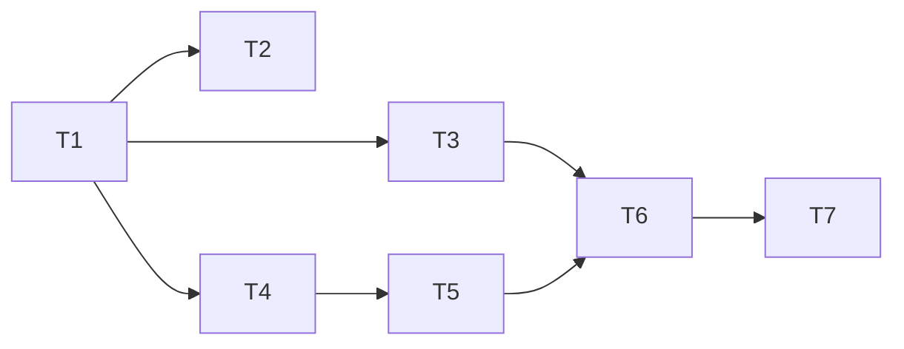

# Fix 01 — Post-Ingest Structural Lint Hints

> **优先级**：P0  
> **预计工作量**：半天（~100 行代码 + 1 个 UI 组件）  
> **修复的差距**：[gap-analysis-detailed.md § ②](./gap-analysis-detailed.md#②-post-ingest-lint-hints--写入后缺健康反馈)

---

## 1. 背景与目标

### 问题

Rohit gist 的方向不是“写完 source 就结束”，而是把 ingest、index、graph、quality controls 放在同一条自动维护链路里。raw gist 没有必要被解读成一个必须一字不差实现的四步 pipeline；更准确的工程差距是：`src/lib/ingest.ts` 成功写入后没有任何 post-ingest health feedback。

现在用户 ingest 一个文档后，新产生的 orphan page / broken wikilink / 孤立节点不会被主动提示，必须用户主动去 Settings → Lint 面板才会看到。

### 目标

在 ingest 成功的末尾 best-effort 跑一次 **structural lint**，把结果写到 `.llm-wiki/ingest-lint-hints.json`。Activity Panel 检测到这个文件就显示一个徽章 “N hints from last ingest”，点击跳转到 Lint 面板。

这不是 semantic lint，也不是自动修复。它只是把本地、确定性、可解释的健康检查结果提前暴露出来。

### 非目标（范围外）

- 不跑 semantic lint（需要 LLM 调用，会拖慢 ingest，也可能误报）。
- 不自动修复发现的问题。
- 不在 ingest 失败时跑 lint。
- 不改 `runStructuralLint` 本身的规则语义。
- 不把 hints 写入 Markdown；只写 `.llm-wiki/` 派生状态。

---

## 2. 技术方案

### 数据结构

新文件 `.llm-wiki/ingest-lint-hints.json` schema：

```ts
interface IngestLintHints {
  ingestId: string
  timestamp: number
  sourcePath: string
  hints: LintResult[]
  totalCount: number
}
```

### 代码改动点

**文件 1**：`src/lib/ingest-lint-hints.ts`（新建）

```ts
import { runStructuralLint, type LintResult } from "./lint"
import { deleteFile, readFile, writeFile } from "@/commands/fs"

export interface IngestLintHints {
  ingestId: string
  timestamp: number
  sourcePath: string
  hints: LintResult[]
  totalCount: number
}

export const INGEST_LINT_HINTS_PATH_REL = ".llm-wiki/ingest-lint-hints.json"

export async function writePostIngestLintHints(
  projectPath: string,
  ingestId: string,
  sourcePath: string,
): Promise<void> {
  const hints = await runStructuralLint(projectPath)
  if (hints.length === 0) {
    await clearPostIngestLintHints(projectPath)
    return
  }

  const payload: IngestLintHints = {
    ingestId,
    timestamp: Date.now(),
    sourcePath,
    hints,
    totalCount: hints.length,
  }
  await writeFile(`${projectPath}/${INGEST_LINT_HINTS_PATH_REL}`, JSON.stringify(payload, null, 2))
}

export async function clearPostIngestLintHints(projectPath: string): Promise<void> {
  try {
    await deleteFile(`${projectPath}/${INGEST_LINT_HINTS_PATH_REL}`)
  } catch {
    // File may not exist; clearing stale hints is best-effort.
  }
}

export async function readPostIngestLintHints(
  projectPath: string,
): Promise<IngestLintHints | null> {
  try {
    const raw = await readFile(`${projectPath}/${INGEST_LINT_HINTS_PATH_REL}`)
    const parsed = JSON.parse(raw) as IngestLintHints
    return typeof parsed.totalCount === "number" ? parsed : null
  } catch {
    return null
  }
}
```

**文件 2**：`src/lib/ingest.ts`

在 `autoIngestImpl()` 成功更新 activity、准备 `return writtenPaths` 前添加：

```ts
try {
  await writePostIngestLintHints(projectPath, activityId, sourcePath)
} catch (err) {
  console.warn("[ingest] post-ingest lint hints failed:", err)
}
```

要求：lint hints 失败不得影响 ingest 成功结果。

**文件 3**：`src/components/layout/post-ingest-lint-badge.tsx`（新建）

- 读取 `readPostIngestLintHints(projectPath)`。
- 有 hints 且 `totalCount > 0` 时显示 amber badge。
- 点击设置 `activeView` 为 `lint`。
- 不只靠颜色表达状态，文本要写出数量。

**文件 4**：`src/components/layout/activity-panel.tsx`

在 Activity Panel 顶部挂载：

```tsx
{projectPath && <PostIngestLintBadge projectPath={projectPath} />}
```

### 为什么写文件而不是只放 zustand store？

- 跨 session 持久：用户关闭 app 再打开，上次 ingest 的 hints 仍然可见。
- `.llm-wiki/` 是本地派生状态，不污染 `wiki/` source of truth。
- 不破坏 `audit.jsonl` 契约：hints 是可替换的当前状态，不是不可变审计事件。

---

## 3. 任务清单

- [ ] ⏳ **T1** 新建 `src/lib/ingest-lint-hints.ts`，导出 write/read/clear helper。
- [ ] ⏳ **T2** 写 `src/lib/ingest-lint-hints.test.ts`：覆盖空结果清理、非空写入、读取失败、malformed JSON fallback。
- [ ] ⏳ **T3** 在 `src/lib/ingest.ts` 成功路径 best-effort 调用 helper。
- [ ] ⏳ **T4** 新建 `src/components/layout/post-ingest-lint-badge.tsx`。
- [ ] ⏳ **T5** 在 `src/components/layout/activity-panel.tsx` 挂载徽章。
- [ ] ⏳ **T6** 手测：ingest 一个会产生 orphan 的文档，徽章出现并能跳到 Lint 面板。
- [ ] ⏳ **T7** 跑 `npm run test:mocks -- ingest-lint-hints`（或对应 focused test）和 `npm run typecheck`。

依赖：T1 → T2、T3、T4；T4 → T5；T3 + T5 → T6



---

## 4. 验收标准

- [ ] ingest 一个会产生 orphan / broken link 的文档后，Activity Panel 顶部出现提示徽章，数字正确。
- [ ] 点击徽章跳转到 Lint 面板。
- [ ] 再 ingest 一个 structural lint clean 的文档后，旧徽章被清理。
- [ ] 关闭并重开 app，未处理的 hints 仍然显示。
- [ ] `runStructuralLint` 抛异常时，ingest 不失败。
- [ ] 单测覆盖空结果、非空结果、文件读取失败、JSON 损坏。

---

## 5. 风险与缓解

| 风险 | 概率 | 影响 | 缓解 |
|-----|-----|-----|------|
| `runStructuralLint` 在大 wiki 上变慢 | 中 | 中 | 先 best-effort 串行；如实测慢，再改成 deferred task 或 daemon 消费 |
| 并发 ingest 导致 hints 文件后写覆盖前写 | 低 | 低 | hints 表示“last ingest health”，覆盖可接受；如要历史，另写 audit |
| 用户长期忽略徽章 | 中 | 低 | fix-05 的 daemon 会补全局提醒 |
| polling 读取文件造成噪音 | 低 | 低 | 优先订阅 activity/dataVersion；如没有合适事件再低频轮询 |

---

## 6. 备注块（开发期 AI 填入）

### 🐛 遇到的问题
_（开发时填写）_

### 🔧 最终实现逻辑
_（开发时填写）_

### 🎯 关键决策
_（开发时填写）_

---

*关联文档：[gap-analysis.md](./gap-analysis.md)、[gap-analysis-detailed.md § ②](./gap-analysis-detailed.md#②-post-ingest-lint-hints--写入后缺健康反馈)*
