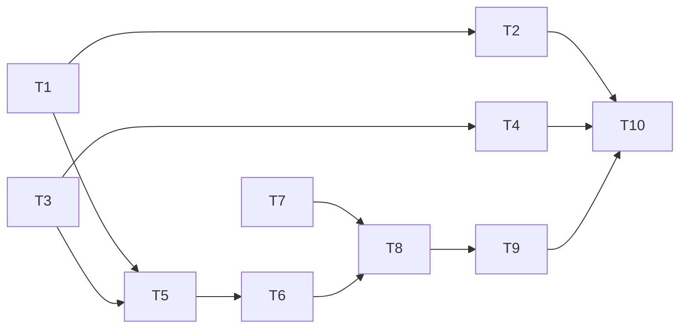

# Fix 03 — Marp Slide Deck Export

> **优先级**：P1
> **预计工作量**：1-2 天（~200 行核心 + 150 行 UI + 测试）
> **修复的差距**：[gap-analysis-detailed.md § ④](./gap-analysis-detailed.md#④-output-formats--只导审计日志不导-wiki-内容)

---

## 1. 背景与目标

### 问题

Rohit gist 明确提到 output formats 应该包括 `"comparison tables, timeline visualizations, dependency graphs, slide decks, JSON/CSV exports, structured briefs"`。但仓库里**唯一的 export 路径** `src/lib/audit-export.ts` 只导审计事件 JSON/CSV，**不导 wiki 内容**。

用户想把一个 query page 的答案放到周报 slide 里，只能手动复制粘贴。gist 里的 "wiki 是知识的生产资料，不只是容器" 这个承诺没兑现。

### 目标

选 **最窄切入点**：**把一个 wiki page 导出成 Marp slide deck**。

Marp 是 markdown + frontmatter 的 slide 格式，技术栈与项目完全吻合。一个 query page（`wiki/queries/*.md`）天然就是一个答案，按 `##` 切成 slide 就是一份可用的汇报。

导出必须保持 local-first：只把当前页面转换成用户选择位置的本地文件，不上传、不调用远程转换服务、不改原 wiki Markdown。

在 preview 面板头部加一个 "Export" 下拉菜单，包含：
- **Export as Marp** (slide deck)
- **Export as CSV** (仅当 page 主体是 markdown table 时激活)

### 非目标

- 不做 matplotlib / 图表生成（需要新依赖）
- 不做 DOT / graphviz 依赖图（用户可以直接看 graph view）
- 不做 timeline 可视化（audit timeline UI 已经够用了）
- 不做批量导出多 page（v1 先单 page）
- 不做 PDF / PPTX 直接转换（Marp CLI 能做，但引入 Node 子进程成本高；导出 .md 让用户自己用 Marp CLI 转）
- 不引入远程导出服务或云端模板系统

---

## 2. 技术方案

### 2.1 Marp 导出

**新建 `src/lib/marp-export.ts`**：

```ts
import type { WikiPage } from "@/types/wiki"

export interface MarpExportOptions {
  theme?: "default" | "gaia" | "uncover"
  paginate?: boolean
  includeFrontmatter?: boolean  // 把 page frontmatter 里的 metadata 放第一张 slide
}

const DEFAULT_OPTIONS: Required<MarpExportOptions> = {
  theme: "default",
  paginate: true,
  includeFrontmatter: true,
}

export function pageToMarp(
  page: WikiPage,
  opts: MarpExportOptions = {},
): string {
  const o = { ...DEFAULT_OPTIONS, ...opts }
  const header = [
    "---",
    "marp: true",
    `theme: ${o.theme}`,
    `paginate: ${o.paginate}`,
    "---",
    "",
  ].join("\n")

  const titleSlide = [
    `# ${page.frontmatter.title ?? page.name}`,
    "",
    o.includeFrontmatter ? formatMetadataSlide(page) : "",
  ].join("\n")

  const bodySlides = splitBodyIntoSlides(page.body)

  return [header, titleSlide, ...bodySlides].join("\n\n---\n\n")
}

// Split markdown body by H2 headings. Each H2 becomes a new slide.
// If body has no H2, return as single slide.
export function splitBodyIntoSlides(body: string): string[] {
  const lines = body.split("\n")
  const slides: string[] = []
  let current: string[] = []
  for (const line of lines) {
    if (line.startsWith("## ")) {
      if (current.length > 0) {
        slides.push(current.join("\n").trim())
        current = []
      }
    }
    current.push(line)
  }
  if (current.length > 0) slides.push(current.join("\n").trim())
  return slides.filter((s) => s.length > 0)
}

function formatMetadataSlide(page: WikiPage): string {
  const fm = page.frontmatter
  const rows: string[] = []
  if (fm.type) rows.push(`**Type**: ${fm.type}`)
  if (fm.created) rows.push(`**Created**: ${fm.created}`)
  if (fm.confidence) rows.push(`**Confidence**: ${fm.confidence}`)
  if (fm.sources?.length) rows.push(`**Sources**: ${fm.sources.length}`)
  return rows.join("  \n")
}
```

**单测 `src/lib/marp-export.test.ts`** 覆盖：
- splitBodyIntoSlides 的分片逻辑（无 H2、单 H2、多 H2、H2 前有内容）
- pageToMarp 生成的 frontmatter 合法
- 空 body、缺失字段的健壮性

### 2.2 CSV 导出（可选增强）

**新建 `src/lib/table-export.ts`**：

```ts
// Detect whether page body is predominantly a markdown table
export function hasDominantMarkdownTable(body: string): boolean {
  const lines = body.split("\n").filter((l) => l.trim().length > 0)
  if (lines.length < 3) return false
  const tableLines = lines.filter((l) => l.trim().startsWith("|"))
  return tableLines.length / lines.length > 0.6
}

// Extract the first markdown table and convert to CSV
export function extractFirstTableAsCSV(body: string): string | null {
  const lines = body.split("\n")
  let inTable = false
  const tableLines: string[] = []
  for (const line of lines) {
    const trimmed = line.trim()
    if (trimmed.startsWith("|") && trimmed.endsWith("|")) {
      inTable = true
      tableLines.push(trimmed)
    } else if (inTable) {
      break
    }
  }
  if (tableLines.length < 2) return null
  // Skip alignment row (|---|---|)
  const rows = tableLines.filter((l) => !/^\|[\s\-:|]+\|$/.test(l))
  return rows.map(markdownRowToCSVRow).join("\n")
}

function markdownRowToCSVRow(row: string): string {
  const cells = row
    .slice(1, -1)  // strip leading/trailing |
    .split("|")
    .map((c) => c.trim())
    .map(escapeCSV)
  return cells.join(",")
}

function escapeCSV(cell: string): string {
  if (cell.includes(",") || cell.includes('"') || cell.includes("\n")) {
    return `"${cell.replace(/"/g, '""')}"`
  }
  return cell
}
```

### 2.3 UI 集成

**文件**：`src/components/layout/preview-panel.tsx`（文件头部 close 按钮在行 90-99）

**改动**：在 header 区域（与 close 按钮 flex 同级）加一个 `<ExportMenu page={...} />` 组件。

**新建 `src/components/layout/export-menu.tsx`**：

```tsx
import { useState } from "react"
import { save } from "@tauri-apps/plugin-dialog"
import { writeFile } from "@/commands/fs"
import { pageToMarp } from "@/lib/marp-export"
import { hasDominantMarkdownTable, extractFirstTableAsCSV } from "@/lib/table-export"
import type { WikiPage } from "@/types/wiki"
import { Download } from "lucide-react"

export function ExportMenu({ page }: { page: WikiPage }) {
  const [open, setOpen] = useState(false)
  const canExportCSV = hasDominantMarkdownTable(page.body)

  const handleExportMarp = async () => {
    const marp = pageToMarp(page)
    const defaultName = `${page.name.replace(/\.md$/, "")}.marp.md`
    const path = await save({
      defaultPath: defaultName,
      filters: [{ name: "Marp Slide Deck", extensions: ["md"] }],
    })
    if (path) await writeFile(path, marp)
    setOpen(false)
  }

  const handleExportCSV = async () => {
    const csv = extractFirstTableAsCSV(page.body)
    if (!csv) return
    const defaultName = `${page.name.replace(/\.md$/, "")}.csv`
    const path = await save({
      defaultPath: defaultName,
      filters: [{ name: "CSV", extensions: ["csv"] }],
    })
    if (path) await writeFile(path, csv)
    setOpen(false)
  }

  return (
    <div className="relative">
      <button
        onClick={() => setOpen(!open)}
        className="p-1 rounded hover:bg-muted"
        title="Export"
      >
        <Download className="w-4 h-4" />
      </button>
      {open && (
        <div className="absolute right-0 mt-1 w-48 bg-popover border rounded shadow-md z-10">
          <button
            className="w-full text-left px-3 py-2 hover:bg-muted text-sm"
            onClick={handleExportMarp}
          >
            Export as Marp slides
          </button>
          <button
            className="w-full text-left px-3 py-2 hover:bg-muted text-sm disabled:opacity-50"
            disabled={!canExportCSV}
            onClick={handleExportCSV}
          >
            Export table as CSV
          </button>
        </div>
      )}
    </div>
  )
}
```

### 2.4 Tauri dialog.save 先例

代码库目前**没有**用过 `@tauri-apps/plugin-dialog` 的 `save()` API。需要：

1. 确认 `save` 从 `@tauri-apps/plugin-dialog` 已正确导出（当前版本 `^2.7.0`）
2. 确认 `tauri.conf.json` 的 `plugins.dialog` 允许 save（一般默认允许）
3. 首次调用可能触发用户授权对话框，属正常

### 2.5 README / docs 更新

在 `README.md` 的 Features 列表加一条：

```markdown
- **Export to Marp / CSV** — turn a query page into a slide deck, or extract
  comparison tables as CSV. Knowledge is a product, not just storage.
```

---

## 3. 任务清单

- [ ] ⏳ **T1** 新建 `src/lib/marp-export.ts`
- [ ] ⏳ **T2** 单测 `src/lib/marp-export.test.ts`，覆盖 5-8 个分片场景
- [ ] ⏳ **T3** 新建 `src/lib/table-export.ts`
- [ ] ⏳ **T4** 单测 `src/lib/table-export.test.ts`，覆盖 table detection 和 CSV escape
- [ ] ⏳ **T5** 新建 `src/components/layout/export-menu.tsx`
- [ ] ⏳ **T6** 集成到 `src/components/layout/preview-panel.tsx` 行 90-99 header 区
- [ ] ⏳ **T7** 确认 `@tauri-apps/plugin-dialog` 的 `save` 在当前版本可用；必要时调整 tauri.conf.json
- [ ] ⏳ **T8** 手测：
  - ingest 一个多 H2 的文档，导出 Marp，在 Marp CLI / VS Code 插件里预览
  - chat 生成一个 comparison table 保存到 wiki，导出 CSV，Excel 打开正确
- [ ] ⏳ **T9** README.md Features 加一条
- [ ] ⏳ **T10** `npm run typecheck` + `npm run test:mocks` 通过

依赖：T1 → T2, T5；T3 → T4, T5；T5 → T6；T7 是 T8 的前置；T6+T7 → T8



---

## 4. 验收标准

### Marp 导出
- [ ] 任意 wiki page 点击 Export → Marp，产出合法的 Marp markdown
- [ ] 用 Marp CLI (`marp file.marp.md`) 能直接转成 HTML/PDF
- [ ] H2 切片正确（多 H2 → 多 slide；无 H2 → 单 slide）
- [ ] Title slide 包含 page 标题 + 关键 metadata（type/created/confidence/sources）

### CSV 导出
- [ ] 对 table-heavy page（>60% table 行），"Export as CSV" 按钮激活
- [ ] 对普通 page，按钮 disabled
- [ ] 导出的 CSV 在 Excel / Numbers / VS Code CSV preview 里列对齐
- [ ] 包含逗号 / 引号 / 换行的 cell 正确 escape（`"foo, bar"` / `"he said ""hi"""`)

### 整体
- [ ] `npm run typecheck` 和 `npm run test:mocks` 全绿
- [ ] 导出操作不改 wiki 原文件（只往外写）
- [ ] 导出操作不访问网络、不依赖远程服务
- [ ] 用户 cancel save dialog 时不报错、不写空文件

---

## 5. 风险与缓解

| 风险 | 概率 | 影响 | 缓解 |
|-----|-----|-----|------|
| Marp 不是标准 markdown 子集，某些 wiki 特性（wikilink / math）在 Marp 里不渲染 | 高 | 中 | 文档里说明：导出是"转换"不是"镜像"；wikilink 保留为纯文本，math 由 Marp 自己的 KaTeX 处理 |
| CSV table detection 误判（比如 page 里只有一个小表格） | 中 | 低 | 阈值 >60% 可调；按钮 disabled 时保持可见让用户知道"为什么不能导" |
| `@tauri-apps/plugin-dialog` save API 在当前 v2.7.0 行为异常 | 低 | 高 | T7 提前验证；有问题退回用 `writeFile` + fixed path |
| 用户期望更多格式（PDF / PPTX） | 高 | 低 | README 明说 v1 只有 Marp / CSV，后续可加 |
| Milkdown 编辑器内的 math block 转到 Marp 后显示异常 | 中 | 低 | Marp 原生支持 math，一般没问题；有差异在 README 说明 |

---

## 6. 备注块

### 🐛 遇到的问题
_（开发时填）_

### 🔧 最终实现逻辑
_（开发时填）_

### 🎯 关键决策
_（切片规则 / 默认 theme / 是否把 sources 转成 footer 等）_

---

*关联文档：[gap-analysis.md](./gap-analysis.md)、[gap-analysis-detailed.md § ④](./gap-analysis-detailed.md#④-output-formats--只导审计日志不导-wiki-内容)*
