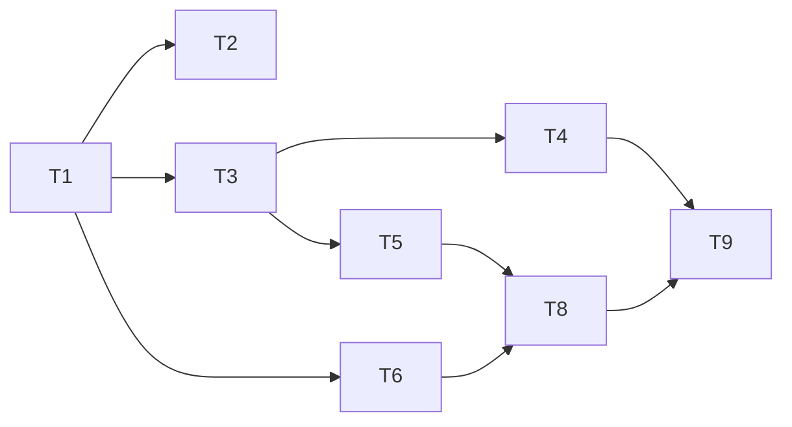

# Fix 05 — App-Resident Local Maintenance Daemon

> **优先级**：P2  
> **预计工作量**：1-2 天（~150 行核心 + UI 提醒 + 测试）  
> **修复的差距**：[gap-analysis-detailed.md § 二 ❌ Schedule](./gap-analysis-detailed.md#-schedule-事件--定期衰减--自动巡检)

---

## 1. 背景与目标

### 问题

现有 Memory Ops 已经有 event-threshold auto patrol：用户活动达到阈值、cooldown 满足时，可以触发 patrol。但它不是一个默认按时间检查的本地维护循环。

用户已经确认：“后台 daemon 还是要的”，并明确 daemon 默认 **15 分钟**跑一次维护检查。这里的 daemon 指 app-resident local daemon：Tauri app 进程仍在运行时，包括 macOS close-to-hide 后，可以在本机做轻量 due check；app 完全退出后不运行。

### 目标

新增一个 app-resident local maintenance daemon：

- 默认每 15 分钟做一次轻量 maintenance due check。
- due check 读取现有 `memoryOpsMaintenanceStateByProject` 和 `MemoryOpsPolicy`。
- `autoPatrolEnabled=false` 时只产生 reminder / activity item，不跑 patrol。
- `autoPatrolEnabled=true` 且 event/time due、cooldown、minPatrolInterval 都满足时，调用现有 `scheduleAutoMemoryOpsPatrol(projectPath, "local-maintenance-daemon")`。
- project 切换、app unmount、React StrictMode 重挂载时不会留下重复 interval。

这不是远程 daemon，也不是 OS 级 LaunchAgent。它随 app 进程启动和停止。

### 非目标

- 不安装 OS 级常驻服务、登录项、LaunchAgent 或 app 退出后的后台任务。
- 不引入远程 scheduler / backend。
- 不让 daemon 静默改 Markdown；patrol 仍只产生 suggestions / audit / maintenance state，实际应用变更仍走用户确认。
- 不把“15 分钟”理解成每 15 分钟全量 patrol；默认只是轻量 due check。
- 不在 daemon 里跑 LLM semantic contradiction scan。

---

## 2. 技术方案

### 2.1 策略配置

**文件**：`src/lib/memory-ops-policy.ts`

在 `MemoryOpsAutomationPolicy` 中新增：

```ts
maintenanceDaemonEnabled: boolean
maintenanceCheckIntervalMinutes: number
```

默认值：

```ts
automation: {
  autoPatrolEnabled: true,
  eventThreshold: 5,
  reminderCooldownMinutes: 30,
  minPatrolIntervalMinutes: 30,
  timeIntervalHours: 24,
  maintenanceDaemonEnabled: true,
  maintenanceCheckIntervalMinutes: 15,
}
```

`normalizeMemoryOpsPolicy()` 要兼容旧配置：缺字段时回落默认值。

### 2.2 轻量 due check helper

**新建 `src/lib/local-maintenance-daemon.ts`**：

```ts
import {
  getMemoryOpsMaintenanceStatus,
  scheduleAutoMemoryOpsPatrol,
  type MemoryOpsMaintenanceStatus,
} from "@/lib/memory-ops"
import { loadMemoryOpsPolicy } from "@/lib/memory-ops-policy"
import { useActivityStore } from "@/stores/activity-store"

export interface LocalMaintenanceDaemonHandle {
  stop: () => void
}

export interface LocalMaintenanceDaemonOptions {
  intervalMs?: number
  onStatus?: (status: MemoryOpsMaintenanceStatus) => void
}

export function startLocalMaintenanceDaemon(
  projectPath: string,
  options: LocalMaintenanceDaemonOptions = {},
): LocalMaintenanceDaemonHandle {
  let stopped = false
  let inFlight = false
  let timer: ReturnType<typeof setInterval> | undefined
  const intervalMs = options.intervalMs ?? 15 * 60 * 1000

  const tick = async () => {
    if (stopped || inFlight) return
    inFlight = true
    try {
      await runLocalMaintenanceCheck(projectPath, options)
    } finally {
      inFlight = false
    }
  }

  void tick()
  timer = setInterval(tick, intervalMs)

  return {
    stop: () => {
      stopped = true
      if (timer) clearInterval(timer)
    },
  }
}

export async function runLocalMaintenanceCheck(
  projectPath: string,
  options: LocalMaintenanceDaemonOptions = {},
): Promise<MemoryOpsMaintenanceStatus> {
  const { policy } = await loadMemoryOpsPolicy(projectPath)
  const status = await getMemoryOpsMaintenanceStatus(projectPath)
  options.onStatus?.(status)

  if (!status.reminderDue) return status

  useActivityStore.getState().addItem({
    type: "maintenance",
    title: "Memory Ops patrol recommended",
    status: "done",
    detail: `Local daemon found patrol due: ${status.dueReasons.join(", ")}.`,
    filesWritten: [],
  })

  if (policy.automation.autoPatrolEnabled) {
    scheduleAutoMemoryOpsPatrol(projectPath, "local-maintenance-daemon")
  }
  return status
}
```

实现时可按实际接口调整，但原则保持：

- interval controller 和单次 due check 分开，方便单测。
- 单次 check 必须轻量：读取 policy + maintenance status，不全量 scan。
- in-flight guard 防止上一次 check 未结束时重入。
- 使用现有 `scheduleAutoMemoryOpsPatrol()`，复用 auto patrol in-flight 保护和错误审计。

### 2.3 React lifecycle 接入

**文件**：`src/App.tsx`

在 project 已设置后启动 daemon：

```tsx
useEffect(() => {
  if (!project) return
  let handle: LocalMaintenanceDaemonHandle | undefined
  let cancelled = false

  ;(async () => {
    const { loadMemoryOpsPolicy } = await import("@/lib/memory-ops-policy")
    const { startLocalMaintenanceDaemon } = await import("@/lib/local-maintenance-daemon")
    const { policy } = await loadMemoryOpsPolicy(project.path)
    if (cancelled || !policy.automation.maintenanceDaemonEnabled) return
    handle = startLocalMaintenanceDaemon(project.path, {
      intervalMs: policy.automation.maintenanceCheckIntervalMinutes * 60 * 1000,
    })
  })().catch((err) =>
    console.warn("[local-maintenance-daemon] failed to start:", err),
  )

  return () => {
    cancelled = true
    handle?.stop()
  }
}, [project?.path])
```

### 2.4 UI 提醒

v1 可以复用 Activity Store 的 maintenance item。若要更显眼，可新增 layout banner：

- `src/stores/local-maintenance-store.ts`
- `src/components/layout/local-maintenance-banner.tsx`
- banner 只展示 `status.reminderDue` 的当前提醒，支持 dismiss 本次 session。

本轮最低验收不强制 banner；Activity item + Memory Ops panel status 已可用。若产品体验要求更强，再加 banner。

### 2.5 Policy 面板

**文件**：`src/components/settings/sections/memory-ops-policy-panel.tsx`

在 Automation 区域加两个控件：

- Enable local maintenance daemon（默认 on）
- Maintenance check interval minutes（默认 15，最小建议 5）

文案必须说明：“This checks due state only; it is not a full patrol interval.”

---

## 3. 任务清单

- [ ] ⏳ **T1** 扩展 `MemoryOpsAutomationPolicy`：`maintenanceDaemonEnabled`、`maintenanceCheckIntervalMinutes`，默认 15 分钟。
- [ ] ⏳ **T2** 更新 `normalizeMemoryOpsPolicy()` 和 `src/lib/memory-ops-policy.test.ts`，兼容旧 policy。
- [ ] ⏳ **T3** 新建 `src/lib/local-maintenance-daemon.ts`，拆分 `startLocalMaintenanceDaemon` 和 `runLocalMaintenanceCheck`。
- [ ] ⏳ **T4** 写 `src/lib/local-maintenance-daemon.test.ts`：覆盖 due/no due、autoPatrol on/off、in-flight guard、stop clears interval。
- [ ] ⏳ **T5** 在 `src/App.tsx` 按 project lifecycle 启停 daemon。
- [ ] ⏳ **T6** 在 `memory-ops-policy-panel.tsx` 增加开关和 interval 输入。
- [ ] ⏳ **T7** 更新 i18n 文案（英文/中文，如果项目当前维护双语）。
- [ ] ⏳ **T8** 手测：
  - 默认 policy 下打开 project，daemon 启动。
  - interval 调成测试值后，到期只做 due check。
  - `autoPatrolEnabled=false` 时只产生 reminder，不跑 patrol。
  - `autoPatrolEnabled=true` 且 due 时调度 auto patrol。
  - 切换 project 后旧 interval 停止，新 project 启动。
- [ ] ⏳ **T9** 跑 `npm run typecheck` + 相关 mocks tests。

依赖：T1 → T2、T3、T6；T3 → T4、T5；T5+T6 → T8



---

## 4. 验收标准

- [ ] 默认 policy 中 daemon enabled，interval 为 15 分钟。
- [ ] daemon 每次 tick 只做 lightweight due check，不全量 scan。
- [ ] `autoPatrolEnabled=false` 时，不调用 `scheduleAutoMemoryOpsPatrol`。
- [ ] `autoPatrolEnabled=true` 且 status `reminderDue=true` 时，调用 `scheduleAutoMemoryOpsPatrol(projectPath, "local-maintenance-daemon")`。
- [ ] interval 重入被保护；长 check 不会并发执行。
- [ ] project 切换 / unmount 会清理旧 interval。
- [ ] app 完全退出后没有 OS 级后台服务。
- [ ] `npm run typecheck` 和相关 mocks tests 通过。

---

## 5. 风险与缓解

| 风险 | 概率 | 影响 | 缓解 |
|-----|-----|-----|------|
| 用户误以为 15 分钟会全量 patrol | 中 | 中 | README、policy 文案和 UI 都写明“lightweight due check” |
| React StrictMode 导致重复 interval | 中 | 中 | effect cleanup + handle.stop + 单测覆盖 |
| 大项目 due check 变重 | 低 | 中 | due check 只读 policy/maintenance state，不扫描 wiki |
| 自动 patrol 太频繁 | 低 | 中 | 继续复用 `minPatrolIntervalMinutes`、cooldown 和 `scheduleAutoMemoryOpsPatrol` in-flight guard |
| daemon 被理解成远程服务 | 中 | 高 | README 明确 app-resident、本地、app quit 后停止 |

### 关于 local-first 合规性

| 能力 | 本 fix |
|-----|------|
| 远程服务 | 不引入 |
| OS 常驻 | 不引入 |
| app 运行期本地循环 | 引入 |
| 默认间隔 | 15 分钟轻量 due check |
| 自动写 Markdown | 不允许 |
| 自动 patrol | 仅 policy 允许且 gate 满足时调度现有 deterministic patrol |

---

## 6. 备注块

### 🐛 遇到的问题
_（开发时填）_

### 🔧 最终实现逻辑
_（开发时填）_

### 🎯 关键决策
_（interval 默认值、policy 字段名、是否加 banner 等）_

---

*关联文档：[gap-analysis.md](./gap-analysis.md)、[gap-analysis-detailed.md § 二](./gap-analysis-detailed.md#-schedule-事件--定期衰减--自动巡检)*
