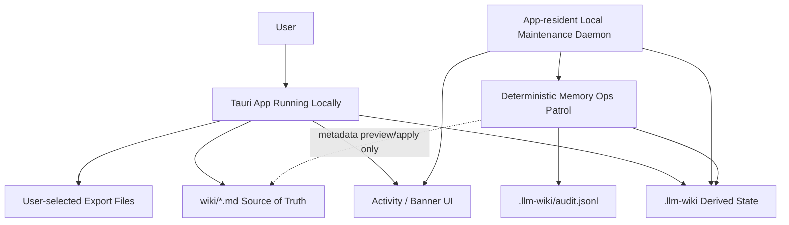
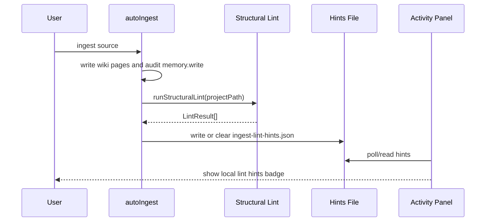
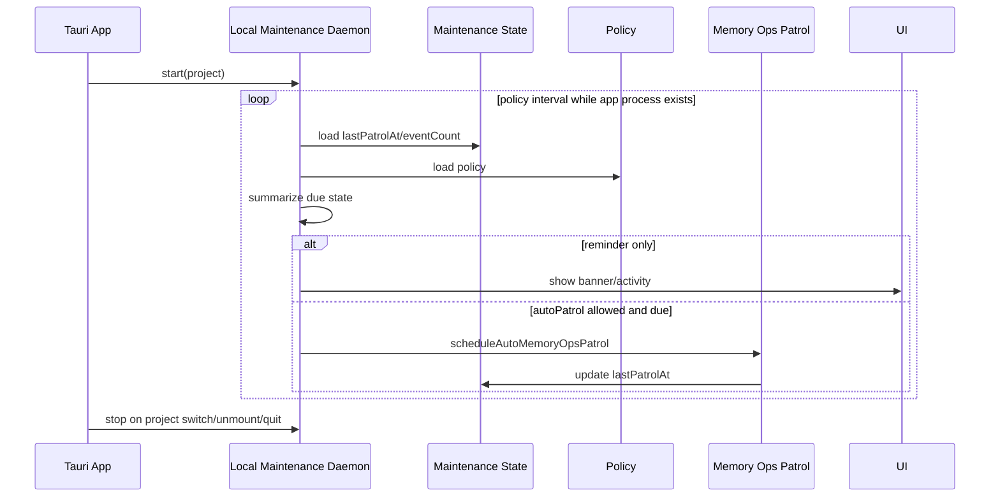

# 需求文档 — LLM Wiki v2 Rohit Gap Local-First Closure

**版本**: v0.1
**日期**: 2026-05-10
**作者**: user + AI
**状态**: 已完成（二次 dev-spec-flow 复核通过）
**关联任务列表**: [`tasks.md`](./tasks.md)

---

## 1. 背景

`docs/llm-wiki-v2-rohit-gap-analysis/` 已经产出 9 份对照 Rohit LLM Wiki v2 gist 的差距分析和修复计划。Phase 1 调研确认：这些文档的大方向成立，但部分表述把 Rohit 的“能力谱系”理解成了必须完整实现的蓝图，容易把项目推向远程 memory server、多用户 mesh sync 或隐式自动写入。

本项目的收口方向是 **local-first**：Markdown 仍是 source of truth，`.llm-wiki/` 保存可重建的本地派生索引、审计、维护状态和建议。Rohit gist 中的 automation、lifecycle、quality controls、output formats 值得吸收；collaboration、mesh sync、远程后端和多用户 ACL 不进入本期。

用户进一步明确“后台 daemon 还是要的”。因此本期不再把 daemon 简化成“只启动时检查一次”，而是实现一个 **app-resident local maintenance daemon**：Tauri app 运行期间，包括 macOS close-to-hide 后仍在本地后台时，可以按本地策略检查 patrol due、stale confidence、post-ingest lint hints，并运行允许范围内的确定性维护。它不是远程服务，不在 app 完全退出后运行，也不绕过用户确认重写 Markdown。

## 2. 目标

### 2.1 范围内

- ✅ 修订现有 Rohit gap analysis 文档中过度扩张或证据不准的表述，特别是 auto-lint、daemon、mesh sync、deep contradiction scan。
- ✅ README / README_CN 前置 local-first 设计哲学，明确本地存储、人类写入闸门、本地 daemon 的边界。
- ✅ 在 ingest 完成后运行 best-effort structural lint，持久化本地 hints，并在 Activity Panel 显示提示。
- ✅ 支持本地导出单个 Markdown wiki page 为 Marp slide deck，支持把 Markdown table 导出为 CSV。
- ✅ 显示 confidence stale 提示，让静态 frontmatter confidence 的过期风险可见。
- ✅ 实现 app-resident local maintenance daemon，在 app 运行期间按策略检查并提醒或触发本地 deterministic patrol。
- ✅ 保持所有写入 Git-friendly、可审计、可回滚；所有建议都优先走 preview/apply/ignore 或 review 队列。

### 2.2 范围外

- ❌ 不做远程 memory server、REST/MCP memory backend、新数据库或云端同步。
- ❌ 不做 mesh sync、多用户 ACL、团队权限、shared/private 的跨设备同步。
- ❌ 不做 OS 级常驻服务、LaunchAgent、登录项安装器或 app 完全退出后的后台运行。本期 daemon 只在 app 进程存在时工作。
- ❌ 不让 LLM 自动判真、自动解决 contradiction 或自动重写 Markdown。
- ❌ 不直接导出 PDF/PPTX，不引入 Marp CLI 子进程。本期只生成 `.marp.md` 和 `.csv` 文件。
- ❌ 不做全库 O(n²) deep contradiction scan。本期只把它保留为未来手动 review 工具，不进入实现。

### 2.3 成功标准

- 现有 9 份 gap 文档与 README/README_CN 都能清楚表达：这是 local-first 实现，不是远程协作 memory server。
- Ingest 后 structural lint hints 能在本地生成、读取、清理，失败不影响 ingest 主流程。
- 用户能从 preview panel 将当前 Markdown page 保存为 Marp markdown；table-heavy page 能保存 CSV。
- 超过半衰期的 `last_confirmed` 在 frontmatter panel 里显示 stale 提示，并能跳转到 Maintenance。
- App 运行期间 local maintenance daemon 能按 policy 检查 patrol overdue / reminder due，且不会在 app quit 后继续运行。
- `npm run typecheck`、`npm run test:mocks` 通过；必要时补跑相关 focused tests。

## 3. 用户场景 / 用户故事

### 3.1 场景 1: 摄入后看到本地 lint hints

**角色**: 单机知识库用户

**前置条件**: 已打开本地 project，ingest 一个文档。

**步骤**:
1. 用户从 Sources 或 chat 保存文件到 wiki。
2. 系统完成 `autoIngest` 并写入 wiki pages。
3. 系统在 ingest 主流程成功后 best-effort 运行 structural lint。
4. 如果发现 orphan / broken link / no-outlinks / lifecycle issue，系统写入 `.llm-wiki/ingest-lint-hints.json`。
5. Activity Panel 显示 “N local lint hints from last ingest”。
6. 用户点击提示进入 Lint view。

**预期结果**: 用户第一时间知道新 ingest 引入了哪些本地结构问题；lint 失败不会让 ingest 失败。

### 3.2 场景 2: 把本地 wiki 内容导出给汇报使用

**角色**: 需要做汇报或周报的用户

**前置条件**: Preview Panel 已打开一个 Markdown wiki page。

**步骤**:
1. 用户点击 preview header 的 Export 按钮。
2. 用户选择 “Export as Marp slides”。
3. 系统用 Tauri dialog `save()` 让用户选择本地保存路径。
4. 系统写出 `.marp.md` 文件，不改原 wiki page。
5. 如果页面主体主要是 Markdown table，用户还能选择 “Export table as CSV”。

**预期结果**: wiki 内容能本地转成可交付材料；导出动作只写用户选择的本地文件。

### 3.3 场景 3: 本地后台维护提醒

**角色**: 长期使用本地知识库的用户

**前置条件**: app 已打开或在 macOS close-to-hide 后仍在后台运行；project 有历史 `lastPatrolAt`。

**步骤**:
1. local maintenance daemon 默认每 15 分钟按 policy 做一次轻量 maintenance due check。
2. 如果超过 patrol threshold 或 event threshold，系统显示非阻塞 banner/activity。
3. 如果 `autoPatrolEnabled` 为 true，且 cooldown / interval gate 满足，系统可以运行本地 deterministic patrol。
4. 如果 `autoPatrolEnabled` 为 false，系统只提醒用户去 Maintenance 手动运行。

**预期结果**: 用户无需记住手动巡检；但系统不在 app 完全退出后运行，也不自动改写 Markdown。

### 3.4 场景 4: 看见 stale confidence

**角色**: 需要判断知识可信度的用户

**前置条件**: 打开一个含 `last_confirmed`、`lifecycle`、`confidence` 的 wiki page。

**步骤**:
1. Frontmatter Panel 根据 lifecycle half-life 和 `last_confirmed` 计算 stale 状态。
2. 如果已超过阈值，显示 amber 提示。
3. 用户点击提示跳转到 Settings -> Maintenance。

**预期结果**: confidence 的“快照属性”对用户透明；刷新仍由本地 patrol 或用户确认触发。

## 4. 功能需求

### F1: Gap Analysis 文档修订

**描述**: 修正现有文档中把 Rohit gist 当成完整产品蓝图的表述，按 local-first 边界重新排序。

**输入**: `docs/llm-wiki-v2-rohit-gap-analysis/*.md`、Rohit gist、当前 README/代码。

**行为**:
- 把 mesh sync / remote backend / multi-user ACL 标成明确 out of scope。
- 把 auto-lint on ingest 的证据改成“符合 Rohit automation/self-healing 方向”，不再声称 raw gist 有精确四步句子。
- 把 daemon 从“不要”改成“需要 app-resident local maintenance daemon；OS-level daemon later”。
- 把 deep contradiction scan 标为 future manual review tool。

**输出**: 修订后的 gap 文档。

**验收标准**:
- [x] 文档不再要求远程服务或多用户同步。
- [x] 文档明确 app-resident daemon 和 OS-level daemon 的区别。
- [x] 文档能解释为什么 deep contradiction scan 不进入本期实现。

### F2: README / README_CN Local-First Design Philosophy

**描述**: 将 local-first、human-gated、本地 daemon 边界前置到 README 开头区域。

**输入**: `README.md`、`README_CN.md`。

**行为**:
- 在 Features 后、详细章节前增加短设计哲学段落。
- 同步中英文，避免只改英文。
- 保留现有 Memory Ops 详细描述，不重复铺陈。

**输出**: 更新后的 README/README_CN。

**验收标准**:
- [x] README 和 README_CN 都明确 Markdown source of truth。
- [x] 文档明确 LLM 不自动判真、不静默重写 Markdown。
- [x] 文档明确 daemon 是本地 app 运行期维护循环，不是远程 server。

### F3: Post-Ingest Structural Lint Hints

**描述**: 在 `autoIngest` 成功后生成本地 structural lint hints，并在 Activity Panel 提示。

**输入**: `projectPath`、`activityId`、`sourcePath`、`runStructuralLint(projectPath)` 结果。

**行为**:
- 新建 `src/lib/ingest-lint-hints.ts`，负责读写/清理 `.llm-wiki/ingest-lint-hints.json`。
- 在 `src/lib/ingest.ts` 成功更新 activity 后调用 best-effort helper。
- 新建 Activity Panel badge，点击进入 `lint` view。
- 无 findings 时清理旧 hints。

**输出**: `.llm-wiki/ingest-lint-hints.json` 或清理后的无提示状态。

**验收标准**:
- [x] structural lint findings 能持久化为 hints。
- [x] clean ingest 后旧 hints 清除。
- [x] lint helper 异常只 `console.warn`，不改变 ingest 成功/失败状态。
- [x] Activity Panel 显示 hints 数量并能跳到 Lint view。

### F4: Local Marp / CSV Export

**描述**: 从 Preview Panel 导出当前 Markdown page 为本地 `.marp.md` 或 `.csv`。

**输入**: `selectedFile`、`fileContent`、解析出的 frontmatter/body。

**行为**:
- 新建 `src/lib/marp-export.ts`，按 H2 切分 slides，生成 Marp frontmatter。
- 新建 `src/lib/table-export.ts`，检测第一张 Markdown table 并转 CSV。
- 新建 `src/components/layout/export-menu.tsx`，通过 Tauri `save()` 选择保存路径。
- 集成到 `src/components/layout/preview-panel.tsx` header。

**输出**: 用户选择路径上的 `.marp.md` 或 `.csv` 文件。

**验收标准**:
- [x] Marp markdown 包含合法 `marp: true` header。
- [x] 无 H2 页面导出为单页内容，有多个 H2 时拆成多张 slides。
- [x] CSV 正确处理逗号、引号、换行。
- [x] 取消 save dialog 时不写文件、不报错。
- [x] 导出不改 wiki 原文件。

### F5: Confidence Stale Badge

**描述**: 在 Frontmatter Panel 里显示 confidence 可能过期的本地 UI 提示。

**输入**: `last_confirmed`、`lifecycle`、Memory Ops half-life 默认值。

**行为**:
- 新增纯函数评估 staleness。
- 在 lifecycle chips 附近显示 amber badge。
- 点击 “Run patrol” 跳转 Settings -> Maintenance。

**输出**: 可见的 stale warning。

**验收标准**:
- [x] 超过 half-life 时显示提示。
- [x] 缺失或非法 `last_confirmed` 不显示且不崩溃。
- [x] `archived` 页面不显示 stale warning。
- [x] 点击跳转到 Settings -> Maintenance。

### F6: App-Resident Local Maintenance Daemon

**描述**: 在 app 运行期间维护一个本地后台循环，按 policy 检查 maintenance due 状态，并触发提醒或确定性 patrol。

**输入**: 当前 project、`MemoryOpsPolicy`、`PersistedMemoryOpsMaintenanceState`、app lifecycle。

**行为**:
- 新增 `src/lib/local-maintenance-daemon.ts`，暴露 start/stop 或 React hook 友好的 controller。
- 每次 project open 时启动；project switch 或 unmount 时停止。
- 使用现有 `summarizeMemoryOpsMaintenanceStatus` / `recordMemoryOpsMaintenanceEvent` / `scheduleAutoMemoryOpsPatrol` 语义，不绕过 policy。
- 默认只显示提醒；只有 policy 允许且 cooldown 满足时才运行 deterministic patrol。
- 所有自动行为写 activity/audit，不改写 Markdown 内容。

**输出**: Activity item、banner/store 状态，或一次本地 deterministic patrol。

**验收标准**:
- [x] 同一 project 同时最多一个 loop。
- [x] app 运行/隐藏时可检查；app quit 后无进程残留。
- [x] `autoPatrolEnabled=false` 时只提醒不自动 patrol。
- [x] `autoPatrolEnabled=true` 且 gate 满足时能调度 patrol。
- [x] 失败写 warning/activity，不影响 app 主流程。

## 5. 非功能需求

### 5.1 性能

- Post-ingest lint 只跑 structural lint，不跑 LLM semantic lint。
- Local maintenance daemon 默认每 15 分钟做一次轻量 due check，避免高频扫描；15 分钟不是强制全量 patrol 间隔。
- Daemon 每轮先做轻量 state check；只有 policy due 时才运行 patrol。
- Marp/CSV 导出只处理当前打开文件，不做批量全库导出。

### 5.2 安全

- 不引入网络后端、新数据库或远程同步。
- private scope 内容在 audit/export 中继续按现有 redaction 规则处理。
- Lint hints 和 daemon state 只写 `.llm-wiki/` 下的本地派生文件。
- 导出路径必须来自用户通过 Tauri save dialog 的显式选择。

### 5.3 可访问性

- 新按钮必须有可读 label/title。
- Stale badge 和 lint hints 不能只靠颜色表达，必须有文本。
- Export menu 支持键盘关闭/点击操作，不遮挡主内容。

### 5.4 国际化

- README 和 README_CN 同步。
- 新 UI 文案优先接入现有 i18n；若组件局部仍有英文，应在任务备注中记录并在最终审核补齐。

### 5.5 可观测性

- daemon start/stop/due/check failure 应有 console 或 activity 线索。
- auto patrol 继续复用现有 audit event。
- post-ingest lint hints 是瞬态建议，不写入 append-only audit；真正 patrol/apply/ignore 仍写 audit。

## 6. 技术栈与依赖

### 6.1 选型

| 维度 | 选型 | 版本 | 理由 |
|------|------|------|------|
| 桌面框架 | Tauri | `@tauri-apps/api` ^2.10.1 | 已有 app 架构，本地文件访问和 dialog 能力成熟 |
| 前端 | React | ^19.0.0 | 当前 UI 栈 |
| 语言 | TypeScript | ^5.7.3 | 类型安全，已有测试体系 |
| 测试 | Vitest | ^4.1.4 | 当前 `test:mocks` 使用 |
| UI 图标 | lucide-react | ^1.7.0 | 当前按钮图标体系 |
| 导出格式 | Marp Markdown | 无新增依赖 | Markdown + frontmatter，local-first，用户可自行用 Marp CLI 转 PDF/PPTX |

### 6.2 新增依赖

| 包名 | 版本 | 用途 |
|------|------|------|
| 无 | 无 | 本期不新增 npm/Cargo 依赖 |

### 6.3 环境变量

| 名称 | 必需? | 用途 | 示例 |
|------|-------|------|------|
| 无 | 否 | 本期不新增环境变量 | - |

## 7. 架构概览

### 7.1 整体架构图



### 7.2 数据模型

| 文件 / 状态 | 说明 | 权威性 |
|-------------|------|--------|
| `wiki/**/*.md` | 用户知识库 Markdown | Source of truth |
| `.llm-wiki/ingest-lint-hints.json` | 最近 ingest 后的 structural lint hints | 派生、可清理 |
| `.llm-wiki/audit.jsonl` | append-only 操作审计 | 派生审计 |
| app store `memoryOpsMaintenanceStateByProject` | 本地 maintenance cooldown / last patrol state | 派生运行状态 |
| 导出的 `.marp.md` / `.csv` | 用户选择路径的输出文件 | 外部交付物，不回写 wiki |

### 7.3 关键流程





### 7.4 模块划分

```text
src/lib/ingest-lint-hints.ts          ← post-ingest hints persistence
src/components/layout/post-ingest-lint-badge.tsx
src/lib/marp-export.ts                ← Markdown page to Marp markdown
src/lib/table-export.ts               ← Markdown table to CSV
src/components/layout/export-menu.tsx
src/lib/confidence-staleness.ts        ← pure stale assessment helper
src/lib/local-maintenance-daemon.ts    ← app-resident daemon controller
src/stores/local-maintenance-store.ts  ← banner/reminder state if needed
```

## 8. 开放风险

| 风险 | 概率 | 影响 | 缓解方案 |
|------|------|------|----------|
| Daemon 被误解成远程/OS 常驻服务 | 中 | 高 | README 明确 app-resident、本地、随 app quit 停止 |
| Auto patrol 在大项目上太重 | 中 | 中 | policy gate + cooldown + 默认低频；先轻量 status check |
| Post-ingest lint 在大 wiki 上拖慢 ingest | 中 | 中 | best-effort，必要时放到 daemon loop 延后执行 |
| Export menu 与 preview autosave 互相影响 | 低 | 中 | 导出只读 `fileContent`，写用户选择路径，不触碰 `selectedFile` |
| CSV 解析 Markdown table 不覆盖复杂 GFM | 中 | 低 | v1 只处理第一张标准 pipe table，文档说明限制 |
| Stale badge 文案造成用户以为 confidence 自动刷新 | 中 | 中 | 文案明确 “may be stale”，按钮跳转 Maintenance |

## 9. 开放问题 / 待用户拍板

- [ ] OS 级本地 daemon 是否要作为下一期独立规格推进？本期默认只做 app-resident daemon。
- [x] App-resident daemon 默认每 15 分钟轻量检查一次；自动运行 patrol 复用现有 `autoPatrolEnabled`，不新增单独开关。
- [ ] Marp 导出默认 theme 采用 `default`，是否需要同时提供 `gaia` / `uncover` 选择？本期建议先固定 default。
