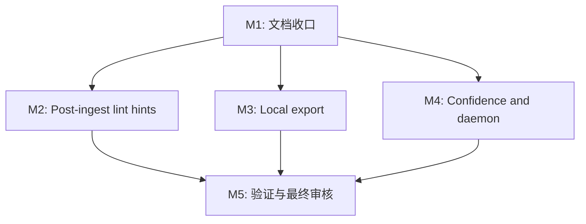

# 任务列表 — LLM Wiki v2 Rohit Gap Local-First Closure

**关联需求**: [`requirements.md`](./requirements.md)
**估算量级**: 中 (审核轮数：5)
**总体进度**: 🚧 7 / 14

---

## 状态图例

| Emoji | 状态 | 含义 |
|-------|------|------|
| ⏳ | 待开始 | 还没开始 |
| 🚧 | 进行中 | 当前正在做 |
| ✅ | 已完成 | 自检通过、commit/push 完毕 |
| ⚠️ | 阻塞中 | 等待外部决策 / 修不动 |
| 🔍 | 待审核 | 自己做完了等用户 review |

## 执行纪律

- 每个行为变更先写 failing test，再实现，再跑 focused test。
- 每个任务完成后更新本文件状态和备注块。
- 每个任务完成后至少跑相关 focused test；每个里程碑完成后跑 `npm run typecheck` 和相关 test subset。
- Phase 3 执行时每个任务单独 commit + push。
- local-first 边界不可破：不引入远程后端、新数据库、多用户 sync 或自动 Markdown 重写。

## 里程碑依赖图

---

## Milestone 1: 文档收口

**目标**: 修正 Rohit gap 文档和 README，使后续实现清楚服务 local-first + app-resident daemon 的边界。  
**依赖**: 无  
**状态**: ✅

### Task 1.1 ✅ 修订 gap-analysis 主报告和详解版

**描述**: 调整 `gap-analysis.md` / `gap-analysis-detailed.md` 中关于 auto-lint、daemon、mesh sync、deep contradiction scan 的判断。

**依赖**: 无  
**阻塞**: T1.2, T1.3

**预估**: 1.5h

**关联文件 / 模块**:
- `docs/llm-wiki-v2-rohit-gap-analysis/gap-analysis.md`
- `docs/llm-wiki-v2-rohit-gap-analysis/gap-analysis-detailed.md`

**验收**:
- [x] Auto-lint 不再声称 raw gist 有精确四步句子，而是解释为 automation/self-healing 方向。
- [x] Daemon 表述改成 “app-resident local maintenance daemon in scope; OS-level daemon future scope”。
- [x] Mesh sync 继续标为 out of scope。
- [x] Deep contradiction scan 标为 future manual review tool，不进入本轮实现。

#### 备注

- 🐛 **遇到的问题**: Phase 1 复核发现原分析把 `auto-lint` 写成 Rohit gist 的精确 ingest 阶段，但 raw gist 更准确的证据是 automation + quality/self-healing 的组合方向；同时用户确认本地后台 daemon 仍然需要。
- 🔧 **最终实现逻辑**: 修订 `gap-analysis.md` 和 `gap-analysis-detailed.md`，把 auto-lint 改为 post-ingest structural lint hints，把 schedule 缺口改为 app-resident local maintenance daemon，并写明默认 15 分钟轻量 due check。
- 🎯 **关键决策**: local-first 不是 no-daemon；本轮允许 app 运行期本地 daemon，但继续排除远程 memory server、OS 级常驻服务、mesh sync、多用户 ACL 和后台静默 Markdown 改写。

---

### Task 1.2 ✅ 修订 6 个 fix 计划的范围和优先级

**描述**: 将 `fix-01` 到 `fix-06` 对齐本期范围，尤其是 fix-05 从启动一次检查升级为 app-resident daemon，fix-06 降级为后续。

**依赖**: T1.1  
**阻塞**: T2.1, T4.2

**预估**: 2h

**关联文件 / 模块**:
- `docs/llm-wiki-v2-rohit-gap-analysis/fix-01-auto-lint-on-ingest.md`
- `docs/llm-wiki-v2-rohit-gap-analysis/fix-02-readme-design-philosophy.md`
- `docs/llm-wiki-v2-rohit-gap-analysis/fix-03-marp-export.md`
- `docs/llm-wiki-v2-rohit-gap-analysis/fix-04-confidence-stale-badge.md`
- `docs/llm-wiki-v2-rohit-gap-analysis/fix-05-patrol-overdue-notification.md`
- `docs/llm-wiki-v2-rohit-gap-analysis/fix-06-deep-contradiction-scan.md`

**验收**:
- [x] fix-05 标题/内容体现 app-running daemon，而不是只启动时检查。
- [x] fix-06 明确不自动写 Markdown，只作为 future manual review queue。
- [x] README 计划要求同步 README_CN。
- [x] README 总览 ROI 顺序更新。

#### 备注

- 🐛 **遇到的问题**: 原 `fix-05` 仍按“启动时提醒一次”设计，和用户确认的 15 分钟后台维护循环不一致；`fix-01` 也继续把 Rohit 证据写成过硬的精确 pipeline。
- 🔧 **最终实现逻辑**: 重写 README 总览、fix-01、fix-02、fix-05，并小幅修订 fix-03、fix-04、fix-06；将 fix-05 规格改成 app-resident local daemon，默认 15 分钟轻量 due check，复用现有 `autoPatrolEnabled`、cooldown 和 `scheduleAutoMemoryOpsPatrol`。
- 🎯 **关键决策**: fix-06 降为 Future / Backlog，不进入本轮 local-first closure；README / README_CN 同步从可选改为必做验收。

---

### Task 1.3 ✅ README / README_CN 前置 local-first 哲学

**描述**: 在 README 开头新增短设计哲学段落，并同步中文版。

**依赖**: T1.1  
**阻塞**: 无

**预估**: 1h

**关联文件 / 模块**:
- `README.md`
- `README_CN.md`

**验收**:
- [x] README 明确 local-first、Markdown source of truth、human-gated writes。
- [x] README_CN 同步表达。
- [x] 文档明确本地 daemon 是 app 运行期维护循环，不是远程服务。
- [x] 没有重复堆砌已有 Memory Ops 详细功能列表。

#### 备注

- 🐛 **遇到的问题**: README / README_CN 的 Memory Ops 功能列表里仍有 “without daemon / 无 daemon” 旧口径，和用户确认的 app 内 daemon 不一致。
- 🔧 **最终实现逻辑**: 在 README / README_CN 的功能亮点后新增设计哲学段落，并把 Memory Ops 事件 hooks、auto patrol 文案改为 app-resident local daemon；默认 15 分钟轻量 due check，app 完全退出后停止。
- 🎯 **关键决策**: README 只讲边界和使用心智，不重复展开已有 Memory Ops 细节；双语文档保持同等约束。

---

## Milestone 2: Post-Ingest Lint Hints

**目标**: Ingest 成功后本地生成 structural lint hints，并在 Activity Panel 提示。  
**依赖**: M1  
**状态**: ✅

### Task 2.1 ✅ 新增 ingest lint hints 持久化 helper

**描述**: 新建纯 helper 读写 `.llm-wiki/ingest-lint-hints.json`。

**依赖**: T1.2  
**阻塞**: T2.2, T2.3

**预估**: 2h

**关联文件 / 模块**:
- `src/lib/ingest-lint-hints.ts` (新建)
- `src/lib/ingest-lint-hints.test.ts` (新建)

**验收**:
- [x] 先写测试覆盖写入、读取、clean 清理、malformed JSON fallback。
- [x] helper 使用 `runStructuralLint(projectPath)`。
- [x] hints 文件 schema 包含 `ingestId`、`sourcePath`、`timestamp`、`hints`、`totalCount`。
- [x] 无 hints 时删除或清理旧文件。

#### 备注

- 🐛 **遇到的问题**: TDD 红灯确认时测试因缺少 `src/lib/ingest-lint-hints.ts` 失败，符合预期；实现后 focused test 和 typecheck 均通过。
- 🔧 **最终实现逻辑**: 新增 `writePostIngestLintHints`、`readPostIngestLintHints`、`clearPostIngestLintHints`；写入前调用 `runStructuralLint(projectPath)`，有 findings 时写 `.llm-wiki/ingest-lint-hints.json`，无 findings 时 best-effort 删除旧文件。
- 🎯 **关键决策**: hints 是 last-ingest 的可替换本地派生状态，不写 audit、不写 Markdown；读取失败或 malformed JSON 返回 `null`，避免 UI 因坏状态崩溃。

---

### Task 2.2 ✅ 接入 autoIngest 成功路径

**描述**: 在 `autoIngestImpl` 成功更新 activity 后 best-effort 调用 lint hints helper。

**依赖**: T2.1  
**阻塞**: T2.3

**预估**: 1h

**关联文件 / 模块**:
- `src/lib/ingest.ts`
- `src/lib/ingest.scenarios.test.ts` 或 `src/lib/ingest.test.ts`

**验收**:
- [x] `runStructuralLint` 失败不会改变 ingest 结果。
- [x] 成功 ingest 后调用 hints helper。
- [x] cache-hit 分支是否运行 hints 有明确决策并记录备注。
- [x] focused test 覆盖 helper failure 不影响 `autoIngest`。

#### 备注

- 🐛 **遇到的问题**: TDD 红灯确认显示 `autoIngest` 成功路径没有调用 hints helper；cache-hit fixture 的返回值受现有缓存文件存在性影响，测试改为只验证“再次成功导入会刷新 hints”。
- 🔧 **最终实现逻辑**: 在 full ingest 写入成功并更新 activity 后 best-effort 调用 `writePostIngestLintHints`；cache-hit 分支更新 activity 后也调用同一安全 wrapper。helper 异常只 `console.warn`，不改变 ingest 返回值。
- 🎯 **关键决策**: cache-hit 仍刷新 lint hints，因为用户可能在两次导入之间手动修复 wiki，重新导入应清理或更新 last-ingest badge，而不是保留旧提示。

---

### Task 2.3 ✅ Activity Panel 展示 post-ingest lint badge

**描述**: 在 Activity Panel 顶部展示最近 ingest 的 lint hint 数量，点击跳转 Lint view。

**依赖**: T2.1, T2.2  
**阻塞**: 无

**预估**: 2h

**关联文件 / 模块**:
- `src/components/layout/post-ingest-lint-badge.tsx` (新建)
- `src/components/layout/activity-panel.tsx`
- `src/components/layout/post-ingest-lint-badge.test.tsx` (新建或合并现有 layout test)

**验收**:
- [x] 有 hints 时显示文本数量，不只靠颜色。
- [x] 无 project 或 totalCount=0 时不显示。
- [x] 点击设置 `activeView` 为 `lint`。
- [x] 组件测试覆盖显示和点击。

#### 备注

- 🐛 **遇到的问题**: 项目当前 React 组件测试主要使用 node 环境下的 static markup，没有 DOM click helper；测试拆成静态渲染输出和 view handler wiring。
- 🔧 **最终实现逻辑**: 新增 `PostIngestLintBadge` / `PostIngestLintBadgeView`，读取 `.llm-wiki/ingest-lint-hints.json`，有 hints 时在 Activity Panel 展开区顶部显示数量和 source 文件名；点击调用 `setActiveView("lint")`。
- 🎯 **关键决策**: 组件按 `projectPath + dataVersion` 重新读取，并保留 3 秒轻量轮询兜底；badge 文案带数量和 source 名，不只依赖 amber 颜色。

---

## Milestone 3: Local Export

**目标**: 当前 Markdown page 可本地导出为 Marp 或 CSV。  
**依赖**: M1  
**状态**: 🚧

### Task 3.1 ✅ 实现 Marp export helper

**描述**: 将 Markdown page 内容转换为 `.marp.md`。

**依赖**: T1.2  
**阻塞**: T3.3

**预估**: 2h

**关联文件 / 模块**:
- `src/lib/marp-export.ts` (新建)
- `src/lib/marp-export.test.ts` (新建)
- `src/lib/frontmatter.ts`

**验收**:
- [x] 测试覆盖无 H2、单 H2、多 H2、H2 前有正文、空正文。
- [x] 输出包含 `marp: true`、`theme: default`、`paginate: true`。
- [x] title slide 从 frontmatter title 或文件名推导。
- [x] 不破坏原 markdown body。

#### 备注

- 🐛 **遇到的问题**: 现有 `WikiPage` 类型没有单独 `body` 字段，必须从 `content` 中解析 frontmatter/body，同时兼容调用方传入的 `frontmatter`。
- 🔧 **最终实现逻辑**: 新增 `pageToMarp` 和 `splitBodyIntoSlides`；输出 Marp frontmatter、title slide、可选 metadata，并按 H2 切分 body，保留原 Markdown 内容。
- 🎯 **关键决策**: title 优先取 frontmatter `title`，否则取文件名 stem；metadata 只放 type/created/updated/confidence/source count，避免把整段 frontmatter 灌入 slides。

---

### Task 3.2 ⏳ 实现 Markdown table to CSV helper

**描述**: 检测并导出第一张标准 pipe table。

**依赖**: T1.2  
**阻塞**: T3.3

**预估**: 2h

**关联文件 / 模块**:
- `src/lib/table-export.ts` (新建)
- `src/lib/table-export.test.ts` (新建)

**验收**:
- [ ] 测试覆盖 table-heavy 检测、普通页面 disabled、alignment row 跳过。
- [ ] CSV escape 正确处理逗号、引号、换行。
- [ ] 无合法 table 时返回 null。

#### 备注

- 🐛 **遇到的问题**:
- 🔧 **最终实现逻辑**:
- 🎯 **关键决策**:

---

### Task 3.3 ⏳ Preview Panel 集成 Export menu

**描述**: 在 Preview Panel header 加 Export menu，使用 Tauri save dialog 写本地文件。

**依赖**: T3.1, T3.2  
**阻塞**: 无

**预估**: 3h

**关联文件 / 模块**:
- `src/components/layout/export-menu.tsx` (新建)
- `src/components/layout/preview-panel.tsx`
- `src/components/layout/export-menu.test.tsx` (新建或现有测试扩展)

**验收**:
- [ ] Markdown page 显示 Export 按钮，非 markdown/binary 预览不显示或禁用。
- [ ] `save()` 返回 null 时不写文件。
- [ ] Marp 导出写用户选择路径。
- [ ] CSV 仅 table page 激活。
- [ ] 导出不触发 preview autosave 到原文件。

#### 备注

- 🐛 **遇到的问题**:
- 🔧 **最终实现逻辑**:
- 🎯 **关键决策**:

---

## Milestone 4: Confidence and Local Daemon

**目标**: 让 stale confidence 可见，并实现 app-resident local maintenance daemon。  
**依赖**: M1  
**状态**: ⏳

### Task 4.1 ⏳ 实现 confidence staleness helper 和 UI badge

**描述**: 按 lifecycle half-life 判断 `last_confirmed` 是否 stale，并在 frontmatter panel 展示。

**依赖**: T1.2  
**阻塞**: 无

**预估**: 3h

**关联文件 / 模块**:
- `src/lib/confidence-staleness.ts` (新建)
- `src/lib/confidence-staleness.test.ts` (新建)
- `src/components/editor/frontmatter-panel.tsx`
- `src/components/editor/frontmatter-panel.test.tsx` (如已有则扩展)

**验收**:
- [ ] 先写测试覆盖 undefined、新日期、过期、malformed、archived。
- [ ] UI 显示天数和 half-life，不只靠颜色。
- [ ] 点击 “Run patrol” 跳转 Settings。
- [ ] 不自动改 confidence。

#### 备注

- 🐛 **遇到的问题**:
- 🔧 **最终实现逻辑**:
- 🎯 **关键决策**:

---

### Task 4.2 ⏳ 实现 local maintenance daemon controller

**描述**: 新建 app-resident daemon controller，负责 project 运行期间的本地维护检查。

**依赖**: T1.2  
**阻塞**: T4.3, T4.4

**预估**: 4h

**关联文件 / 模块**:
- `src/lib/local-maintenance-daemon.ts` (新建)
- `src/lib/local-maintenance-daemon.test.ts` (新建)
- `src/lib/memory-ops.ts`
- `src/lib/memory-ops-policy.ts`

**验收**:
- [ ] 同一 project 重复 start 不创建多个 loop。
- [ ] stop 后 interval 清理。
- [ ] `autoPatrolEnabled=false` 时只产生 reminder。
- [ ] 默认每 15 分钟执行一次轻量 due check。
- [ ] `autoPatrolEnabled=true` 且 due 时调用 `scheduleAutoMemoryOpsPatrol`。
- [ ] 所有异常被捕获并记录，不抛到 UI 主流程。

#### 备注

- 🐛 **遇到的问题**:
- 🔧 **最终实现逻辑**:
- 🎯 **关键决策**:

---

### Task 4.3 ⏳ App lifecycle 接入 local daemon

**描述**: Project open 后启动 daemon，project switch/unmount/quit 时停止。

**依赖**: T4.2  
**阻塞**: T4.4

**预估**: 2h

**关联文件 / 模块**:
- `src/App.tsx`
- `src/lib/reset-project-state.ts` (如需)
- `src/stores/local-maintenance-store.ts` (如需新建)

**验收**:
- [ ] 打开 project 后 daemon start。
- [ ] 切换 project 时旧 project daemon stop，新 project daemon start。
- [ ] Welcome/no project 状态不运行 daemon。
- [ ] App unmount 清理。

#### 备注

- 🐛 **遇到的问题**:
- 🔧 **最终实现逻辑**:
- 🎯 **关键决策**:

---

### Task 4.4 ⏳ 本地维护提醒 UI

**描述**: 显示 daemon 产生的 patrol due / overdue reminder，并提供跳转 Maintenance 操作。

**依赖**: T4.2, T4.3  
**阻塞**: 无

**预估**: 2h

**关联文件 / 模块**:
- `src/components/layout/local-maintenance-banner.tsx` (新建)
- `src/components/layout/app-layout.tsx`
- `src/stores/local-maintenance-store.ts` (如新建)

**验收**:
- [ ] reminder 显示原因和天数/阈值。
- [ ] 点击跳转 Settings。
- [ ] Dismiss 只影响本 session。
- [ ] banner 不遮挡主内容，文本可读。

#### 备注

- 🐛 **遇到的问题**:
- 🔧 **最终实现逻辑**:
- 🎯 **关键决策**:

---

## Milestone 5: 验证与最终审核

**目标**: 跑完整验证，完成 5 轮审核报告，并补齐遗漏。  
**依赖**: M2, M3, M4  
**状态**: ⏳

### Task 5.1 ⏳ 全量静态检查和 mock tests

**描述**: 跑项目级验证并修复阻塞问题。

**依赖**: T2.3, T3.3, T4.4  
**阻塞**: T5.2

**预估**: 2h

**关联文件 / 模块**:
- `package.json`
- 所有本期修改文件

**验收**:
- [ ] `npm run typecheck` 通过。
- [ ] `npm run test:mocks` 通过。
- [ ] 如跳过 real LLM tests，在备注说明原因。

#### 备注

- 🐛 **遇到的问题**:
- 🔧 **最终实现逻辑**:
- 🎯 **关键决策**:

---

### Task 5.2 ⏳ Phase 4 五轮最终审核

**描述**: 按中量级要求完成 5 轮最终审核并写报告。

**依赖**: T5.1  
**阻塞**: 无

**预估**: 4h

**关联文件 / 模块**:
- `docs/llm-wiki-v2-rohit-local-first/review-round-1.md`
- `docs/llm-wiki-v2-rohit-local-first/review-round-2.md`
- `docs/llm-wiki-v2-rohit-local-first/review-round-3.md`
- `docs/llm-wiki-v2-rohit-local-first/review-round-4.md`
- `docs/llm-wiki-v2-rohit-local-first/review-round-5.md`

**验收**:
- [ ] Round 1 功能完整性：对照 requirements/tasks 无遗漏。
- [ ] Round 2 类型安全：typecheck、类型边界、no hidden any。
- [ ] Round 3 性能：daemon interval、lint/export 成本、不会高频扫描。
- [ ] Round 4 安全：local-first、redaction、无远程后端/自动重写。
- [ ] Round 5 UX & a11y：按钮 label、banner 可读、i18n 状态。

#### 备注

- 🐛 **遇到的问题**:
- 🔧 **最终实现逻辑**:
- 🎯 **关键决策**:

---

## 进度总览

| 里程碑 | 任务 | 完成 | 总数 | 状态 |
|--------|------|------|------|------|
| M1 | 文档收口 | 3 | 3 | ✅ |
| M2 | Post-ingest lint hints | 3 | 3 | ✅ |
| M3 | Local export | 1 | 3 | 🚧 |
| M4 | Confidence and local daemon | 0 | 4 | ⏳ |
| M5 | 验证与最终审核 | 0 | 2 | ⏳ |
| **总计** | | **7** | **14** | **🚧** |

## 变更记录

| 日期 | 变更 |
|------|------|
| 2026-05-10 | 初稿，按 local-first + app-resident daemon 收口，14 个任务 |
| 2026-05-10 | 用户确认 daemon 默认每 15 分钟做轻量维护检查 |
| 2026-05-10 | 修订 6 个 fix 计划：fix-05 升级为 app-resident daemon，fix-06 降为 future backlog |
| 2026-05-10 | README / README_CN 新增 local-first 设计哲学并移除 no-daemon 旧口径 |
| 2026-05-10 | 新增 post-ingest lint hints 持久化 helper 与 focused tests |
| 2026-05-10 | autoIngest 成功路径接入 post-ingest lint hints，cache-hit 也刷新 hints |
| 2026-05-10 | Activity Panel 新增 post-ingest lint badge，点击进入 Lint 面板 |
| 2026-05-10 | 新增 Marp export helper，支持 frontmatter title、metadata 和 H2 分片 |

## 最终审核索引

| Round | 视角 | 状态 | 报告 |
|-------|------|------|------|
| 1 | 功能 | ⏳ | `review-round-1.md` |
| 2 | 类型 & 静态分析 | ⏳ | `review-round-2.md` |
| 3 | 性能 | ⏳ | `review-round-3.md` |
| 4 | 安全 | ⏳ | `review-round-4.md` |
| 5 | UX & a11y | ⏳ | `review-round-5.md` |
