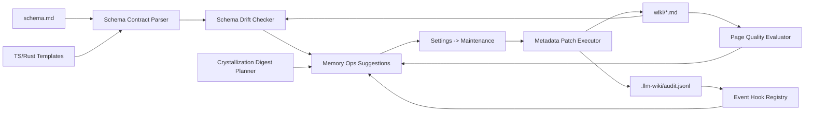
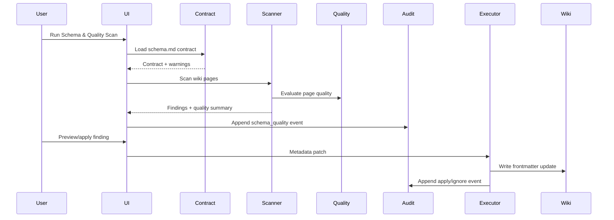

# 需求文档 - LLM Wiki v2 Schema 与事件自动化闭环

**版本**: v0.2
**日期**: 2026-05-07
**作者**: user + AI
**状态**: M4 文档收口，M5 待验证
**关联任务列表**: [tasks.md](./tasks.md)

---

## 1. 背景

当前项目已经把 Karpathy LLM Wiki 的三层结构、ingest/query/lint、index/log、Obsidian 兼容和 LLM 维护 Wiki 的核心模式落地为 Tauri/React 桌面应用，并且已经完成多轮 Rohit LLM Wiki v2 本地切片：page-level lifecycle/confidence metadata、typed relation arrays、typed graph traversal、BM25/vector/graph RRF search、append-only audit、Memory Ops patrol、batch governance、rollback、timeline explorer、policy tuning、search health 和 crystallization candidate。

这意味着本阶段不再重复实现 lifecycle、typed graph、RRF、audit 或 Memory Ops 工作台。Rohit v2 里下一块尚未完整产品化的是 “schema is the real product” 与 “from manual to event-driven”：当前 `schema.md` 主要是给 LLM 阅读的自然语言契约，缺少机器可读版本、字段契约、漂移检测、迁移路径和质量评分闭环；事件 hook 已覆盖部分 query/search/review/crystallize，但 session start/end、memory write、schema drift、quality review 与本地协作状态还没有统一的产品化入口。

本阶段目标是在保持本地优先、Markdown source-of-truth 和人工确认边界不变的前提下，把 schema 契约、事件自动化、质量评分、crystallization digest 和轻量本地协作信号做成可测试、可审计、可解释的工程系统。

### 1.1 当前能力与缺口

| 主题 | 当前已有 | 本阶段缺口 | 本阶段处理 |
|------|----------|------------|------------|
| Schema contract | `schema.md` / `purpose.md` / TS templates / Rust project scaffold 已描述 page type、frontmatter、typed relation、Memory Ops 规则。 | 缺少机器可读 schema version、字段类型契约、模板 parity 校验和项目 drift report。 | 增加 `schema-contract` 模块、schema contract artifact、drift checker 和 Maintenance 入口。 |
| Frontmatter compliance | `frontmatter.ts` 能解析并修复常见 LLM YAML 问题；`wiki-frontmatter-fields.ts` 集中 typed relation 字段。 | 没有统一校验每页必填字段、枚举值、数组字段、typed relation slug、过期 schema version。 | 增加纯函数 validator，输出 Memory Ops suggestions 和 audit。 |
| Event automation | ingest/search/query/review/crystallize/Memory Ops 已有 audit；maintenance dirty counter 已有 cooldown。 | session start/end、memory write、schema drift、quality scan、crystallization digest 事件不统一。 | 增加 event hook registry 和轻量 trigger，只写 audit/建议/dirty marker，不在高频路径跑重扫描。 |
| Quality scoring | `lifecycle.ts` 可补 `quality_score`，Memory Ops 能基于 confidence/staleness 生成建议。 | 质量评分仍偏 metadata 补齐，缺少结构质量、引用质量、关系质量、可检索性等可解释维度。 | 增加 deterministic page quality evaluator 和低分 review/metadata suggestions。 |
| Crystallization | Chat/Deep Research/Review 可以显式 Save to Wiki，候选评分和 audit 已存在。 | 保存结果主要是 query page，缺少 digest 内部的 lessons/decisions/entities/relations 抽取建议。 | 做 non-LLM-first digest planner，生成可预览结构化建议；确认后复用现有写入能力，metadata patch 继续走 Memory Ops。 |
| Collaboration slice | `scope: private/shared` 已存在，audit actor 支持 user/system/agent。 | 没有本地 work coordination、agent activity summary、schema owner/change trail。 | 增加 audit-derived coordination summary，不做云同步、ACL 或额外 worklog 持久化。 |

### 1.2 实施状态

- M1-M4.4 已完成：schema contract、drift/quality 核心、Memory Ops 映射、event registry、digest planner、Maintenance UI、patrol schema summary、digest preview 和 coordination summary 已落地。
- T4.5 当前收口文档和迁移说明；M5 仍需 focused tests、typecheck、mock regression、Rust scaffold test 和 5 轮最终审核。
- 旧项目没有 contract block 时使用内置 `llm-wiki-v2-default` v1 fallback，不阻塞打开项目或运行 Memory Ops；Schema & Quality scan 会展示 fallback warning。
- Schema & Quality scan 会保存最近一次 summary；Memory Ops patrol 只读取这个 summary，不在巡检路径重读 `schema.md` 和 `wiki/**/*.md` 做昂贵扫描。
- Digest preview 是 dry-run；确认保存时写入 query/synthesis page 并记录 audit。Relation/metadata patch 目前作为候选展示，实际修改仍走 Memory Ops executor 的 preview/apply/ignore。
- Coordination summary 基于 audit events、review items 和最近 schema findings 汇总本地状态；不写 worklog 文件，也不引入外部 memory server、云同步或团队权限。

---

## 2. 目标

### 2.1 范围内

- ✅ 定义机器可读 `LlmWikiSchemaContract`，覆盖版本、page types、frontmatter fields、typed relation fields、quality expectations 和 Memory Ops policy linkage。
- ✅ 在新项目模板和现有 TS/Rust schema scaffold 中加入 schema contract block，并提供解析、归一化、兼容旧项目的 fallback。
- ✅ 增加 schema/frontmatter drift checker：检测缺失字段、错误类型、枚举非法、typed relation dangling、模板不一致和过期 contract。
- ✅ 将 schema drift 和 quality findings 接入 Memory Ops，生成可解释 suggestions、preview/apply metadata patch 或 review-only action。
- ✅ 增加轻量 event hook registry，统一 session start/end、memory write、schema scan、quality scan、crystallization digest 和 search health 等事件命名。
- ✅ 增加 deterministic page quality evaluator，输出结构质量、引用质量、关系质量、检索质量和治理质量评分。
- ✅ 扩展 crystallization digest：从高价值输出中生成 lessons/decisions/entities/relations 候选，用户确认后写入 Wiki；metadata relation patch 仍经 Memory Ops 确认流程处理。
- ✅ 增加本地协作/agent activity summary：基于 audit、review state 和最近 schema findings 汇总 actor、操作、阻塞项和 shared/private promotion 候选。
- ✅ 更新 Maintenance UI、README/README_CN、schema templates、i18n 和测试。

### 2.2 范围外

- ❌ 不引入 agentmemory、iii-engine、Neo4j、Postgres、Qdrant、Redis、MCP memory server 或远程后端。
- ❌ 不做多用户实时协作、云同步、权限系统、lease/lock server 或 team feed。
- ❌ 不自动重写正文、不自动删除、不自动合并矛盾 claim；高风险动作仍必须 preview/apply/audit。
- ❌ 不做 claim/span-level provenance 数据库；本阶段仍以 page-level metadata 和 page-level relation 为粒度。
- ❌ 不把 `schema.md` 替换为 JSON-only；机器可读 contract 是自然语言 schema 的补充。
- ❌ 不新增真实 LLM 调用测试；real LLM 测试保持 opt-in。

### 2.3 成功标准

- 新项目包含可解析的 schema contract block；旧项目没有 contract 时能 fallback 到默认 contract 并产生 warning。
- 用户能在 Settings -> Maintenance 运行 Schema & Quality scan，看到 schema drift、frontmatter compliance、quality score 和 coordination summary。
- 每条 finding 都有 reasons、severity、target path 和 suggested action；metadata 修复必须支持 preview/apply/ignore 并写 audit。
- Event hook registry 覆盖 session start/end、memory write、schema scan、quality scan、crystallization digest，且高频路径不触发全量扫描。
- Crystallization digest 能从 saved output 生成 lessons/decisions/entities/relations 候选，preview 不写文件，确认后复用现有 Wiki 写入；metadata patch 候选不静默应用。
- `npm run typecheck`、focused Vitest suites、`npm run test:mocks` 通过；若 Rust scaffold 改动，`cd src-tauri && cargo test` 通过。
- README、README_CN、TS templates、Rust scaffold 和 schema contract tests 对齐，不声明范围外能力。

### 2.4 旧项目迁移 / Fallback 指南

旧项目无需迁移即可打开和使用。系统按以下路径处理旧项目：

1. 如果 `schema.md` 含 `llm-wiki-schema-contract` fenced block，Schema & Quality scan 解析该 contract。
2. 如果 `schema.md` 没有 contract block 或 block 损坏，扫描使用内置默认 contract，并在 warnings 和最近 scan summary 中提示 fallback。
3. 用户可以继续运行 Memory Ops patrol；patrol 只展示最近一次 Schema & Quality scan summary，不会因为缺 contract 阻断其它维护能力。
4. 要显式迁移，先备份旧项目或用版本控制确认工作树，再用当前版本新建一个项目，把新 `schema.md` 中的 `llm-wiki-schema-contract` fenced block 复制到旧项目 `schema.md`。
5. 运行 Schema & Quality scan，逐条 preview schema/metadata suggestions；只应用确认过的 metadata patch，review-only finding 保持人工处理。
6. 迁移不需要外部数据库、memory server、云同步或团队权限；相关状态仍保存在本地 Markdown、`.llm-wiki/audit.jsonl` 和本地 project store summary。

---

## 3. 用户场景 / 用户故事

### 3.1 场景 1: 用户检查项目 schema 是否漂移

**角色**: 长期维护知识库的用户

**前置条件**: 项目中已有 `schema.md`、`wiki/` 页面和 `.llm-wiki/audit.jsonl`。

**步骤**:
1. 用户进入 Settings -> Maintenance。
2. 用户运行 Schema & Quality scan。
3. 系统解析 `schema.md` 的 contract block；如果没有，则使用默认 contract 并显示 warning。
4. 系统扫描 wiki frontmatter、typed relations、page types 和 required fields。
5. 系统展示 schema drift findings，并给出 metadata patch 或 review-only action。
6. 用户 preview/apply/ignore。

**预期结果**: 用户能看到哪些页面不符合当前项目契约，且修复动作可审计。

**异常分支**:
- 如果 `schema.md` 损坏，系统不阻塞 Memory Ops，只显示 contract fallback warning。
- 如果某个 typed relation 指向不存在页面，系统区分 dangling target 与 alias candidate。

### 3.2 场景 2: 新项目带着可演进 schema contract 启动

**角色**: 新项目创建者

**前置条件**: 用户创建一个新 LLM Wiki 项目或选择 scenario template。

**步骤**:
1. 系统生成 `schema.md`、`purpose.md`、`wiki/index.md`、`wiki/log.md`。
2. `schema.md` 包含人类可读规则和机器可读 contract block。
3. contract 记录版本、page types、required fields、enum fields、array fields、typed relation fields 和 quality thresholds。
4. 后续 ingest prompt 读取 schema 时也能看到 contract 约束。

**预期结果**: 新项目从第一天就有可检测、可迁移、可测试的 schema。

### 3.3 场景 3: 页面质量下降被发现而不是沉积

**角色**: 研究型用户

**前置条件**: 某些页面由 LLM 生成，存在引用少、结构弱、typed relation 缺失或检索 evidence 弱的问题。

**步骤**:
1. 用户运行 Schema & Quality scan 或 Memory Ops patrol。
2. 系统计算 page quality dimensions。
3. 低分页面被标记为 needs-review、low-quality 或 relation-needs-work。
4. 用户打开 finding 查看具体原因。
5. 用户选择创建 review item、更新 metadata 或忽略。

**预期结果**: 质量问题进入维护队列，不需要用户逐页人工发现。

### 3.4 场景 4: 高价值对话被消化为结构化 digest

**角色**: 经常使用 Chat / Deep Research / Review 的用户

**前置条件**: 用户得到一段有结论、有引用、有决策或操作建议的输出。

**步骤**:
1. 系统基于现有 crystallization candidate 评分识别高价值输出。
2. 用户点击 digest preview。
3. 系统生成 lessons、decisions、entities、typed relations 和 target page 建议。
4. 用户选择保存为 query/synthesis page；relation/metadata patch 候选只展示，不在 digest UI 里静默应用。
5. 系统写入 Wiki 并记录 audit；需要修改 metadata 时继续走 Memory Ops preview/apply/ignore。

**预期结果**: 探索结果不只是保存成一篇页面，还能给后续图谱和 schema 维护提供候选信号。

### 3.5 场景 5: 用户查看本地协作/agent activity 状态

**角色**: 使用多个 AI agent 或多轮会话维护同一知识库的用户

**前置条件**: audit 中已有 user/system/agent 操作记录。

**步骤**:
1. 用户打开 Maintenance 中的 Activity/Coordination summary。
2. 系统按 actor、action、target path、scope、status 汇总最近操作。
3. 系统展示待处理 review、blocked finding、recent schema change 和 private->shared promotion candidate。
4. 用户打开相关页面或 timeline 事件。

**预期结果**: 用户能知道最近哪些自动化或 agent 操作影响了知识库，不需要人工翻 JSONL。

---

## 4. 功能需求

### F1: Machine-readable schema contract

**描述**: 定义 `LlmWikiSchemaContract`，并支持从 `schema.md` 中解析机器可读 contract block。

**输入**: `schema.md` 文本、默认 contract、project template metadata。

**行为**:
- 解析 fenced JSON 或 YAML contract block。
- 归一化版本、page types、required fields、enum fields、array fields、typed relation fields。
- 无 contract 时回退默认 v1 contract，并返回 warning。
- 坏 contract 不阻塞项目打开，只在 scan 中标 warning。

**输出**: `SchemaContractLoadResult`。

**验收标准**:
- [ ] 新项目 schema 能解析出 contract version/name。
- [ ] 旧项目 fallback 默认 contract。
- [ ] 坏 JSON/YAML 返回 warning 而不是抛到 UI。
- [ ] TS template 和 Rust scaffold 的 contract 字段保持 parity。

### F2: Schema and frontmatter drift checker

**描述**: 扫描 wiki pages，检测是否符合 schema contract。

**输入**: `LlmWikiSchemaContract`、wiki markdown pages、typed graph、alias index。

**行为**:
- 检查缺失 frontmatter、必填字段、enum 非法、数组字段类型、number score 范围。
- 检查 page type 是否在 contract 中，path 是否符合 page type directory。
- 检查 typed relation target 是否存在或可通过 alias candidate 修复。
- 生成 drift findings 和可选 metadata patch。

**输出**: `SchemaDriftReport` / `SchemaDriftFinding[]`。

**验收标准**:
- [ ] 缺失 frontmatter、非法 lifecycle、scalar relation、dangling relation 均有测试。
- [ ] 修复建议只改 frontmatter，不改正文。
- [ ] review-only finding 不进入 batch apply。
- [ ] private 页面 finding 不泄漏正文。

### F3: Schema & Quality scan integration

**描述**: 将 drift checker 和 quality evaluator 接入 Memory Ops/Maintenance。

**输入**: project path、dataVersion、policy、schema contract、wiki pages。

**行为**:
- 提供 `runSchemaQualityScan()` helper。
- 写 `schema.scan` 或 `memory_ops.schema_quality` audit event。
- 将 findings 转换为 Memory Ops suggestion groups。
- UI 中展示 scan summary、warnings、findings、preview/apply/ignore。

**输出**: `SchemaQualityScanReport`。

**验收标准**:
- [ ] scan 可手动运行，空项目稳定返回。
- [ ] scan 不自动修改 wiki。
- [ ] finding 能进入现有 batch governance/ignore 机制。
- [ ] audit summary 包含 contract version、finding counts、quality score summary。

### F4: Event hook registry

**描述**: 统一事件命名和轻量 hook 触发策略。

**输入**: session start/end、query answer、search run、ingest done、memory write、review resolve、crystallize save、schema scan、quality scan。

**行为**:
- 定义 `WikiAutomationEvent` 和 action naming。
- 提供 `recordWikiAutomationEvent()`，统一写 audit 和 maintenance dirty counter。
- 高频路径只记录事件，不触发重扫描。
- 支持 cooldown/reminder。

**输出**: audit event、dirty state、optional activity reminder。

**验收标准**:
- [ ] session start/end、memory write、schema scan 事件有 tests。
- [ ] query/search 不因 hook 增加明显同步延迟。
- [ ] audit 写失败不阻断主流程。
- [ ] action/category 命名与既有 audit contract 兼容。

### F5: Deterministic page quality evaluator

**描述**: 对 wiki page 计算可解释质量维度。

**输入**: page content、frontmatter、schema contract、typed graph、search evidence optional。

**行为**:
- 计算 structure、citation、relation、retrieval、governance 维度评分。
- 聚合为 `quality_score` 建议。
- 低分页面生成 review action 或 metadata update suggestion。
- reasons 使用确定性规则，不调用 LLM。

**输出**: `PageQualityScore` / quality suggestions。

**验收标准**:
- [ ] 无 headings/无 sources/无 relations/非法 scope 等场景有测试。
- [ ] quality_score patch 不覆盖更高的用户显式评分，除非理由明确。
- [ ] 评分固定 today/dataVersion 下稳定。
- [ ] 质量建议可以被 Memory Ops UI 分类展示。

### F6: Crystallization digest planner

**描述**: 在现有 Save to Wiki 之外，提供结构化 digest preview。

**输入**: chat/research/review output、referenced pages、candidate score、schema contract。

**行为**:
- 生成 lessons、decisions、entities、relation patch candidates 和 target page candidates。
- 初期以 deterministic heuristics 为主；可选 LLM digest 保持手动确认。
- 保存为 query/synthesis page 时复用 `writeCrystallizedQueryPage`。
- relation/metadata patch 复用 Memory Ops executor。

**输出**: `CrystallizationDigestPlan`。

**验收标准**:
- [ ] 无引用或低价值内容不提示 digest。
- [ ] digest preview 不写文件。
- [ ] 确认保存后写 audit，包含 score/reasons/target paths。
- [ ] 不重复提示同一 dedupeKey。

### F7: Local coordination summary

**描述**: 基于 audit、review state 和最近 schema findings 提供本地 actor activity 和 work coordination summary。

**输入**: audit events、review items、schema findings、Memory Ops suggestions。

**行为**:
- 汇总 actor/action/path/scope/status。
- 展示 recent schema changes、blocked findings、pending review、private/shared promotion candidates。
- 不写额外 worklog 文件；summary 可随 audit/review/schema state 重新计算。

**输出**: `CoordinationSummary`。

**验收标准**:
- [ ] audit-only 项目能生成 summary。
- [ ] private events 摘要不泄漏 private detail。
- [ ] UI 可打开相关 target 或 timeline filter。
- [ ] 不做云同步或多人权限声明。

### F8: Documentation, templates, and migration guide

**描述**: 更新文档、模板和迁移说明，使 v2.3 contract 可复用。

**输入**: README、README_CN、TS templates、Rust scaffold、docs。

**行为**:
- README 说明 schema contract、Schema & Quality scan、event hooks、digest planner 和 coordination summary。
- 新项目 schema 包含 machine-readable contract block。
- 旧项目迁移说明告诉用户如何运行 scan 和接受默认 contract。
- i18n parity 保持通过。

**输出**: 更新后的 docs/templates/i18n。

**验收标准**:
- [ ] README/README_CN 不声明外部 memory server 或云协作。
- [ ] TS/Rust schema contract 字段一致。
- [ ] i18n parity test 通过。
- [ ] migration guide 覆盖旧项目 fallback。

---

## 5. 非功能需求

### 5.1 性能

- Schema & Quality scan 在 500 个 markdown pages 内应保持可交互，UI 必须显示 running 状态。
- Event hook registry 在 query/search 等高频路径只做 best-effort audit/dirty marker，不同步跑全量 scan。
- Drift checker 和 quality evaluator 应是 O(page count + relation count)。

### 5.2 安全

- 不扩大 Tauri filesystem 权限；所有 patch/rollback 继续使用 project root sandbox。
- Audit 写入继续经过 redaction；private scope finding 不写正文和完整 diff。
- Schema contract block 只作为本地配置解析，不执行代码、不加载远程 schema。

### 5.3 可访问性

- Maintenance 新面板支持键盘导航、明确按钮 label、loading/disabled/error 状态。
- Scan findings 和 quality score 不只依赖颜色表达 severity。
- Tabs/filters 使用已有 ARIA 模式或等价语义。

### 5.4 国际化

- 新增 UI 文案必须同步更新 `src/i18n/en.json` 和 `src/i18n/zh.json`。
- 中英文 README 都要更新；实现术语保持一致：Schema Contract、Schema & Quality scan、Digest、Coordination summary。

### 5.5 可观测性

- 关键操作进入 `.llm-wiki/audit.jsonl`：schema scan、quality scan、digest preview/save、memory write、session start/end。
- Scan report 可在 UI 中定位到 target path 和 reasons。
- 测试 report 要覆盖 drift finding counts 和 quality summary。

---

## 6. 技术栈与依赖

### 6.1 选型

| 维度 | 选型 | 版本 | 理由 |
|------|------|------|------|
| Frontend | React + TypeScript | repo current | 沿用现有 Tauri/Vite 架构。 |
| YAML/contract parsing | `js-yaml` | repo current | 项目已用它解析 frontmatter，避免新增依赖。 |
| Persistence | Markdown + `.llm-wiki/*.jsonl` | app-owned | 保持本地 source-of-truth 与 append-only audit。 |
| Tests | Vitest | repo current | 现有确定性测试体系。 |
| Rust scaffold | Tauri command | repo current | 新项目默认 schema 仍由 Rust command 生成。 |

### 6.2 新增依赖

不计划新增 npm 或 Rust 依赖。

### 6.3 环境变量

无新增环境变量。

---

## 7. 架构概览

### 7.1 整体架构图



### 7.2 数据模型

| 模型 | 说明 |
|------|------|
| `LlmWikiSchemaContract` | 机器可读 schema 版本、page types、fields、relations、quality thresholds。 |
| `SchemaDriftFinding` | 单条 contract/compliance finding，包含 target、severity、reason、suggested operation。 |
| `SchemaQualityScanReport` | drift + quality + warnings + contract summary。 |
| `PageQualityScore` | structure/citation/relation/retrieval/governance 维度评分。 |
| `WikiAutomationEvent` | event hook registry 的统一事件输入。 |
| `CrystallizationDigestPlan` | lessons/decisions/entities/relations/page candidates。 |
| `CoordinationSummary` | actor activity、blocked findings、pending reviews、promotion candidates。 |

### 7.3 关键流程



### 7.4 模块划分

```
src/lib/
├── schema-contract.ts            # contract parsing/defaults/parity helpers
├── schema-drift.ts               # frontmatter/schema compliance scanner
├── page-quality.ts               # deterministic quality scoring
├── wiki-automation-events.ts     # event hook registry
├── crystallization-digest.ts     # structured digest planner
├── coordination-summary.ts       # local actor/activity summary
└── memory-ops-rules.ts           # bridge findings into suggestions

src/components/settings/sections/
├── schema-quality-panel.tsx      # scan UI
├── coordination-summary-panel.tsx
└── existing maintenance panels
```

---

## 8. 开放风险

| 风险 | 概率 | 影响 | 缓解方案 |
|------|------|------|----------|
| Schema contract 与自然语言 schema 出现双写漂移 | 中 | 中 | 用 TS/Rust template parity tests 和 scan warning 暴露。 |
| Quality score 被用户理解成 LLM 真值判断 | 中 | 中 | UI 和 docs 明确 deterministic health score，不代表事实正确性。 |
| Scan findings 太多导致 UI 噪音 | 中 | 中 | 按 severity/category 分组，支持 ignore/batch，默认显示摘要。 |
| Digest planner 过度推断 entities/decisions | 中 | 中 | 初期以保守 heuristic + preview 为主，不自动保存。 |
| 事件 hook 增加交互延迟 | 低 | 中 | fire-and-forget audit；高频路径不全量扫描。 |

---

## 9. 开放问题 / 待用户拍板

- [ ] 是否允许 digest planner 在用户点击 preview 后调用 LLM 做二次结构化抽取？默认建议本期先 deterministic，保留可选开关。
- [ ] Schema contract block 使用 JSON 还是 YAML？默认建议 YAML，和 frontmatter/schema 文档风格一致。
- [x] Coordination summary 是否需要单独 `.llm-wiki/worklog.jsonl`，还是完全从 audit 派生？结论：本期完全从 audit/review/schema state 派生，减少持久化面。

---

## 10. 参考资料

- Karpathy LLM Wiki gist: https://gist.github.com/karpathy/442a6bf555914893e9891c11519de94f
- Rohit LLM Wiki v2 gist: https://gist.github.com/rohitg00/2067ab416f7bbe447c1977edaaa681e2
- 当前仓库已有 v2 文档: `docs/llm-wiki-v2-engineering/`, `docs/llm-wiki-v2-memory-ops/`, `docs/llm-wiki-v2-productization/`
- 当前关键模块: `src/lib/templates.ts`, `src-tauri/src/commands/project.rs`, `src/lib/frontmatter.ts`, `src/lib/memory-ops.ts`, `src/lib/audit-timeline.ts`, `src/lib/crystallize-candidates.ts`

---

## 变更历史

| 日期 | 版本 | 变更 |
|------|------|------|
| 2026-05-07 | v0.1 | 初稿，定义 schema contract、event automation、quality、digest 和 coordination 本地闭环。 |
| 2026-05-07 | v0.2 | 记录 M4 实施状态，补充旧项目 fallback/migration 指南，并澄清 digest、coordination 和 audit 的实际落地边界。 |
