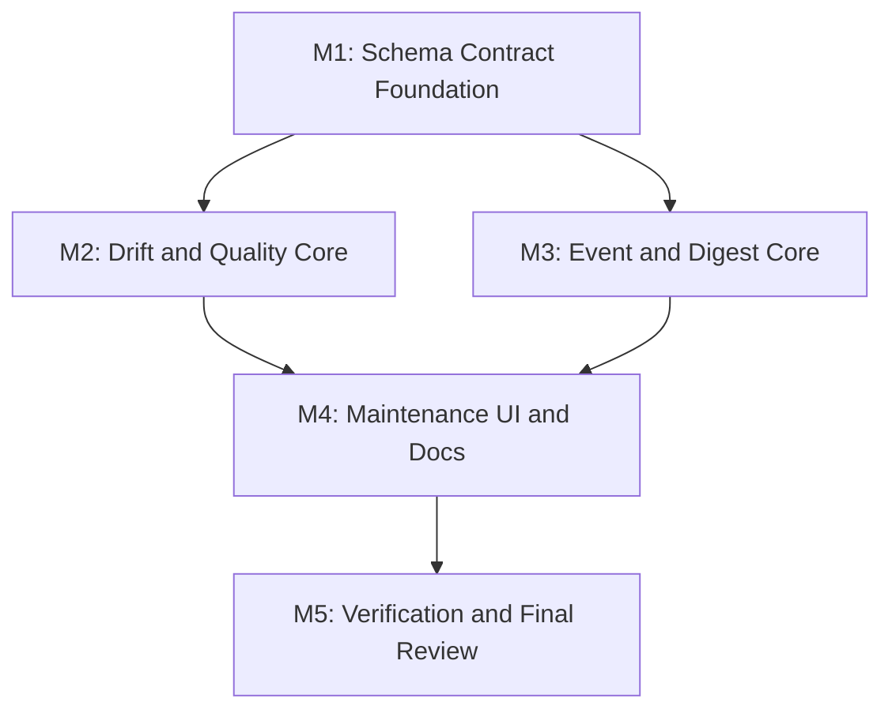

# 任务列表 - LLM Wiki v2 Schema 与事件自动化闭环

**关联需求**: [requirements.md](./requirements.md)
**估算量级**: 中 (审核轮数: 5)
**总体进度**: 🚧 3 / 17

---

## 状态图例

| Emoji | 状态 | 含义 |
|-------|------|------|
| ⏳ | 待开始 | 还没开始 |
| 🚧 | 进行中 | 当前正在做 |
| ✅ | 已完成 | 自检通过、commit/push 完毕 |
| ⚠️ | 阻塞中 | 等待外部决策 / 修不动 |
| 🔍 | 待审核 | 自己做完了等用户 review |

---

## 里程碑依赖图



---

## Milestone 1: Schema Contract Foundation

**目标**: 把自然语言 schema 升级为可解析、可测试、可迁移的机器可读 contract，同时保持 Markdown schema 可读。
**依赖**: 无
**状态**: ✅

### Task 1.1 ✅ 定义 schema contract 类型和默认 contract

**描述**: 新建 `schema-contract` 模块，定义 `LlmWikiSchemaContract`、默认 v1 contract、归一化和 warning shape。

**依赖**: 无
**阻塞**: T1.2, T1.3, T2.1

**预估**: 3h

**关联文件 / 模块**:
- `src/lib/schema-contract.ts` (新建)
- `src/lib/schema-contract.test.ts` (新建)
- `src/lib/wiki-frontmatter-fields.ts`

**验收**:
- [x] 默认 contract 覆盖 page types、required fields、enum fields、array fields、typed relation fields。
- [x] contract 复用现有 `WIKI_TYPED_RELATION_ARRAY_FIELDS`，避免字段双写。
- [x] normalize 对坏值返回 warnings 和默认值。

#### 备注

- 🐛 **遇到的问题**: 无功能阻塞；实现时需要避免 schema contract 复制已有 typed relation 字段造成未来漂移。
- 🔧 **最终实现逻辑**: 新增 `src/lib/schema-contract.ts`，定义 `LlmWikiSchemaContract`、默认 v1 contract、page type/frontmatter/relation/quality/Memory Ops contract、normalize helper 和 field/pageType map helper；新增 `src/lib/schema-contract.test.ts` 覆盖默认契约、自定义扩展、fallback 和坏值 warning。
- 🎯 **关键决策**: 默认 contract 复用 `WIKI_GRAPH_SEED_ARRAY_FIELDS` 和 `WIKI_TYPED_RELATION_ARRAY_FIELDS`；本任务只建立可检测契约，不改变模板、不读取 `schema.md`、不修改任何 wiki 页面。

---

### Task 1.2 ✅ 解析 schema.md contract block

**描述**: 支持从 `schema.md` 中读取 fenced YAML/JSON contract block；无 contract 或坏 contract 时 fallback 默认 contract。

**依赖**: T1.1
**阻塞**: T2.1, T3.1, T4.1

**预估**: 3h

**关联文件 / 模块**:
- `src/lib/schema-contract.ts`
- `src/lib/schema-contract.test.ts`
- `src/commands/fs.ts`

**验收**:
- [x] 能解析 ` ```yaml llm-wiki-schema-contract` 或等价标记。
- [x] 旧项目无 contract 返回默认 contract + warning。
- [x] YAML/JSON 解析失败不抛到 UI。
- [x] contract load 不读取网络、不执行代码。

#### 备注

- 🐛 **遇到的问题**: 无测试失败；任务文档提到 `src/commands/fs.ts`，但本步更适合保持纯解析，文件读取留给后续 scan helper。
- 🔧 **最终实现逻辑**: 在 `src/lib/schema-contract.ts` 增加 `parseSchemaContractFromMarkdown` 和 fenced block locator，支持 `yaml llm-wiki-schema-contract` 与 `json llm-wiki-schema-contract`，解析后复用 `normalizeSchemaContract`；坏 block 或缺失 block 返回默认 contract 和 warnings。
- 🎯 **关键决策**: contract block 解析不读取文件、不访问网络、不执行代码；JSON/YAML parse failure 被收敛为 fallback warning，避免损坏的 `schema.md` 阻塞项目打开或后续 scan。

---

### Task 1.3 ✅ 更新 TS templates 和 Rust project scaffold

**描述**: 在 `src/lib/templates.ts` 和 `src-tauri/src/commands/project.rs` 生成的新项目 schema 中加入机器可读 contract block，并补 parity 测试。

**依赖**: T1.1, T1.2
**阻塞**: T4.4, T5.1

**预估**: 4h

**关联文件 / 模块**:
- `src/lib/templates.ts`
- `src/lib/templates.test.ts`
- `src-tauri/src/commands/project.rs`
- `src-tauri/src/commands/project.rs` tests

**验收**:
- [x] 所有 scenario template 的 `schema.md` 包含 contract block。
- [x] Rust create_project 生成的 `schema.md` 包含同等 contract block。
- [x] TS/Rust contract 字段 parity 有测试。
- [x] 仍保留人类可读 schema 段落。

#### 备注

- 🐛 **遇到的问题**: Rust 侧没有直接复用 TS 常量的机制，只能内联同等 YAML block；通过 TS/Rust 测试断言关键字段降低后续漂移风险。
- 🔧 **最终实现逻辑**: 在 `schema-contract.ts` 导出 `DEFAULT_LLM_WIKI_SCHEMA_CONTRACT_BLOCK`，`templates.ts` 将其插入所有 scenario schema；`project.rs` 在默认 `schema.md` 中加入同等 machine-readable block；`templates.test.ts` 解析每个 template 的 contract 并断言默认关系、质量和 Memory Ops 契约，Rust project test 断言 scaffold 包含 contract 关键字段。
- 🎯 **关键决策**: contract block 放在人类可读 `## Frontmatter` 规则之前，作为 app-readable 契约和后续 drift checker 的输入；保留原自然语言 schema，不把 `schema.md` 变成 JSON-only。

---

## Milestone 2: Drift and Quality Core

**目标**: 提供纯函数 schema drift checker 和 deterministic page quality evaluator，作为后续 UI 和 Memory Ops 的稳定 API。
**依赖**: M1
**状态**: ⏳

### Task 2.1 ⏳ 实现 schema/frontmatter drift checker

**描述**: 新建 `schema-drift.ts`，扫描 wiki pages 与 contract 的偏差，输出 typed findings。

**依赖**: T1.1, T1.2
**阻塞**: T2.3, T4.1

**预估**: 5h

**关联文件 / 模块**:
- `src/lib/schema-drift.ts` (新建)
- `src/lib/schema-drift.test.ts` (新建)
- `src/lib/frontmatter.ts`
- `src/lib/typed-graph.ts`
- `src/lib/wiki-alias-index.ts`

**验收**:
- [ ] 缺失 frontmatter、必填字段、非法 enum、scalar array、score 越界有 tests。
- [ ] page type/path mismatch 有 tests。
- [ ] dangling typed relation 与 alias candidate 分开输出。
- [ ] finding 包含 targetPath、severity、reasons、proposedOperation 可选。

#### 备注

- 🐛 **遇到的问题**:
- 🔧 **最终实现逻辑**:
- 🎯 **关键决策**:

---

### Task 2.2 ⏳ 实现 deterministic page quality evaluator

**描述**: 新建 `page-quality.ts`，按 structure/citation/relation/retrieval/governance 维度评分并给出 reasons。

**依赖**: T1.1
**阻塞**: T2.3, T4.1

**预估**: 5h

**关联文件 / 模块**:
- `src/lib/page-quality.ts` (新建)
- `src/lib/page-quality.test.ts` (新建)
- `src/lib/search-eval.ts`
- `src/lib/lifecycle.ts`

**验收**:
- [ ] 无标题结构、无 sources、无 typed/link relation、private governance、weak retrieval evidence 场景有 tests。
- [ ] quality_score 建议可解释且固定输入稳定。
- [ ] 不调用 LLM。
- [ ] 不覆盖更高用户显式评分，除非 contract 配置允许。

#### 备注

- 🐛 **遇到的问题**:
- 🔧 **最终实现逻辑**:
- 🎯 **关键决策**:

---

### Task 2.3 ⏳ 聚合 SchemaQualityScanReport

**描述**: 新建 `schema-quality.ts`，组合 contract load、drift findings、quality scores、warnings 和 summary。

**依赖**: T2.1, T2.2
**阻塞**: T4.1, T4.2

**预估**: 4h

**关联文件 / 模块**:
- `src/lib/schema-quality.ts` (新建)
- `src/lib/schema-quality.test.ts` (新建)
- `src/lib/memory-ops.ts`
- `src/lib/audit-timeline.ts`

**验收**:
- [ ] 空项目、旧项目、坏 schema、正常项目均稳定返回 report。
- [ ] report summary 包含 contract version、finding counts、quality distribution。
- [ ] run helper 写 `memory_ops.schema_quality` audit event。
- [ ] audit 写失败不丢 scan result。

#### 备注

- 🐛 **遇到的问题**:
- 🔧 **最终实现逻辑**:
- 🎯 **关键决策**:

---

### Task 2.4 ⏳ 将 drift/quality findings 映射为 Memory Ops suggestions

**描述**: 把 schema drift 和 quality finding 转换为现有 `MemoryOpsSuggestion` 分类，复用 batch preview/apply/ignore。

**依赖**: T2.1, T2.2, T2.3
**阻塞**: T4.1

**预估**: 4h

**关联文件 / 模块**:
- `src/lib/memory-ops-rules.ts`
- `src/lib/memory-ops-ui.ts`
- `src/lib/schema-quality.ts`
- `src/lib/memory-ops-rules.test.ts`
- `src/lib/memory-ops-ui.test.ts`

**验收**:
- [ ] metadata-fix finding 可 batch apply。
- [ ] review-only finding 不可 batch apply。
- [ ] suggestion category 支持 schema/quality 或映射到合理现有分类。
- [ ] private finding 不泄漏正文或完整 diff。

#### 备注

- 🐛 **遇到的问题**:
- 🔧 **最终实现逻辑**:
- 🎯 **关键决策**:

---

## Milestone 3: Event and Digest Core

**目标**: 建立轻量 event automation registry，扩展 crystallization digest，并提供本地 coordination summary。
**依赖**: M1
**状态**: ⏳

### Task 3.1 ⏳ 实现 Wiki automation event registry

**描述**: 新建 `wiki-automation-events.ts`，统一 session/memory/schema/quality/digest 事件输入、audit 写入和 dirty counter。

**依赖**: T1.2
**阻塞**: T3.2, T3.3, T4.1

**预估**: 4h

**关联文件 / 模块**:
- `src/lib/wiki-automation-events.ts` (新建)
- `src/lib/wiki-automation-events.test.ts` (新建)
- `src/lib/audit-events.ts`
- `src/lib/audit-timeline.ts`
- `src/lib/memory-ops.ts`

**验收**:
- [ ] 支持 session.start、session.end、memory.write、schema.scan、quality.scan、digest.preview、digest.save。
- [ ] audit action/category 与现有 contract 兼容。
- [ ] record helper best-effort，失败不阻断主流程。
- [ ] 触发 dirty counter/cooldown 的行为有 tests。

#### 备注

- 🐛 **遇到的问题**:
- 🔧 **最终实现逻辑**:
- 🎯 **关键决策**:

---

### Task 3.2 ⏳ 接入 session start/end 和 memory write hooks

**描述**: 在 app/session/chat/ingest/crystallize 等明确边界接入轻量 automation events。

**依赖**: T3.1
**阻塞**: T4.1

**预估**: 4h

**关联文件 / 模块**:
- `src/components/chat/chat-panel.tsx`
- `src/lib/ingest.ts`
- `src/lib/crystallize.ts`
- `src/lib/deep-research.ts`
- `src/stores/chat-store.ts`

**验收**:
- [ ] session start/end 或 conversation lifecycle 事件能被记录。
- [ ] ingest/crystallize memory write 后记录 memory.write。
- [ ] 不在每次 keystroke/input 触发事件。
- [ ] audit 写失败仅 console warn 或返回 auditError。

#### 备注

- 🐛 **遇到的问题**:
- 🔧 **最终实现逻辑**:
- 🎯 **关键决策**:

---

### Task 3.3 ⏳ 实现 crystallization digest planner

**描述**: 新建 `crystallization-digest.ts`，基于现有 candidate 输入生成 lessons/decisions/entities/relations/page candidates。

**依赖**: T1.1, T3.1
**阻塞**: T4.3

**预估**: 5h

**关联文件 / 模块**:
- `src/lib/crystallization-digest.ts` (新建)
- `src/lib/crystallization-digest.test.ts` (新建)
- `src/lib/crystallize-candidates.ts`
- `src/lib/crystallize.ts`

**验收**:
- [ ] 低价值/无引用内容不生成 digest plan。
- [ ] 有 decisions/lessons/entity mentions 的内容生成 conservative plan。
- [ ] preview 不写文件。
- [ ] save/apply 事件写 audit 且带 dedupeKey。

#### 备注

- 🐛 **遇到的问题**:
- 🔧 **最终实现逻辑**:
- 🎯 **关键决策**:

---

### Task 3.4 ⏳ 实现 coordination summary helper

**描述**: 新建 `coordination-summary.ts`，从 audit/review/schema findings 汇总 actor activity、blocked findings、pending review 和 promotion candidates。

**依赖**: T2.3, T3.1
**阻塞**: T4.4

**预估**: 4h

**关联文件 / 模块**:
- `src/lib/coordination-summary.ts` (新建)
- `src/lib/coordination-summary.test.ts` (新建)
- `src/lib/audit-timeline-ui.ts`
- `src/stores/review-store.ts`

**验收**:
- [ ] audit-only 项目能生成 summary。
- [ ] actor/action/path/scope/status 聚合稳定。
- [ ] private event 摘要不泄漏 detail。
- [ ] pending review 和 blocked finding 可定位 target path。

#### 备注

- 🐛 **遇到的问题**:
- 🔧 **最终实现逻辑**:
- 🎯 **关键决策**:

---

## Milestone 4: Maintenance UI and Documentation

**目标**: 把 schema scan、quality、digest 和 coordination 做成 Settings -> Maintenance 中可操作的工作台能力，并更新文档。
**依赖**: M2, M3
**状态**: ⏳

### Task 4.1 ⏳ 增加 Schema & Quality scan 面板

**描述**: 在 Maintenance 中加入 Schema & Quality scan UI，展示 contract summary、warnings、findings、quality distribution，并支持 preview/apply/ignore。

**依赖**: T2.3, T2.4, T3.1
**阻塞**: T4.4, T5.1

**预估**: 6h

**关联文件 / 模块**:
- `src/components/settings/sections/schema-quality-panel.tsx` (新建)
- `src/components/settings/sections/maintenance-section.tsx`
- `src/components/settings/sections/memory-ops-suggestion-groups.tsx`
- `src/i18n/en.json`
- `src/i18n/zh.json`

**验收**:
- [ ] 支持 no project/running/empty/warnings/error 状态。
- [ ] findings 可按 severity/category 过滤或分组。
- [ ] metadata finding 可 preview/apply/ignore。
- [ ] scan 后刷新 audit timeline。

#### 备注

- 🐛 **遇到的问题**:
- 🔧 **最终实现逻辑**:
- 🎯 **关键决策**:

---

### Task 4.2 ⏳ 将 Schema & Quality summary 接入 Memory Ops patrol

**描述**: Memory Ops patrol 报告中展示 schema/quality 摘要，避免用户需要运行多个独立工具才看到全貌。

**依赖**: T2.3, T2.4, T4.1
**阻塞**: T5.1

**预估**: 4h

**关联文件 / 模块**:
- `src/lib/memory-ops.ts`
- `src/lib/memory-ops-ui.ts`
- `src/components/settings/sections/memory-ops-patrol-block.tsx`
- `src/i18n/en.json`
- `src/i18n/zh.json`

**验收**:
- [ ] Patrol summary 显示 schema warnings/finding counts/quality average。
- [ ] 不让 patrol 对大项目同步重复跑昂贵 scan，必要时用最近 report。
- [ ] UI 明确区分 Memory Ops suggestions 与 schema scan findings。

#### 备注

- 🐛 **遇到的问题**:
- 🔧 **最终实现逻辑**:
- 🎯 **关键决策**:

---

### Task 4.3 ⏳ 增加 digest preview UI

**描述**: 在现有 Save to Wiki candidate 入口附近加入 Digest Preview，允许用户查看 lessons/decisions/entities/relations，再确认保存或 patch。

**依赖**: T3.3
**阻塞**: T5.1

**预估**: 5h

**关联文件 / 模块**:
- `src/components/chat/chat-message.tsx`
- `src/components/review/review-card.tsx`
- `src/components/layout/research-panel.tsx`
- `src/lib/crystallization-digest.ts`
- `src/i18n/en.json`
- `src/i18n/zh.json`

**验收**:
- [ ] digest preview 不阻挡原 Save to Wiki 流程。
- [ ] 低价值内容不显示 digest。
- [ ] 用户确认前不写文件。
- [ ] 保存/patch 后写 audit 并刷新 file tree/dataVersion。

#### 备注

- 🐛 **遇到的问题**:
- 🔧 **最终实现逻辑**:
- 🎯 **关键决策**:

---

### Task 4.4 ⏳ 增加 Coordination Summary 面板

**描述**: 在 Maintenance 中展示本地 actor activity、pending review、blocked findings、private/shared promotion candidates。

**依赖**: T3.4
**阻塞**: T5.1

**预估**: 4h

**关联文件 / 模块**:
- `src/components/settings/sections/coordination-summary-panel.tsx` (新建)
- `src/components/settings/sections/maintenance-section.tsx`
- `src/lib/coordination-summary.ts`
- `src/i18n/en.json`
- `src/i18n/zh.json`

**验收**:
- [ ] 空 audit 和有坏行 audit 都能显示合理状态。
- [ ] summary 可打开 target 或过滤 timeline。
- [ ] private event 显示收缩摘要。
- [ ] 不出现云同步/团队权限误导文案。

#### 备注

- 🐛 **遇到的问题**:
- 🔧 **最终实现逻辑**:
- 🎯 **关键决策**:

---

### Task 4.5 ⏳ 更新 README、README_CN、migration guide 和 i18n parity

**描述**: 更新项目文档说明 v2.3 schema-as-product 和事件自动化能力，补齐 i18n 文案。

**依赖**: T1.3, T4.1, T4.2, T4.3, T4.4
**阻塞**: T5.1

**预估**: 4h

**关联文件 / 模块**:
- `README.md`
- `README_CN.md`
- `docs/llm-wiki-v2-schema-automation/requirements.md`
- `src/i18n/en.json`
- `src/i18n/zh.json`
- `src/i18n/i18n-parity.test.ts`

**验收**:
- [ ] 文档说明 schema contract、scan、event hooks、digest、coordination summary。
- [ ] 旧项目 migration/fallback 说明清楚。
- [ ] 不声明范围外 external memory server / cloud collaboration。
- [ ] i18n parity test 通过。

#### 备注

- 🐛 **遇到的问题**:
- 🔧 **最终实现逻辑**:
- 🎯 **关键决策**:

---

## Milestone 5: Verification and Final Review

**目标**: 完成回归验证、文档对齐和 5 轮最终审核。
**依赖**: M4
**状态**: ⏳

### Task 5.1 ⏳ 运行 focused tests、typecheck、mock regression 和 Rust tests

**描述**: 跑新增 focused suites、全量 typecheck、mock tests；如果 Rust scaffold 改动，跑 cargo test。

**依赖**: T4.5
**阻塞**: T5.2

**预估**: 4h

**关联文件 / 模块**:
- `src/lib/schema-*.test.ts`
- `src/lib/page-quality.test.ts`
- `src/lib/wiki-automation-events.test.ts`
- `src/lib/crystallization-digest.test.ts`
- `src/lib/coordination-summary.test.ts`
- `src/i18n/i18n-parity.test.ts`
- `src-tauri/src/commands/project.rs`

**验收**:
- [ ] Focused Vitest suites 通过。
- [ ] `npm run typecheck` 通过。
- [ ] `npm run test:mocks` 通过或明确记录失败和原因。
- [ ] Rust scaffold 有改动时 `cd src-tauri && cargo test` 通过。

#### 备注

- 🐛 **遇到的问题**:
- 🔧 **最终实现逻辑**:
- 🎯 **关键决策**:

---

### Task 5.2 ⏳ 五轮最终审核与 completion audit

**描述**: 按中型项目执行 5 轮最终审核：功能、类型/静态分析、性能、安全、UX/a11y，并补齐发现。

**依赖**: T5.1
**阻塞**: 无

**预估**: 5h

**关联文件 / 模块**:
- `docs/llm-wiki-v2-schema-automation/review-round-1.md`
- `docs/llm-wiki-v2-schema-automation/review-round-2.md`
- `docs/llm-wiki-v2-schema-automation/review-round-3.md`
- `docs/llm-wiki-v2-schema-automation/review-round-4.md`
- `docs/llm-wiki-v2-schema-automation/review-round-5.md`
- `docs/llm-wiki-v2-schema-automation/completion-audit.md`

**验收**:
- [ ] 5 轮 review reports 存在。
- [ ] 每轮发现修复或明确记录为 follow-up/非目标。
- [ ] completion audit 对照 F1-F8。

#### 备注

- 🐛 **遇到的问题**:
- 🔧 **最终实现逻辑**:
- 🎯 **关键决策**:

---

## 进度总览 (开发中实时维护)

| 里程碑 | 任务 | 完成 | 总数 | 状态 |
|--------|------|------|------|------|
| M1 | Schema Contract Foundation | 3 | 3 | ✅ |
| M2 | Drift and Quality Core | 0 | 4 | ⏳ |
| M3 | Event and Digest Core | 0 | 4 | ⏳ |
| M4 | Maintenance UI and Documentation | 0 | 5 | ⏳ |
| M5 | Verification and Final Review | 0 | 2 | ⏳ |
| **总计** | | **3** | **17** | **🚧** |

---

## 变更记录

| 日期 | 变更 |
|------|------|
| 2026-05-07 | 初稿，17 个任务 |

---

## 最终审核索引 (Phase 4 期间填)

| Round | 视角 | 状态 | 报告 |
|-------|------|------|------|
| 1 | 功能 | ⏳ | <-> |
| 2 | 类型 & 静态分析 | ⏳ | <-> |
| 3 | 性能 | ⏳ | <-> |
| 4 | 安全 | ⏳ | <-> |
| 5 | UX & a11y | ⏳ | <-> |
