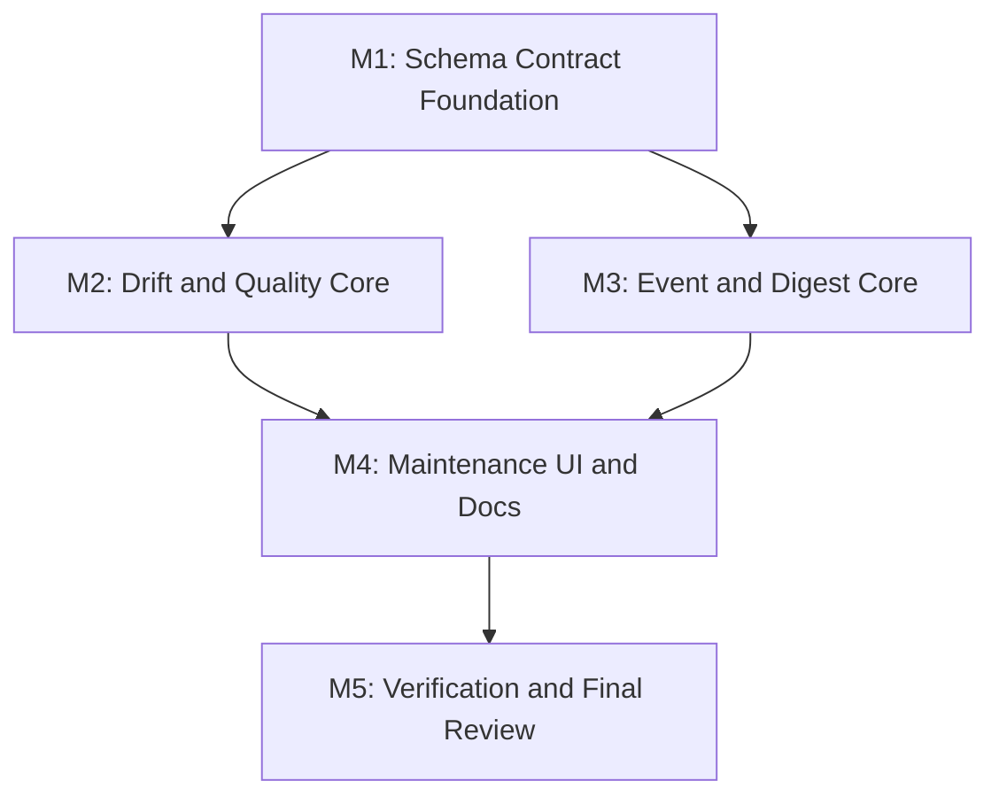

# 任务列表 - LLM Wiki v2 Schema 与事件自动化闭环

**关联需求**: [requirements.md](./requirements.md)
**估算量级**: 中 (审核轮数: 5)
**总体进度**: 🚧 15 / 17

---

## 状态图例

| Emoji | 状态 | 含义 |
|-------|------|------|
| ⏳ | 待开始 | 还没开始 |
| 🚧 | 进行中 | 当前正在做 |
| ✅ | 已完成 | 自检通过、commit/push 完毕 |
| ⚠️ | 阻塞中 | 等待外部决策 / 修不动 |
| 🔍 | 待审核 | 自己做完了等用户 review |

---

## 里程碑依赖图



---

## Milestone 1: Schema Contract Foundation

**目标**: 把自然语言 schema 升级为可解析、可测试、可迁移的机器可读 contract，同时保持 Markdown schema 可读。
**依赖**: 无
**状态**: ✅

### Task 1.1 ✅ 定义 schema contract 类型和默认 contract

**描述**: 新建 `schema-contract` 模块，定义 `LlmWikiSchemaContract`、默认 v1 contract、归一化和 warning shape。

**依赖**: 无
**阻塞**: T1.2, T1.3, T2.1

**预估**: 3h

**关联文件 / 模块**:
- `src/lib/schema-contract.ts` (新建)
- `src/lib/schema-contract.test.ts` (新建)
- `src/lib/wiki-frontmatter-fields.ts`

**验收**:
- [x] 默认 contract 覆盖 page types、required fields、enum fields、array fields、typed relation fields。
- [x] contract 复用现有 `WIKI_TYPED_RELATION_ARRAY_FIELDS`，避免字段双写。
- [x] normalize 对坏值返回 warnings 和默认值。

#### 备注

- 🐛 **遇到的问题**: 无功能阻塞；实现时需要避免 schema contract 复制已有 typed relation 字段造成未来漂移。
- 🔧 **最终实现逻辑**: 新增 `src/lib/schema-contract.ts`，定义 `LlmWikiSchemaContract`、默认 v1 contract、page type/frontmatter/relation/quality/Memory Ops contract、normalize helper 和 field/pageType map helper；新增 `src/lib/schema-contract.test.ts` 覆盖默认契约、自定义扩展、fallback 和坏值 warning。
- 🎯 **关键决策**: 默认 contract 复用 `WIKI_GRAPH_SEED_ARRAY_FIELDS` 和 `WIKI_TYPED_RELATION_ARRAY_FIELDS`；本任务只建立可检测契约，不改变模板、不读取 `schema.md`、不修改任何 wiki 页面。

---

### Task 1.2 ✅ 解析 schema.md contract block

**描述**: 支持从 `schema.md` 中读取 fenced YAML/JSON contract block；无 contract 或坏 contract 时 fallback 默认 contract。

**依赖**: T1.1
**阻塞**: T2.1, T3.1, T4.1

**预估**: 3h

**关联文件 / 模块**:
- `src/lib/schema-contract.ts`
- `src/lib/schema-contract.test.ts`
- `src/commands/fs.ts`

**验收**:
- [x] 能解析 ` ```yaml llm-wiki-schema-contract` 或等价标记。
- [x] 旧项目无 contract 返回默认 contract + warning。
- [x] YAML/JSON 解析失败不抛到 UI。
- [x] contract load 不读取网络、不执行代码。

#### 备注

- 🐛 **遇到的问题**: 无测试失败；任务文档提到 `src/commands/fs.ts`，但本步更适合保持纯解析，文件读取留给后续 scan helper。
- 🔧 **最终实现逻辑**: 在 `src/lib/schema-contract.ts` 增加 `parseSchemaContractFromMarkdown` 和 fenced block locator，支持 `yaml llm-wiki-schema-contract` 与 `json llm-wiki-schema-contract`，解析后复用 `normalizeSchemaContract`；坏 block 或缺失 block 返回默认 contract 和 warnings。
- 🎯 **关键决策**: contract block 解析不读取文件、不访问网络、不执行代码；JSON/YAML parse failure 被收敛为 fallback warning，避免损坏的 `schema.md` 阻塞项目打开或后续 scan。

---

### Task 1.3 ✅ 更新 TS templates 和 Rust project scaffold

**描述**: 在 `src/lib/templates.ts` 和 `src-tauri/src/commands/project.rs` 生成的新项目 schema 中加入机器可读 contract block，并补 parity 测试。

**依赖**: T1.1, T1.2
**阻塞**: T4.4, T5.1

**预估**: 4h

**关联文件 / 模块**:
- `src/lib/templates.ts`
- `src/lib/templates.test.ts`
- `src-tauri/src/commands/project.rs`
- `src-tauri/src/commands/project.rs` tests

**验收**:
- [x] 所有 scenario template 的 `schema.md` 包含 contract block。
- [x] Rust create_project 生成的 `schema.md` 包含同等 contract block。
- [x] TS/Rust contract 字段 parity 有测试。
- [x] 仍保留人类可读 schema 段落。

#### 备注

- 🐛 **遇到的问题**: Rust 侧没有直接复用 TS 常量的机制，只能内联同等 YAML block；通过 TS/Rust 测试断言关键字段降低后续漂移风险。
- 🔧 **最终实现逻辑**: 在 `schema-contract.ts` 导出 `DEFAULT_LLM_WIKI_SCHEMA_CONTRACT_BLOCK`，`templates.ts` 将其插入所有 scenario schema；`project.rs` 在默认 `schema.md` 中加入同等 machine-readable block；`templates.test.ts` 解析每个 template 的 contract 并断言默认关系、质量和 Memory Ops 契约，Rust project test 断言 scaffold 包含 contract 关键字段。
- 🎯 **关键决策**: contract block 放在人类可读 `## Frontmatter` 规则之前，作为 app-readable 契约和后续 drift checker 的输入；保留原自然语言 schema，不把 `schema.md` 变成 JSON-only。

---

## Milestone 2: Drift and Quality Core

**目标**: 提供纯函数 schema drift checker 和 deterministic page quality evaluator，作为后续 UI 和 Memory Ops 的稳定 API。
**依赖**: M1
**状态**: ✅

### Task 2.1 ✅ 实现 schema/frontmatter drift checker

**描述**: 新建 `schema-drift.ts`，扫描 wiki pages 与 contract 的偏差，输出 typed findings。

**依赖**: T1.1, T1.2
**阻塞**: T2.3, T4.1

**预估**: 5h

**关联文件 / 模块**:
- `src/lib/schema-drift.ts` (新建)
- `src/lib/schema-drift.test.ts` (新建)
- `src/lib/frontmatter.ts`
- `src/lib/typed-graph.ts`
- `src/lib/wiki-alias-index.ts`

**验收**:
- [x] 缺失 frontmatter、必填字段、非法 enum、scalar array、score 越界有 tests。
- [x] page type/path mismatch 有 tests。
- [x] dangling typed relation 与 alias candidate 分开输出。
- [x] finding 包含 targetPath、severity、reasons、proposedOperation 可选。

#### 备注

- 🐛 **遇到的问题**: 自检时发现 private scope 测试最初断言了不会生成 patch 的 date finding；已改为用 private 页面上的 scalar typed relation 验证 proposedOperation scope。
- 🔧 **最终实现逻辑**: 新增 `src/lib/schema-drift.ts`，提供 `scanSchemaDrift` 纯函数，扫描 frontmatter 缺失、required field、enum/score/integer/date、array shape、page type/path 和 typed relation target；新增 `src/lib/schema-drift.test.ts` 覆盖缺失 frontmatter、可推断 metadata patch、坏值、scalar relation、dangling relation、alias candidate、path mismatch 和 private redaction。
- 🎯 **关键决策**: Drift scanner 不读取磁盘、不写 audit、不调用 LLM；自动修复只输出 `MetadataPatchOperation`，且仅覆盖安全 frontmatter 形状修复或可推断字段，正文和事实裁决留给后续 Memory Ops/Review。

---

### Task 2.2 ✅ 实现 deterministic page quality evaluator

**描述**: 新建 `page-quality.ts`，按 structure/citation/relation/retrieval/governance 维度评分并给出 reasons。

**依赖**: T1.1
**阻塞**: T2.3, T4.1

**预估**: 5h

**关联文件 / 模块**:
- `src/lib/page-quality.ts` (新建)
- `src/lib/page-quality.test.ts` (新建)
- `src/lib/search-eval.ts`
- `src/lib/lifecycle.ts`

**验收**:
- [x] 无标题结构、无 sources、无 typed/link relation、private governance、weak retrieval evidence 场景有 tests。
- [x] quality_score 建议可解释且固定输入稳定。
- [x] 不调用 LLM。
- [x] 不覆盖更高用户显式评分，除非 contract 配置允许。

#### 备注

- 🐛 **遇到的问题**: 无测试失败；评分规则需要避免被理解成事实正确性判断，因此测试和命名都围绕 wiki artifact health。
- 🔧 **最终实现逻辑**: 新增 `src/lib/page-quality.ts`，按 structure、citation、relation、retrieval、governance 五个维度计算确定性分数，聚合为 `quality_score` 建议；新增 `src/lib/page-quality.test.ts` 覆盖高质量页面、短无来源页面、高显式分不覆盖、private scope 和 batch 评估。
- 🎯 **关键决策**: `quality_score` 只衡量页面结构健康、引用/关系/检索种子和治理 metadata 完整度；不调用 LLM，也不判断正文事实真假。若已有显式 `quality_score` 高于新分数，则不降级覆盖。

---

### Task 2.3 ✅ 聚合 SchemaQualityScanReport

**描述**: 新建 `schema-quality.ts`，组合 contract load、drift findings、quality scores、warnings 和 summary。

**依赖**: T2.1, T2.2
**阻塞**: T4.1, T4.2

**预估**: 4h

**关联文件 / 模块**:
- `src/lib/schema-quality.ts` (新建)
- `src/lib/schema-quality.test.ts` (新建)
- `src/lib/memory-ops.ts`
- `src/lib/audit-timeline.ts`

**验收**:
- [x] 空项目、旧项目、坏 schema、正常项目均稳定返回 report。
- [x] report summary 包含 contract version、finding counts、quality distribution。
- [x] run helper 写 `memory_ops.schema_quality` audit event。
- [x] audit 写失败不丢 scan result。

#### 备注

- 🐛 **遇到的问题**: 无测试失败；audit mock 需要保持 best-effort 行为可断言，避免 scan report 和 audit 写入强耦合。
- 🔧 **最终实现逻辑**: 新增 `src/lib/schema-quality.ts`，组合 contract parse/fallback、`scanSchemaDrift` 和 `evaluatePagesQuality`，输出 `SchemaQualityScanReport`、summary 和 `memory_ops.schema_quality` audit event；新增 `src/lib/schema-quality.test.ts` 覆盖正常 schema、缺失 schema fallback、紧凑 audit、audit 成功和 audit 失败。
- 🎯 **关键决策**: 本任务不遍历磁盘、不接 UI、不生成 Memory Ops suggestions；调用方传入已读 schema/pages。Audit event 只记录 summary、top finding 和低分页面路径/分数，不携带正文。

---

### Task 2.4 ✅ 将 drift/quality findings 映射为 Memory Ops suggestions

**描述**: 把 schema drift 和 quality finding 转换为现有 `MemoryOpsSuggestion` 分类，复用 batch preview/apply/ignore。

**依赖**: T2.1, T2.2, T2.3
**阻塞**: T4.1

**预估**: 4h

**关联文件 / 模块**:
- `src/lib/memory-ops-rules.ts`
- `src/lib/memory-ops-ui.ts`
- `src/lib/schema-quality.ts`
- `src/lib/memory-ops-rules.test.ts`
- `src/lib/memory-ops-ui.test.ts`

**验收**:
- [x] metadata-fix finding 可 batch apply。
- [x] review-only finding 不可 batch apply。
- [x] suggestion category 支持 schema/quality 或映射到合理现有分类。
- [x] private finding 不泄漏正文或完整 diff。

#### 备注

- 🐛 **遇到的问题**: 初版 category 识别里 quality suggestion 因 reasons 含 `retrieval` 被归为 search-health，随后又因 schema finding id 使用 `schema-quality:` 前缀被误归类；已调整为 quality/schema/search 的优先级，并把 drift suggestion id 前缀改成 `schema-drift:`。
- 🔧 **最终实现逻辑**: 在 `schema-quality.ts` 增加 `schemaQualityScanSuggestions()`，将 drift finding 映射为 `metadata-update` 或 `review-action`，将低分 quality score 映射为可批量处理的 metadata suggestion；在 `memory-ops-ui.ts` 增加 schema/quality category 并更新稳定排序。
- 🎯 **关键决策**: 有 `proposedOperation` 的 schema finding 可以走 batch apply；dangling relation 等无安全 patch 的 finding 保持 review-only。Suggestion 只携带 paths、fields、reasons 和 redacted summary，不携带正文。

---

## Milestone 3: Event and Digest Core

**目标**: 建立轻量 event automation registry，扩展 crystallization digest，并提供本地 coordination summary。
**依赖**: M1
**状态**: ✅

### Task 3.1 ✅ 实现 Wiki automation event registry

**描述**: 新建 `wiki-automation-events.ts`，统一 session/memory/schema/quality/digest 事件输入、audit 写入和 dirty counter。

**依赖**: T1.2
**阻塞**: T3.2, T3.3, T4.1

**预估**: 4h

**关联文件 / 模块**:
- `src/lib/wiki-automation-events.ts` (新建)
- `src/lib/wiki-automation-events.test.ts` (新建)
- `src/lib/audit-events.ts`
- `src/lib/audit-timeline.ts`
- `src/lib/memory-ops.ts`

**验收**:
- [x] 支持 session.start、session.end、memory.write、schema.scan、quality.scan、digest.preview、digest.save。
- [x] audit action/category 与现有 contract 兼容。
- [x] record helper best-effort，失败不阻断主流程。
- [x] 触发 dirty counter/cooldown 的行为有 tests。

#### 备注

- 🐛 **遇到的问题**: TypeScript 发现 maintenance false 分支后还有冗余 `!== false` 比较；已简化为 `input.maintenance ?? {}`。
- 🔧 **最终实现逻辑**: 新增 `src/lib/wiki-automation-events.ts`，定义 `WikiAutomationEventType` 和 `recordWikiAutomationEvent`，统一构造 audit event、best-effort 写 audit、可选触发 `recordMemoryOpsMaintenanceEvent`；新增 `src/lib/wiki-automation-events.test.ts` 覆盖 session/memory/schema/digest 默认值、maintenance skip、audit/maintenance 错误返回。
- 🎯 **关键决策**: Registry 只记录事件和 dirty marker，不触发全量 scan；preview 类事件可以 `maintenance: false`，避免把只读预览计为需要 patrol 的写入。

---

### Task 3.2 ✅ 接入 session start/end 和 memory write hooks

**描述**: 在 app/session/chat/ingest/crystallize 等明确边界接入轻量 automation events。

**依赖**: T3.1
**阻塞**: T4.1

**预估**: 4h

**关联文件 / 模块**:
- `src/components/chat/chat-panel.tsx`
- `src/lib/ingest.ts`
- `src/lib/crystallize.ts`
- `src/lib/deep-research.ts`
- `src/stores/chat-store.ts`

**验收**:
- [x] session start/end 或 conversation lifecycle 事件能被记录。
- [x] ingest/crystallize memory write 后记录 memory.write。
- [x] 不在每次 keystroke/input 触发事件。
- [x] audit 写失败仅 console warn 或返回 auditError。

#### 备注

- 🐛 **遇到的问题**: 自检时发现 `recordWikiAutomationEvent().catch` 的对象类型缺少 `maintenanceError`，以及一个 catch 括号语法错误；已由 typecheck/Vitest 暴露并修正。Chat callback dependency 也补入 `project`，避免新项目切换后闭包使用旧路径。
- 🔧 **最终实现逻辑**: 新增 `chat-session-events.ts`，封装 `recordChatSessionStart/End`，在侧栏 New Chat、无 active conversation 的首次发送、stream done/error 边界记录 session 事件；在 `writeCrystallizedQueryPage` 写入后记录 `memory.write`；在 `autoIngest` 和 `executeIngestWrites` 的批量写入完成后记录一次 `memory.write`，并补充聚焦测试。
- 🎯 **关键决策**: session.start/end 只写 audit，不触发 Memory Ops dirty counter；真正改变 wiki 的 ingest/crystallize 写入才计入 maintenance。写入事件按批次记录一次，避免 token/keystroke 高频噪声；automation 失败只 console.warn，不阻断文件写入或聊天完成。

---

### Task 3.3 ✅ 实现 crystallization digest planner

**描述**: 新建 `crystallization-digest.ts`，基于现有 candidate 输入生成 lessons/decisions/entities/relations/page candidates。

**依赖**: T1.1, T3.1
**阻塞**: T4.3

**预估**: 5h

**关联文件 / 模块**:
- `src/lib/crystallization-digest.ts` (新建)
- `src/lib/crystallization-digest.test.ts` (新建)
- `src/lib/crystallize-candidates.ts`
- `src/lib/crystallize.ts`

**验收**:
- [x] 低价值/无引用内容不生成 digest plan。
- [x] 有 decisions/lessons/entity mentions 的内容生成 conservative plan。
- [x] preview 不写文件。
- [x] save/apply 事件写 audit 且带 dedupeKey。

#### 备注

- 🐛 **遇到的问题**: 初版测试发现 `Next step` 被合理归入 decision/action signal，已更新预期；TypeScript 也暴露了 optional `targetPath` 与 type predicate 不兼容，改为显式循环构造实体数组。`[[concepts/foo]]` wikilink 最初没有识别为 wiki 子目录路径，已补支持。
- 🔧 **最终实现逻辑**: 新增 `src/lib/crystallization-digest.ts`，从现有 `CrystallizationCandidate` 生成 deterministic digest plan，包含 lessons、decisions、entities、supports relation candidates 和 query/synthesis page candidate；新增 preview/save 事件 helper，preview 使用 `maintenance:false`，save 事件记录 dedupeKey、target paths 和 operation counts；新增 `crystallization-digest.test.ts` 覆盖低价值拒绝、保守 plan、dedupe、preview/save audit。
- 🎯 **关键决策**: Digest planner 不读写文件、不调用 LLM、不自动 patch metadata；它只产出可预览 plan 和 audit helper。高分且跨多个 lesson/decision/relation 的输出建议为 synthesis，否则保守建议为 query page；所有保存仍留到后续 UI 或现有 write helper 由用户确认。

---

### Task 3.4 ✅ 实现 coordination summary helper

**描述**: 新建 `coordination-summary.ts`，从 audit/review/schema findings 汇总 actor activity、blocked findings、pending review 和 promotion candidates。

**依赖**: T2.3, T3.1
**阻塞**: T4.4

**预估**: 4h

**关联文件 / 模块**:
- `src/lib/coordination-summary.ts` (新建)
- `src/lib/coordination-summary.test.ts` (新建)
- `src/lib/audit-timeline-ui.ts`
- `src/stores/review-store.ts`

**验收**:
- [x] audit-only 项目能生成 summary。
- [x] actor/action/path/scope/status 聚合稳定。
- [x] private event 摘要不泄漏 detail。
- [x] pending review 和 blocked finding 可定位 target path。

#### 备注

- 🐛 **遇到的问题**: 测试 fixture 初版用了不存在的 `set-frontmatter-field` patch kind，typecheck 暴露后改为现有 `metadata-patch` 结构，确保 helper 与 Memory Ops executor 类型一致。
- 🔧 **最终实现逻辑**: 新增 `coordination-summary.ts`，从 audit events、review items 和 schema drift findings 聚合 actor activity、recent events、target summaries、pending reviews、blocked findings 与 private->shared promotion candidates；新增 `coordination-summary.test.ts` 覆盖 audit-only、private redaction、review/finding 定位和 promotion candidate 过滤。
- 🎯 **关键决策**: Coordination summary 是纯函数，不读取磁盘、不写 worklog、不引入同步/权限语义。Private event 保留 target locator，但隐藏 page/source path 和 reason detail；blocked finding 优先展示 review-only 或 warning finding，避免把它误当作自动可处理工作。

---

## Milestone 4: Maintenance UI and Documentation

**目标**: 把 schema scan、quality、digest 和 coordination 做成 Settings -> Maintenance 中可操作的工作台能力，并更新文档。
**依赖**: M2, M3
**状态**: 🚧

### Task 4.1 ✅ 增加 Schema & Quality scan 面板

**描述**: 在 Maintenance 中加入 Schema & Quality scan UI，展示 contract summary、warnings、findings、quality distribution，并支持 preview/apply/ignore。

**依赖**: T2.3, T2.4, T3.1
**阻塞**: T4.4, T5.1

**预估**: 6h

**关联文件 / 模块**:
- `src/components/settings/sections/schema-quality-panel.tsx` (新建)
- `src/components/settings/sections/maintenance-section.tsx`
- `src/components/settings/sections/memory-ops-suggestion-groups.tsx`
- `src/i18n/en.json`
- `src/i18n/zh.json`

**验收**:
- [x] 支持 no project/running/empty/warnings/error 状态。
- [x] findings 可按 severity/category 过滤或分组。
- [x] metadata finding 可 preview/apply/ignore。
- [x] scan 后刷新 audit timeline。

#### 备注

- 🐛 **遇到的问题**: 接入时发现 `schema.scan`/`quality.scan` 需要成为 audit category，已扩展 timeline category 类型和过滤 UI；React 面板里 `result` nullable narrowing 需要单独缓存 `auditError`；finding 分组初版只平铺展示，后续改为按 severity 分组以满足验收。
- 🔧 **最终实现逻辑**: 新增 `schema-quality-project.ts` 读取项目 `schema.md` 与 `wiki/**/*.md`，调用已有 `runSchemaQualityScan` 并产出 Memory Ops suggestions；新增 `SchemaQualityPanel`，在 Maintenance 加入 Schema & Quality tab，展示 contract summary、quality distribution、warnings、findings 分组和 suggestions；复用现有 Memory Ops preview/apply/ignore/batch 逻辑；补 i18n、audit category 和 smoke/unit tests。
- 🎯 **关键决策**: Schema scan 是手动运行，不在 tab 打开或 query/search 高频路径自动跑；scan event 使用 `schema.scan`，建议处理继续走 `memory_ops.*` batch/audit contract。Schema 面板与 Patrol 共用 suggestion 状态管线，但 tab 内 selected suggestions 只来自当前 schema scan result，避免误批量处理 Patrol suggestions。

---

### Task 4.2 ✅ 将 Schema & Quality summary 接入 Memory Ops patrol

**描述**: Memory Ops patrol 报告中展示 schema/quality 摘要，避免用户需要运行多个独立工具才看到全貌。

**依赖**: T2.3, T2.4, T4.1
**阻塞**: T5.1

**预估**: 4h

**关联文件 / 模块**:
- `src/lib/memory-ops.ts`
- `src/lib/memory-ops-ui.ts`
- `src/components/settings/sections/memory-ops-patrol-block.tsx`
- `src/i18n/en.json`
- `src/i18n/zh.json`

**验收**:
- [x] Patrol summary 显示 schema warnings/finding counts/quality average。
- [x] 不让 patrol 对大项目同步重复跑昂贵 scan，必要时用最近 report。
- [x] UI 明确区分 Memory Ops suggestions 与 schema scan findings。

#### 备注

- 🐛 **遇到的问题**: Typecheck 暴露组件测试手写 `TypedGraph` fixture 带了不存在的 `aliases` 字段；已改为复用 `extractTypedGraphFromPages([], 9)`，避免测试结构与真实 graph 类型漂移。
- 🔧 **最终实现逻辑**: `runProjectSchemaQualityScan` 在 scan 后构建并持久化轻量 `schemaQualitySummary`，包含 scannedAt、dataVersion、contract、finding/warning/info、平均质量、低质量页和 suggestion 数；`scanMemoryOpsProject` best-effort 读取最近摘要并放入 patrol snapshot；`summarizeMemoryOpsPatrolReport` 和 `MemoryOpsPatrolBlock` 展示最近 Schema & Quality 摘要，补充中英文文案和组件测试。
- 🎯 **关键决策**: Patrol 只读取最近一次保存的 schema scan summary，不在 Memory Ops 巡检路径里重复读取 `schema.md` 和 `wiki/**/*.md` 做昂贵扫描。UI 文案明确这是 latest saved schema result，并把 schema/quality suggestion 数作为摘要展示，不混入当前 Memory Ops active suggestions。

---

### Task 4.3 ✅ 增加 digest preview UI

**描述**: 在现有 Save to Wiki candidate 入口附近加入 Digest Preview，允许用户查看 lessons/decisions/entities/relations，再确认保存或 patch。

**依赖**: T3.3
**阻塞**: T5.1

**预估**: 5h

**关联文件 / 模块**:
- `src/components/chat/chat-message.tsx`
- `src/components/review/review-card.tsx`
- `src/components/layout/research-panel.tsx`
- `src/lib/crystallization-digest.ts`
- `src/i18n/en.json`
- `src/i18n/zh.json`

**验收**:
- [x] digest preview 不阻挡原 Save to Wiki 流程。
- [x] 低价值内容不显示 digest。
- [x] 用户确认前不写文件。
- [x] 保存/patch 后写 audit 并刷新 file tree/dataVersion。

#### 备注

- 🐛 **遇到的问题**: Deep Research 任务已经自动保存后，原 candidate scoring 会因 `alreadySaved` 直接返回 null，导致无法做 preview-only 展示；已改为仍生成 digest preview，但保存按钮关闭并显示已保存路径。自检还补充了 `digest.save` audit 中的 source score/reasons，满足验收里的可追溯性。
- 🔧 **最终实现逻辑**: 新增 `CrystallizationDigestPreview` 组件，基于 `buildCrystallizationDigestPlan` 展示 lessons、decisions、entities、relation candidates 和目标页面；首次展开记录 `digest.preview` 且不写文件；确认保存时调用 `saveCrystallizationDigestPage`，复用 `writeCrystallizedQueryPage` 写 query/synthesis 页面，更新 `wiki/index.md`、`wiki/log.md`，记录 `digest.save`，刷新 file tree/dataVersion 并打开保存页；Chat/Review/Research 的 Save suggested 附近均接入 preview。
- 🎯 **关键决策**: Digest preview 是新增旁路，不替换原 Save to Wiki 按钮；低分或无引用内容不渲染组件。当前版本只自动保存 digest page，relation/metadata patch 作为 preview 中的 relation candidates 展示，实际 patch 仍留给 Memory Ops executor 的确认流程，避免在 digest UI 中静默改 metadata。

---

### Task 4.4 ✅ 增加 Coordination Summary 面板

**描述**: 在 Maintenance 中展示本地 actor activity、pending review、blocked findings、private/shared promotion candidates。

**依赖**: T3.4
**阻塞**: T5.1

**预估**: 4h

**关联文件 / 模块**:
- `src/components/settings/sections/coordination-summary-panel.tsx` (新建)
- `src/components/settings/sections/maintenance-section.tsx`
- `src/lib/coordination-summary.ts`
- `src/i18n/en.json`
- `src/i18n/zh.json`

**验收**:
- [x] 空 audit 和有坏行 audit 都能显示合理状态。
- [x] summary 可打开 target 或过滤 timeline。
- [x] private event 显示收缩摘要。
- [x] 不出现云同步/团队权限误导文案。

#### 备注

- 🐛 **遇到的问题**: 初版英文说明为了澄清范围写了 cloud/team 字样，组件测试按验收捕获后改成纯本地项目摘要文案；空 section 的 `children || fallback` 对空数组无效，改用 `Children.count(children)` 判断。
- 🔧 **最终实现逻辑**: 新增 `CoordinationSummaryPanel`，在 Maintenance workbench 增加 Coordination tab，基于当前 audit events、Review store 和最近一次 Schema & Quality findings 调用 `buildCoordinationSummary`，展示 actor activity、recent events、pending reviews、blocked findings 和 private-to-shared candidates；每个 path 支持打开目标或切换到 Timeline 并注入 path filter。
- 🎯 **关键决策**: 面板只做本地汇总，不引入 worklog、同步状态或团队权限语义。Private event 只显示 target locator 与 redacted detail；schema blocked findings 来自最近一次手动 schema scan result，不在 Coordination tab 自动重跑扫描。

---

### Task 4.5 ✅ 更新 README、README_CN、migration guide 和 i18n parity

**描述**: 更新项目文档说明 v2.3 schema-as-product 和事件自动化能力，补齐 i18n 文案。

**依赖**: T1.3, T4.1, T4.2, T4.3, T4.4
**阻塞**: T5.1

**预估**: 4h

**关联文件 / 模块**:
- `README.md`
- `README_CN.md`
- `docs/llm-wiki-v2-schema-automation/requirements.md`
- `src/i18n/en.json`
- `src/i18n/zh.json`
- `src/i18n/i18n-parity.test.ts`

**验收**:
- [x] 文档说明 schema contract、scan、event hooks、digest、coordination summary。
- [x] 旧项目 migration/fallback 说明清楚。
- [x] 不声明范围外 external memory server / cloud collaboration。
- [x] i18n parity test 通过。

#### 备注

- 🐛 **遇到的问题**: README 需要同时解释 Rohit v2 工程化能力和当前本地产品边界，避免把 schema automation 误读成外部 memory server、云同步或团队权限系统；requirements 里也有早期计划阶段的 worklog / metadata patch 表述，需要按实际实现校准。
- 🔧 **最终实现逻辑**: 更新 README 和 README_CN 的 Memory Ops 段落，补充 schema-as-product contract、Schema & Quality scan、latest scan summary、event hooks、digest preview、coordination summary 和旧项目 Schema Contract Migration；requirements 升到 v0.2，新增实施状态、fallback/migration 指南，并澄清 digest 保存与 coordination summary 的真实边界。
- 🎯 **关键决策**: 文档只描述当前 deterministic、本地、人工确认的能力。旧项目无 contract block 时不阻塞使用，scan 使用默认 contract 并提示 warning；digest UI 只直接保存 query/synthesis page，relation/metadata patch 仍交给 Memory Ops executor。

---

## Milestone 5: Verification and Final Review

**目标**: 完成回归验证、文档对齐和 5 轮最终审核。
**依赖**: M4
**状态**: ⏳

### Task 5.1 ✅ 运行 focused tests、typecheck、mock regression 和 Rust tests

**描述**: 跑新增 focused suites、全量 typecheck、mock tests；如果 Rust scaffold 改动，跑 cargo test。

**依赖**: T4.5
**阻塞**: T5.2

**预估**: 4h

**关联文件 / 模块**:
- `src/lib/schema-*.test.ts`
- `src/lib/page-quality.test.ts`
- `src/lib/wiki-automation-events.test.ts`
- `src/lib/crystallization-digest.test.ts`
- `src/lib/coordination-summary.test.ts`
- `src/i18n/i18n-parity.test.ts`
- `src-tauri/src/commands/project.rs`

**验收**:
- [x] Focused Vitest suites 通过。
- [x] `npm run typecheck` 通过。
- [x] `npm run test:mocks` 通过或明确记录失败和原因。
- [x] Rust scaffold 有改动时 `cd src-tauri && cargo test` 通过。

#### 备注

- 🐛 **遇到的问题**: 无验证阻塞；全量 mock 回归、focused suites、TypeScript build 和 Rust unit/doc tests 均通过。
- 🔧 **最终实现逻辑**: 运行 focused Vitest suites 覆盖 schema contract/drift/quality、schema project scan、automation events、digest、coordination、Maintenance UI 和 i18n parity；运行 `npm run typecheck`、`npm run test:mocks` 和 `cd src-tauri && cargo test` 完成跨栈回归。
- 🎯 **关键决策**: Rust scaffold 在本阶段改过模板内容，因此即使 T4.5 只改文档，T5.1 仍纳入 `cargo test`，确认 TS/Rust schema template parity 没有回归。

---

### Task 5.2 ✅ 五轮最终审核与 completion audit

**描述**: 按中型项目执行 5 轮最终审核：功能、类型/静态分析、性能、安全、UX/a11y，并补齐发现。

**依赖**: T5.1
**阻塞**: 无

**预估**: 5h

**关联文件 / 模块**:
- `docs/llm-wiki-v2-schema-automation/review-round-1.md`
- `docs/llm-wiki-v2-schema-automation/review-round-2.md`
- `docs/llm-wiki-v2-schema-automation/review-round-3.md`
- `docs/llm-wiki-v2-schema-automation/review-round-4.md`
- `docs/llm-wiki-v2-schema-automation/review-round-5.md`
- `docs/llm-wiki-v2-schema-automation/completion-audit.md`

**验收**:
- [x] 5 轮 review reports 存在。
- [x] 每轮发现修复或明确记录为 follow-up/非目标。
- [x] completion audit 对照 F1-F8。

#### 备注

- 🐛 **遇到的问题**: Round 3 发现 project-level schema scan 串行读取文件和 page quality 重复解析 frontmatter 两个 P2 性能问题，已修复；Round 4 依赖审计受环境限制，`npm audit` 被当前镜像 audit endpoint 拒绝，`cargo audit` 未安装。
- 🔧 **最终实现逻辑**: 生成 `review-round-1.md` 到 `review-round-5.md`，按功能、类型/静态分析、性能、安全、UX/a11y 五个视角审核；新增 `completion-audit.md` 对照 F1-F8，总结验证命令、限制和最终结论。
- 🎯 **关键决策**: 依赖审计环境限制不阻塞本阶段收口，但在安全报告和 completion audit 中明确记录；Round 3 的性能修复保持行为等价，只优化主动 scan 的 I/O 并发和解析成本。

---

## 进度总览 (开发中实时维护)

| 里程碑 | 任务 | 完成 | 总数 | 状态 |
|--------|------|------|------|------|
| M1 | Schema Contract Foundation | 3 | 3 | ✅ |
| M2 | Drift and Quality Core | 4 | 4 | ✅ |
| M3 | Event and Digest Core | 4 | 4 | ✅ |
| M4 | Maintenance UI and Documentation | 5 | 5 | ✅ |
| M5 | Verification and Final Review | 2 | 2 | ✅ |
| **总计** | | **17** | **17** | **✅** |

---

## 变更记录

| 日期 | 变更 |
|------|------|
| 2026-05-07 | 初稿，17 个任务 |
| 2026-05-07 | 完成 17 个任务、五轮最终审核和 completion audit |

---

## 最终审核索引 (Phase 4 期间填)

| Round | 视角 | 状态 | 报告 |
|-------|------|------|------|
| 1 | 功能 | ✅ | [review-round-1.md](./review-round-1.md) |
| 2 | 类型 & 静态分析 | ✅ | [review-round-2.md](./review-round-2.md) |
| 3 | 性能 | ✅ | [review-round-3.md](./review-round-3.md) |
| 4 | 安全 | ✅ | [review-round-4.md](./review-round-4.md) |
| 5 | UX & a11y | ✅ | [review-round-5.md](./review-round-5.md) |
